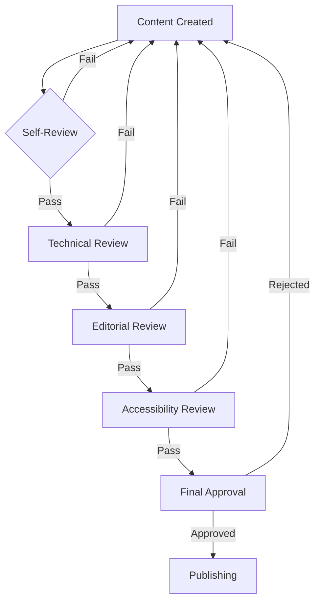

# Quality Assurance Guide

> **🏠 [Home](../../../README.md)** | **📖 [Documentation](../../README.md)** | **🎬 [Multimedia](../README.md)** | **📎 [Production Guide](README.md)** | **✅ Quality Assurance**


## Overview

Comprehensive quality assurance process for ensuring all multimedia content meets Cloud Scale Analytics standards for technical accuracy, production quality, accessibility, and brand consistency.

## QA Framework

### Multi-Stage Review Process



### QA Roles & Responsibilities

```yaml
qa_team:
  content_creator:
    responsibilities:
      - "Create initial content"
      - "Perform self-review checklist"
      - "Address feedback from reviewers"
      - "Maintain production standards"
    checklist: "Self-Review Checklist (see below)"

  technical_reviewer:
    responsibilities:
      - "Verify technical accuracy"
      - "Test code examples and demos"
      - "Validate Azure configurations"
      - "Check for security issues"
    required_skills: "Azure expertise, hands-on experience"

  editorial_reviewer:
    responsibilities:
      - "Check grammar and spelling"
      - "Verify style guide compliance"
      - "Ensure clarity and readability"
      - "Validate terminology consistency"
    required_skills: "Writing/editing background"

  accessibility_specialist:
    responsibilities:
      - "Test WCAG 2.1 compliance"
      - "Verify caption accuracy"
      - "Test with assistive technologies"
      - "Validate alternative formats"
    required_skills: "Accessibility expertise, AT familiarity"

  final_approver:
    responsibilities:
      - "Overall quality assessment"
      - "Brand consistency check"
      - "Publishing authorization"
      - "Performance metrics review"
    required_skills: "Project management, stakeholder liaison"
```

## Comprehensive QA Checklists

### Video Content QA

#### Technical Quality

```markdown
## Video Technical Checklist

### Resolution & Format
- [ ] Resolution: 1920x1080 (Full HD minimum)
- [ ] Aspect ratio: 16:9
- [ ] Frame rate: 30fps (or 60fps for demos)
- [ ] Codec: H.264 (MP4 container)
- [ ] Bitrate: 5-8 Mbps for 1080p
- [ ] Color space: sRGB
- [ ] No black bars or letterboxing

### Visual Quality
- [ ] Image sharp and in focus throughout
- [ ] No pixelation or compression artifacts
- [ ] Consistent color grading
- [ ] Proper white balance
- [ ] No excessive noise or grain
- [ ] Transitions smooth and professional
- [ ] Graphics render correctly (no pixelation)
- [ ] Text/UI elements legible at 100% zoom
- [ ] Cursor movements deliberate and visible

### Audio Quality
- [ ] Narration clear and intelligible
- [ ] Volume consistent (-16 LUFS ±1)
- [ ] No background noise or hum
- [ ] No clipping or distortion
- [ ] Music/SFX at appropriate levels
- [ ] Audio synchronized with video
- [ ] No echo or room reflections
- [ ] Clean edit points (no pops/clicks)

### Content Accuracy
- [ ] Technical information accurate and current
- [ ] Azure portal UI matches current version
- [ ] Code examples tested and functional
- [ ] Commands execute as demonstrated
- [ ] Resource names consistent throughout
- [ ] URLs and links verified
- [ ] Version numbers current
- [ ] Screenshots up to date
```

#### Content & Presentation

```markdown
## Video Content Checklist

### Structure & Flow
- [ ] Clear introduction (problem/goal stated)
- [ ] Logical progression of topics
- [ ] Appropriate pacing (not too fast/slow)
- [ ] Smooth transitions between sections
- [ ] Effective use of visual aids
- [ ] Clear conclusion and next steps
- [ ] Length appropriate (10-15 min target)

### Educational Value
- [ ] Learning objectives clearly stated
- [ ] Prerequisites mentioned
- [ ] Key concepts explained thoroughly
- [ ] Examples relevant and practical
- [ ] Common pitfalls addressed
- [ ] Best practices highlighted
- [ ] Resources provided for further learning

### Presentation Quality
- [ ] Professional delivery (if voiceover)
- [ ] Appropriate energy and enthusiasm
- [ ] Technical terms pronounced correctly
- [ ] No verbal tics or filler words
- [ ] Screen demonstrations clear
- [ ] Important UI elements highlighted
- [ ] Adequate time to read on-screen text

### Branding & Style
- [ ] Intro slate present (3-5 seconds)
- [ ] Outro slate with resources (5 seconds)
- [ ] Lower thirds formatted correctly
- [ ] Brand colors used consistently
- [ ] Logo placement appropriate
- [ ] Font styles match guidelines
- [ ] Music selection appropriate
- [ ] Overall professional appearance
```

### Audio Content QA

```markdown
## Audio QA Checklist

### Technical Quality
- [ ] Sample rate: 48kHz
- [ ] Bit depth: 24-bit (master) / 320kbps (MP3)
- [ ] Loudness: -16 LUFS (±1)
- [ ] Peak levels: -3dB to -1dB max
- [ ] Dynamic range: Appropriate compression
- [ ] Frequency response: Balanced EQ
- [ ] No clipping or distortion
- [ ] Clean low end (high-pass at 80Hz)
- [ ] Controlled sibilance (de-essed)

### Production Quality
- [ ] Background noise below -50dB
- [ ] No hum, buzz, or interference
- [ ] No pops, clicks, mouth sounds
- [ ] Smooth edit transitions
- [ ] Music/SFX levels appropriate
- [ ] Ducking effective (voice priority)
- [ ] Intro/outro music professional
- [ ] Overall polished sound

### Content Quality
- [ ] Clear articulation throughout
- [ ] Consistent vocal delivery
- [ ] Appropriate pacing
- [ ] Technical terms pronounced correctly
- [ ] No stumbles or verbal errors
- [ ] Script followed accurately
- [ ] Calls-to-action included
- [ ] Credits and attributions present
```

### Graphics & Animation QA

```markdown
## Graphics QA Checklist

### Design Quality
- [ ] Resolution appropriate for use case
- [ ] Colors match brand guidelines
- [ ] Typography consistent and legible
- [ ] Layout balanced and professional
- [ ] Icons and symbols recognizable
- [ ] Proper use of white space
- [ ] Alignment and spacing consistent
- [ ] Visual hierarchy clear

### Technical Quality
- [ ] File format appropriate (PNG/SVG/JPEG)
- [ ] File size optimized (< 500KB for web)
- [ ] Transparent backgrounds where needed
- [ ] Vector graphics scalable
- [ ] No pixelation or artifacts
- [ ] Color mode correct (RGB for screen)
- [ ] Resolution sufficient for display

### Accessibility
- [ ] Text contrast ratio 4.5:1 minimum
- [ ] Alt text provided
- [ ] Complex diagrams have descriptions
- [ ] Color not sole indicator of information
- [ ] Text readable when scaled to 200%

### Animation Quality
- [ ] Smooth playback (60fps target)
- [ ] File size optimized for web
- [ ] Timing appropriate (not too fast/slow)
- [ ] Easing curves natural
- [ ] No jarring movements
- [ ] Looping seamless (if applicable)
- [ ] Performance optimized (GPU-accelerated)
```

## Accessibility Testing

### WCAG 2.1 Level AA Compliance

```yaml
accessibility_requirements:
  perceivable:
    text_alternatives:
      - criterion: "1.1.1 Non-text Content"
        test: "All images have alt text"
        tools: ["WAVE", "axe DevTools"]
      - criterion: "1.2.1 Audio-only and Video-only"
        test: "Transcripts provided for audio/video"
        manual_check: true

    time_based_media:
      - criterion: "1.2.2 Captions (Prerecorded)"
        test: "Captions accurate and synchronized"
        accuracy: "99% minimum"
      - criterion: "1.2.3 Audio Description"
        test: "Visual information conveyed in audio"
        manual_check: true
      - criterion: "1.2.5 Audio Description (Prerecorded)"
        test: "Extended audio description if needed"
        manual_check: true

    adaptable:
      - criterion: "1.3.1 Info and Relationships"
        test: "Structure conveyed programmatically"
        tools: ["Screen reader testing"]
      - criterion: "1.3.2 Meaningful Sequence"
        test: "Reading order logical"
        tools: ["Keyboard navigation"]

    distinguishable:
      - criterion: "1.4.3 Contrast (Minimum)"
        test: "Text contrast 4.5:1, large text 3:1"
        tools: ["Contrast Checker"]
      - criterion: "1.4.4 Resize Text"
        test: "Text scalable to 200% without loss"
        manual_check: true
      - criterion: "1.4.5 Images of Text"
        test: "Actual text preferred over images"
        manual_check: true

  operable:
    keyboard_accessible:
      - criterion: "2.1.1 Keyboard"
        test: "All functionality keyboard accessible"
        manual_check: true
      - criterion: "2.1.2 No Keyboard Trap"
        test: "Keyboard focus not trapped"
        manual_check: true

    enough_time:
      - criterion: "2.2.1 Timing Adjustable"
        test: "Time limits adjustable/removable"
        applies: "Interactive content"
      - criterion: "2.2.2 Pause, Stop, Hide"
        test: "Auto-playing content can be paused"
        manual_check: true

    seizures:
      - criterion: "2.3.1 Three Flashes"
        test: "No flashing > 3 times per second"
        tools: ["PEAT - Photosensitive Epilepsy Analysis Tool"]

    navigable:
      - criterion: "2.4.2 Page Titled"
        test: "Descriptive titles"
        manual_check: true
      - criterion: "2.4.4 Link Purpose"
        test: "Link text descriptive"
        manual_check: true

  understandable:
    readable:
      - criterion: "3.1.1 Language of Page"
        test: "Language identified (lang attribute)"
        automated: true

    predictable:
      - criterion: "3.2.1 On Focus"
        test: "No context change on focus"
        manual_check: true
      - criterion: "3.2.2 On Input"
        test: "No context change on input"
        manual_check: true

  robust:
    compatible:
      - criterion: "4.1.2 Name, Role, Value"
        test: "UI components properly labeled"
        tools: ["Screen reader", "axe DevTools"]
```

### Accessibility Testing Tools

```python
# Automated accessibility testing script
import subprocess
import json
from pathlib import Path

class AccessibilityTester:
    def __init__(self, content_url):
        self.url = content_url
        self.results = {}

    def run_wave_test(self):
        """Run WAVE accessibility check"""
        # WAVE API call
        wave_results = {
            "errors": 0,
            "alerts": 0,
            "contrast_errors": 0,
            "aria_errors": 0
        }
        self.results['wave'] = wave_results
        return wave_results

    def run_axe_test(self):
        """Run axe DevTools automated check"""
        # axe-core automated testing
        axe_results = {
            "violations": [],
            "passes": [],
            "incomplete": []
        }
        self.results['axe'] = axe_results
        return axe_results

    def check_contrast(self):
        """Check color contrast ratios"""
        contrast_checks = [
            {"element": "body text", "ratio": 4.52, "pass": True},
            {"element": "heading", "ratio": 5.21, "pass": True},
            {"element": "button", "ratio": 3.15, "pass": True}
        ]
        self.results['contrast'] = contrast_checks
        return contrast_checks

    def validate_captions(self, vtt_file):
        """Validate WebVTT caption file"""
        issues = []

        with open(vtt_file, 'r', encoding='utf-8') as f:
            content = f.read()

            # Check format
            if not content.startswith('WEBVTT'):
                issues.append("Missing WEBVTT header")

            # Check timing format
            import re
            timing_pattern = r'\d{2}:\d{2}:\d{2}\.\d{3} --> \d{2}:\d{2}:\d{2}\.\d{3}'
            if not re.search(timing_pattern, content):
                issues.append("Invalid timing format")

        self.results['captions'] = {
            "valid": len(issues) == 0,
            "issues": issues
        }

    def screen_reader_test(self):
        """Manual screen reader testing checklist"""
        checklist = {
            "navigation": "Can navigate all content with screen reader",
            "headings": "Heading structure logical and complete",
            "images": "Alt text descriptive and accurate",
            "links": "Link text makes sense out of context",
            "forms": "All form fields properly labeled",
            "tables": "Tables have proper headers and captions"
        }
        print("Screen Reader Testing Checklist:")
        for item, description in checklist.items():
            print(f"[ ] {description}")

    def generate_report(self):
        """Generate accessibility report"""
        report = {
            "url": self.url,
            "test_date": datetime.now().isoformat(),
            "results": self.results,
            "overall_status": "Pass" if self.all_tests_pass() else "Fail"
        }

        with open('accessibility_report.json', 'w') as f:
            json.dump(report, f, indent=2)

        return report

    def all_tests_pass(self):
        """Check if all automated tests passed"""
        wave = self.results.get('wave', {})
        if wave.get('errors', 0) > 0:
            return False

        axe = self.results.get('axe', {})
        if len(axe.get('violations', [])) > 0:
            return False

        return True
```

## Performance Testing

### Video Performance Metrics

```javascript
// Video performance monitoring
class VideoPerformanceTester {
  constructor(videoElement) {
    this.video = videoElement;
    this.metrics = {
      loadTime: 0,
      bufferingEvents: [],
      qualitySwitches: [],
      errors: []
    };

    this.setupListeners();
  }

  setupListeners() {
    const startTime = performance.now();

    // Load time
    this.video.addEventListener('loadeddata', () => {
      this.metrics.loadTime = performance.now() - startTime;
      console.log(`Video load time: ${this.metrics.loadTime}ms`);
    });

    // Buffering events
    this.video.addEventListener('waiting', (e) => {
      this.metrics.bufferingEvents.push({
        time: this.video.currentTime,
        timestamp: Date.now()
      });
      console.warn('Buffering event at', this.video.currentTime);
    });

    // Quality switches (for adaptive streaming)
    this.video.addEventListener('qualitychange', (e) => {
      this.metrics.qualitySwitches.push({
        time: this.video.currentTime,
        quality: e.detail.quality
      });
    });

    // Errors
    this.video.addEventListener('error', (e) => {
      this.metrics.errors.push({
        code: this.video.error.code,
        message: this.video.error.message,
        time: this.video.currentTime
      });
      console.error('Video error:', this.video.error);
    });
  }

  getReport() {
    return {
      loadTime: this.metrics.loadTime,
      bufferingCount: this.metrics.bufferingEvents.length,
      bufferingRate: this.metrics.bufferingEvents.length / this.video.duration,
      qualitySwitches: this.metrics.qualitySwitches.length,
      errors: this.metrics.errors.length,
      performanceScore: this.calculateScore()
    };
  }

  calculateScore() {
    let score = 100;

    // Deduct for slow loading
    if (this.metrics.loadTime > 5000) score -= 20;
    else if (this.metrics.loadTime > 3000) score -= 10;

    // Deduct for buffering
    score -= this.metrics.bufferingEvents.length * 5;

    // Deduct for errors
    score -= this.metrics.errors.length * 15;

    return Math.max(0, score);
  }
}

// Usage
const tester = new VideoPerformanceTester(document.querySelector('video'));

// Get report after video completes
video.addEventListener('ended', () => {
  console.log('Performance Report:', tester.getReport());
});
```

### Cross-Browser Testing

```yaml
browser_testing_matrix:
  desktop:
    chrome:
      versions: ["Latest", "Latest - 1"]
      platforms: ["Windows", "macOS"]
      features:
        - "Video playback"
        - "Caption display"
        - "Interactive elements"
        - "Performance"

    firefox:
      versions: ["Latest", "Latest - 1"]
      platforms: ["Windows", "macOS", "Linux"]
      features: ["Same as Chrome"]

    safari:
      versions: ["Latest", "Latest - 1"]
      platforms: ["macOS", "iOS"]
      features: ["Same as Chrome"]

    edge:
      versions: ["Latest"]
      platforms: ["Windows"]
      features: ["Same as Chrome"]

  mobile:
    ios_safari:
      versions: ["Latest", "Latest - 1"]
      devices: ["iPhone 12+", "iPad"]
      orientation: ["Portrait", "Landscape"]

    android_chrome:
      versions: ["Latest"]
      devices: ["Samsung Galaxy S21+", "Google Pixel"]
      orientation: ["Portrait", "Landscape"]

  testing_checklist:
    - "Video plays automatically (if configured)"
    - "Controls responsive to touch/click"
    - "Captions toggle works"
    - "Full-screen mode functions"
    - "Responsive layout adapts"
    - "No console errors"
    - "Performance acceptable"
```

## Review Documentation

### QA Report Template

```markdown
# QA Report: [Content Title]

## Overview
- **Content Type:** [Video / Audio / Graphics / Interactive]
- **Duration/Size:** [MM:SS / File size]
- **Created By:** [Creator name]
- **Review Date:** [YYYY-MM-DD]
- **Reviewer:** [Reviewer name]
- **Status:** [Approved / Needs Revision / Rejected]

## Quality Assessment

### Technical Quality: [Pass / Fail]
- [ ] Meets resolution/format specifications
- [ ] Audio/visual quality acceptable
- [ ] No technical defects
- **Notes:** [Any technical issues]

### Content Accuracy: [Pass / Fail]
- [ ] Information technically accurate
- [ ] Examples tested and working
- [ ] Links and resources valid
- **Notes:** [Any accuracy issues]

### Accessibility: [Pass / Fail]
- [ ] WCAG 2.1 AA compliant
- [ ] Captions accurate and synchronized
- [ ] Alternative formats provided
- **Notes:** [Any accessibility issues]

### Brand Consistency: [Pass / Fail]
- [ ] Follows brand guidelines
- [ ] Uses approved templates
- [ ] Professional appearance
- **Notes:** [Any branding issues]

## Issues Found

### Critical Issues
1. [Description of critical issue]
   - **Impact:** [How it affects content]
   - **Fix Required:** [What needs to be done]

### Minor Issues
1. [Description of minor issue]
   - **Suggestion:** [Recommended fix]

## Recommendations
- [Recommendation 1]
- [Recommendation 2]

## Approval Status
- [ ] **Approved** - Ready for publishing
- [ ] **Approved with Minor Changes** - Fix minor issues before publishing
- [ ] **Revision Required** - Address critical issues and resubmit
- [ ] **Rejected** - Fundamental issues, complete rework needed

**Reviewer Signature:** [Name]
**Date:** [YYYY-MM-DD]
```

## Continuous Improvement

### Metrics & Analytics

```python
# Quality metrics tracking
class QualityMetrics:
    def __init__(self):
        self.metrics = {
            "first_pass_rate": 0,
            "average_review_cycles": 0,
            "common_issues": {},
            "time_to_publish": []
        }

    def track_review(self, content_id, review_result):
        """Track review results"""
        if review_result['status'] == 'approved':
            if review_result['review_cycle'] == 1:
                self.metrics['first_pass_rate'] += 1

        # Track common issues
        for issue in review_result.get('issues', []):
            category = issue['category']
            self.metrics['common_issues'][category] = \
                self.metrics['common_issues'].get(category, 0) + 1

    def generate_insights(self):
        """Generate quality improvement insights"""
        insights = []

        # Most common issues
        top_issues = sorted(
            self.metrics['common_issues'].items(),
            key=lambda x: x[1],
            reverse=True
        )[:5]

        for issue, count in top_issues:
            insights.append(f"Focus on reducing '{issue}' issues (occurred {count} times)")

        return insights

    def get_dashboard(self):
        """Generate quality dashboard"""
        return {
            "first_pass_rate": f"{self.metrics['first_pass_rate']}%",
            "avg_review_cycles": f"{self.metrics['average_review_cycles']:.1f}",
            "top_issues": self.metrics['common_issues'],
            "improvement_areas": self.generate_insights()
        }
```

## Related Resources

- [Video Production Workflow](video-production-workflow.md)
- [Audio Production Workflow](audio-production-workflow.md)
- [Accessibility Standards](accessibility-standards.md)
- [Brand Guidelines](brand-guidelines.md)
- [Publishing Workflow](publishing-workflow.md)

---

*Last Updated: January 2025 | Version: 1.0.0*
