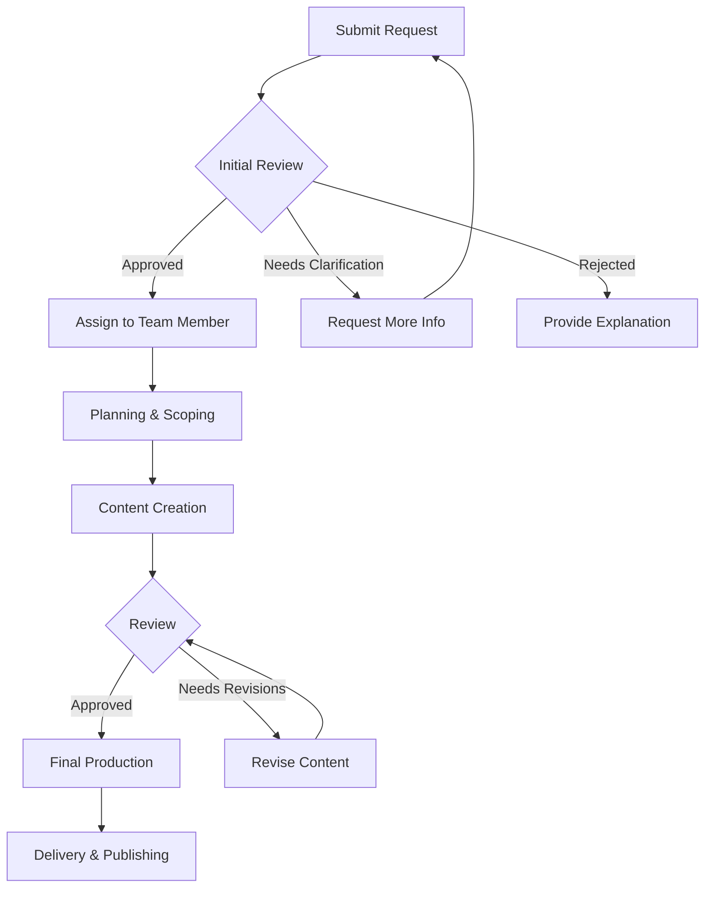

# 📋 Multimedia Content Requests

> **🏠 [Home](../../../README.md)** | **📖 [Documentation](../../README.md)** | **🎬 [Multimedia](../README.md)** | **📋 Requests**


## 📋 Overview

Streamlined process for requesting new multimedia content for the Cloud Scale Analytics documentation. This includes videos, diagrams, animations, audio content, and interactive demos.

## 🎯 Request Types

### Video Content

Request new tutorial videos, demos, or walkthroughs:

**Typical Requests:**
- Tutorial videos (5-15 minutes)
- Product demos (3-10 minutes)
- Quick tips (1-3 minutes)
- Webinar recordings (30-60 minutes)

**Estimated Timeline:** 7-14 days
**Required Information:** Script, objectives, target audience

### Diagrams & Graphics

Request architecture diagrams, infographics, or illustrations:

**Typical Requests:**
- Architecture diagrams
- Data flow diagrams
- Process flowcharts
- Infographics
- Custom illustrations

**Estimated Timeline:** 3-7 days
**Required Information:** Content outline, reference materials

### Interactive Demos

Request hands-on interactive demonstrations:

**Typical Requests:**
- Code playgrounds
- Configuration wizards
- Cost calculators
- Architecture builders

**Estimated Timeline:** 10-20 days
**Required Information:** Functionality specs, user flows

### Audio Content

Request voiceovers, podcasts, or audio guides:

**Typical Requests:**
- Narration for videos
- Podcast episodes
- Audio tutorials
- Background music

**Estimated Timeline:** 5-10 days
**Required Information:** Script, voice preferences

## 📝 How to Submit a Request

### Option 1: GitHub Issue (Recommended)

```markdown
1. Go to: https://github.com/csa-inabox/csa-inabox-docs/issues/new
2. Select template: "Multimedia Content Request"
3. Fill in required fields
4. Add labels: multimedia, content-request
5. Submit issue
```

**Issue Template:**

```markdown
---
name: Multimedia Content Request
about: Request new multimedia content (video, diagram, demo, etc.)
title: '[CONTENT] Brief description of request'
labels: multimedia, content-request
assignees: multimedia-team
---

## Request Type
<!-- Select one -->
- [ ] Video
- [ ] Diagram/Graphic
- [ ] Interactive Demo
- [ ] Audio
- [ ] Other: ___________

## Title/Topic
<!-- Brief, descriptive title -->

## Description
<!-- Detailed description of what you need -->

## Purpose/Objective
<!-- Why is this content needed? What problem does it solve? -->

## Target Audience
<!-- Who will use this content? -->
- [ ] Beginners
- [ ] Intermediate users
- [ ] Advanced users
- [ ] Administrators
- [ ] Developers

## Priority
- [ ] Critical - Blocks documentation release
- [ ] High - Important for upcoming release
- [ ] Medium - Nice to have soon
- [ ] Low - Future enhancement

## Preferred Delivery Date
<!-- When do you need this? -->
YYYY-MM-DD

## Reference Materials
<!-- Links to existing docs, sketches, examples -->

## Success Criteria
<!-- How will we know this content is successful? -->

## Additional Notes
<!-- Any other relevant information -->
```

### Option 2: Email Request

Send email to: **multimedia@csa.azure.com**

**Email Template:**

```
Subject: [CONTENT REQUEST] [Type] - [Brief Description]

Content Type: [Video/Diagram/Demo/Audio]
Title: [Content Title]

Description:
[Detailed description of what you need]

Purpose:
[Why is this content needed?]

Target Audience:
[Who will use this content?]

Priority: [Critical/High/Medium/Low]
Preferred Delivery: [Date]

Reference Materials:
[Links or attachments]

Contact: [Your email/Teams]
```

### Option 3: Microsoft Teams

Post in **CSA Multimedia Channel**:

```
@MultimediaTeam I need help with:

📝 Content Type: [Type]
🎯 Topic: [Topic]
👥 Audience: [Audience]
📅 Need by: [Date]

Details: [Description]

References: [Links]
```

## 🔄 Request Process

### Workflow



### Timeline

| Stage | Duration | Description |
|-------|----------|-------------|
| **Initial Review** | 1-2 business days | Team reviews request, assigns priority |
| **Planning & Scoping** | 2-3 days | Define requirements, gather resources |
| **Content Creation** | 3-10 days | Create content based on type and complexity |
| **Review & Revisions** | 1-3 days | Stakeholder review, incorporate feedback |
| **Final Production** | 1-2 days | Finalize, optimize, prepare for delivery |
| **Delivery** | Same day | Publish content, notify requester |

**Total Estimated Time:** 5-20 days (varies by complexity)

## 📊 Priority Levels

### Critical Priority

**Response Time:** Same day
**Target Completion:** 3-5 days
**Criteria:**
- Blocks documentation release
- Security vulnerability disclosure
- Critical bug affecting users
- Executive/customer commitment

### High Priority

**Response Time:** 1 business day
**Target Completion:** 5-7 days
**Criteria:**
- Important for upcoming release
- Key feature documentation
- High-traffic page update
- Partner/customer request

### Medium Priority

**Response Time:** 2-3 business days
**Target Completion:** 7-14 days
**Criteria:**
- Nice to have soon
- Enhancement to existing content
- General improvements
- Standard documentation updates

### Low Priority

**Response Time:** 3-5 business days
**Target Completion:** 14-30 days
**Criteria:**
- Future enhancement
- Non-critical improvement
- Experimental content
- Nice-to-have additions

## ✅ Request Requirements

### For Video Requests

**Required:**
- [ ] Script or detailed outline
- [ ] Target duration
- [ ] Key messages/takeaways
- [ ] Target audience

**Optional but Helpful:**
- [ ] Reference videos
- [ ] Specific tools/technologies to show
- [ ] On-screen talent preferences
- [ ] Voiceover preferences

### For Diagram Requests

**Required:**
- [ ] Content/components to include
- [ ] Diagram type (architecture, flow, etc.)
- [ ] Output format (SVG, PNG, etc.)

**Optional but Helpful:**
- [ ] Rough sketch or wireframe
- [ ] Similar diagram examples
- [ ] Color preferences
- [ ] Size/dimension requirements

### For Interactive Demo Requests

**Required:**
- [ ] Functionality description
- [ ] User flow/interactions
- [ ] Data/scenarios to demonstrate
- [ ] Target platform (web, desktop, etc.)

**Optional but Helpful:**
- [ ] UI mockups
- [ ] Similar demos for reference
- [ ] Integration requirements
- [ ] Performance requirements

## 🔄 Tracking Your Request

### GitHub Issue Tracking

Monitor your request status via GitHub:

```bash
# View all open requests
https://github.com/csa-inabox/csa-inabox-docs/issues?q=is%3Aissue+is%3Aopen+label%3Amultimedia

# View your specific request
https://github.com/csa-inabox/csa-inabox-docs/issues/[ISSUE_NUMBER]
```

### Status Labels

| Label | Meaning |
|-------|---------|
| `multimedia` | Multimedia content request |
| `content-request` | New content request |
| `in-progress` | Actively being worked on |
| `needs-review` | Ready for stakeholder review |
| `needs-revision` | Requires changes |
| `completed` | Finished and delivered |
| `on-hold` | Temporarily paused |
| `blocked` | Waiting on external dependency |

### Notifications

You'll receive updates via:
- GitHub issue comments
- Email notifications (if subscribed)
- Teams messages (for critical items)

## 📞 Contact & Support

### Multimedia Team

**Email:** multimedia@csa.azure.com
**Teams Channel:** CSA Multimedia
**Office Hours:** Mon-Fri, 9am-5pm EST

### Team Members

**Video Production:**
- Lead: @video-lead
- Editors: @video-editors

**Graphics & Design:**
- Lead: @design-lead
- Designers: @designers

**Interactive Demos:**
- Lead: @demo-lead
- Developers: @demo-developers

**Audio Production:**
- Lead: @audio-lead
- Engineers: @audio-engineers

## 📊 Request Statistics

### Current Backlog

View real-time statistics:
- [Open Requests Dashboard](https://github.com/csa-inabox/csa-inabox-docs/projects/multimedia-requests)
- [Request Analytics](https://app.powerbi.com/csa-multimedia-analytics)

### Average Turnaround Times

| Content Type | Average Days | Median Days |
|--------------|--------------|-------------|
| Video (Tutorial) | 10 | 8 |
| Video (Quick Tip) | 5 | 4 |
| Diagram | 4 | 3 |
| Interactive Demo | 15 | 12 |
| Audio (Narration) | 6 | 5 |

*Data from last 90 days*

## 💡 Tips for Better Requests

### Do's ✅

- Be specific about requirements
- Provide reference materials
- Define clear success criteria
- Allow reasonable timeline
- Respond promptly to questions
- Give constructive feedback

### Don'ts ❌

- Submit vague requests
- Rush without proper planning
- Change requirements mid-production
- Skip review steps
- Assume technical limitations
- Demand unrealistic timelines

## 🔗 Related Resources

- [Production Guide](../production-guide/README.md)
- [Brand Guidelines](../production-guide/brand-guidelines.md)
- [Templates Library](../templates/README.md)
- [Quality Standards](../production-guide/quality-assurance.md)

## 📝 Request Templates

Pre-filled templates for common requests:
- [Tutorial Video Request](https://github.com/csa-inabox/csa-inabox-docs/issues/new?template=video-tutorial.md)
- [Architecture Diagram Request](https://github.com/csa-inabox/csa-inabox-docs/issues/new?template=diagram.md)
- [Interactive Demo Request](https://github.com/csa-inabox/csa-inabox-docs/issues/new?template=interactive-demo.md)

---

*Last Updated: January 2025 | Version: 1.0.0*
