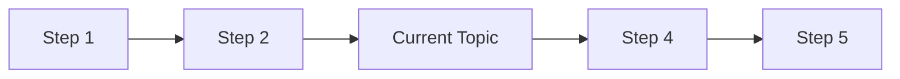

# 📝 [Document Title] - CSA-in-a-Box

<!--
INSTRUCTIONS FOR USE:
1. Replace all [PLACEHOLDERS] with actual content
2. Remove all <!-- COMMENT --> sections before publishing
3. Update metadata at bottom (date, version, owner)
4. Follow CSA-in-a-Box markdown style guide
5. Validate with markdownlint before committing
-->

> **🏠 [Home](../../../README.md)** | **📖 [Documentation](../../README.md)** | **[Current Section](../README.md)** | **👤 [Document Title]**

<!-- Update badges as appropriate -->
![Status: [Active/Draft/Deprecated]](https://img.shields.io/badge/Status-[Active/Draft/Deprecated]-[green/yellow/red])
![Type: [Documentation/Guide/Reference]](https://img.shields.io/badge/Type-[Type]-blue)
![Complexity: [Basic/Intermediate/Advanced]](https://img.shields.io/badge/Complexity-[Level]-[green/yellow/red])

## 📋 Overview

<!--
Provide a 2-3 sentence summary of what this document covers.
Answer: What is this? Why does it matter? Who is it for?
-->

[Brief description of the document's purpose and target audience]

## 🎯 Objectives

<!-- List the key learning objectives or goals of this documentation -->

By the end of this document, you will be able to:

- [Objective 1]
- [Objective 2]
- [Objective 3]

## 📖 Table of Contents

<!--
Auto-generate or manually create TOC for documents > 200 lines
Use descriptive section names
-->

- [Prerequisites](#prerequisites)
- [Section 1](#section-1)
- [Section 2](#section-2)
- [Examples](#examples)
- [Troubleshooting](#troubleshooting)
- [Related Resources](#related-resources)

## ⚙️ Prerequisites

<!-- List all requirements before users can follow this documentation -->

Before you begin, ensure you have:

- [ ] [Prerequisite 1]
- [ ] [Prerequisite 2]
- [ ] [Prerequisite 3]

**Required Knowledge**:

- [Knowledge area 1]
- [Knowledge area 2]

**Required Tools**:

- [Tool 1] (version X.X or higher)
- [Tool 2]

**Required Access**:

- [Permission or role needed]

## 📝 Section 1

<!--
Main content sections
Use clear headings and subheadings
Break content into digestible chunks
-->

### Subsection 1.1

[Content explaining concept or procedure]

> **💡 Tip:** [Helpful hint or best practice]

### Subsection 1.2

[Additional content]

> **⚠️ Warning:** [Important caution or known issue]

## 🔧 Section 2

### Subsection 2.1

[Implementation details, procedures, or explanations]

### Code Example

<!--
Always specify language for syntax highlighting
Include comments explaining key parts
Provide complete, working examples
-->

```python
# Example: [Brief description of what this code does]

def example_function(param1, param2):
    """
    [Function description]

    Args:
        param1: [Description]
        param2: [Description]

    Returns:
        [Return value description]
    """
    result = param1 + param2
    return result

# Usage
output = example_function(10, 20)
print(f"Result: {output}")
```

### Configuration Example

```yaml
# Configuration: [What this configures]
setting_name:
  option1: value1
  option2: value2
  nested_option:
    sub_option: value
```

## 📊 Examples

<!--
Provide real-world examples
Show both simple and complex scenarios
Include expected output
-->

### Example 1: [Simple Scenario]

**Scenario**: [Description of use case]

**Steps**:

1. [Step 1]
2. [Step 2]
3. [Step 3]

**Expected Result**:

[What the user should see or achieve]

### Example 2: [Complex Scenario]

**Scenario**: [Description of advanced use case]

**Implementation**:

```sql
-- Example SQL query
SELECT
    column1,
    column2,
    COUNT(*) as record_count
FROM table_name
WHERE condition = true
GROUP BY column1, column2
ORDER BY record_count DESC;
```

**Result**:

```text
column1    | column2    | record_count
-----------|------------|-------------
Value1     | Value2     | 1000
Value3     | Value4     | 500
```

## 🔍 Troubleshooting

<!--
Include common issues and solutions
Use consistent format for each issue
Provide diagnostic steps
-->

### Common Issues

#### Issue 1: [Problem Description]

**Symptoms**:

- [What the user observes]
- [Error messages they see]

**Cause**:

[Why this happens]

**Solution**:

1. [Step-by-step solution]
2. [Verification step]

**Prevention**:

[How to avoid this in the future]

---

#### Issue 2: [Problem Description]

**Symptoms**:

- [Observable symptoms]

**Solution**:

```bash
# Command to fix the issue
command --parameter value
```

## ✅ Best Practices

<!-- List key recommendations and best practices -->

- ✅ **Do**: [Recommended practice with brief explanation]
- ✅ **Do**: [Another best practice]
- ❌ **Don't**: [Anti-pattern to avoid]
- ❌ **Don't**: [What not to do]

## 📊 Comparison Table

<!-- Use tables for comparing options, features, or alternatives -->

| Feature | Option A | Option B | Option C |
|---------|----------|----------|----------|
| **Performance** | High | Medium | Low |
| **Cost** | $$ | $ | $$$ |
| **Complexity** | Low | Medium | High |
| **Use Case** | [When to use] | [When to use] | [When to use] |

## 🔄 Related Workflows

<!-- Show how this documentation fits into larger processes -->



## 📚 Related Resources

<!--
Link to related documentation
Include both internal and external resources
Categorize links logically
-->

### Documentation

- [Related Guide 1](../guides/related-guide-1.md)
- [Related Guide 2](../guides/related-guide-2.md)
- [API Reference](../reference/api-reference.md)

### External Resources

- [Official Microsoft Documentation](https://docs.microsoft.com/)
- [Azure Architecture Center](https://docs.microsoft.com/azure/architecture/)
- [Community Resources](https://techcommunity.microsoft.com/)

### Video Tutorials

- [Tutorial Title](../multimedia/video-tutorials/tutorial-name.md)
- [Deep Dive Session](../multimedia/video-tutorials/deep-dive.md)

### Tools & Templates

- [Related Template](./related-template.md)
- [Configuration Generator](../tools/config-generator.md)

## 📝 Quick Reference

<!--
Provide a cheat sheet for quick lookup
Include most common commands, parameters, or patterns
-->

### Common Commands

```bash
# Command purpose
command --option value

# Another common operation
command2 --flag
```

### Key Concepts

| Concept | Description | Example |
|---------|-------------|---------|
| [Concept 1] | [Brief explanation] | `example` |
| [Concept 2] | [Brief explanation] | `example` |

## 🔒 Security Considerations

<!-- If applicable, include security best practices and warnings -->

- **Authentication**: [How to handle authentication securely]
- **Authorization**: [Access control recommendations]
- **Data Protection**: [How to protect sensitive data]
- **Secrets Management**: [Never hardcode secrets; use Azure Key Vault]

## 💰 Cost Considerations

<!-- If applicable, discuss pricing and cost optimization -->

**Cost Factors**:

- [Factor 1]: [How it affects cost]
- [Factor 2]: [How it affects cost]

**Optimization Tips**:

- [Tip 1 to reduce costs]
- [Tip 2 to optimize spending]

## 📈 Performance Optimization

<!-- If applicable, provide performance tuning guidance -->

- **Optimization 1**: [Description and benefit]
- **Optimization 2**: [Description and benefit]

**Monitoring**:

[How to monitor performance metrics]

## 🆘 Getting Help

<!-- Provide support channels and escalation paths -->

If you need additional assistance:

- **Documentation Issues**: [GitHub Issues](https://github.com/csa-inabox-docs/issues)
- **Technical Support**: [Support Channel]
- **Community Forums**: [Forum Link]
- **Emergency**: [Escalation Contact]

## 💬 Feedback

<!-- Always include feedback section -->

Your feedback helps us improve this documentation:

- Was this document helpful?
- What could be improved?
- Are there any errors or unclear sections?
- What additional information would be valuable?

[Provide Feedback](https://github.com/fgarofalo56/csa-inabox-docs/issues/new?title=[Feedback]+[Document-Title])

## 📋 Checklist

<!--
Provide a completion checklist for users
Helps ensure they've completed all necessary steps
-->

Use this checklist to verify you've completed everything:

- [ ] [Completion item 1]
- [ ] [Completion item 2]
- [ ] [Completion item 3]
- [ ] [Completion item 4]
- [ ] Tested implementation
- [ ] Verified results
- [ ] Documented any customizations

## 🔄 Changelog

<!-- Track major updates to this document -->

### Version 1.1.0 (YYYY-MM-DD)

- Added: [What was added]
- Changed: [What was modified]
- Fixed: [What was corrected]

### Version 1.0.0 (YYYY-MM-DD)

- Initial release

---

<!--
METADATA SECTION (REQUIRED)
Update these fields before publishing
-->

**Document Information**:

- **Last Updated**: {YYYY-MM-DD}
- **Version**: {X.Y.Z}
- **Owner**: {Team or Person Name}
- **Status**: {Draft/Active/Deprecated}
- **Review Date**: {Next review date}

**Tags**: `[tag1]`, `[tag2]`, `[tag3]`

---

*This document follows the [CSA-in-a-Box Markdown Style Guide](../../guides/MARKDOWN_STYLE_GUIDE.md)*
