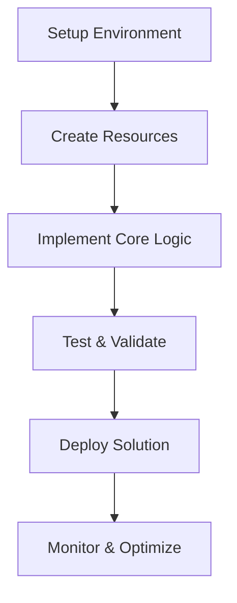

# 🎓 Tutorial: [Tutorial Title] - CSA-in-a-Box

<!--
TUTORIAL TEMPLATE INSTRUCTIONS:
1. Replace all [PLACEHOLDERS] with actual content
2. Include clear learning objectives
3. Provide step-by-step instructions
4. Add verification steps after each major section
5. Include troubleshooting for common issues
6. Test all steps before publishing
7. Remove all <!-- COMMENTS --> before publishing
-->

> **🏠 [Home](../../../README.md)** | **📖 [Documentation](../../README.md)** | **🎓 [Tutorials](../../tutorials/README.md)** | **👤 [Tutorial Title]**


![Difficulty: [Beginner/Intermediate/Advanced]](https://img.shields.io/badge/Difficulty-[Level]-[green/yellow/red])
![Duration: [XX minutes]](https://img.shields.io/badge/Duration-[XX]%20min-purple)

## 📋 Tutorial Overview

<!--
Provide a compelling overview that explains:
- What students will build or learn
- Why this is important
- Real-world application
-->

In this tutorial, you will learn how to [main objective]. By the end, you will have [concrete outcome].

**What You'll Build**: [Brief description of final result]

**Why This Matters**: [Practical application and business value]

## 🎯 Learning Objectives

By completing this tutorial, you will be able to:

- [ ] [Specific, measurable objective 1]
- [ ] [Specific, measurable objective 2]
- [ ] [Specific, measurable objective 3]
- [ ] [Specific, measurable objective 4]

## ⏱️ Time Estimate

- **Total Time**: [XX] minutes
  - Setup: [XX] minutes
  - Implementation: [XX] minutes
  - Testing & Validation: [XX] minutes

## 👥 Target Audience

**Best For**:

- [Persona 1]: [What they'll gain]
- [Persona 2]: [What they'll gain]

**Experience Level**: [Beginner/Intermediate/Advanced]

## ⚙️ Prerequisites

### Required Knowledge

Before starting, you should be familiar with:

- [ ] [Concept or technology 1]
- [ ] [Concept or technology 2]
- [ ] [Concept or technology 3]

**Recommended Tutorials** (if new to these topics):

- [Prerequisite Tutorial 1](../prerequisite-tutorial-1.md)
- [Prerequisite Tutorial 2](../prerequisite-tutorial-2.md)

### Required Tools

Ensure you have the following installed and configured:

| Tool | Version | Purpose | Installation Link |
|------|---------|---------|-------------------|
| [Tool 1] | X.X+ | [Purpose] | [Link] |
| [Tool 2] | X.X+ | [Purpose] | [Link] |
| [Tool 3] | X.X+ | [Purpose] | [Link] |

### Required Access

- [ ] Azure subscription with [specific permissions]
- [ ] [Service or resource] access
- [ ] [API keys or credentials]

### Sample Data

<!-- If applicable, provide sample data or resources -->

Download the tutorial resources:

- [Sample Dataset](../resources/sample-data.zip)
- [Starter Code](../resources/starter-code.zip)
- [Configuration Files](../resources/config-files.zip)

## 🗺️ Tutorial Roadmap

<!-- Provide a visual overview of tutorial flow -->



---

## 📚 Part 1: Environment Setup

**Estimated Time**: [XX] minutes

### Step 1.1: Verify Prerequisites

First, verify all prerequisites are installed:

```bash
# Check tool versions
tool1 --version
# Expected output: tool1 version X.X.X

tool2 --version
# Expected output: tool2 version X.X.X
```

✅ **Verification**: You should see version numbers for all tools.

### Step 1.2: Setup Project Structure

Create the project directory structure:

```bash
# Create project directory
mkdir tutorial-project
cd tutorial-project

# Create subdirectories
mkdir -p {src,tests,config,data}

# Verify structure
tree .
```

**Expected Structure**:

```text
tutorial-project/
├── src/
├── tests/
├── config/
└── data/
```

### Step 1.3: Initialize Configuration

Create the initial configuration file:

```bash
# Create config file
cat > config/app.yaml << EOF
# Application Configuration
app_name: tutorial-app
version: 1.0.0
environment: development

# Connection settings
connection:
  endpoint: "[YOUR-ENDPOINT]"
  timeout: 30

# Feature flags
features:
  feature_a: true
  feature_b: false
EOF
```

> **💡 Tip**: Replace `[YOUR-ENDPOINT]` with your actual endpoint URL.

### ✅ Part 1 Checkpoint

Before proceeding, verify:

- [ ] All tools are installed and working
- [ ] Project structure is created
- [ ] Configuration file exists

**Troubleshooting**: If you encounter issues, see [Troubleshooting Part 1](#troubleshooting-part-1).

---

## 🔨 Part 2: Building the Solution

**Estimated Time**: [XX] minutes

### Step 2.1: [Descriptive Step Name]

<!--
Provide detailed step-by-step instructions
Explain WHY as well as HOW
-->

Now we'll [description of what we're doing and why].

**Implementation**:

```python
# [Filename: src/main.py]

# Import required libraries
from azure.identity import DefaultAzureCredential
from azure.storage.blob import BlobServiceClient

def create_blob_client(account_url):
    """
    Create a blob service client using Azure AD authentication.

    Args:
        account_url: Storage account URL

    Returns:
        BlobServiceClient instance
    """
    # Use DefaultAzureCredential for authentication
    credential = DefaultAzureCredential()

    # Create and return client
    blob_service_client = BlobServiceClient(
        account_url=account_url,
        credential=credential
    )

    return blob_service_client

# Usage example
if __name__ == "__main__":
    account_url = "https://yourstorageaccount.blob.core.windows.net"
    client = create_blob_client(account_url)
    print("✅ Blob client created successfully")
```

**Code Explanation**:

1. **Line 1-2**: Import necessary Azure SDK libraries
2. **Line 4-9**: Define function with clear docstring
3. **Line 11**: Use DefaultAzureCredential for automatic authentication
4. **Line 14-17**: Create the blob service client
5. **Line 22-24**: Example usage and verification

> **⚠️ Warning**: Never hardcode credentials in your code. Always use Azure Key Vault or managed identities.

### Step 2.2: [Next Step]

[Continue with detailed instructions...]

```bash
# Execute the script
python src/main.py
```

**Expected Output**:

```text
✅ Blob client created successfully
```

### ✅ Part 2 Checkpoint

Verify your implementation:

- [ ] Code runs without errors
- [ ] Expected output is displayed
- [ ] [Additional verification step]

**Test Your Implementation**:

```bash
# Run tests
pytest tests/test_main.py -v
```

---

## 🧪 Part 3: Testing & Validation

**Estimated Time**: [XX] minutes

### Step 3.1: Unit Tests

Create unit tests to verify functionality:

```python
# [Filename: tests/test_main.py]

import pytest
from src.main import create_blob_client

class TestBlobClient:
    """Test blob client creation and operations."""

    def test_client_creation(self):
        """Test that blob client can be created."""
        account_url = "https://test.blob.core.windows.net"
        client = create_blob_client(account_url)

        assert client is not None
        assert client.account_name == "test"

    def test_invalid_url(self):
        """Test error handling for invalid URL."""
        with pytest.raises(ValueError):
            create_blob_client("invalid-url")
```

**Run Tests**:

```bash
pytest tests/ -v --cov=src
```

**Expected Output**:

```text
tests/test_main.py::TestBlobClient::test_client_creation PASSED
tests/test_main.py::TestBlobClient::test_invalid_url PASSED

----------- coverage: 95% -----------
```

### Step 3.2: Integration Testing

[Instructions for integration testing...]

### ✅ Part 3 Checkpoint

- [ ] All unit tests passing
- [ ] Integration tests successful
- [ ] Code coverage > 80%

---

## 🚀 Part 4: Deployment

**Estimated Time**: [XX] minutes

### Step 4.1: Prepare for Deployment

[Deployment preparation steps...]

### Step 4.2: Deploy to Azure

```bash
# Deploy using Azure CLI
az deployment group create \
  --resource-group tutorial-rg \
  --template-file deployment/main.bicep \
  --parameters @deployment/parameters.json
```

### ✅ Part 4 Checkpoint

- [ ] Deployment successful
- [ ] Resources created in Azure Portal
- [ ] Application accessible

---

## 📊 Part 5: Monitoring & Validation

**Estimated Time**: [XX] minutes

### Step 5.1: Verify Deployment

Check that everything is working:

```bash
# Test the deployed endpoint
curl https://your-app.azurewebsites.net/health

# Expected response
{"status": "healthy", "version": "1.0.0"}
```

### Step 5.2: Setup Monitoring

[Instructions for setting up monitoring...]

---

## 🎓 Tutorial Summary

**Congratulations!** You've completed the tutorial. Let's recap what you've accomplished:

✅ **What You Built**:

- [Achievement 1]
- [Achievement 2]
- [Achievement 3]

✅ **What You Learned**:

- [Skill or concept 1]
- [Skill or concept 2]
- [Skill or concept 3]

## 🔄 Next Steps

Now that you've completed this tutorial, you can:

1. **Extend**: [Suggestion for extending the solution]
2. **Optimize**: [Suggestion for optimization]
3. **Learn More**: Try these related tutorials:
   - [Related Tutorial 1](../related-tutorial-1.md)
   - [Related Tutorial 2](../related-tutorial-2.md)

## 🔧 Troubleshooting

### Troubleshooting Part 1

**Issue**: Tool not found error

**Solution**:

```bash
# Install missing tool
pip install tool-name
# or
npm install -g tool-name
```

---

**Issue**: Permission denied

**Solution**:

Ensure you have the required Azure role assignments:

```bash
az role assignment create \
  --assignee your-user@domain.com \
  --role "Storage Blob Data Contributor" \
  --scope "/subscriptions/{subscription-id}/resourceGroups/{resource-group}"
```

### Troubleshooting Part 2

[Additional troubleshooting entries...]

### Common Issues

| Issue | Cause | Solution |
|-------|-------|----------|
| [Issue 1] | [Cause] | [Solution with link] |
| [Issue 2] | [Cause] | [Solution with link] |

## 📚 Additional Resources

### Documentation

- [Official Documentation](https://docs.microsoft.com/)
- [API Reference](../reference/api-reference.md)
- [Best Practices Guide](../../best-practices/README.md)

### Code Samples

- [Complete Tutorial Code](https://github.com/example/tutorial-code)
- [Advanced Examples](https://github.com/example/advanced-examples)

### Video Walkthrough

- [Tutorial Video](../multimedia/video-tutorials/tutorial-name.md)

### Community

- [Discussion Forum](https://github.com/discussions)
- [Stack Overflow Tag](https://stackoverflow.com/questions/tagged/topic)

## 💬 How Was This Tutorial?

> **💡 Help us improve!** Let us know how this tutorial worked for you.

- ✅ **Worked perfectly** - [Give feedback](https://github.com/csa-inabox-docs/issues/new?title=[Feedback]+Tutorial-Success)
- ⚠️ **Had issues** - [Report problem](https://github.com/csa-inabox-docs/issues/new?title=[Tutorial]+Issue)
- 💡 **Have suggestions** - [Share ideas](https://github.com/csa-inabox-docs/issues/new?title=[Tutorial]+Suggestion)

**Quick Survey**:

- Did you complete this tutorial successfully? [Yes/No]
- How long did it take? [Time estimate]
- Difficulty rating: [1-5]
- What was most helpful?
- What was confusing?

---

**Tutorial Information**:

- **Last Updated**: {YYYY-MM-DD}
- **Version**: {X.Y.Z}
- **Author**: {Author Name}
- **Tested With**: [List tool versions]
- **Estimated Duration**: [XX] minutes

**Tags**: `[tag1]`, `[tag2]`, `[tag3]`

---

*This tutorial follows the [CSA-in-a-Box Markdown Style Guide](../../guides/MARKDOWN_STYLE_GUIDE.md)*
