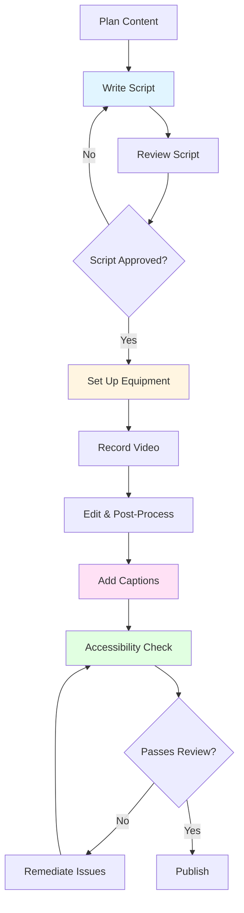

# Video Tutorial Production Guides

> **🏠 [Home](../../../../README.md)** | **📖 [Documentation](../../../README.md)** | **🎬 [Multimedia](../../README.md)** | **📹 [Video Tutorials](../README.md)** | **👤 Production Guides**

## Overview

Comprehensive production guides for creating professional, accessible, and engaging video tutorials for Cloud Scale Analytics documentation. These guides cover all aspects of video production from scriptwriting to equipment selection.

## Available Guides

### 📝 [Script Writing Guidelines](./script-writing.md)

Complete guide to writing effective video tutorial scripts.

**Topics Covered:**
- Understanding your audience and learning objectives
- Script structure and storytelling techniques
- Writing for different skill levels
- Voice and tone guidelines
- Demonstration scripting patterns
- Review and refinement processes

**Best For:** Content creators, instructional designers, technical writers

---

### 🎬 [Production Best Practices](./production-best-practices.md)

Professional video production standards and workflows.

**Topics Covered:**
- Pre-production planning and research
- Recording environment setup
- Screen recording and voice-over techniques
- Post-production editing workflows
- Quality control and publishing
- Analytics and continuous improvement

**Best For:** Video producers, editors, content managers

---

### 🎙️ [Equipment Requirements](./equipment.md)

Detailed equipment recommendations for all production levels.

**Topics Covered:**
- Audio equipment (microphones, interfaces, headphones)
- Video equipment (cameras, lighting, monitors)
- Computer specifications and software
- Studio setup and acoustic treatment
- Budget recommendations by production level
- Maintenance and upgrade paths

**Best For:** Production managers, budget planners, equipment purchasers

---

### ♿ [Accessibility Guidelines](./accessibility.md)

Comprehensive accessibility standards for video content.

**Topics Covered:**
- WCAG 2.1 and Section 508 compliance
- Closed captioning requirements
- Audio descriptions and transcripts
- Visual accessibility (contrast, readability)
- Keyboard navigation and screen readers
- Testing and validation procedures

**Best For:** Accessibility specialists, content creators, QA teams

---

## Quick Start Guides

### For New Video Creators

If you're creating your first video tutorial, follow this sequence:

1. **Start Here**: [Script Writing Guidelines](./script-writing.md)
   - Learn how to structure your content
   - Write your first script using the templates
   - Get peer feedback on your script

2. **Then Review**: [Production Best Practices](./production-best-practices.md)
   - Understand the production workflow
   - Set up your recording environment
   - Learn recording techniques

3. **Equipment Check**: [Equipment Requirements](./equipment.md)
   - Review starter package recommendations
   - Purchase or borrow essential equipment
   - Test your setup before recording

4. **Ensure Accessibility**: [Accessibility Guidelines](./accessibility.md)
   - Plan for captions and transcripts
   - Check color contrast and readability
   - Add accessibility to your workflow

### For Experienced Producers

Jump directly to specific topics:

- **Improving Quality**: [Production Best Practices](./production-best-practices.md)
- **Upgrading Equipment**: [Equipment Requirements](./equipment.md)
- **Meeting Compliance**: [Accessibility Guidelines](./accessibility.md)

## Resource Comparison

### By Production Level

| Guide | Beginner | Intermediate | Advanced |
|-------|----------|--------------|----------|
| **Script Writing** | Essential templates | Advanced techniques | Storytelling mastery |
| **Production** | Basic workflow | Professional tips | Studio-level quality |
| **Equipment** | Starter package ($500) | Professional setup ($2,500) | Studio setup ($8,000+) |
| **Accessibility** | Basic compliance | Full WCAG 2.1 AA | Enterprise standards |

### By Role

| Role | Primary Guides | Secondary Guides |
|------|---------------|------------------|
| **Content Writer** | Script Writing | Production Best Practices |
| **Video Producer** | Production Best Practices | Equipment, Accessibility |
| **Accessibility Specialist** | Accessibility | Script Writing, Production |
| **Project Manager** | All guides (overview) | Equipment (budgeting) |
| **QA Tester** | Accessibility | Production Best Practices |

## Production Workflow Integration

### Complete Production Pipeline

### Guide Usage by Phase

| Production Phase | Relevant Guides | Key Actions |
|------------------|-----------------|-------------|
| **1. Planning** | Script Writing | Define objectives, research content |
| **2. Scripting** | Script Writing | Write, review, refine script |
| **3. Pre-Production** | Production, Equipment | Setup environment, test equipment |
| **4. Recording** | Production, Equipment | Capture audio/video |
| **5. Post-Production** | Production | Edit, mix audio, add graphics |
| **6. Accessibility** | Accessibility | Captions, transcripts, descriptions |
| **7. QA** | All guides | Quality checks, compliance validation |
| **8. Publishing** | Production | Export, upload, optimize metadata |

## Templates & Downloads

### Available Templates

Each guide includes downloadable templates:

**Script Writing:**
- Complete tutorial script template
- Quick tips script template
- Storyboard template

**Production:**
- Shot list template
- Recording checklist
- Export settings presets

**Equipment:**
- Equipment comparison spreadsheet
- Budget planning worksheet
- Setup diagrams

**Accessibility:**
- Caption format templates (SRT, VTT)
- Transcript template
- Accessibility checklist

### Template Locations

All templates are referenced within their respective guide documents. Look for sections marked:

> 📥 **Template Download** or 📋 **Template**

## Common Questions

### How long does it take to produce a 15-minute tutorial?

**Typical Timeline:**
- Planning & scripting: 3-4 hours
- Recording: 2-3 hours
- Post-production: 4-6 hours
- Accessibility (captions, etc.): 1-2 hours
- **Total: 10-15 hours**

See [Production Best Practices](./production-best-practices.md#recording-workflow) for detailed breakdown.

### What's the minimum budget to get started?

**Starter Package: ~$500**
- USB microphone: $130
- Headphones: $100
- Software: Free (OBS, DaVinci Resolve)
- Basic lighting: $50
- Acoustic treatment: $120

See [Equipment Requirements](./equipment.md#budget-recommendations) for complete packages.

### What are the essential accessibility requirements?

**Must-Haves:**
- Accurate closed captions (synchronized within 200ms)
- Complete text transcript
- Color contrast ratio of 4.5:1 minimum
- Keyboard-accessible video controls

See [Accessibility Guidelines](./accessibility.md#wcag-21-compliance) for full requirements.

### Can I use AI tools for captions and scripts?

**Yes, with caveats:**
- **Captions**: AI auto-captions are a good starting point but require manual editing for accuracy
- **Scripts**: AI can help with outlines and drafts, but human review is essential for quality
- **Transcripts**: AI transcription works well for clear audio, less so for technical jargon

See relevant sections in [Accessibility Guidelines](./accessibility.md#caption-services) and [Script Writing](./script-writing.md#script-development).

## Standards & Compliance

### Quality Standards

All video tutorials must meet these minimum standards:

| Aspect | Minimum Requirement | Recommended |
|--------|-------------------|-------------|
| **Resolution** | 1920x1080 (1080p) | 2560x1440 (1440p) |
| **Frame Rate** | 30 fps | 60 fps (for demos) |
| **Audio Quality** | 48kHz, no background noise | Studio quality, -3dB peak |
| **Captions** | 98% accuracy, synced | Professional human-edited |
| **Accessibility** | WCAG 2.1 Level A | WCAG 2.1 Level AA |

### Compliance Checklist

Before publishing, verify:

- [ ] Learning objectives clearly defined
- [ ] Script reviewed and approved
- [ ] Video quality meets standards
- [ ] Audio clear and consistent
- [ ] Captions accurate and synchronized
- [ ] Transcript complete
- [ ] Accessibility validation passed
- [ ] Branding guidelines followed
- [ ] Metadata optimized
- [ ] Resources linked

## Additional Resources

### External References

- **Microsoft Learn**: [Create training videos](https://learn.microsoft.com/training/)
- **Google Developers**: [Technical video production](https://developers.google.com/style/videos)
- **W3C**: [Making Audio and Video Media Accessible](https://www.w3.org/WAI/media/av/)
- **YouTube Creator Academy**: [Production basics](https://creatoracademy.youtube.com/)

### Related Documentation

- **[Multimedia Production Guide](../../production-guide/README.md)** - Overall multimedia strategy
- **[Animation Guidelines](../../animations/animation-guidelines.md)** - Animated content standards
- **[Interactive Demos](../../interactive-demos/README.md)** - Interactive tutorial alternatives
- **[Visual Style Guide](../../../VISUAL-STYLE-GUIDE.md)** - Brand and design standards

### Community & Support

- **Internal Slack**: #video-production
- **Documentation Team**: docs-team@example.com
- **Accessibility Team**: a11y-team@example.com
- **Equipment Support**: av-support@example.com

## Version History

| Version | Date | Changes |
|---------|------|---------|
| 1.0.0 | Jan 2025 | Initial release with four comprehensive guides |

## Contributing

Found an error or have suggestions? See our [Contributing Guide](../../../guides/CONTRIBUTING_GUIDE.md).

---

*Last Updated: January 2025 | Version: 1.0.0*
