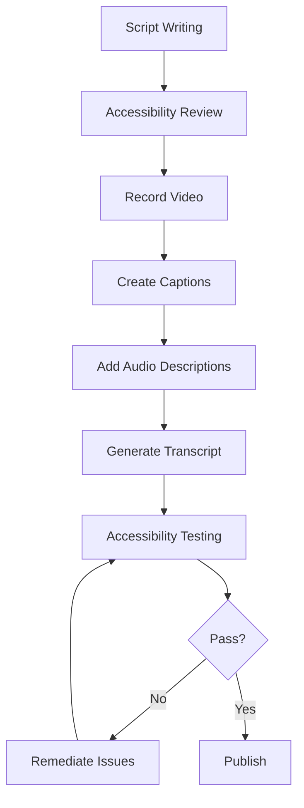

# Video Accessibility Guidelines

> **🏠 [Home](../../../../README.md)** | **📖 [Documentation](../../../README.md)** | **🎬 [Multimedia](../../README.md)** | **📹 [Video Tutorials](../README.md)** | **👤 Accessibility Guidelines**


## Overview

Creating accessible video content ensures that all users, regardless of their abilities, can consume and benefit from Cloud Scale Analytics video tutorials. This guide provides comprehensive accessibility standards and best practices for video production.

## Accessibility Standards

### WCAG 2.1 Compliance

All video content must meet **Web Content Accessibility Guidelines (WCAG) 2.1 Level AA** standards:

| Criterion | Requirement | Implementation |
|-----------|-------------|----------------|
| **1.2.1** | Audio-only and Video-only (Prerecorded) | Provide text transcripts |
| **1.2.2** | Captions (Prerecorded) | Synchronized captions for all audio |
| **1.2.3** | Audio Description or Media Alternative | Audio descriptions for visual content |
| **1.2.4** | Captions (Live) | Real-time captions if applicable |
| **1.2.5** | Audio Description (Prerecorded) | Extended audio descriptions |
| **1.4.2** | Audio Control | Auto-play prevention or pause control |

### Section 508 Compliance

For government and enterprise use, ensure compliance with:

- **1194.24(c)**: Audio descriptions of visual information
- **1194.24(d)**: Closed captioning for multimedia
- **1194.31**: Functional performance criteria

## Closed Captions

### Caption Requirements

#### Technical Specifications

```yaml
caption_format: SRT, VTT, or SCC
encoding: UTF-8
line_length: 32-42 characters
lines_per_screen: 1-2 lines
duration_per_screen: 1-7 seconds
reading_speed: 140-180 words per minute
```

#### Caption Content Standards

**Do's:**
- ✅ Include all spoken dialogue word-for-word
- ✅ Identify speakers when multiple people talk
- ✅ Describe relevant sound effects [KEYBOARD TYPING]
- ✅ Indicate music genre and mood [UPBEAT ELECTRONIC MUSIC]
- ✅ Note important non-speech sounds [NOTIFICATION CHIME]
- ✅ Use proper punctuation and grammar

**Don'ts:**
- ❌ Paraphrase or summarize dialogue
- ❌ Omit background sounds that add context
- ❌ Use excessive capitalization
- ❌ Include speaker identification when obvious
- ❌ Censor or modify language

#### Caption Formatting Examples

```srt
1
00:00:00,000 --> 00:00:03,500
Welcome to Azure Synapse Analytics Fundamentals.

2
00:00:03,500 --> 00:00:07,200
In this tutorial, we'll explore the core
components of Azure Synapse.

3
00:00:07,200 --> 00:00:10,800
[NARRATOR] Let's start with Serverless SQL pools.
[MOUSE CLICKING]

4
00:00:10,800 --> 00:00:14,500
INSTRUCTOR: Notice how the query executes
without provisioning infrastructure.
```

### Caption Synchronization

**Timing Guidelines:**

- **Lead time**: Captions appear 0-200ms before audio
- **Lag time**: Captions remain 200-400ms after audio ends
- **Scene changes**: Captions should not span scene cuts
- **Reading time**: Minimum 1 second per caption
- **Maximum duration**: 7 seconds per caption

## Audio Descriptions

### When to Include Audio Descriptions

Audio descriptions are essential when:

- Complex diagrams or architecture visualizations appear
- On-screen text contains critical information
- Code demonstrations show visual results
- UI navigation occurs without verbal explanation
- Data visualizations or charts are displayed

### Audio Description Techniques

#### Extended Audio Descriptions

For content with complex visuals:

```markdown
[PAUSE VIDEO]
AUDIO DESCRIPTION: "The architecture diagram shows three main layers.
At the top, data sources including Event Hubs, IoT Hub, and Azure SQL.
In the middle, the Azure Synapse workspace with Spark pools and SQL pools.
At the bottom, Power BI and Azure ML consuming the processed data."
[RESUME VIDEO]
```

#### Integrated Descriptions

For simpler content, integrate descriptions into narration:

```markdown
NARRATOR: "As you can see on the screen, the Azure Portal displays
the Create Synapse Workspace dialog with four required fields:
Workspace name, Subscription, Resource group, and Region."
```

### Audio Description Standards

| Aspect | Requirement | Notes |
|--------|-------------|-------|
| **Clarity** | Clear, concise descriptions | Avoid technical jargon |
| **Timing** | During natural pauses | Don't overlap dialogue |
| **Content** | Describe what, not why | Focus on visual elements |
| **Voice** | Same voice as narration | Maintain consistency |
| **Volume** | Same level as narration | -3dB to -6dB peak |

## Transcripts

### Full Transcript Requirements

Every video must include a complete text transcript containing:

- **All spoken dialogue**: Word-for-word narration and speech
- **Speaker identification**: [NARRATOR], [INSTRUCTOR], [EXPERT]
- **Sound effects**: [KEYBOARD TYPING], [NOTIFICATION SOUND]
- **Music cues**: [BACKGROUND MUSIC BEGINS]
- **Visual descriptions**: [SHOWS: Azure Portal dashboard]
- **Code snippets**: Full code examples displayed on screen
- **Timestamps**: Section markers for navigation

### Transcript Format

```markdown
# Transcript: Azure Synapse Analytics Fundamentals

**Duration**: 25:00
**Video URL**: [link]
**Published**: January 2025

---

## Opening (00:00 - 00:45)

[UPBEAT INTRO MUSIC]

[VISUAL: Animated Azure Synapse logo on blue background]

**NARRATOR**: Welcome to Azure Synapse Analytics Fundamentals. In this
25-minute tutorial, we'll explore everything you need to know to get
started with Microsoft's unified analytics platform.

[TRANSITION: Fade to Azure Portal]

---

## Section 1: Understanding Synapse Components (00:45 - 08:30)

[VISUAL: Azure Portal homepage displayed]

**NARRATOR**: Let's begin by understanding the core components that make
up Azure Synapse Analytics.

[MOUSE CLICK]
[VISUAL: Navigate to Synapse workspace]

**NARRATOR**: The first component is Serverless SQL pools...

[Code appears on screen:]
```sql
SELECT TOP 100 *
FROM OPENROWSET(
    BULK 'https://lake.dfs.core.windows.net/data/*.parquet',
    FORMAT = 'PARQUET'
) AS data;
```

---

## Section 2: Hands-On Demo (08:30 - 18:00)

[VISUAL: New browser tab opens]

**INSTRUCTOR**: Now let's create our first Synapse workspace together.

[KEYBOARD TYPING SOUNDS]

...
```

## Visual Accessibility

### Color Contrast

**Minimum Contrast Ratios (WCAG AA):**

- Normal text (< 18pt): **4.5:1**
- Large text (≥ 18pt): **3:1**
- UI components: **3:1**
- Graphical objects: **3:1**

#### Recommended Color Palettes

```css
/* High Contrast Text */
.text-on-light { color: #1a1a1a; }  /* Dark gray on white: 16.1:1 */
.text-on-dark { color: #ffffff; }   /* White on dark blue: 12.6:1 */

/* Azure Brand Colors (Accessible) */
.azure-blue { color: #0078D4; }     /* Primary: 4.5:1 on white */
.azure-teal { color: #008272; }     /* Success: 4.6:1 on white */
.azure-orange { color: #D83B01; }   /* Warning: 5.3:1 on white */
.azure-red { color: #A80000; }      /* Error: 6.4:1 on white */
```

### Text Readability

**Font Guidelines:**

- **Minimum size**: 16px (12pt) for body text
- **Code text**: 14px (10.5pt) with monospace font
- **Heading size**: At least 24px (18pt)
- **Font family**: Sans-serif (Segoe UI, Arial, Helvetica)
- **Font weight**: Regular (400) or Bold (600-700)
- **Line height**: 1.5 for body text, 1.2 for headings

**On-Screen Text Duration:**

```python
# Calculate minimum display time for text
def calculate_text_duration(word_count: int) -> float:
    """
    Calculate minimum seconds to display text.
    Assumes average reading speed of 200 words/minute.
    """
    base_reading_time = (word_count / 200) * 60  # seconds
    minimum_time = 2.0  # Never less than 2 seconds
    return max(base_reading_time * 1.5, minimum_time)  # 1.5x for comfort

# Example
text = "Navigate to Azure Portal and click Create Resource"
words = len(text.split())  # 9 words
display_time = calculate_text_duration(words)  # ~2.7 seconds
```

### Animation and Motion

**Avoid Seizure-Triggering Content:**

- ❌ No flashing more than 3 times per second
- ❌ No large area flashes (>25% of screen)
- ❌ Avoid red flashes specifically

**Motion Sensitivity:**

- Provide pause controls
- Avoid excessive parallax scrolling
- Minimize rapid zooms and pans
- Include motion reduction options

## Keyboard Navigation

### Video Player Requirements

All video players must support:

| Control | Keyboard Shortcut | Function |
|---------|------------------|----------|
| **Play/Pause** | Space or K | Toggle playback |
| **Seek Forward** | → or L | Jump ahead 5 seconds |
| **Seek Backward** | ← or J | Jump back 5 seconds |
| **Volume Up** | ↑ | Increase 5% |
| **Volume Down** | ↓ | Decrease 5% |
| **Mute** | M | Toggle mute |
| **Fullscreen** | F | Toggle fullscreen |
| **Captions** | C | Toggle captions |
| **Speed** | < / > | Decrease/increase playback speed |

### Interactive Elements

- Tab order must be logical
- Focus indicators must be visible
- No keyboard traps
- Skip links for long content

## Screen Reader Compatibility

### Video Player Accessibility

```html
<!-- Accessible video player markup -->
<video
  id="tutorial-video"
  aria-label="Azure Synapse Analytics Fundamentals Tutorial"
  aria-describedby="video-description"
  controls
  preload="metadata">

  <source src="synapse-fundamentals.mp4" type="video/mp4">
  <source src="synapse-fundamentals.webm" type="video/webm">

  <!-- Captions -->
  <track kind="captions"
         src="synapse-fundamentals-en.vtt"
         srclang="en"
         label="English Captions"
         default>

  <!-- Audio Descriptions -->
  <track kind="descriptions"
         src="synapse-fundamentals-desc.vtt"
         srclang="en"
         label="Audio Descriptions">

  <!-- Fallback -->
  <p>Your browser doesn't support HTML5 video.
     <a href="synapse-fundamentals.mp4">Download the video</a>.</p>
</video>

<div id="video-description" class="sr-only">
  This 25-minute tutorial covers Azure Synapse Analytics fundamentals
  including Serverless SQL pools, Spark pools, and data integration.
</div>
```

### ARIA Labels

```html
<!-- Progress bar -->
<div role="progressbar"
     aria-valuenow="45"
     aria-valuemin="0"
     aria-valuemax="100"
     aria-label="Video progress: 45% complete">
</div>

<!-- Chapter navigation -->
<nav aria-label="Video chapters">
  <ul>
    <li><a href="#chapter-1" aria-label="Chapter 1: Introduction">Introduction</a></li>
    <li><a href="#chapter-2" aria-label="Chapter 2: Core Concepts">Core Concepts</a></li>
  </ul>
</nav>
```

## Testing & Validation

### Accessibility Testing Checklist

- [ ] **Caption Quality**
  - [ ] All audio transcribed accurately
  - [ ] Sound effects described
  - [ ] Speaker identification included
  - [ ] Synchronized within 200ms
  - [ ] Grammar and punctuation correct

- [ ] **Visual Accessibility**
  - [ ] Color contrast meets 4.5:1 minimum
  - [ ] Text readable at 200% zoom
  - [ ] No flashing content
  - [ ] Motion can be paused

- [ ] **Audio Descriptions**
  - [ ] Complex visuals described
  - [ ] Descriptions don't overlap dialogue
  - [ ] Code demonstrations narrated
  - [ ] UI actions verbalized

- [ ] **Keyboard Navigation**
  - [ ] All controls keyboard accessible
  - [ ] Logical tab order
  - [ ] Focus indicators visible
  - [ ] Shortcuts documented

- [ ] **Screen Reader**
  - [ ] Video has descriptive label
  - [ ] Controls properly labeled
  - [ ] Chapter markers announced
  - [ ] Status updates conveyed

### Testing Tools

```bash
# Automated accessibility testing
npm install -g @axe-core/cli
axe https://your-video-page.com --tags wcag2a,wcag2aa

# Caption validation
npm install -g subtitle-validator
subtitle-validator captions.vtt

# Color contrast checker
npm install -g color-contrast-checker
check-contrast "#0078D4" "#FFFFFF"  # Returns ratio: 4.54:1 ✓
```

### Manual Testing Protocol

1. **Watch with sound off**: Verify captions convey all information
2. **Listen without watching**: Confirm audio descriptions explain visuals
3. **Keyboard only**: Navigate and control using only keyboard
4. **Screen reader**: Test with NVDA, JAWS, or VoiceOver
5. **High contrast mode**: Verify visibility in Windows High Contrast
6. **200% zoom**: Ensure text remains readable
7. **Slow connection**: Test on throttled connection

## Best Practices

### Content Design

**Inclusive Language:**
- Use person-first language: "person with disability" not "disabled person"
- Avoid ableist metaphors: "let's explore" not "let's see"
- Be specific: "click" not "hit" or "bang"

**Clear Communication:**
- Speak clearly and at moderate pace (140-160 wpm)
- Avoid idioms and jargon
- Spell out acronyms on first use
- Provide context for visual references

### Production Workflow



## Resources

### Accessibility Tools

- **[WAVE Browser Extension](https://wave.webaim.org/)** - Web accessibility evaluation
- **[axe DevTools](https://www.deque.com/axe/devtools/)** - Automated accessibility testing
- **[Color Contrast Analyzer](https://www.tpgi.com/color-contrast-checker/)** - Free contrast checker
- **[NVDA Screen Reader](https://www.nvaccess.org/)** - Free screen reader for testing

### Caption Services

- **[Rev.com](https://www.rev.com/)** - Professional captioning service
- **[3Play Media](https://www.3playmedia.com/)** - Accessibility services
- **YouTube Auto-Captions** - Starting point (requires editing)
- **Otter.ai** - AI-powered transcription

### Guidelines & Standards

- **[WCAG 2.1 Guidelines](https://www.w3.org/WAI/WCAG21/quickref/)** - Official specification
- **[Section 508 Standards](https://www.section508.gov/)** - U.S. federal requirements
- **[Microsoft Accessibility](https://www.microsoft.com/accessibility/)** - Microsoft's guidelines
- **[WebAIM Resources](https://webaim.org/)** - Comprehensive accessibility guides

---

*Last Updated: January 2025 | Version: 1.0.0*
