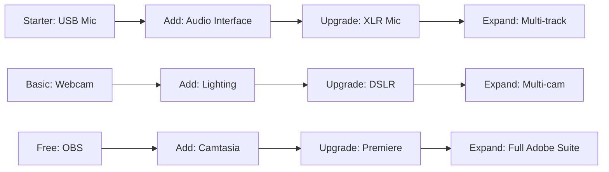

# Video Production Equipment Requirements

> **🏠 [Home](../../../../README.md)** | **📖 [Documentation](../../../README.md)** | **🎬 [Multimedia](../../README.md)** | **📹 [Video Tutorials](../README.md)** | **👤 Equipment Guide**


## Overview

This guide outlines the equipment requirements and recommendations for producing professional-quality video tutorials for Cloud Scale Analytics documentation. Equipment is categorized by production level to accommodate different budgets and quality expectations.

## Production Levels

### Basic Setup ($200-500)

Suitable for internal training and draft tutorials.

### Professional Setup ($1,000-3,000)

Recommended for public-facing tutorial content.

### Studio Setup ($5,000+)

For high-volume production and premium content.

## Audio Equipment

### Microphones

Audio quality is the most critical factor in video production. Invest in the best microphone your budget allows.

#### Entry Level ($50-150)

| Microphone | Type | Price | Use Case | Notes |
|------------|------|-------|----------|-------|
| **Blue Snowball** | USB Condenser | $50 | Voice-over recording | Good starter mic |
| **Fifine K669** | USB Condenser | $35 | Basic narration | Budget option |
| **Samson Q2U** | USB/XLR Dynamic | $70 | Voice-over, portable | Dual connection |

**Pros**: Affordable, USB plug-and-play, no additional equipment needed
**Cons**: Limited control, average sound quality, USB noise possible

#### Professional Level ($150-400)

| Microphone | Type | Price | Use Case | Notes |
|------------|------|-------|----------|-------|
| **Audio-Technica AT2020USB+** | USB Condenser | $150 | Studio voice-over | Excellent clarity |
| **Blue Yeti** | USB Condenser | $130 | Versatile recording | Multiple patterns |
| **Shure MV7** | USB/XLR Dynamic | $250 | Broadcast quality | Hybrid connectivity |
| **Rode NT-USB** | USB Condenser | $170 | Professional VO | Studio quality |

**Pros**: Professional sound, flexible control, USB convenience
**Cons**: May pick up room noise, requires quiet environment

#### Studio Level ($400-1,000+)

| Microphone | Type | Price | Use Case | Notes |
|------------|------|-------|----------|-------|
| **Shure SM7B** | XLR Dynamic | $400 | Broadcast standard | Requires interface |
| **Rode NT1** | XLR Condenser | $230 | Studio recording | Very low noise |
| **Audio-Technica AT4040** | XLR Condenser | $300 | Pro studio work | Wide frequency |
| **Neumann TLM 102** | XLR Condenser | $700 | Premium quality | Industry standard |

**Pros**: Exceptional quality, professional durability, expandable
**Cons**: Requires audio interface, more expensive, needs treatment

### Audio Interfaces

Required for XLR microphones. Converts analog signal to digital.

| Interface | Inputs | Price | Features | Recommended For |
|-----------|--------|-------|----------|-----------------|
| **Focusrite Scarlett Solo** | 1 XLR | $120 | Simple, reliable | Single narrator |
| **Focusrite Scarlett 2i2** | 2 XLR | $180 | 2 inputs, quality | Interview format |
| **PreSonus AudioBox** | 2 XLR | $100 | Budget option | Entry level |
| **Universal Audio Volt 276** | 2 XLR | $300 | Vintage preamps | Premium quality |

### Headphones

#### Closed-Back (Recording)

| Model | Type | Price | Use Case |
|-------|------|-------|----------|
| **Sony MDR-7506** | Professional | $100 | Industry standard |
| **Audio-Technica ATH-M50x** | Studio | $170 | Excellent clarity |
| **Beyerdynamic DT 770 PRO** | Studio | $180 | Superior comfort |

#### Open-Back (Mixing)

| Model | Type | Price | Use Case |
|-------|------|-------|----------|
| **Sennheiser HD 600** | Studio | $350 | Reference quality |
| **Audio-Technica ATH-R70x** | Reference | $350 | Critical listening |

### Acoustic Treatment

Essential for professional audio quality.

| Item | Quantity | Price | Purpose |
|------|----------|-------|---------|
| **Foam Panels** | 12-24 panels | $80-150 | Wall absorption |
| **Bass Traps** | 4-6 traps | $100-200 | Corner treatment |
| **Acoustic Blankets** | 2-4 blankets | $60-120 | Temporary treatment |
| **Mic Isolation Shield** | 1 | $50-100 | Reduce reflections |
| **Pop Filter** | 1 | $10-30 | Reduce plosives |
| **Mic Stand/Boom Arm** | 1 | $30-150 | Positioning |

## Video Equipment

### Cameras

Most screen recordings don't require cameras, but they're useful for presenter segments.

#### Webcams ($50-300)

| Camera | Resolution | FPS | Price | Features |
|--------|-----------|-----|-------|----------|
| **Logitech C920** | 1080p | 30 | $70 | Reliable, affordable |
| **Logitech Brio** | 4K | 60 | $200 | Premium quality |
| **Razer Kiyo Pro** | 1080p | 60 | $150 | Low-light performance |

#### DSLR/Mirrorless ($400-2,000+)

| Camera | Type | Price | Notes |
|--------|------|-------|-------|
| **Sony ZV-E10** | Mirrorless | $700 | Content creator focused |
| **Canon EOS M50 Mark II** | Mirrorless | $600 | Dual Pixel AF |
| **Sony A6400** | Mirrorless | $900 | Fast autofocus |

**Additional Requirements:**
- **Capture Card**: Elgato Cam Link 4K ($130) - HDMI to USB
- **Dummy Battery**: Continuous power ($15-30)
- **HDMI Cable**: Clean output ($10-20)

### Lighting

Good lighting dramatically improves video quality.

#### Basic Lighting Kit ($100-200)

```
[Setup Diagram]
┌─────────────────────┐
│    Background       │
│        ↑            │
│     [Person]        │
│       ↙  ↘          │
│   Key    Fill       │
└─────────────────────┘
```

| Item | Purpose | Price | Recommendation |
|------|---------|-------|----------------|
| **Key Light** | Primary illumination | $50-100 | Neewer LED Panel |
| **Fill Light** | Soften shadows | $40-80 | Smaller LED panel |
| **Back Light** | Separation | $30-50 | Small LED or clip |

#### Professional Lighting ($300-800)

| Light | Type | Price | Features |
|-------|------|-------|----------|
| **Elgato Key Light** | LED Panel | $200 | App control, adjustable |
| **Aputure AL-M9** | Compact LED | $60 | Portable, bi-color |
| **Godox SL-60W** | LED Bowens | $120 | Professional output |

**Modifiers:**
- **Softbox** ($30-80): Diffuse harsh light
- **Umbrella** ($20-50): Broad, soft light
- **Diffusion Panels** ($40-100): Control intensity

### Screen Recording

#### Hardware

| Item | Purpose | Price Range | Notes |
|------|---------|-------------|-------|
| **High-Resolution Monitor** | Sharp visuals | $200-600 | 1920x1080 minimum, 2560x1440 recommended |
| **Second Monitor** | Reference/notes | $150-400 | Workflow efficiency |
| **Graphics Tablet** | Annotations | $50-400 | Wacom Intuos or similar |
| **Capture Card** | External recording | $100-200 | For console/device capture |

**Recommended Monitor Specs:**
- **Resolution**: 2560x1440 (1440p) or higher
- **Size**: 27-32 inches for 1440p
- **Panel**: IPS for color accuracy
- **Refresh Rate**: 60Hz minimum
- **Color Gamut**: sRGB 99%+

## Computer Requirements

### Minimum Specifications

```yaml
operating_system: Windows 10/11 Pro or macOS 12+
processor: Intel i5-10400 / AMD Ryzen 5 3600 or better
ram: 16 GB DDR4
graphics: Dedicated GPU with 4GB VRAM
storage: 512 GB NVMe SSD (system)
additional_storage: 1-2 TB SSD/HDD (project files)
display: 1920x1080 minimum resolution
```

### Recommended Specifications

```yaml
operating_system: Windows 11 Pro or macOS 13+
processor: Intel i7-12700K / AMD Ryzen 7 5800X or better
ram: 32 GB DDR4 3200MHz
graphics: NVIDIA RTX 3060 / AMD RX 6700 XT (8GB+)
storage: 1 TB NVMe SSD (system + active projects)
additional_storage: 4 TB NVMe/SSD (archive)
display: 2560x1440 or 4K primary display
network: Gigabit Ethernet or WiFi 6
```

### Professional Specifications

```yaml
operating_system: Windows 11 Pro Workstation or macOS 13+
processor: Intel i9-13900K / AMD Ryzen 9 7950X / Apple M2 Max
ram: 64 GB DDR5 or unified memory
graphics: NVIDIA RTX 4080 / Apple M2 Max GPU
storage: 2 TB NVMe Gen4 SSD
additional_storage: 8-16 TB NVMe RAID array
display: 4K main + 1440p secondary
backup: 10+ TB NAS with RAID
network: 10 Gigabit Ethernet
```

## Software

### Screen Recording & Editing

| Software | Platform | Price | Level | Features |
|----------|----------|-------|-------|----------|
| **OBS Studio** | Win/Mac/Linux | Free | All | Live streaming, recording |
| **Camtasia** | Win/Mac | $300 | Basic-Pro | All-in-one, easy to use |
| **ScreenFlow** | Mac | $170 | Pro | Screen + camera recording |
| **Adobe Premiere Pro** | Win/Mac | $21/mo | Pro | Industry standard editing |
| **DaVinci Resolve** | Win/Mac/Linux | Free/$300 | Pro-Studio | Color grading, effects |
| **Final Cut Pro** | Mac | $300 | Pro | Optimized for Mac |

### Audio Editing

| Software | Platform | Price | Use Case |
|----------|----------|-------|----------|
| **Audacity** | Win/Mac/Linux | Free | Basic editing |
| **Adobe Audition** | Win/Mac | $21/mo | Professional |
| **iZotope RX** | Win/Mac | $400+ | Audio repair |
| **Reaper** | Win/Mac/Linux | $60 | Full DAW |

### Graphics & Animation

| Software | Platform | Price | Purpose |
|----------|----------|-------|---------|
| **Canva Pro** | Web | $120/yr | Thumbnails, graphics |
| **Adobe After Effects** | Win/Mac | $21/mo | Motion graphics |
| **Adobe Photoshop** | Win/Mac | $21/mo | Image editing |
| **Adobe Illustrator** | Win/Mac | $21/mo | Vector graphics |
| **Blender** | All | Free | 3D animation |

### Utility Software

```bash
# Recommended installations
- Teleprompter software: PromptSmart ($15)
- Color picker: ColorSlurp (free)
- Screen ruler: PixelSnap ($15)
- Macro recorder: AutoHotkey (free - Windows)
- Screenshot tool: ShareX (free - Windows), CleanShot X ($30 - Mac)
- Note-taking: Obsidian (free)
```

## Studio Setup

### Desk & Ergonomics

| Item | Purpose | Price Range |
|------|---------|-------------|
| **Standing Desk** | Ergonomic positioning | $300-800 |
| **Ergonomic Chair** | Comfort for long sessions | $300-1,000 |
| **Monitor Arm** | Screen positioning | $100-300 |
| **Keyboard Tray** | Ergonomic typing | $50-150 |
| **Footrest** | Posture support | $30-80 |

### Cable Management

- **Cable Sleeves**: $20-40
- **Cable Clips**: $10-20
- **Power Strips**: $30-60
- **UPS (Uninterruptible Power Supply)**: $100-300

### Environmental Control

| Item | Purpose | Price |
|------|---------|-------|
| **Air Purifier** | Clean air, reduce noise | $150-400 |
| **Dehumidifier** | Equipment protection | $200-400 |
| **Fan/AC** | Temperature control | $100-500 |
| **Sound Machine** | Mask external noise | $30-100 |

## Recording Environment

### Room Requirements

**Ideal Room Characteristics:**
- **Size**: 10x10 ft minimum (larger is better)
- **Ceiling Height**: 8+ ft
- **Windows**: Minimal or covered for light control
- **Hard Surfaces**: Treated with acoustic panels
- **Background**: Clean, uncluttered, or virtual

### Acoustic Treatment Budget Guide

```markdown
Basic Treatment ($200-400):
- 12 foam panels on walls
- 2 bass traps in corners
- 1 rug on floor
- 1 mic isolation shield

Standard Treatment ($500-1,000):
- 24 acoustic panels (walls + ceiling)
- 4 bass traps (all corners)
- Acoustic curtains over windows
- Door seal kit
- Floating floor/rug

Professional Treatment ($2,000-5,000):
- Full wall coverage
- Ceiling treatment
- Professional bass traps
- Floating floor
- Double-sealed door
- HVAC damping
```

## Budget Recommendations

### Starter Package ($500)

```yaml
microphone: Blue Yeti ($130)
headphones: Sony MDR-7506 ($100)
screen_recording: OBS Studio (Free)
editing: DaVinci Resolve Free (Free)
lighting: Neewer Ring Light ($50)
acoustic: Foam panels + pop filter ($120)
total_cost: ~$500
```

### Professional Package ($2,500)

```yaml
microphone: Shure MV7 ($250)
audio_interface: Focusrite Scarlett Solo ($120)
headphones: Audio-Technica ATH-M50x ($170)
camera: Logitech Brio ($200)
screen_recording: Camtasia ($300)
editing: Adobe Creative Cloud ($21/mo)
lighting: Elgato Key Light + fill ($300)
acoustic_treatment: Comprehensive kit ($400)
monitor: Dell 27" 1440p ($350)
peripherals: Mic stand, cables, accessories ($200)
total_cost: ~$2,500
```

### Studio Package ($8,000)

```yaml
microphone: Shure SM7B ($400)
audio_interface: Universal Audio Volt 276 ($300)
headphones: Sennheiser HD 600 ($350)
camera: Sony ZV-E10 + lens ($900)
capture_card: Elgato Cam Link 4K ($130)
screen_recording: ScreenFlow ($170)
editing: Adobe Creative Cloud Suite ($55/mo)
color_grading: DaVinci Resolve Studio ($300)
lighting: 3-point professional kit ($600)
acoustic_treatment: Professional package ($2,000)
monitors: Dual 4K displays ($1,200)
computer_upgrade: RAM, storage, GPU ($1,500)
furniture: Standing desk + chair ($800)
total_cost: ~$8,000
```

## Maintenance & Upgrades

### Regular Maintenance

**Monthly:**
- Clean microphone with soft cloth
- Check cable connections
- Update software
- Backup project files

**Quarterly:**
- Deep clean equipment
- Test all gear functionality
- Review and update software licenses
- Calibrate monitor colors

**Annually:**
- Replace worn cables
- Upgrade acoustic treatment if needed
- Review and update equipment
- Professional equipment servicing

### Upgrade Path



## Cost-Saving Tips

1. **Buy Used Equipment**: Professional mics and cameras hold value
2. **Student Discounts**: Adobe offers 60% off for students/teachers
3. **Bundle Deals**: Focusrite Scarlett bundles include software
4. **Free Software First**: Master OBS and Audacity before upgrading
5. **DIY Acoustic Treatment**: Build your own panels and bass traps
6. **Gradual Upgrades**: Start with audio, add video equipment later
7. **Rent Equipment**: For occasional multi-camera shoots
8. **Black Friday Deals**: Major discounts on software and hardware

## Testing & Verification

### Equipment Testing Checklist

- [ ] **Audio Quality**
  - [ ] Record 1-minute test narration
  - [ ] Check for background noise
  - [ ] Verify clarity and volume
  - [ ] Test in editing software

- [ ] **Video Quality**
  - [ ] Record 1080p test at 30fps
  - [ ] Check focus and exposure
  - [ ] Verify color accuracy
  - [ ] Test capture settings

- [ ] **Screen Recording**
  - [ ] Capture desktop at native resolution
  - [ ] Verify smooth playback
  - [ ] Check file size and format
  - [ ] Test cursor visibility

- [ ] **Editing Performance**
  - [ ] Import test footage
  - [ ] Apply basic effects
  - [ ] Render short clip
  - [ ] Verify export quality

## Resources

### Shopping Links

- **[B&H Photo](https://www.bhphotovideo.com/)** - Professional equipment retailer
- **[Sweetwater](https://www.sweetwater.com/)** - Audio equipment specialist
- **[Amazon Business](https://business.amazon.com/)** - Bulk equipment purchasing
- **[Adorama](https://www.adorama.com/)** - Camera and video equipment

### Reviews & Comparisons

- **[RTINGS](https://www.rtings.com/)** - Monitor and headphone reviews
- **[DPReview](https://www.dpreview.com/)** - Camera reviews
- **[Julian Krause](https://www.youtube.com/c/juliankrause)** - Audio interface testing
- **[Booth Junkie](https://www.youtube.com/c/boothjunkie)** - Microphone comparisons

### Learning Resources

- **[Booth Junkie](https://www.youtube.com/c/boothjunkie)** - Voice-over techniques
- **[Curtis Judd](https://www.youtube.com/c/curtisjudd)** - Audio for video
- **[Video Creators](https://www.youtube.com/c/VideoCreators)** - YouTube production
- **[Film Riot](https://www.youtube.com/c/FilmRiot)** - Filmmaking tutorials

---

*Last Updated: January 2025 | Version: 1.0.0*
