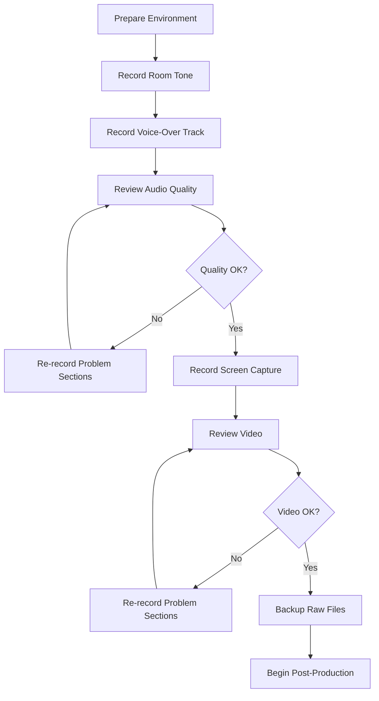

# Video Production Best Practices

> **🏠 [Home](../../../../README.md)** | **📖 [Documentation](../../../README.md)** | **🎬 [Multimedia](../../README.md)** | **📹 [Video Tutorials](../README.md)** | **👤 Production Best Practices**


## Overview

This guide establishes best practices for producing professional, engaging, and educational video tutorials for Cloud Scale Analytics documentation. Following these guidelines ensures consistent quality, efficient production workflows, and excellent viewer experience.

## Pre-Production

### Planning & Research

#### Define Learning Objectives

Before starting production, clearly define what viewers should learn:

```yaml
video_title: "Azure Synapse Serverless SQL Pools"
learning_objectives:
  - Understand serverless SQL pool architecture
  - Write queries against data lake files
  - Optimize query performance
  - Implement cost-effective patterns

target_audience: Data engineers with SQL experience
prerequisite_knowledge:
  - Basic SQL syntax
  - Azure fundamentals
  - Data lake concepts

success_criteria:
  - Viewer can query Parquet files in data lake
  - Viewer understands pricing model
  - Viewer can apply optimization techniques
```

#### Research Your Topic

**Deep Dive Checklist:**

- [ ] Review official Microsoft documentation
- [ ] Study Azure Architecture Center patterns
- [ ] Analyze real-world implementation examples
- [ ] Identify common pitfalls and solutions
- [ ] Gather performance benchmarks
- [ ] Collect relevant code samples
- [ ] Verify current pricing and limits
- [ ] Test all demonstrations personally

### Script Development

#### Script Structure Template

```markdown
# Video Script: [Topic Name]

## Metadata
Duration: [Target length]
Complexity: [Beginner/Intermediate/Advanced]

## Hook (0:00 - 0:30)
- Present relatable problem or challenge
- Preview what viewers will learn
- Show end result or transformation

## Introduction (0:30 - 2:00)
- Establish context and importance
- Define key terms
- Outline video structure

## Content Sections (2:00 - X:00)
Each section:
- State learning objective
- Explain concept clearly
- Demonstrate with example
- Highlight key takeaways

## Hands-On Demo (X:00 - Y:00)
- Real-world scenario
- Step-by-step walkthrough
- Common mistakes to avoid
- Troubleshooting tips

## Summary (Y:00 - End)
- Recap key concepts
- Provide next steps
- Share additional resources
```

#### Writing for Voice-Over

**Best Practices:**

```markdown
✅ DO:
- Write conversationally: "Let's explore..." not "We will explore..."
- Use active voice: "Click Create" not "The Create button should be clicked"
- Keep sentences short: 15-20 words maximum
- Use transitions: "Now that we've covered X, let's move to Y"
- Spell out numbers under 10: "three components" not "3 components"
- Include pronunciation guides: "Azure (AZH-ur) Synapse (SIN-aps)"

❌ DON'T:
- Use complex jargon without explanation
- Write long, run-on sentences
- Include overly technical acronyms
- Use passive voice excessively
- Assume prior knowledge
```

**Example Comparison:**

```markdown
Poor Script:
"The serverless SQL pool functionality within Azure Synapse Analytics
workspace enables users to execute T-SQL queries against data stored in
ADLS Gen2 without the necessity of provisioning dedicated infrastructure."

Better Script:
"Serverless SQL pools let you query data in your data lake using standard
SQL. You don't need to set up any servers - just write your query and run it.
You only pay for the data you process."
```

### Storyboarding

#### Visual Planning

```markdown
Scene 1: Opening Hook (15 seconds)
┌─────────────────────────────┐
│ Visual: Cluttered dashboard │
│ with slow queries           │
│                             │
│ Text Overlay: "Slow queries │
│ wasting time and money?"    │
│                             │
│ Narration: "Tired of slow   │
│ analytics queries..."       │
└─────────────────────────────┘

Scene 2: Solution Preview (15 seconds)
┌─────────────────────────────┐
│ Visual: Clean Azure Synapse │
│ interface, fast query       │
│                             │
│ Text: "Query data lakes in  │
│ seconds, pay only for what  │
│ you use"                    │
│                             │
│ Narration: "Serverless SQL  │
│ pools solve this..."        │
└─────────────────────────────┘
```

#### Shot Planning

| Shot Type | When to Use | Example |
|-----------|-------------|---------|
| **Wide Shot** | Establish context | Full Azure Portal dashboard |
| **Medium Shot** | Main content | Synapse workspace interface |
| **Close-Up** | Important details | Specific configuration field |
| **Insert Shot** | B-roll, visuals | Architecture diagram animation |
| **Over-Shoulder** | User perspective | Looking at code editor |

## Production

### Recording Environment

#### Setup Checklist

**Before Every Recording:**

- [ ] Close unnecessary applications
- [ ] Disable notifications (Focus Assist on Windows, Do Not Disturb on Mac)
- [ ] Clear browser history and cookies (fresh demo)
- [ ] Set display resolution to 1920x1080 or 2560x1440
- [ ] Increase browser zoom to 125-150% for readability
- [ ] Use high-contrast theme
- [ ] Close extra browser tabs
- [ ] Prepare demo data and environment
- [ ] Test microphone levels (-6dB to -3dB peak)
- [ ] Clear desktop of personal items

#### Environment Settings

```bash
# Windows Display Settings
Resolution: 1920x1080 (100% scaling) or 2560x1440 (150% scaling)
Color Profile: sRGB
Night Light: Disabled
HDR: Disabled

# Browser Settings (Chrome/Edge)
Zoom: 125% or 150%
Theme: Light (for better visibility)
Extensions: Disable all except essentials
Flags: Disable auto-translate popups

# Audio Settings
Sample Rate: 48000 Hz
Bit Depth: 24-bit
Buffer Size: 512 samples (low latency)
```

### Recording Techniques

#### Screen Recording Best Practices

**Recording Settings:**

```yaml
resolution: 1920x1080 (minimum)
frame_rate: 30fps (60fps for animations)
codec: H.264
bitrate: 8-10 Mbps (screen), 15-20 Mbps (video)
format: MP4 or MOV
audio: 48kHz, 320kbps AAC
```

**Cursor & Interaction:**

- Enable cursor highlighting (yellow or red ring)
- Slow down cursor movements (50-70% normal speed)
- Pause briefly before clicks
- Use keyboard shortcuts visibly
- Show typed text character-by-character (not paste)

**OBS Studio Configuration:**

```json
{
  "video_settings": {
    "base_resolution": "2560x1440",
    "output_resolution": "1920x1080",
    "downscale_filter": "Lanczos",
    "fps": 30
  },
  "output_settings": {
    "encoder": "x264",
    "rate_control": "CBR",
    "bitrate": 8000,
    "keyframe_interval": 2,
    "preset": "veryfast",
    "profile": "high"
  },
  "audio_settings": {
    "sample_rate": 48000,
    "channels": "Stereo"
  }
}
```

#### Voice-Over Recording

**Microphone Technique:**

- **Distance**: 6-8 inches from microphone
- **Position**: Slightly off-axis (30° angle) to reduce plosives
- **Posture**: Sit upright, maintain consistent position
- **Volume**: Speak at normal conversational level
- **Pace**: 140-160 words per minute
- **Breathing**: Breathe during pauses, edit breaths out later

**Recording Tips:**

```markdown
1. Warm up your voice (5 minutes of reading aloud)
2. Hydrate (room temperature water, no ice)
3. Record in 5-10 minute segments
4. Leave 2 seconds of room tone at start/end
5. Slate each take: "Section 2, Take 3"
6. Punch-in for mistakes rather than re-recording entire section
7. Record multiple takes of complex explanations
8. Review immediately after recording
```

**Common Mistakes & Fixes:**

| Mistake | Fix |
|---------|-----|
| **Plosives (P, B sounds)** | Use pop filter, speak at angle |
| **Sibilance (S, SH sounds)** | Back away 1-2 inches, de-ess in post |
| **Mouth clicks** | Stay hydrated, use apple before recording |
| **Room echo** | Add acoustic treatment, use blankets |
| **Background noise** | Record during quiet hours, use noise gate |
| **Inconsistent volume** | Maintain mic distance, use compression |

### Demonstration Techniques

#### Showing vs. Telling

**Show First Approach:**

```markdown
❌ Poor: "Click on the Create button, then select Resource Group,
and enter a name in the text field..."

✅ Better: [Perform action while narrating]
"Let's create a new resource group. I'll click Create...
choose Resource Group... and name it 'synapse-demo-rg'."
```

#### Code Demonstrations

**Best Practices:**

1. **Type Code Live** (Don't paste)
   - Helps viewers follow along
   - Demonstrates syntax
   - Shows IntelliSense features
   - Feels more authentic

2. **Use Syntax Highlighting**
   - Choose high-contrast theme
   - Increase font size (16-20pt)
   - Use consistent color scheme

3. **Explain While Coding**

```sql
-- Narration: "First, we'll create an external data source
-- that points to our data lake."

CREATE EXTERNAL DATA SOURCE sales_data
WITH (
    -- Narration: "We specify the Azure Data Lake Gen2 endpoint..."
    LOCATION = 'https://mystorageaccount.dfs.core.windows.net/sales',
    -- Narration: "...and use managed identity for authentication."
    CREDENTIAL = synapse_managed_identity
);
```

4. **Show Results**
   - Execute code and display output
   - Explain what success looks like
   - Show common errors and fixes

#### Portal Navigation

**Clear Navigation Principles:**

```markdown
1. Announce where you're going:
   "Let's navigate to the Azure Portal and find Synapse workspaces."

2. Show the path:
   [Highlight search bar]
   "I'll use the search feature here at the top..."

3. Confirm actions:
   "Notice the workspace is now created - we can see it in the list."

4. Use breadcrumbs:
   "We're currently in Settings > Security > Managed Private Endpoints."
```

### Recording Workflow

#### Efficient Production Process



**Time Allocation:**

```yaml
planning_and_scripting: 30% of total time
recording: 20% of total time
editing: 40% of total time
review_and_revisions: 10% of total time

example_10_minute_video:
  planning: 3 hours
  recording: 2 hours
  editing: 4 hours
  review: 1 hour
  total: 10 hours
```

## Post-Production

### Video Editing

#### Editing Workflow

**Standard Edit Sequence:**

1. **Assembly Edit**
   - Import all footage
   - Arrange clips in sequence
   - Remove obvious mistakes
   - Rough timing pass

2. **Rough Cut**
   - Trim dead space
   - Sync audio and video
   - Add basic transitions
   - Insert B-roll

3. **Fine Cut**
   - Precise timing adjustments
   - Add graphics and text overlays
   - Insert music and sound effects
   - Color correction

4. **Polish Pass**
   - Final audio mix
   - Smooth all transitions
   - Add end screens
   - Export settings verification

#### Pacing & Timing

**Edit for Engagement:**

```markdown
Cut Techniques:
- Remove pauses longer than 2 seconds
- Cut "um," "uh," and filler words
- Trim front and tail of clips (in-points and out-points)
- Jump cuts every 3-7 seconds maintain interest
- Use J-cuts and L-cuts for smooth audio transitions
- Vary shot composition (zoom levels)

Breathing Room:
- Leave 0.5-1 second before/after important points
- Pause 1-2 seconds before major transitions
- Allow 3-4 seconds for complex visuals to register
```

**Ideal Segment Lengths:**

| Content Type | Ideal Length | Maximum Length |
|--------------|--------------|----------------|
| **Introduction** | 30-45 seconds | 90 seconds |
| **Concept Explanation** | 2-3 minutes | 5 minutes |
| **Demonstration** | 3-5 minutes | 8 minutes |
| **Hands-On Exercise** | 5-8 minutes | 12 minutes |
| **Summary** | 30-60 seconds | 90 seconds |

#### Visual Enhancements

**Text Overlays:**

```css
/* Lower Third - Speaker/Topic */
.lower-third {
  font-family: 'Segoe UI', sans-serif;
  font-size: 32px;
  font-weight: 600;
  color: #FFFFFF;
  background: linear-gradient(90deg, #0078D4 0%, transparent 100%);
  padding: 20px 40px;
  position: bottom-left;
  animation: slide-in 0.5s ease-out;
}

/* Key Point Highlight */
.key-point {
  font-size: 48px;
  font-weight: 700;
  color: #FFB900;
  text-align: center;
  animation: fade-in 0.3s;
  duration: 3-5 seconds;
}

/* Code Annotation */
.code-callout {
  font-family: 'Consolas', monospace;
  font-size: 24px;
  background: rgba(0, 0, 0, 0.8);
  padding: 10px 20px;
  border-left: 4px solid #0078D4;
}
```

**Callouts & Annotations:**

- **Arrows**: Point to UI elements (yellow/white, 5-8px stroke)
- **Boxes**: Highlight regions (red/yellow outline, 3-5px)
- **Zoom**: 150-200% for small text, 1-2 second duration
- **Blur**: Hide sensitive information (API keys, emails)

#### Audio Post-Production

**Standard Audio Chain:**

```
1. Noise Reduction (if needed)
   - Apply to room tone sample
   - Reduce 6-12 dB

2. EQ (Equalization)
   - High-pass filter: 80-100 Hz
   - Presence boost: 2-4 kHz (+2 to +4 dB)
   - De-essing: 6-8 kHz (-3 to -6 dB)

3. Compression
   - Ratio: 3:1 to 4:1
   - Threshold: -18 to -12 dB
   - Attack: 10-30 ms
   - Release: 100-300 ms
   - Makeup gain: +2 to +6 dB

4. Limiting
   - Ceiling: -1.0 dB
   - Prevents clipping

5. Normalization
   - Target: -3 dB peak or -14 LUFS integrated
```

**Music & Sound Effects:**

```yaml
background_music:
  genre: Corporate/Ambient/Electronic
  volume: -25 to -30 dB (under narration)
  ducking: -40 dB when voice present
  intro_outro: -18 to -20 dB (full volume)

sound_effects:
  ui_clicks: -20 to -25 dB
  transitions: -15 to -20 dB
  notifications: -18 to -22 dB
  alerts: -15 to -18 dB

royalty_free_sources:
  - YouTube Audio Library
  - Epidemic Sound
  - Artlist
  - AudioJungle
```

### Quality Control

#### Pre-Export Checklist

- [ ] **Content Review**
  - [ ] All information accurate and current
  - [ ] No outdated UI or features shown
  - [ ] Links and resources verified
  - [ ] Code examples tested

- [ ] **Visual Quality**
  - [ ] No blurry or pixelated sections
  - [ ] Text readable at 720p
  - [ ] Color correction consistent
  - [ ] No jarring transitions

- [ ] **Audio Quality**
  - [ ] No background noise or hum
  - [ ] Volume consistent throughout
  - [ ] No clipping or distortion
  - [ ] Music appropriately mixed

- [ ] **Accessibility**
  - [ ] Captions accurate and synced
  - [ ] Audio descriptions added
  - [ ] Transcript prepared
  - [ ] Color contrast sufficient

- [ ] **Branding**
  - [ ] Intro/outro present
  - [ ] Logo properly placed
  - [ ] Brand colors used correctly
  - [ ] End screen configured

#### Export Settings

**YouTube Optimal Settings:**

```yaml
container: MP4
video_codec: H.264
framerate: 30fps (or source rate)
resolution: 1920x1080 (1080p)
bitrate: 8 Mbps (SDR), 10 Mbps (HDR)
keyframe: Every 2 seconds
pixel_format: YUV 4:2:0

audio_codec: AAC
sample_rate: 48 kHz
channels: Stereo
bitrate: 384 kbps

color:
  space: sRGB or Rec. 709
  primaries: Rec. 709
  transfer: Rec. 709
```

**File Naming Convention:**

```
CSA_[Series]_[Episode]_[Title]_[Resolution]_[Date].mp4

Examples:
CSA_Synapse_01_Introduction_1080p_20250115.mp4
CSA_DeltaLake_03_Optimization_1080p_20250120.mp4
```

## Publishing & Distribution

### Metadata Optimization

#### Title Best Practices

```markdown
Format: [Platform] [Topic] | [Benefit/Outcome] | [Series Name]

Examples:
✅ "Azure Synapse Serverless SQL | Query Data Lakes in Seconds | CSA Tutorial"
✅ "Delta Lake Optimization | 10x Faster Queries | Cloud Scale Analytics"
✅ "Stream Analytics Setup | Real-Time Dashboards in 20 Minutes | CSA Guide"

❌ "Tutorial 5 - Synapse"
❌ "How to use Azure"
❌ "Data stuff"
```

**Character Limits:**

- YouTube: 100 characters (70 visible in search)
- Vimeo: 128 characters
- LinkedIn: 200 characters

#### Description Template

```markdown
In this tutorial, you'll learn [specific outcome] using [technology].

⏱️ Timestamps:
0:00 - Introduction
1:30 - Prerequisites
3:00 - Core Concepts
8:15 - Hands-On Demo
15:30 - Best Practices
18:00 - Summary & Next Steps

📚 Resources:
- Documentation: [link]
- Code Examples: [link]
- Architecture Diagram: [link]
- Related Videos: [links]

🎯 What You'll Learn:
• [Learning objective 1]
• [Learning objective 2]
• [Learning objective 3]

💻 Prerequisites:
- [Prerequisite 1]
- [Prerequisite 2]

🔗 Useful Links:
- GitHub Repository: [link]
- Microsoft Docs: [link]
- Community Forum: [link]

---

📖 Cloud Scale Analytics Documentation: [link]
💬 Questions? Comment below!
🔔 Subscribe for more Azure tutorials

#Azure #AzureSynapse #DataEngineering #CloudAnalytics
```

### Thumbnail Design

**Design Specifications:**

```yaml
dimensions: 1280x720 pixels (16:9 ratio)
file_size: Under 2 MB
format: JPG or PNG
safe_zone: 1230x680 (avoid edges for mobile display)

text:
  max_words: 3-5 words
  font_size: 80-120px
  font_weight: Bold (700-900)
  contrast: High contrast against background

colors:
  background: Azure blue (#0078D4) or brand colors
  text: White (#FFFFFF) with dark outline
  accents: Yellow (#FFB900) for highlights
```

**Thumbnail Elements:**

```markdown
Components:
1. Background (branded or relevant visual)
2. 3-5 word text overlay (main topic)
3. Logo/branding element
4. Optional: Face/person (if applicable)
5. Optional: Icon representing technology

Layout Example:
┌────────────────────────────────────┐
│  [Azure Logo]          [Person]    │
│                                    │
│  SERVERLESS SQL                    │
│  PERFORMANCE                       │
│  TUNING                           │
│                                    │
│  [CSA Logo]           [Duration]   │
└────────────────────────────────────┘
```

## Analytics & Improvement

### Key Metrics to Track

| Metric | Target | Indicates |
|--------|--------|-----------|
| **Average View Duration** | >60% | Content engagement |
| **Click-Through Rate** | >5% | Thumbnail/title effectiveness |
| **Completion Rate** | >50% | Content quality/pacing |
| **Likes/Dislikes Ratio** | >95% positive | Viewer satisfaction |
| **Comments** | >10 per 1000 views | Engagement level |
| **Shares** | >5 per 1000 views | Content value |

### Continuous Improvement

**Analysis Process:**

```markdown
1. Weekly Review:
   - Check analytics for recent videos
   - Identify drop-off points
   - Read and respond to comments
   - Note common questions

2. Monthly Analysis:
   - Compare video performance
   - Identify successful patterns
   - Review feedback themes
   - Adjust production approach

3. Quarterly Deep Dive:
   - Comprehensive analytics review
   - Survey audience preferences
   - Benchmark against competitors
   - Update production guidelines
```

**A/B Testing Ideas:**

- Thumbnail styles (with/without faces)
- Title formats (question vs. statement)
- Video lengths (shorter vs. longer)
- Intro lengths (15s vs. 30s vs. 60s)
- Background music presence
- Teaching approaches (conceptual first vs. demo first)

## Common Pitfalls & Solutions

### Production Mistakes

| Mistake | Impact | Solution |
|---------|--------|----------|
| **Recording at low resolution** | Blurry playback | Use 1080p minimum, 1440p preferred |
| **Inconsistent audio levels** | Poor experience | Use compression, normalize to -3dB |
| **Too much dead space** | Viewer drop-off | Edit aggressively, maintain pace |
| **Overcomplicated explanations** | Confusion | Simplify, use analogies |
| **No clear structure** | Disorganization | Use script template, add chapters |
| **Outdated content** | Misinformation | Verify current state before recording |

### Technical Issues

**Problem**: Audio out of sync with video

**Solution**:
```markdown
1. Always record audio and video at same sample rate (48kHz)
2. Use constant frame rate (CFR), not variable (VFR)
3. Sync audio in post using waveform matching
4. Use clapperboard or audio spike at start
```

**Problem**: Large file sizes

**Solution**:
```markdown
1. Use H.264 codec with appropriate bitrate (8-10 Mbps)
2. Optimize keyframe interval (every 2 seconds)
3. Export at target resolution (don't upscale)
4. Use two-pass encoding for better compression
```

## Resources

### Learning Platforms

- **[Video Creator Academy](https://creatoracademy.youtube.com/)** - YouTube best practices
- **[LinkedIn Learning](https://www.linkedin.com/learning/)** - Video production courses
- **[Skillshare](https://www.skillshare.com/)** - Creative video techniques
- **[Udemy](https://www.udemy.com/)** - Technical tutorial creation

### Tools & Templates

- **[Script Template](./templates/script-template.md)** - Standard script format
- **[Shot List Template](./templates/shot-list.md)** - Production planning
- **[Review Checklist](./templates/review-checklist.md)** - Quality assurance
- **[Thumbnail Templates](./templates/thumbnail-psd)** - Photoshop templates

### Communities

- **[r/VideoEditing](https://www.reddit.com/r/VideoEditing/)** - Editing community
- **[r/YouTubers](https://www.reddit.com/r/YouTubers/)** - Content creator support
- **[Video Creator Forums](https://www.videomakers.net/)** - Production discussions
- **[Azure Community](https://techcommunity.microsoft.com/azure)** - Azure-specific feedback

---

*Last Updated: January 2025 | Version: 1.0.0*
