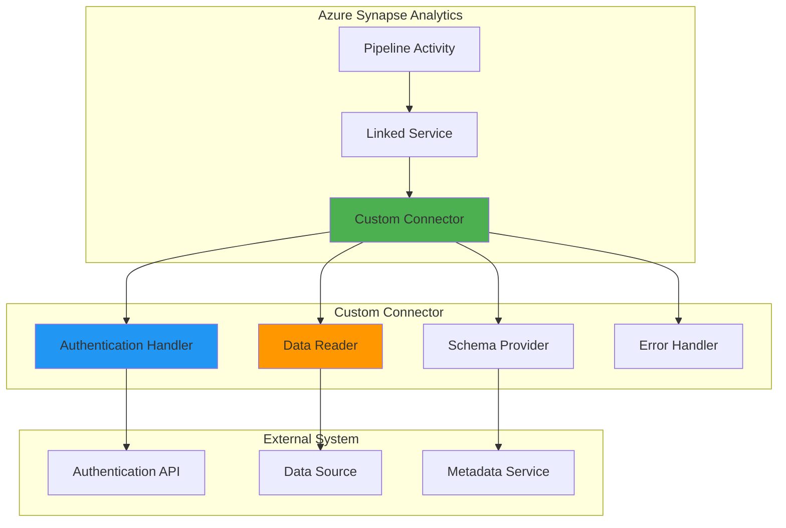

# Custom Connectors for Azure Synapse Analytics

> **Home [Home](../../../README.md)** | **Documentation** | **Reference [Reference](../README.md)** | **Synapse**

---

## Overview

This guide provides comprehensive documentation for developing custom connectors for Azure Synapse Analytics, enabling integration with proprietary or specialized data sources not covered by built-in connectors.

## Table of Contents

- [Introduction](#introduction)
- [Architecture](#architecture)
- [Development Prerequisites](#development-prerequisites)
- [Creating Custom Connectors](#creating-custom-connectors)
- [Testing and Validation](#testing-and-validation)
- [Deployment](#deployment)
- [Best Practices](#best-practices)
- [Examples](#examples)
- [Troubleshooting](#troubleshooting)

---

## Introduction

### What are Custom Connectors?

Custom connectors extend Azure Synapse Analytics' integration capabilities by enabling connections to:

- Proprietary enterprise systems
- Legacy databases and applications
- Custom REST APIs
- Specialized data sources
- Third-party SaaS platforms

### When to Build Custom Connectors

| Use Case | Built-in Connector | Custom Connector |
|----------|-------------------|------------------|
| Common databases (SQL Server, Oracle) | Use built-in | Not needed |
| Standard APIs (REST, OData) | Use HTTP connector | Optional |
| Proprietary systems | Not available | **Required** |
| Complex authentication | Limited support | **Recommended** |
| Custom data transformations | Basic only | **Recommended** |

---

## Architecture

### Connector Architecture



### Connector Components

| Component | Purpose | Implementation |
|-----------|---------|----------------|
| **Linked Service** | Connection configuration | JSON definition |
| **Activity** | Pipeline integration | Pipeline JSON |
| **Connector Logic** | Data access implementation | C#/.NET code |
| **Authentication** | Security implementation | OAuth/API Key/Custom |
| **Schema Provider** | Metadata discovery | Interface implementation |

---

## Development Prerequisites

### Required Tools

```yaml
Development Environment:
  - Visual Studio 2022 or later
  - .NET 6.0 SDK
  - Azure Functions Core Tools
  - Azure CLI
  - Git

Azure Resources:
  - Azure Synapse Workspace
  - Azure Key Vault (for secrets)
  - Azure Storage Account (for deployment)
  - Service Principal (for authentication)
```

### Required Permissions

- Synapse Contributor on workspace
- Key Vault Secrets Officer
- Storage Blob Data Contributor

---

## Creating Custom Connectors

### Step 1: Define Linked Service Schema

**CustomConnectorLinkedService.json:**

```json
{
  "name": "CustomDataSourceLinkedService",
  "type": "Microsoft.Synapse/workspaces/linkedServices",
  "properties": {
    "type": "CustomConnector",
    "typeProperties": {
      "endpoint": {
        "type": "SecureString",
        "value": "https://api.customsource.com/v1"
      },
      "authenticationType": "ApiKey",
      "apiKey": {
        "type": "AzureKeyVaultSecret",
        "store": {
          "referenceName": "AzureKeyVault",
          "type": "LinkedServiceReference"
        },
        "secretName": "custom-api-key"
      },
      "timeout": 30,
      "maxRetries": 3
    },
    "annotations": ["production", "custom"]
  }
}
```

### Step 2: Implement Connector Logic

**CustomConnector.cs:**

```csharp
using System;
using System.Collections.Generic;
using System.Net.Http;
using System.Threading.Tasks;
using Microsoft.Azure.Synapse.Connectors;
using Newtonsoft.Json;

namespace CustomSynapseConnectors
{
    public class CustomDataConnector : IDataConnector
    {
        private readonly HttpClient _httpClient;
        private readonly ConnectorConfiguration _config;

        public CustomDataConnector(ConnectorConfiguration config)
        {
            _config = config ?? throw new ArgumentNullException(nameof(config));
            _httpClient = new HttpClient
            {
                BaseAddress = new Uri(_config.Endpoint),
                Timeout = TimeSpan.FromSeconds(_config.Timeout)
            };

            // Add authentication header
            _httpClient.DefaultRequestHeaders.Add("X-API-Key", _config.ApiKey);
        }

        public async Task<IEnumerable<DataRecord>> ReadDataAsync(
            string tableName,
            Dictionary<string, object> parameters = null)
        {
            try
            {
                // Build request URL
                var requestUrl = $"/data/{tableName}";
                if (parameters != null && parameters.Count > 0)
                {
                    var queryString = BuildQueryString(parameters);
                    requestUrl += $"?{queryString}";
                }

                // Execute HTTP request
                var response = await _httpClient.GetAsync(requestUrl);
                response.EnsureSuccessStatusCode();

                // Parse response
                var content = await response.Content.ReadAsStringAsync();
                var records = JsonConvert.DeserializeObject<List<DataRecord>>(content);

                return records;
            }
            catch (HttpRequestException ex)
            {
                throw new ConnectorException(
                    $"Failed to read data from {tableName}: {ex.Message}",
                    ex);
            }
        }

        public async Task WriteDataAsync(
            string tableName,
            IEnumerable<DataRecord> records)
        {
            try
            {
                var requestUrl = $"/data/{tableName}";
                var json = JsonConvert.SerializeObject(records);
                var content = new StringContent(json, System.Text.Encoding.UTF8, "application/json");

                var response = await _httpClient.PostAsync(requestUrl, content);
                response.EnsureSuccessStatusCode();
            }
            catch (HttpRequestException ex)
            {
                throw new ConnectorException(
                    $"Failed to write data to {tableName}: {ex.Message}",
                    ex);
            }
        }

        public async Task<TableSchema> GetSchemaAsync(string tableName)
        {
            try
            {
                var requestUrl = $"/metadata/schema/{tableName}";
                var response = await _httpClient.GetAsync(requestUrl);
                response.EnsureSuccessStatusCode();

                var content = await response.Content.ReadAsStringAsync();
                var schema = JsonConvert.DeserializeObject<TableSchema>(content);

                return schema;
            }
            catch (HttpRequestException ex)
            {
                throw new ConnectorException(
                    $"Failed to retrieve schema for {tableName}: {ex.Message}",
                    ex);
            }
        }

        private string BuildQueryString(Dictionary<string, object> parameters)
        {
            var queryParams = new List<string>();
            foreach (var param in parameters)
            {
                queryParams.Add($"{param.Key}={Uri.EscapeDataString(param.Value.ToString())}");
            }
            return string.Join("&", queryParams);
        }

        public void Dispose()
        {
            _httpClient?.Dispose();
        }
    }

    public class ConnectorConfiguration
    {
        public string Endpoint { get; set; }
        public string ApiKey { get; set; }
        public int Timeout { get; set; } = 30;
        public int MaxRetries { get; set; } = 3;
    }

    public class DataRecord
    {
        public Dictionary<string, object> Fields { get; set; }
    }

    public class TableSchema
    {
        public string TableName { get; set; }
        public List<ColumnDefinition> Columns { get; set; }
    }

    public class ColumnDefinition
    {
        public string Name { get; set; }
        public string DataType { get; set; }
        public bool IsNullable { get; set; }
    }

    public class ConnectorException : Exception
    {
        public ConnectorException(string message, Exception innerException)
            : base(message, innerException)
        {
        }
    }

    public interface IDataConnector : IDisposable
    {
        Task<IEnumerable<DataRecord>> ReadDataAsync(
            string tableName,
            Dictionary<string, object> parameters = null);

        Task WriteDataAsync(
            string tableName,
            IEnumerable<DataRecord> records);

        Task<TableSchema> GetSchemaAsync(string tableName);
    }
}
```

### Step 3: Implement Authentication

**OAuth2Authentication.cs:**

```csharp
using System;
using System.Net.Http;
using System.Threading.Tasks;
using Newtonsoft.Json;

namespace CustomSynapseConnectors.Authentication
{
    public class OAuth2TokenProvider
    {
        private readonly string _tokenEndpoint;
        private readonly string _clientId;
        private readonly string _clientSecret;
        private readonly HttpClient _httpClient;
        private string _accessToken;
        private DateTime _tokenExpiry;

        public OAuth2TokenProvider(string tokenEndpoint, string clientId, string clientSecret)
        {
            _tokenEndpoint = tokenEndpoint;
            _clientId = clientId;
            _clientSecret = clientSecret;
            _httpClient = new HttpClient();
        }

        public async Task<string> GetAccessTokenAsync()
        {
            // Return cached token if still valid
            if (!string.IsNullOrEmpty(_accessToken) && DateTime.UtcNow < _tokenExpiry)
            {
                return _accessToken;
            }

            // Request new token
            var request = new HttpRequestMessage(HttpMethod.Post, _tokenEndpoint);
            var parameters = new Dictionary<string, string>
            {
                { "grant_type", "client_credentials" },
                { "client_id", _clientId },
                { "client_secret", _clientSecret }
            };

            request.Content = new FormUrlEncodedContent(parameters);

            var response = await _httpClient.SendAsync(request);
            response.EnsureSuccessStatusCode();

            var content = await response.Content.ReadAsStringAsync();
            var tokenResponse = JsonConvert.DeserializeObject<TokenResponse>(content);

            _accessToken = tokenResponse.AccessToken;
            _tokenExpiry = DateTime.UtcNow.AddSeconds(tokenResponse.ExpiresIn - 60); // 60s buffer

            return _accessToken;
        }

        private class TokenResponse
        {
            [JsonProperty("access_token")]
            public string AccessToken { get; set; }

            [JsonProperty("expires_in")]
            public int ExpiresIn { get; set; }

            [JsonProperty("token_type")]
            public string TokenType { get; set; }
        }
    }
}
```

---

## Testing and Validation

### Unit Testing

**CustomConnectorTests.cs:**

```csharp
using System.Collections.Generic;
using System.Threading.Tasks;
using Xunit;
using Moq;
using CustomSynapseConnectors;

namespace CustomSynapseConnectors.Tests
{
    public class CustomConnectorTests
    {
        [Fact]
        public async Task ReadDataAsync_ValidTable_ReturnsRecords()
        {
            // Arrange
            var config = new ConnectorConfiguration
            {
                Endpoint = "https://test-api.com",
                ApiKey = "test-key",
                Timeout = 30
            };

            var connector = new CustomDataConnector(config);

            // Act
            var records = await connector.ReadDataAsync("test_table");

            // Assert
            Assert.NotNull(records);
        }

        [Fact]
        public async Task GetSchemaAsync_ValidTable_ReturnsSchema()
        {
            // Arrange
            var config = new ConnectorConfiguration
            {
                Endpoint = "https://test-api.com",
                ApiKey = "test-key"
            };

            var connector = new CustomDataConnector(config);

            // Act
            var schema = await connector.GetSchemaAsync("test_table");

            // Assert
            Assert.NotNull(schema);
            Assert.NotEmpty(schema.Columns);
        }
    }
}
```

### Integration Testing

```python
# test_custom_connector.py
import pytest
from azure.synapse.artifacts import ArtifactsClient
from azure.identity import DefaultAzureCredential

def test_custom_connector_read():
    """Test custom connector can read data from source."""

    # Setup
    credential = DefaultAzureCredential()
    client = ArtifactsClient(
        credential=credential,
        endpoint="https://myworkspace.dev.azuresynapse.net"
    )

    # Execute pipeline with custom connector
    run_response = client.pipeline_run.create_run(
        pipeline_name="TestCustomConnectorPipeline"
    )

    # Wait for completion
    status = wait_for_pipeline_run(client, run_response.run_id)

    # Verify
    assert status == "Succeeded"

def wait_for_pipeline_run(client, run_id, timeout=300):
    """Wait for pipeline run to complete."""
    import time
    start_time = time.time()

    while time.time() - start_time < timeout:
        run = client.pipeline_run.get(run_id)
        if run.status in ["Succeeded", "Failed", "Cancelled"]:
            return run.status
        time.sleep(10)

    raise TimeoutError("Pipeline run timed out")
```

---

## Deployment

### Package Connector

```bash
# Build connector project
dotnet build --configuration Release

# Package as NuGet
dotnet pack --configuration Release

# Publish to Azure Artifacts
dotnet nuget push ./bin/Release/CustomSynapseConnectors.1.0.0.nupkg \
  --source "https://pkgs.dev.azure.com/myorg/_packaging/synapse-connectors/nuget/v3/index.json" \
  --api-key $AZURE_ARTIFACTS_TOKEN
```

### Register Connector

```bash
# Register custom connector with Synapse
az synapse connector register \
  --workspace-name myworkspace \
  --name CustomDataConnector \
  --package-path "./CustomSynapseConnectors.1.0.0.nupkg" \
  --description "Custom connector for proprietary data source"
```

---

## Best Practices

### Performance Optimization

1. **Implement connection pooling**
   ```csharp
   private static readonly HttpClient _sharedClient = new HttpClient();
   ```

2. **Use async/await patterns**
   ```csharp
   public async Task<Data> ReadDataAsync() { ... }
   ```

3. **Implement caching for metadata**
   ```csharp
   private readonly Dictionary<string, TableSchema> _schemaCache = new();
   ```

4. **Batch operations when possible**
   ```csharp
   public async Task WriteBatchAsync(IEnumerable<DataRecord> records, int batchSize = 1000)
   ```

### Error Handling

```csharp
public async Task<IEnumerable<DataRecord>> ReadDataWithRetryAsync(
    string tableName,
    int maxRetries = 3)
{
    int attempt = 0;
    while (attempt < maxRetries)
    {
        try
        {
            return await ReadDataAsync(tableName);
        }
        catch (HttpRequestException ex) when (attempt < maxRetries - 1)
        {
            attempt++;
            await Task.Delay(TimeSpan.FromSeconds(Math.Pow(2, attempt))); // Exponential backoff
        }
    }
    throw new ConnectorException($"Failed after {maxRetries} attempts");
}
```

### Security Best Practices

- [ ] Store credentials in Azure Key Vault
- [ ] Use managed identities when possible
- [ ] Implement certificate-based authentication for production
- [ ] Enable audit logging for all operations
- [ ] Validate and sanitize all inputs

---

## Examples

### Example 1: REST API Connector

See [CustomConnector.cs](#step-2-implement-connector-logic) above for full implementation.

### Example 2: SOAP Web Service Connector

```csharp
public class SoapConnector : IDataConnector
{
    private readonly SoapClient _soapClient;

    public async Task<IEnumerable<DataRecord>> ReadDataAsync(
        string tableName,
        Dictionary<string, object> parameters = null)
    {
        var request = new GetDataRequest
        {
            TableName = tableName,
            Parameters = parameters
        };

        var response = await _soapClient.GetDataAsync(request);
        return ConvertToDataRecords(response.Data);
    }

    // Additional implementation...
}
```

---

## Troubleshooting

### Common Issues

#### Issue: Connection Timeout

**Solution:**
```csharp
_httpClient.Timeout = TimeSpan.FromSeconds(60); // Increase timeout
```

#### Issue: Authentication Failure

**Solution:**
```csharp
// Verify credentials
var tokenProvider = new OAuth2TokenProvider(endpoint, clientId, clientSecret);
var token = await tokenProvider.GetAccessTokenAsync();
Console.WriteLine($"Token: {token}");
```

#### Issue: Schema Mismatch

**Solution:**
```csharp
// Implement schema validation
public void ValidateSchema(TableSchema expected, TableSchema actual)
{
    if (!SchemasMatch(expected, actual))
    {
        throw new SchemaValidationException("Schema mismatch detected");
    }
}
```

---

## Additional Resources

- [Azure Synapse Connectors SDK](https://docs.microsoft.com/azure/synapse-analytics/)
- [Custom Connector Development Guide](https://docs.microsoft.com/)
- [Authentication Best Practices](../../best-practices/security.md)

---

**Last Updated:** December 9, 2025
**Version:** 1.0.0
**SDK Version:** 2.0.0
**Maintainer:** CSA Integration Team
