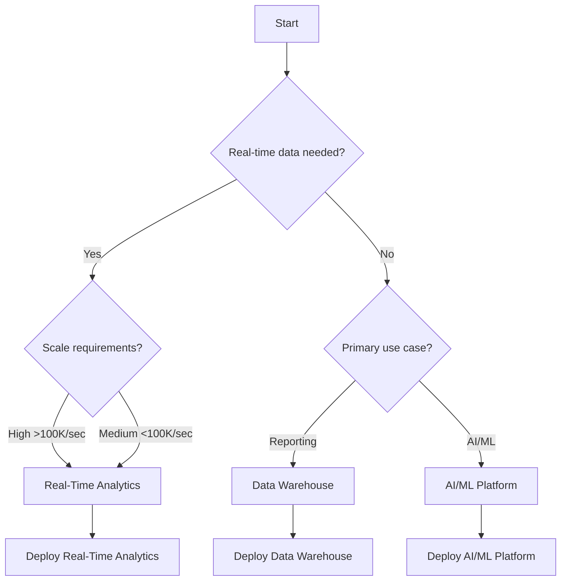

# 🏗️ Cloud Scale Analytics Solutions

> **🏠 [Home](../../README.md)** | **📚 [Documentation](../README.md)** | **🏗️ Solutions**

---

## 📋 Overview

This section contains complete, production-ready solution architectures for Cloud Scale Analytics implementations on Azure. Each solution includes comprehensive documentation, implementation guides, operational procedures, and best practices derived from real-world deployments.

## 🎯 Available Solutions

### 🚀 [Azure Real-Time Analytics](./azure-realtime-analytics/README.md)

**Enterprise real-time analytics platform processing 1.2M+ events/second**

| Aspect | Details |
|--------|---------|
| **Use Cases** | IoT analytics, fraud detection, customer 360, supply chain |
| **Core Technologies** | Databricks, Delta Lake, Kafka, Power BI |
| **Scale** | 1.2M events/sec, <5 sec latency, 99.99% availability |
| **Status** | ✅ Production Ready |

**Key Features:**
- Real-time stream processing with Databricks
- Delta Lake for ACID-compliant storage
- Power BI Direct Lake for instant insights
- Azure OpenAI integration for AI enrichment
- Zero-trust security architecture

[→ View Solution](./azure-realtime-analytics/README.md)

---

### 🏭 Modern Data Warehouse (Coming Soon)

**Cloud-native data warehouse with Synapse Analytics**

| Aspect | Details |
|--------|---------|
| **Use Cases** | Enterprise reporting, historical analytics, data marts |
| **Core Technologies** | Synapse Analytics, Dedicated SQL Pools |
| **Scale** | Petabyte-scale, 10,000+ concurrent users |
| **Status** | 📝 In Development |

---

### 🤖 AI/ML Platform (Coming Soon)

**End-to-end machine learning platform**

| Aspect | Details |
|--------|---------|
| **Use Cases** | Model training, deployment, monitoring, MLOps |
| **Core Technologies** | Azure ML, Databricks MLflow, Azure OpenAI |
| **Scale** | 1000+ models, automated retraining |
| **Status** | 📝 In Development |

---

## 📊 Solution Comparison

| Solution | Real-Time | Batch | AI/ML | BI | Cost | Complexity |
|----------|-----------|-------|-------|-----|------|------------|
| **Real-Time Analytics** | ⭐⭐⭐⭐⭐ | ⭐⭐⭐⭐ | ⭐⭐⭐⭐ | ⭐⭐⭐⭐⭐ | $$$$ | High |
| **Modern Data Warehouse** | ⭐⭐ | ⭐⭐⭐⭐⭐ | ⭐⭐⭐ | ⭐⭐⭐⭐⭐ | $$$ | Medium |
| **AI/ML Platform** | ⭐⭐⭐ | ⭐⭐⭐⭐ | ⭐⭐⭐⭐⭐ | ⭐⭐⭐ | $$$$ | High |

## 🎯 Choosing the Right Solution

### Decision Tree

### Selection Criteria

| If You Need... | Choose... | Why |
|----------------|-----------|-----|
| Sub-second insights | Real-Time Analytics | Optimized for streaming |
| Historical reporting | Data Warehouse | Cost-effective for batch |
| Machine learning at scale | AI/ML Platform | Complete MLOps pipeline |
| Mixed workloads | Real-Time Analytics | Supports both patterns |
| Maximum cost efficiency | Data Warehouse | Lowest cost per query |

## 📚 Solution Components

### Common Architecture Patterns

All solutions follow these architectural principles:

1. **Medallion Architecture** - Bronze, Silver, Gold data layers
2. **Zero Trust Security** - Defense in depth approach
3. **Infrastructure as Code** - Automated deployment
4. **GitOps** - Version-controlled operations
5. **Observability First** - Comprehensive monitoring

### Technology Stack

| Layer | Technologies | Purpose |
|-------|-------------|---------|
| **Ingestion** | Event Hubs, Kafka, Data Factory | Data collection |
| **Processing** | Databricks, Synapse, Stream Analytics | Data transformation |
| **Storage** | ADLS Gen2, Delta Lake, Cosmos DB | Data persistence |
| **Analytics** | Power BI, Azure ML, Synapse SQL | Insights generation |
| **Governance** | Purview, Unity Catalog | Data management |

## 🚀 Getting Started

### Prerequisites

All solutions require:

- ✅ Azure subscription (Owner/Contributor access)
- ✅ Azure DevOps or GitHub account
- ✅ Power BI Pro or Premium license
- ✅ Basic knowledge of Azure services

### Deployment Process

1. **Choose Solution** - Select based on requirements
2. **Review Architecture** - Understand components
3. **Prepare Environment** - Set up prerequisites
4. **Deploy Infrastructure** - Use provided IaC templates
5. **Configure Services** - Follow implementation guides
6. **Validate Deployment** - Run test scenarios
7. **Operationalize** - Set up monitoring and maintenance

### Time to Deploy

| Solution | Infrastructure | Configuration | Testing | Total |
|----------|---------------|---------------|---------|-------|
| Real-Time Analytics | 2 hours | 4 hours | 2 hours | 8 hours |
| Data Warehouse | 1 hour | 2 hours | 1 hour | 4 hours |
| AI/ML Platform | 3 hours | 6 hours | 3 hours | 12 hours |

## 📈 Success Stories

### Real-Time Analytics Implementation

**Customer:** Global Retail Chain  
**Challenge:** Process 500M daily transactions in real-time  
**Solution:** Azure Real-Time Analytics with Databricks  
**Results:**
- 🚀 Sub-second fraud detection
- 💰 32% cost reduction vs previous solution
- 📊 Real-time inventory optimization
- 🎯 99.99% availability achieved

### Key Metrics Achieved

| Metric | Before | After | Improvement |
|--------|--------|-------|-------------|
| Processing Latency | 15 minutes | 3 seconds | 300x faster |
| Data Freshness | 1 hour | Real-time | Instant |
| Cost per Transaction | $0.0012 | $0.0008 | 33% reduction |
| System Availability | 99.5% | 99.99% | 10x improvement |

## 🛡️ Security & Compliance

All solutions include:

- **Zero Trust Architecture** - Never trust, always verify
- **Encryption** - At rest and in transit
- **Identity Management** - Azure AD integration
- **Network Security** - Private endpoints, NSGs
- **Compliance** - SOC 2, ISO 27001, GDPR ready
- **Monitoring** - Security Center, Sentinel

## 📊 Cost Optimization

### Built-in Cost Controls

- **Auto-scaling** - Scale based on demand
- **Spot Instances** - Up to 90% compute savings
- **Data Tiering** - Hot/cool/archive storage
- **Reserved Capacity** - Predictable workload savings
- **Resource Tagging** - Cost tracking and allocation

### Typical Monthly Costs

| Solution | Small | Medium | Large | Enterprise |
|----------|-------|--------|-------|------------|
| Real-Time Analytics | $5K | $15K | $50K | $100K+ |
| Data Warehouse | $3K | $10K | $30K | $75K+ |
| AI/ML Platform | $4K | $12K | $40K | $80K+ |

*Costs vary based on data volume, processing requirements, and region*

## 🤝 Support & Resources

### Documentation

Each solution includes:
- 📖 Architecture documentation
- 🚀 Implementation guides
- 🔧 Operational runbooks
- 📊 Performance tuning guides
- 🔒 Security best practices
- 💰 Cost optimization strategies

### Community

- 💬 [Discussion Forum](https://github.com/fgarofalo56/csa-inabox-docs/discussions)
- 🐛 [Issue Tracker](https://github.com/fgarofalo56/csa-inabox-docs/issues)
- 📧 [Email Support](mailto:csa-support@microsoft.com)
- 📚 [Knowledge Base](https://learn.microsoft.com/azure)

### Training Resources

- 🎓 [Azure Architecture Center](https://docs.microsoft.com/azure/architecture/)
- 📖 [Databricks Academy](https://academy.databricks.com/)
- 🎯 [Power BI Learning Path](https://docs.microsoft.com/learn/powerbi/)
- 🔧 [Azure Training](https://azure.microsoft.com/training/)

## 🔄 Contributing

We welcome contributions:

1. **Share Your Solution** - Submit PR with your architecture
2. **Improve Documentation** - Enhance existing content
3. **Report Issues** - Help us improve
4. **Suggest Features** - Request new solutions

See [Contributing Guide](../guides/CONTRIBUTING_GUIDE.md) for details.

---

**Last Updated:** January 28, 2025  
**Version:** 1.0.0  
**Maintainer:** Cloud Scale Analytics Team