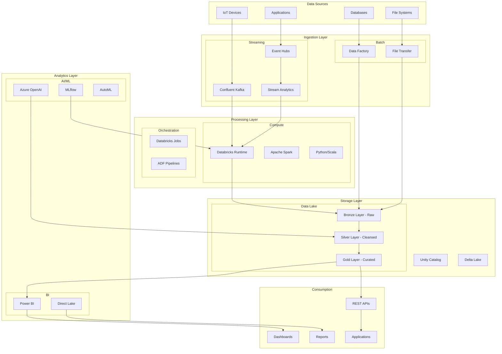
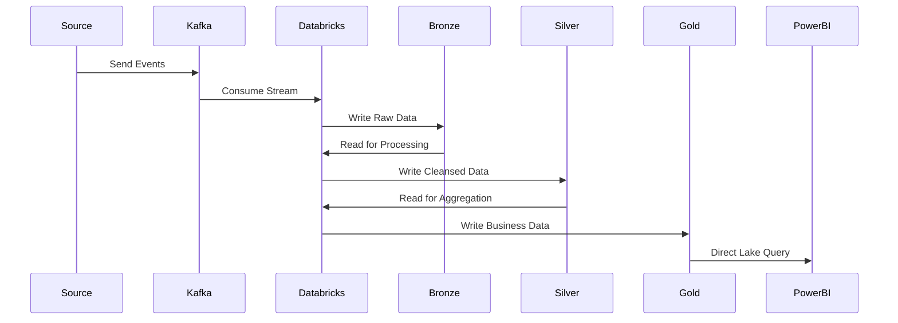
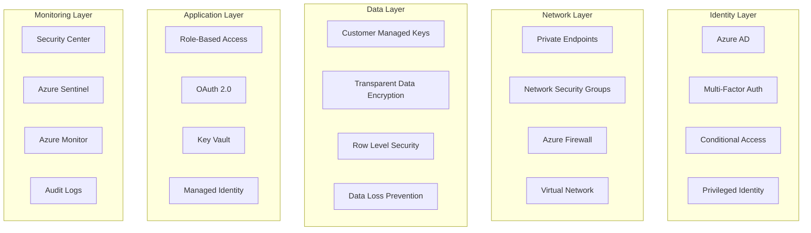
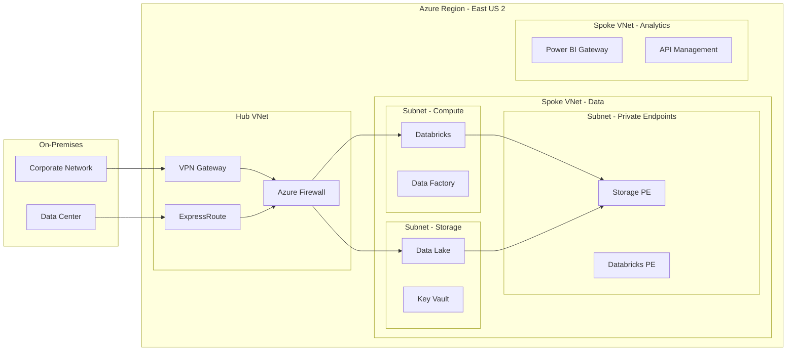
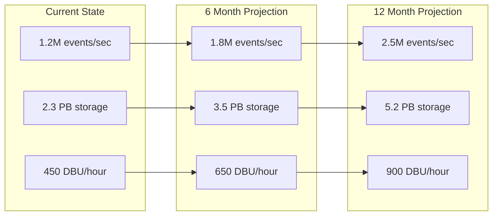

# 🏗️ Architecture Documentation

> **🏠 [Home](../../../../README.md)** | **📚 [Documentation](../../../README.md)** | **🚀 [Solution](../README.md)** | **🏗️ Architecture**

---

## 📋 Overview

Comprehensive architecture documentation for the Azure Real-Time Analytics platform, covering system design, component specifications, data flow patterns, and security implementation.

## 📑 Table of Contents

- [System Architecture](#system-architecture)
- [Component Design](#component-design)
- [Data Flow Architecture](#data-flow-architecture)
- [Security Architecture](#security-architecture)
- [Network Architecture](#network-architecture)
- [Scalability Design](#scalability-design)

---

## 🎯 System Architecture

### Architectural Principles

1. **Cloud-Native Design** - Built for Azure with native service integration
2. **Event-Driven Architecture** - Real-time processing with streaming-first approach
3. **Microservices Pattern** - Loosely coupled, independently deployable components
4. **Zero Trust Security** - Comprehensive security with assume-breach mentality
5. **Infrastructure as Code** - Automated deployment and configuration
6. **Observability First** - Comprehensive monitoring and alerting

### High-Level Architecture



### Architecture Layers

| Layer | Purpose | Technologies | SLA |
|-------|---------|-------------|-----|
| **Ingestion** | Data collection at scale | Kafka, Event Hubs | 99.99% |
| **Processing** | Transform and enrich | Databricks, Spark | 99.95% |
| **Storage** | Persist and organize | Delta Lake, ADLS | 99.99% |
| **Analytics** | Generate insights | Power BI, ML | 99.9% |
| **Consumption** | Deliver value | APIs, Apps | 99.95% |

---

## 🔧 Component Design

### Azure Databricks

**Purpose:** Unified analytics and processing platform

```yaml
Configuration:
  Workspace:
    Tier: Premium
    Region: East US 2
    Storage: ADLS Gen2
    
  Clusters:
    Stream_Cluster:
      Node_Type: Standard_D16s_v3
      Min_Nodes: 2
      Max_Nodes: 50
      Autoscale: true
      Spot_Instances: 70%
      Runtime: 13.3 LTS
      
    Batch_Cluster:
      Node_Type: Standard_E8s_v3
      Min_Nodes: 1
      Max_Nodes: 100
      Autoscale: true
      Spot_Instances: 90%
      Runtime: 13.3 LTS
      
  Features:
    - Unity Catalog
    - MLflow
    - Delta Live Tables
    - Photon Acceleration
```

### Confluent Kafka

**Purpose:** High-throughput streaming platform

```yaml
Configuration:
  Cluster:
    Type: Dedicated
    Cloud: Azure
    Region: East US 2
    
  Specifications:
    Kafka_Version: 3.5
    CKU: 10
    Storage: 10 TB
    
  Topics:
    events:
      Partitions: 20
      Replication: 3
      Retention: 7 days
      
    metrics:
      Partitions: 10
      Replication: 3
      Retention: 3 days
      
  Security:
    Authentication: SASL/PLAIN
    Encryption: TLS 1.2
    ACLs: Enabled
    IP_Whitelist: true
```

### Azure Data Lake Storage Gen2

**Purpose:** Scalable data lake storage

```yaml
Configuration:
  Account:
    Name: rtadatalake
    Performance: Standard
    Replication: ZRS
    
  Containers:
    bronze:
      Access: Private
      Lifecycle: 90 days hot, 180 days cool
      
    silver:
      Access: Private
      Lifecycle: 180 days hot, archive after 1 year
      
    gold:
      Access: Private
      Lifecycle: Always hot
      
  Features:
    - Hierarchical Namespace
    - Encryption at Rest
    - Soft Delete
    - Versioning
```

### Power BI

**Purpose:** Business intelligence and visualization

```yaml
Configuration:
  Capacity:
    Type: Premium
    SKU: P2
    Region: East US 2
    
  Workspace:
    Name: RealTimeAnalytics
    Mode: Premium
    
  Datasets:
    Connection: Direct Lake
    Refresh: Automatic
    
  Features:
    - Paginated Reports
    - AI Insights
    - Deployment Pipelines
    - Advanced Security
```

---

## 🔄 Data Flow Architecture

### Streaming Data Flow



### Data Processing Patterns

#### Bronze Layer Processing
```python
# Bronze layer - raw data ingestion
bronze_stream = (
    spark.readStream
    .format("kafka")
    .option("kafka.bootstrap.servers", kafka_servers)
    .option("subscribe", "events")
    .load()
    .selectExpr("CAST(value AS STRING)")
    .writeStream
    .format("delta")
    .outputMode("append")
    .option("checkpointLocation", checkpoint_path)
    .trigger(processingTime="10 seconds")
    .table("bronze.raw_events")
)
```

#### Silver Layer Processing
```python
# Silver layer - data cleansing and validation
silver_stream = (
    spark.readStream
    .format("delta")
    .table("bronze.raw_events")
    .transform(parse_json)
    .transform(validate_schema)
    .transform(enrich_data)
    .transform(apply_data_quality_rules)
    .writeStream
    .format("delta")
    .outputMode("append")
    .option("checkpointLocation", checkpoint_path)
    .trigger(processingTime="30 seconds")
    .table("silver.validated_events")
)
```

#### Gold Layer Processing
```python
# Gold layer - business aggregations
gold_stream = (
    spark.readStream
    .format("delta")
    .table("silver.validated_events")
    .groupBy(
        window("event_time", "1 minute"),
        "product_id",
        "region"
    )
    .agg(
        count("*").alias("event_count"),
        sum("amount").alias("total_amount"),
        avg("amount").alias("avg_amount")
    )
    .writeStream
    .format("delta")
    .outputMode("complete")
    .option("checkpointLocation", checkpoint_path)
    .trigger(processingTime="1 minute")
    .table("gold.metrics_1min")
)
```

### Data Quality Framework

| Layer | Quality Checks | Action on Failure |
|-------|---------------|-------------------|
| **Bronze** | Schema validation | Log and quarantine |
| **Silver** | Business rules, constraints | Reject and alert |
| **Gold** | Aggregation accuracy | Reprocess |

---

## 🔒 Security Architecture

### Zero Trust Security Model



### Security Controls

#### Identity & Access Management
```yaml
Azure_AD:
  Authentication:
    - Multi-Factor Authentication
    - Conditional Access Policies
    - Risk-Based Authentication
    
  Authorization:
    - Role-Based Access Control
    - Attribute-Based Access
    - Just-In-Time Access
    
Service_Principals:
  - Managed Identities
  - Certificate Authentication
  - Secret Rotation
```

#### Data Protection
```yaml
Encryption:
  At_Rest:
    - Azure Storage Service Encryption
    - Customer Managed Keys
    - Double Encryption
    
  In_Transit:
    - TLS 1.2 minimum
    - Certificate Pinning
    - IPSec for VPN
    
  In_Processing:
    - Confidential Computing
    - Secure Enclaves
```

#### Network Security
```yaml
Network_Isolation:
  - Virtual Networks
  - Network Security Groups
  - Azure Firewall
  - DDoS Protection
  
Private_Connectivity:
  - Private Endpoints
  - Service Endpoints
  - ExpressRoute
  - VPN Gateway
```

---

## 🌐 Network Architecture

### Network Topology



### Network Configuration

| Component | Subnet | CIDR | NSG Rules |
|-----------|--------|------|-----------|
| Databricks Public | /26 | 10.1.1.0/26 | Managed by Azure |
| Databricks Private | /26 | 10.1.1.64/26 | Managed by Azure |
| Storage | /27 | 10.1.2.0/27 | HTTPS only |
| Private Endpoints | /27 | 10.1.2.32/27 | Deny all inbound |
| Management | /28 | 10.1.3.0/28 | RDP/SSH from Bastion |

---

## 📈 Scalability Design

### Auto-Scaling Strategy

```yaml
Databricks_Clusters:
  Streaming:
    Metric: CPU Utilization
    Scale_Up: >70% for 5 min
    Scale_Down: <30% for 10 min
    Min: 2 nodes
    Max: 50 nodes
    
  Batch:
    Metric: Queue Length
    Scale_Up: >10 jobs pending
    Scale_Down: 0 jobs for 15 min
    Min: 0 nodes
    Max: 100 nodes
    
Event_Hubs:
  Throughput_Units:
    Auto_Inflate: true
    Max_TU: 40
    
Storage:
  Performance_Tier: Auto-scale
  Throughput: 10,000 - 50,000 RU/s
```

### Performance Targets

| Metric | Target | Current | Headroom |
|--------|--------|---------|----------|
| **Ingestion Rate** | 2M events/sec | 1.2M events/sec | 67% |
| **Processing Latency** | <5 sec | 3.7 sec | 26% |
| **Storage IOPS** | 100K | 65K | 35% |
| **Query Response** | <3 sec | 1.8 sec | 40% |
| **Concurrent Users** | 10,000 | 6,500 | 35% |

### Capacity Planning



---

## 📚 Related Documentation

- [Component Details](./components.md)
- [Data Flow Patterns](./data-flow.md)
- [Security Implementation](./security.md)
- [Network Design](./network.md)
- [Disaster Recovery](../operations/disaster-recovery.md)

---

**Last Updated:** January 28, 2025  
**Version:** 2.0.0  
**Maintainer:** Platform Architecture Team