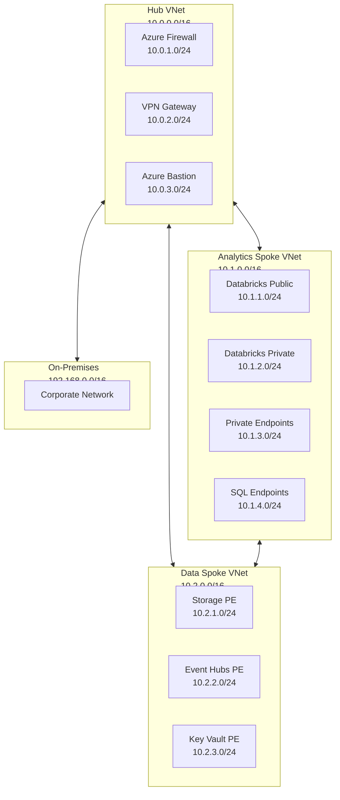
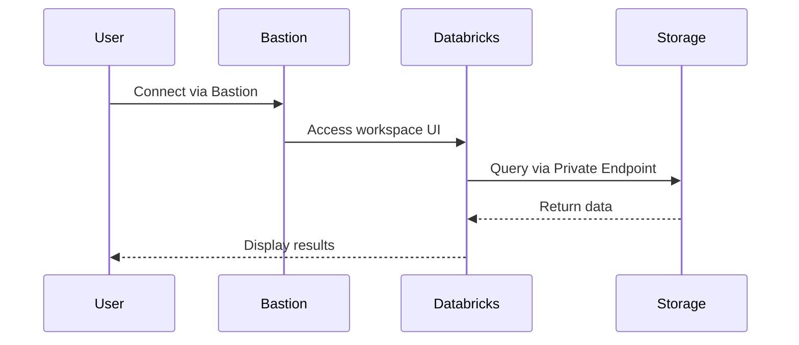
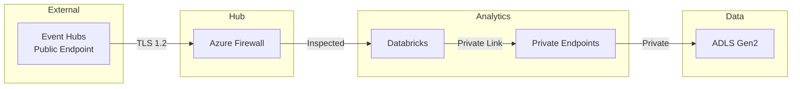

# Network Architecture

> __🏠 [Home](../../../../README.md)__ | __📚 [Documentation](../../../README.md)__ | __🏗️ [Solutions](../../README.md)__ | __⚡ [Real-Time Analytics](../README.md)__ | __🏛️ [Architecture](README.md)__ | __🌐 Network__

---


## Overview

This document describes the network architecture for the Azure Real-Time Analytics solution, implementing zero-trust principles with private connectivity, network isolation, and defense-in-depth security.

## Table of Contents

- [Network Topology](#network-topology)
- [Virtual Network Design](#virtual-network-design)
- [Private Endpoints](#private-endpoints)
- [Network Security Groups](#network-security-groups)
- [Azure Firewall Configuration](#azure-firewall-configuration)
- [DNS Configuration](#dns-configuration)
- [Connectivity Patterns](#connectivity-patterns)
- [Network Monitoring](#network-monitoring)

---

## Network Topology

### Hub-and-Spoke Architecture



### Network Specifications

| Component | Address Space | Purpose |
|-----------|---------------|---------|
| __Hub VNet__ | 10.0.0.0/16 | Central connectivity |
| __Analytics Spoke__ | 10.1.0.0/16 | Databricks workspace |
| __Data Spoke__ | 10.2.0.0/16 | Data services |
| __Management Spoke__ | 10.3.0.0/16 | Management tools |

---

## Virtual Network Design

### Hub VNet Configuration

```bash
# Create Hub VNet
az network vnet create \
  --resource-group hub-network-rg \
  --name hub-vnet \
  --address-prefix 10.0.0.0/16 \
  --location eastus

# Firewall subnet
az network vnet subnet create \
  --resource-group hub-network-rg \
  --vnet-name hub-vnet \
  --name AzureFirewallSubnet \
  --address-prefix 10.0.1.0/24

# VPN Gateway subnet
az network vnet subnet create \
  --resource-group hub-network-rg \
  --vnet-name hub-vnet \
  --name GatewaySubnet \
  --address-prefix 10.0.2.0/24

# Bastion subnet
az network vnet subnet create \
  --resource-group hub-network-rg \
  --vnet-name hub-vnet \
  --name AzureBastionSubnet \
  --address-prefix 10.0.3.0/24
```

### Analytics Spoke VNet

```bash
# Create Analytics Spoke VNet
az network vnet create \
  --resource-group analytics-network-rg \
  --name analytics-spoke-vnet \
  --address-prefix 10.1.0.0/16 \
  --location eastus

# Databricks public subnet
az network vnet subnet create \
  --resource-group analytics-network-rg \
  --vnet-name analytics-spoke-vnet \
  --name databricks-public \
  --address-prefix 10.1.1.0/24 \
  --delegations Microsoft.Databricks/workspaces

# Databricks private subnet
az network vnet subnet create \
  --resource-group analytics-network-rg \
  --vnet-name analytics-spoke-vnet \
  --name databricks-private \
  --address-prefix 10.1.2.0/24 \
  --delegations Microsoft.Databricks/workspaces

# Private endpoints subnet
az network vnet subnet create \
  --resource-group analytics-network-rg \
  --vnet-name analytics-spoke-vnet \
  --name private-endpoints \
  --address-prefix 10.1.3.0/24 \
  --disable-private-endpoint-network-policies true
```

### VNet Peering

```bash
# Peer Hub to Analytics Spoke
az network vnet peering create \
  --resource-group hub-network-rg \
  --name hub-to-analytics \
  --vnet-name hub-vnet \
  --remote-vnet analytics-spoke-vnet \
  --allow-vnet-access \
  --allow-forwarded-traffic \
  --allow-gateway-transit

# Peer Analytics Spoke to Hub
az network vnet peering create \
  --resource-group analytics-network-rg \
  --name analytics-to-hub \
  --vnet-name analytics-spoke-vnet \
  --remote-vnet hub-vnet \
  --allow-vnet-access \
  --allow-forwarded-traffic \
  --use-remote-gateways
```

---

## Private Endpoints

### Storage Account Private Endpoint

```bash
# Create private endpoint for Storage Account
az network private-endpoint create \
  --resource-group analytics-network-rg \
  --name storage-pe \
  --vnet-name analytics-spoke-vnet \
  --subnet private-endpoints \
  --private-connection-resource-id /subscriptions/{sub-id}/resourceGroups/{rg}/providers/Microsoft.Storage/storageAccounts/{storage-account} \
  --group-id blob \
  --connection-name storage-blob-connection

# Create private endpoint for DFS
az network private-endpoint create \
  --resource-group analytics-network-rg \
  --name storage-dfs-pe \
  --vnet-name analytics-spoke-vnet \
  --subnet private-endpoints \
  --private-connection-resource-id /subscriptions/{sub-id}/resourceGroups/{rg}/providers/Microsoft.Storage/storageAccounts/{storage-account} \
  --group-id dfs \
  --connection-name storage-dfs-connection
```

### Event Hubs Private Endpoint

```bash
# Create private endpoint for Event Hubs
az network private-endpoint create \
  --resource-group analytics-network-rg \
  --name eventhub-pe \
  --vnet-name analytics-spoke-vnet \
  --subnet private-endpoints \
  --private-connection-resource-id /subscriptions/{sub-id}/resourceGroups/{rg}/providers/Microsoft.EventHub/namespaces/{eventhub-namespace} \
  --group-id namespace \
  --connection-name eventhub-connection
```

### Databricks Private Link

```bash
# Enable Databricks Private Link
# Note: This is configured during workspace creation
{
  "properties": {
    "publicNetworkAccess": "Disabled",
    "requiredNsgRules": "NoAzureDatabricksRules",
    "parameters": {
      "enableNoPublicIp": {
        "value": true
      },
      "customVirtualNetworkId": {
        "value": "/subscriptions/{sub-id}/resourceGroups/{rg}/providers/Microsoft.Network/virtualNetworks/analytics-spoke-vnet"
      },
      "customPublicSubnetName": {
        "value": "databricks-public"
      },
      "customPrivateSubnetName": {
        "value": "databricks-private"
      }
    }
  }
}
```

### Private Endpoint Summary

| Service | Endpoint Type | Subnet | IP Range |
|---------|---------------|--------|----------|
| __Storage (Blob)__ | Private | private-endpoints | 10.1.3.4 |
| __Storage (DFS)__ | Private | private-endpoints | 10.1.3.5 |
| __Event Hubs__ | Private | private-endpoints | 10.1.3.6 |
| __Key Vault__ | Private | private-endpoints | 10.1.3.7 |
| __Databricks UI__ | Private | databricks-public | 10.1.1.0/24 |
| __Databricks Backend__ | Private | databricks-private | 10.1.2.0/24 |

---

## Network Security Groups

### Databricks Public Subnet NSG

```bash
# Create NSG for Databricks public subnet
az network nsg create \
  --resource-group analytics-network-rg \
  --name databricks-public-nsg

# Allow inbound from VNet
az network nsg rule create \
  --resource-group analytics-network-rg \
  --nsg-name databricks-public-nsg \
  --name AllowVNetInbound \
  --priority 100 \
  --source-address-prefixes VirtualNetwork \
  --destination-address-prefixes VirtualNetwork \
  --access Allow \
  --protocol '*' \
  --direction Inbound

# Allow outbound to VNet
az network nsg rule create \
  --resource-group analytics-network-rg \
  --nsg-name databricks-public-nsg \
  --name AllowVNetOutbound \
  --priority 100 \
  --source-address-prefixes VirtualNetwork \
  --destination-address-prefixes VirtualNetwork \
  --access Allow \
  --protocol '*' \
  --direction Outbound

# Allow outbound to Azure services
az network nsg rule create \
  --resource-group analytics-network-rg \
  --nsg-name databricks-public-nsg \
  --name AllowAzureServicesOutbound \
  --priority 110 \
  --source-address-prefixes VirtualNetwork \
  --destination-address-prefixes AzureCloud \
  --destination-port-ranges 443 \
  --access Allow \
  --protocol Tcp \
  --direction Outbound
```

### Private Endpoints Subnet NSG

```bash
# Create NSG for private endpoints subnet
az network nsg create \
  --resource-group analytics-network-rg \
  --name private-endpoints-nsg

# Allow inbound from Databricks subnets
az network nsg rule create \
  --resource-group analytics-network-rg \
  --nsg-name private-endpoints-nsg \
  --name AllowDatabricksInbound \
  --priority 100 \
  --source-address-prefixes 10.1.1.0/24 10.1.2.0/24 \
  --destination-address-prefixes 10.1.3.0/24 \
  --destination-port-ranges 443 \
  --access Allow \
  --protocol Tcp \
  --direction Inbound

# Deny all other inbound
az network nsg rule create \
  --resource-group analytics-network-rg \
  --nsg-name private-endpoints-nsg \
  --name DenyAllInbound \
  --priority 1000 \
  --access Deny \
  --protocol '*' \
  --direction Inbound
```

### NSG Flow Logs

```bash
# Enable NSG Flow Logs
az network watcher flow-log create \
  --resource-group analytics-network-rg \
  --nsg databricks-public-nsg \
  --name databricks-nsg-flow-log \
  --storage-account nsgflowlogsstorage \
  --workspace flowlogs-analytics-workspace \
  --enabled true \
  --retention 30 \
  --format JSON \
  --log-version 2 \
  --traffic-analytics true
```

---

## Azure Firewall Configuration

### Firewall Deployment

```bash
# Create public IP for firewall
az network public-ip create \
  --resource-group hub-network-rg \
  --name firewall-pip \
  --sku Standard \
  --allocation-method Static

# Create Azure Firewall
az network firewall create \
  --resource-group hub-network-rg \
  --name hub-firewall \
  --location eastus \
  --vnet-name hub-vnet \
  --public-ip firewall-pip \
  --tier Premium
```

### Application Rules

```bash
# Allow Databricks control plane
az network firewall application-rule create \
  --firewall-name hub-firewall \
  --resource-group hub-network-rg \
  --collection-name databricks-control-plane \
  --name allow-databricks \
  --priority 100 \
  --action Allow \
  --source-addresses 10.1.0.0/16 \
  --protocols Https=443 \
  --target-fqdns \
    *.databricks.azure.net \
    *.azuredatabricks.net \
    *.blob.core.windows.net \
    *.dfs.core.windows.net

# Allow Azure services
az network firewall application-rule create \
  --firewall-name hub-firewall \
  --resource-group hub-network-rg \
  --collection-name azure-services \
  --name allow-azure \
  --priority 110 \
  --action Allow \
  --source-addresses 10.1.0.0/16 10.2.0.0/16 \
  --protocols Https=443 \
  --target-fqdns \
    *.azure.com \
    *.windows.net \
    *.microsoftonline.com
```

### Network Rules

```bash
# Allow DNS
az network firewall network-rule create \
  --firewall-name hub-firewall \
  --resource-group hub-network-rg \
  --collection-name allow-dns \
  --name allow-dns \
  --priority 100 \
  --action Allow \
  --source-addresses 10.1.0.0/16 10.2.0.0/16 \
  --dest-addr 168.63.129.16 \
  --protocols UDP \
  --destination-ports 53

# Allow NTP
az network firewall network-rule create \
  --firewall-name hub-firewall \
  --resource-group hub-network-rg \
  --collection-name allow-ntp \
  --name allow-ntp \
  --priority 110 \
  --action Allow \
  --source-addresses 10.1.0.0/16 10.2.0.0/16 \
  --dest-addr '*' \
  --protocols UDP \
  --destination-ports 123
```

---

## DNS Configuration

### Private DNS Zones

```bash
# Create private DNS zones
az network private-dns zone create \
  --resource-group hub-network-rg \
  --name privatelink.blob.core.windows.net

az network private-dns zone create \
  --resource-group hub-network-rg \
  --name privatelink.dfs.core.windows.net

az network private-dns zone create \
  --resource-group hub-network-rg \
  --name privatelink.servicebus.windows.net

az network private-dns zone create \
  --resource-group hub-network-rg \
  --name privatelink.vaultcore.azure.net

# Link DNS zones to VNets
az network private-dns link vnet create \
  --resource-group hub-network-rg \
  --zone-name privatelink.blob.core.windows.net \
  --name hub-vnet-link \
  --virtual-network hub-vnet \
  --registration-enabled false

az network private-dns link vnet create \
  --resource-group hub-network-rg \
  --zone-name privatelink.blob.core.windows.net \
  --name analytics-vnet-link \
  --virtual-network analytics-spoke-vnet \
  --registration-enabled false
```

### DNS Zone Groups

```bash
# Create DNS zone group for storage private endpoint
az network private-endpoint dns-zone-group create \
  --resource-group analytics-network-rg \
  --endpoint-name storage-pe \
  --name storage-zone-group \
  --private-dns-zone privatelink.blob.core.windows.net \
  --zone-name blob
```

---

## Connectivity Patterns

### User Connectivity



### Data Flow Connectivity



---

## Network Monitoring

### Azure Network Watcher

```bash
# Enable Network Watcher
az network watcher configure \
  --resource-group network-watcher-rg \
  --locations eastus \
  --enabled true

# Create connection monitor
az network watcher connection-monitor create \
  --resource-group analytics-network-rg \
  --name databricks-connectivity-monitor \
  --location eastus \
  --test-configuration name=databricks-test protocol=Tcp port=443 threshold=30 \
  --test-group name=databricks-group destinations=storage-pe sources=databricks-cluster \
  --output-type Workspace \
  --workspace-ids /subscriptions/{sub-id}/resourceGroups/{rg}/providers/Microsoft.OperationalInsights/workspaces/network-monitoring
```

### Traffic Analytics

```kusto
// Query NSG flow logs
AzureNetworkAnalytics_CL
| where SubType_s == "FlowLog"
| where DestIP_s startswith "10.1.3"
| summarize TotalFlows = count() by SourceIP = SrcIP_s, DestinationIP = DestIP_s, DestPort = DestPort_d
| top 10 by TotalFlows desc
```

### Connectivity Monitoring

```kusto
// Monitor private endpoint connectivity
AzureDiagnostics
| where Category == "PrivateEndpoint"
| where OperationName == "PrivateEndpointConnection"
| summarize ConnectionAttempts = count() by PrivateEndpointName = privateLinkResourceName_s, Result = resultType
| order by ConnectionAttempts desc
```

---

## Security Best Practices

### Network Isolation

- ✅ Use private endpoints for all Azure services
- ✅ Disable public access to storage accounts
- ✅ Enable VNet injection for Databricks
- ✅ Implement NSG rules with least privilege
- ✅ Use Azure Firewall for egress control

### Zero Trust Principles

- ✅ Verify explicitly with NSG rules
- ✅ Use least privileged access
- ✅ Assume breach with network segmentation
- ✅ Encrypt all traffic with TLS 1.2+
- ✅ Monitor and log all network activity

### High Availability

- ✅ Deploy across Availability Zones
- ✅ Use zone-redundant storage replication
- ✅ Implement redundant VPN gateways
- ✅ Configure failover for critical services
- ✅ Test disaster recovery procedures

---

## Troubleshooting

### Common Network Issues

**Issue: Cannot connect to Databricks workspace**

```bash
# Check NSG rules
az network nsg show --resource-group analytics-network-rg --name databricks-public-nsg

# Check private endpoint status
az network private-endpoint show --resource-group analytics-network-rg --name storage-pe

# Test connectivity
az network watcher test-connectivity \
  --source-resource databricks-cluster \
  --dest-address 10.1.3.4 \
  --dest-port 443
```

**Issue: Private endpoint DNS not resolving**

```bash
# Check DNS zone links
az network private-dns link vnet list \
  --resource-group hub-network-rg \
  --zone-name privatelink.blob.core.windows.net

# Verify DNS resolution
nslookup storage-account.blob.core.windows.net
# Should resolve to 10.1.3.x
```

---

## Related Documentation

- [Architecture Components](components.md)
- [Security Architecture](security.md)
- [Network Setup Implementation](../implementation/network-setup.md)
- [Security Setup Implementation](../implementation/security-setup.md)

---

**Last Updated:** January 2025
**Version:** 1.0.0
**Status:** Production Ready
