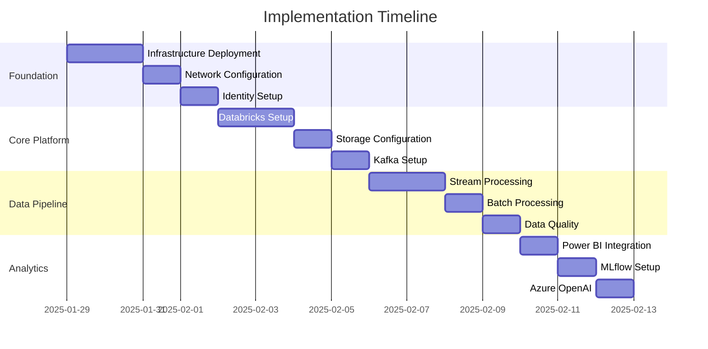

# 🚀 Implementation Guides

> **🏠 [Home](../../../../README.md)** | **📚 [Documentation](../../../README.md)** | **🚀 [Solution](../README.md)** | **🚀 Implementation**

---

## 📋 Overview

Comprehensive implementation guides for deploying and configuring the Azure Real-Time Analytics platform. These guides provide step-by-step instructions for setting up each component of the solution.

## 📑 Table of Contents

- [Deployment Guide](#deployment-guide)
- [Databricks Setup](#databricks-setup)
- [Stream Processing](#stream-processing)
- [Power BI Integration](#power-bi-integration)
- [MLflow Configuration](#mlflow-configuration)
- [Security Setup](#security-setup)

---

## 🎯 Implementation Roadmap

### Phase 1: Foundation (Week 1)
1. **[Infrastructure Deployment](./deployment.md)** - Deploy base Azure resources
2. **[Network Configuration](./network-setup.md)** - Configure VNets and security
3. **[Identity Setup](./identity-setup.md)** - Configure Azure AD and RBAC

### Phase 2: Core Platform (Week 2)
1. **[Databricks Workspace](./databricks-setup.md)** - Configure Databricks environment
2. **[Storage Configuration](./storage-setup.md)** - Set up ADLS Gen2 and Delta Lake
3. **[Kafka Setup](./kafka-setup.md)** - Configure Confluent Cloud or Event Hubs

### Phase 3: Data Pipeline (Week 3)
1. **[Stream Processing](./stream-processing.md)** - Implement real-time pipelines
2. **[Batch Processing](./batch-processing.md)** - Set up scheduled jobs
3. **[Data Quality](./data-quality.md)** - Implement validation rules

### Phase 4: Analytics & AI (Week 4)
1. **[Power BI Integration](./power-bi.md)** - Configure Direct Lake
2. **[MLflow Setup](./mlflow.md)** - Machine learning lifecycle
3. **[Azure OpenAI](./azure-openai.md)** - AI enrichment setup

---

## 📚 Implementation Guides

### 🔧 [Deployment Guide](./deployment.md)
**Complete infrastructure deployment using Infrastructure as Code**

| Aspect | Details |
|--------|---------|
| **Duration** | 4 hours |
| **Complexity** | Medium |
| **Prerequisites** | Azure subscription, DevOps account |
| **Deliverables** | Deployed infrastructure |

**Key Steps:**
- Azure resource provisioning
- Infrastructure as Code deployment
- Network configuration
- Security baseline

---

### 🔥 [Databricks Setup](./databricks-setup.md)
**Configure Azure Databricks workspace and clusters**

| Aspect | Details |
|--------|---------|
| **Duration** | 2 hours |
| **Complexity** | Medium |
| **Prerequisites** | Deployed infrastructure |
| **Deliverables** | Configured Databricks workspace |

**Key Steps:**
- Workspace initialization
- Cluster configuration
- Unity Catalog setup
- Libraries installation

---

### 🌊 [Stream Processing](./stream-processing.md)
**Implement real-time data processing pipelines**

| Aspect | Details |
|--------|---------|
| **Duration** | 3 hours |
| **Complexity** | High |
| **Prerequisites** | Databricks, Kafka/Event Hubs |
| **Deliverables** | Running stream pipelines |

**Key Steps:**
- Structured Streaming setup
- Checkpoint configuration
- Error handling
- Performance tuning

---

### 📊 [Power BI Integration](./power-bi.md)
**Configure Power BI Direct Lake mode**

| Aspect | Details |
|--------|---------|
| **Duration** | 2 hours |
| **Complexity** | Low |
| **Prerequisites** | Power BI Premium, Gold layer |
| **Deliverables** | Connected Power BI workspace |

**Key Steps:**
- Direct Lake connection
- Dataset configuration
- Report development
- Row-level security

---

### 🤖 [MLflow Configuration](./mlflow.md)
**Set up machine learning lifecycle management**

| Aspect | Details |
|--------|---------|
| **Duration** | 3 hours |
| **Complexity** | Medium |
| **Prerequisites** | Databricks workspace |
| **Deliverables** | MLflow tracking server |

**Key Steps:**
- MLflow installation
- Experiment tracking
- Model registry
- Deployment pipelines

---

## 🛠️ Prerequisites Checklist

### Required Access
- [ ] Azure subscription (Owner/Contributor)
- [ ] Azure DevOps or GitHub account
- [ ] Power BI Premium capacity
- [ ] Confluent Cloud account (optional)

### Required Knowledge
- [ ] Basic Azure services understanding
- [ ] Familiarity with Python/SQL
- [ ] Understanding of streaming concepts
- [ ] Basic DevOps practices

### Required Tools
- [ ] Azure CLI installed
- [ ] Databricks CLI configured
- [ ] Power BI Desktop
- [ ] Git client

---

## 🎯 Implementation Best Practices

### Planning
1. **Capacity Planning** - Size resources based on expected load
2. **Network Design** - Plan IP ranges and security groups
3. **Naming Conventions** - Follow consistent naming standards
4. **Cost Estimation** - Use Azure calculator for budgeting

### Deployment
1. **Infrastructure as Code** - Use Terraform or Bicep
2. **Staged Rollout** - Deploy to dev, test, then production
3. **Configuration Management** - Use Azure App Configuration
4. **Secret Management** - Store secrets in Key Vault

### Testing
1. **Unit Testing** - Test individual components
2. **Integration Testing** - Test end-to-end flows
3. **Performance Testing** - Validate under load
4. **Security Testing** - Run vulnerability scans

### Operations
1. **Monitoring Setup** - Configure comprehensive monitoring
2. **Alerting Rules** - Set up proactive alerts
3. **Backup Strategy** - Implement regular backups
4. **Documentation** - Keep runbooks updated

---

## 📊 Implementation Timeline

---

## 🔄 Validation Steps

### Post-Implementation Validation

1. **Infrastructure Validation**
   - All resources deployed successfully
   - Network connectivity verified
   - Security policies applied

2. **Platform Validation**
   - Databricks clusters operational
   - Storage accessible
   - Streaming endpoints active

3. **Pipeline Validation**
   - Data flowing through Bronze layer
   - Silver layer transformations working
   - Gold layer aggregations correct

4. **Analytics Validation**
   - Power BI reports loading
   - ML models deployed
   - AI enrichment functional

---

## 🚨 Common Issues & Solutions

| Issue | Solution |
|-------|----------|
| **Cluster startup failures** | Check VNet configuration and resource quotas |
| **Stream processing lag** | Increase cluster size or optimize code |
| **Power BI connection issues** | Verify Direct Lake prerequisites |
| **Cost overruns** | Implement auto-scaling and spot instances |
| **Security violations** | Review network rules and RBAC permissions |

---

## 📚 Related Documentation

- [Architecture Overview](../architecture/README.md)
- [Operations Guide](../operations/README.md)
- [Security Implementation](./security-setup.md)
- [Troubleshooting Guide](../operations/troubleshooting.md)

---

**Last Updated:** January 29, 2025  
**Version:** 1.0.0  
**Maintainer:** Platform Implementation Team