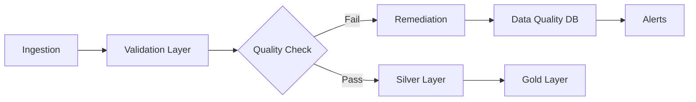

# Data Quality Implementation

> __🏠 [Home](../../../../README.md)__ | __📚 [Documentation](../../../README.md)__ | __🏗️ [Solutions](../../README.md)__ | __⚡ [Real-Time Analytics](../README.md)__ | __⚙️ [Implementation](README.md)__

---


## Overview

Comprehensive data quality framework implementation for the Azure Real-Time Analytics solution, including validation rules, monitoring, and automated remediation.

## Table of Contents

- [Data Quality Framework](#data-quality-framework)
- [Validation Rules](#validation-rules)
- [Implementation Patterns](#implementation-patterns)
- [Monitoring and Metrics](#monitoring-and-metrics)
- [Remediation Strategies](#remediation-strategies)
- [Best Practices](#best-practices)

---

## Data Quality Framework

### Quality Dimensions

| Dimension | Definition | Measurement | Target |
|-----------|------------|-------------|--------|
| __Completeness__ | Data presence | % non-null values | >99% |
| __Accuracy__ | Data correctness | % valid values | >99.5% |
| __Consistency__ | Cross-field validation | % consistent records | >99% |
| __Timeliness__ | Data freshness | Time since last update | <5 min |
| __Uniqueness__ | Duplicate detection | % unique records | >99.9% |
| __Validity__ | Format compliance | % schema-compliant | 100% |

### Architecture



---

## Validation Rules

### Schema Validation

```python
from pyspark.sql.types import *
from pyspark.sql import functions as F
from delta.tables import DeltaTable

# Define expected schema
expected_schema = StructType([
    StructField("event_id", StringType(), False),
    StructField("event_timestamp", TimestampType(), False),
    StructField("event_type", StringType(), False),
    StructField("user_id", StringType(), True),
    StructField("amount", DecimalType(10, 2), True),
    StructField("currency", StringType(), True),
    StructField("metadata", MapType(StringType(), StringType()), True)
])

def validate_schema(df, expected_schema):
    """Validate DataFrame against expected schema"""
    validation_results = {
        "schema_match": df.schema == expected_schema,
        "missing_columns": set(expected_schema.fieldNames()) - set(df.columns),
        "extra_columns": set(df.columns) - set(expected_schema.fieldNames()),
        "type_mismatches": []
    }

    for field in expected_schema.fields:
        if field.name in df.columns:
            df_field = [f for f in df.schema.fields if f.name == field.name][0]
            if df_field.dataType != field.dataType:
                validation_results["type_mismatches"].append({
                    "column": field.name,
                    "expected": field.dataType,
                    "actual": df_field.dataType
                })

    return validation_results
```

### Data Validation Rules

```python
from great_expectations.dataset import SparkDFDataset

def apply_data_quality_rules(df):
    """Apply comprehensive data quality validations"""

    # Create Great Expectations dataset
    ge_df = SparkDFDataset(df)

    # Define validation rules
    validations = {
        # Completeness checks
        "event_id_not_null": ge_df.expect_column_values_to_not_be_null("event_id"),
        "event_timestamp_not_null": ge_df.expect_column_values_to_not_be_null("event_timestamp"),

        # Uniqueness checks
        "event_id_unique": ge_df.expect_column_values_to_be_unique("event_id"),

        # Format validations
        "email_format": ge_df.expect_column_values_to_match_regex(
            "email",
            r"^[a-zA-Z0-9._%+-]+@[a-zA-Z0-9.-]+\.[a-zA-Z]{2,}$"
        ),

        # Range validations
        "amount_positive": ge_df.expect_column_values_to_be_between(
            "amount",
            min_value=0,
            max_value=1000000
        ),

        # Categorical validations
        "currency_values": ge_df.expect_column_values_to_be_in_set(
            "currency",
            ["USD", "EUR", "GBP", "JPY", "CAD"]
        ),

        # Timestamp validations
        "timestamp_recent": ge_df.expect_column_values_to_be_between(
            "event_timestamp",
            min_value=F.current_timestamp() - F.expr("INTERVAL 7 DAYS"),
            max_value=F.current_timestamp() + F.expr("INTERVAL 1 HOUR")
        )
    }

    # Calculate validation scores
    passed = sum(1 for v in validations.values() if v["success"])
    total = len(validations)
    quality_score = (passed / total) * 100

    return {
        "validations": validations,
        "quality_score": quality_score,
        "passed": passed,
        "total": total
    }
```

### Custom Validation Functions

```sql
-- Create data quality validation functions in Unity Catalog
CREATE OR REPLACE FUNCTION realtime_analytics.gold.validate_email(email STRING)
RETURNS BOOLEAN
COMMENT 'Validates email format'
RETURN email RLIKE '^[a-zA-Z0-9._%+-]+@[a-zA-Z0-9.-]+\\.[a-zA-Z]{2,}$';

CREATE OR REPLACE FUNCTION realtime_analytics.gold.validate_phone(phone STRING)
RETURNS BOOLEAN
COMMENT 'Validates phone number format'
RETURN phone RLIKE '^\\+?[1-9]\\d{1,14}$';

CREATE OR REPLACE FUNCTION realtime_analytics.gold.calculate_data_quality_score(
    total_records BIGINT,
    valid_records BIGINT,
    null_count BIGINT,
    duplicate_count BIGINT
)
RETURNS DECIMAL(5, 2)
COMMENT 'Calculates overall data quality score'
RETURN (
    (valid_records - null_count - duplicate_count) / total_records * 100
);
```

---

## Implementation Patterns

### Bronze to Silver Validation

```python
from pyspark.sql import DataFrame
from pyspark.sql import functions as F
from delta.tables import DeltaTable

class DataQualityProcessor:
    def __init__(self, spark, catalog="realtime_analytics"):
        self.spark = spark
        self.catalog = catalog

    def process_bronze_to_silver(self, source_table: str, target_table: str):
        """
        Process data from bronze to silver with quality checks
        """
        # Read bronze data
        bronze_df = self.spark.table(f"{self.catalog}.bronze.{source_table}")

        # Add data quality metadata
        validated_df = (bronze_df
            .withColumn("dq_validation_timestamp", F.current_timestamp())
            .withColumn("dq_source_table", F.lit(source_table))
            .withColumn("dq_record_hash", F.sha2(F.concat_ws("|", *bronze_df.columns), 256))
        )

        # Apply validation rules
        validated_df = self._apply_validations(validated_df)

        # Calculate quality metrics
        validated_df = self._calculate_metrics(validated_df)

        # Separate valid and invalid records
        valid_df = validated_df.filter(F.col("dq_is_valid") == True)
        invalid_df = validated_df.filter(F.col("dq_is_valid") == False)

        # Write valid records to silver
        (valid_df
            .write
            .format("delta")
            .mode("append")
            .option("mergeSchema", "true")
            .saveAsTable(f"{self.catalog}.silver.{target_table}")
        )

        # Write invalid records to quarantine
        (invalid_df
            .write
            .format("delta")
            .mode("append")
            .saveAsTable(f"{self.catalog}.bronze.{source_table}_quarantine")
        )

        # Log quality metrics
        self._log_quality_metrics(source_table, validated_df)

        return {
            "total_records": validated_df.count(),
            "valid_records": valid_df.count(),
            "invalid_records": invalid_df.count(),
            "quality_score": self._calculate_quality_score(validated_df)
        }

    def _apply_validations(self, df: DataFrame) -> DataFrame:
        """Apply comprehensive validation rules"""
        return (df
            # Check for nulls in required fields
            .withColumn("dq_null_check",
                F.when(
                    F.col("event_id").isNull() |
                    F.col("event_timestamp").isNull() |
                    F.col("event_type").isNull(),
                    False
                ).otherwise(True)
            )
            # Check for valid timestamps
            .withColumn("dq_timestamp_check",
                F.when(
                    (F.col("event_timestamp") < F.current_timestamp() - F.expr("INTERVAL 7 DAYS")) |
                    (F.col("event_timestamp") > F.current_timestamp() + F.expr("INTERVAL 1 HOUR")),
                    False
                ).otherwise(True)
            )
            # Check for valid amounts
            .withColumn("dq_amount_check",
                F.when(
                    F.col("amount").isNotNull(),
                    (F.col("amount") >= 0) & (F.col("amount") <= 1000000)
                ).otherwise(True)
            )
            # Composite validation flag
            .withColumn("dq_is_valid",
                F.col("dq_null_check") &
                F.col("dq_timestamp_check") &
                F.col("dq_amount_check")
            )
            # Add validation errors
            .withColumn("dq_validation_errors",
                F.array(
                    F.when(~F.col("dq_null_check"), F.lit("null_check_failed")),
                    F.when(~F.col("dq_timestamp_check"), F.lit("timestamp_invalid")),
                    F.when(~F.col("dq_amount_check"), F.lit("amount_out_of_range"))
                )
            )
        )

    def _calculate_metrics(self, df: DataFrame) -> DataFrame:
        """Calculate data quality metrics"""
        return df.withColumn("dq_quality_score",
            (F.col("dq_null_check").cast("int") +
             F.col("dq_timestamp_check").cast("int") +
             F.col("dq_amount_check").cast("int")) / 3.0 * 100
        )

    def _log_quality_metrics(self, table_name: str, df: DataFrame):
        """Log quality metrics to monitoring table"""
        metrics = df.agg(
            F.count("*").alias("total_records"),
            F.sum(F.col("dq_is_valid").cast("int")).alias("valid_records"),
            F.avg("dq_quality_score").alias("avg_quality_score")
        ).collect()[0]

        metrics_df = self.spark.createDataFrame([{
            "table_name": table_name,
            "timestamp": F.current_timestamp(),
            "total_records": metrics["total_records"],
            "valid_records": metrics["valid_records"],
            "quality_score": metrics["avg_quality_score"]
        }])

        (metrics_df.write
            .format("delta")
            .mode("append")
            .saveAsTable(f"{self.catalog}.gold.data_quality_metrics")
        )
```

### Streaming Quality Checks

```python
def create_streaming_quality_pipeline():
    """Create real-time data quality pipeline"""

    # Read streaming data from bronze
    streaming_df = (spark
        .readStream
        .format("delta")
        .table("realtime_analytics.bronze.events")
    )

    # Apply quality checks
    quality_checked = (streaming_df
        .withColumn("quality_check_timestamp", F.current_timestamp())
        .withColumn("is_duplicate",
            F.col("event_id").isin(
                spark.table("realtime_analytics.silver.validated_events")
                    .select("event_id")
                    .distinct()
            )
        )
        .withColumn("is_valid_format",
            F.col("event_type").isin(["click", "view", "purchase", "signup"])
        )
        .withColumn("is_valid_timestamp",
            (F.col("event_timestamp") >= F.current_timestamp() - F.expr("INTERVAL 1 DAY")) &
            (F.col("event_timestamp") <= F.current_timestamp())
        )
        .withColumn("quality_passed",
            ~F.col("is_duplicate") &
            F.col("is_valid_format") &
            F.col("is_valid_timestamp")
        )
    )

    # Write to silver with quality metadata
    query = (quality_checked
        .writeStream
        .format("delta")
        .outputMode("append")
        .option("checkpointLocation", "/mnt/checkpoints/silver/validated_events")
        .trigger(processingTime="30 seconds")
        .foreachBatch(lambda batch_df, batch_id: process_quality_batch(batch_df, batch_id))
        .start()
    )

    return query

def process_quality_batch(batch_df, batch_id):
    """Process each micro-batch with quality checks"""
    # Separate valid and invalid records
    valid_records = batch_df.filter(F.col("quality_passed") == True)
    invalid_records = batch_df.filter(F.col("quality_passed") == False)

    # Write valid records
    valid_records.write.format("delta").mode("append") \
        .saveAsTable("realtime_analytics.silver.validated_events")

    # Write invalid records to quarantine
    invalid_records.write.format("delta").mode("append") \
        .saveAsTable("realtime_analytics.bronze.events_quarantine")

    # Log batch metrics
    metrics = {
        "batch_id": batch_id,
        "timestamp": F.current_timestamp(),
        "total_records": batch_df.count(),
        "valid_records": valid_records.count(),
        "invalid_records": invalid_records.count()
    }

    spark.createDataFrame([metrics]).write.format("delta").mode("append") \
        .saveAsTable("realtime_analytics.gold.streaming_quality_metrics")
```

---

## Monitoring and Metrics

### Quality Metrics Dashboard

```sql
-- Create data quality monitoring view
CREATE OR REPLACE VIEW realtime_analytics.gold.data_quality_dashboard AS
SELECT
    table_name,
    DATE(timestamp) as metric_date,
    AVG(quality_score) as avg_quality_score,
    SUM(total_records) as total_records_processed,
    SUM(valid_records) as total_valid_records,
    (SUM(valid_records) / SUM(total_records) * 100) as success_rate,
    MAX(timestamp) as last_update
FROM realtime_analytics.gold.data_quality_metrics
GROUP BY table_name, DATE(timestamp)
ORDER BY metric_date DESC, table_name;
```

### KQL Monitoring Queries

```kusto
// Data quality metrics over time
let QualityMetrics = datatable(
    TimeGenerated: datetime,
    TableName: string,
    QualityScore: double,
    TotalRecords: long,
    ValidRecords: long
)[];
QualityMetrics
| where TimeGenerated > ago(24h)
| summarize
    AvgQualityScore = avg(QualityScore),
    TotalProcessed = sum(TotalRecords),
    TotalValid = sum(ValidRecords),
    SuccessRate = (sum(ValidRecords) * 100.0 / sum(TotalRecords))
    by bin(TimeGenerated, 1h), TableName
| render timechart

// Quality score trend analysis
QualityMetrics
| where TimeGenerated > ago(7d)
| summarize QualityScore = avg(QualityScore) by bin(TimeGenerated, 1d), TableName
| render timechart

// Quality failures by type
let ValidationErrors = datatable(
    TimeGenerated: datetime,
    ErrorType: string,
    ErrorCount: long
)[];
ValidationErrors
| where TimeGenerated > ago(24h)
| summarize TotalErrors = sum(ErrorCount) by ErrorType
| order by TotalErrors desc
| render piechart
```

### Alert Configuration

```python
# Configure data quality alerts
from azure.monitor.query import LogsQueryClient, LogsQueryStatus
from azure.identity import DefaultAzureCredential

def setup_quality_alerts():
    """Configure automated alerts for data quality issues"""

    alert_rules = [
        {
            "name": "low-quality-score",
            "description": "Alert when quality score drops below 95%",
            "severity": "Error",
            "condition": "avg_quality_score < 95",
            "threshold": 95,
            "evaluation_frequency": "5m",
            "action_group": "data-quality-team"
        },
        {
            "name": "high-rejection-rate",
            "description": "Alert when rejection rate exceeds 5%",
            "severity": "Warning",
            "condition": "rejection_rate > 5",
            "threshold": 5,
            "evaluation_frequency": "10m",
            "action_group": "platform-team"
        },
        {
            "name": "validation-failures",
            "description": "Alert on critical validation failures",
            "severity": "Critical",
            "condition": "critical_failures > 0",
            "threshold": 0,
            "evaluation_frequency": "1m",
            "action_group": "oncall-engineers"
        }
    ]

    return alert_rules
```

---

## Remediation Strategies

### Automated Remediation

```python
class DataQualityRemediation:
    """Automated data quality remediation"""

    def remediate_nulls(self, df: DataFrame, column: str, strategy: str = "mean"):
        """Fill null values based on strategy"""
        if strategy == "mean":
            fill_value = df.select(F.mean(column)).collect()[0][0]
        elif strategy == "median":
            fill_value = df.select(F.expr(f"percentile({column}, 0.5)")).collect()[0][0]
        elif strategy == "mode":
            fill_value = (df.groupBy(column)
                         .count()
                         .orderBy(F.desc("count"))
                         .first()[0])
        else:
            fill_value = None

        return df.fillna({column: fill_value})

    def remediate_outliers(self, df: DataFrame, column: str, method: str = "iqr"):
        """Remove or cap outliers"""
        if method == "iqr":
            quantiles = df.approxQuantile(column, [0.25, 0.75], 0.05)
            Q1, Q3 = quantiles[0], quantiles[1]
            IQR = Q3 - Q1
            lower_bound = Q1 - 1.5 * IQR
            upper_bound = Q3 + 1.5 * IQR

            return df.filter(
                (F.col(column) >= lower_bound) &
                (F.col(column) <= upper_bound)
            )
        elif method == "zscore":
            stats = df.select(
                F.mean(column).alias("mean"),
                F.stddev(column).alias("std")
            ).collect()[0]

            return df.filter(
                F.abs((F.col(column) - stats["mean"]) / stats["std"]) <= 3
            )

    def remediate_duplicates(self, df: DataFrame, key_columns: list):
        """Remove duplicate records"""
        window_spec = Window.partitionBy(key_columns).orderBy(F.desc("event_timestamp"))

        return (df
            .withColumn("row_num", F.row_number().over(window_spec))
            .filter(F.col("row_num") == 1)
            .drop("row_num")
        )
```

---

## Best Practices

### Data Quality Best Practices

- ✅ **Define clear quality dimensions** with measurable targets
- ✅ **Implement validation at each layer** (bronze, silver, gold)
- ✅ **Use quarantine tables** for failed quality checks
- ✅ **Monitor quality metrics** continuously
- ✅ **Automate remediation** where possible
- ✅ **Document validation rules** comprehensively
- ✅ **Test quality checks** regularly
- ✅ **Establish data ownership** for quality accountability

### Performance Optimization

- Use **broadcast joins** for reference data validation
- Implement **predicate pushdown** in Delta Lake
- Cache **frequently accessed** validation lookup tables
- Partition quality metrics by **date and table**
- Use **Z-ordering** on quality score columns

---

## Related Documentation

- [Architecture Overview](../architecture/README.md)
- [Stream Processing Implementation](stream-processing.md)
- [Operations Guide](../operations/README.md)
- [Monitoring Guide](../operations/monitoring.md)

---

**Last Updated:** January 2025
**Version:** 2.0.0
**Status:** Production Ready
