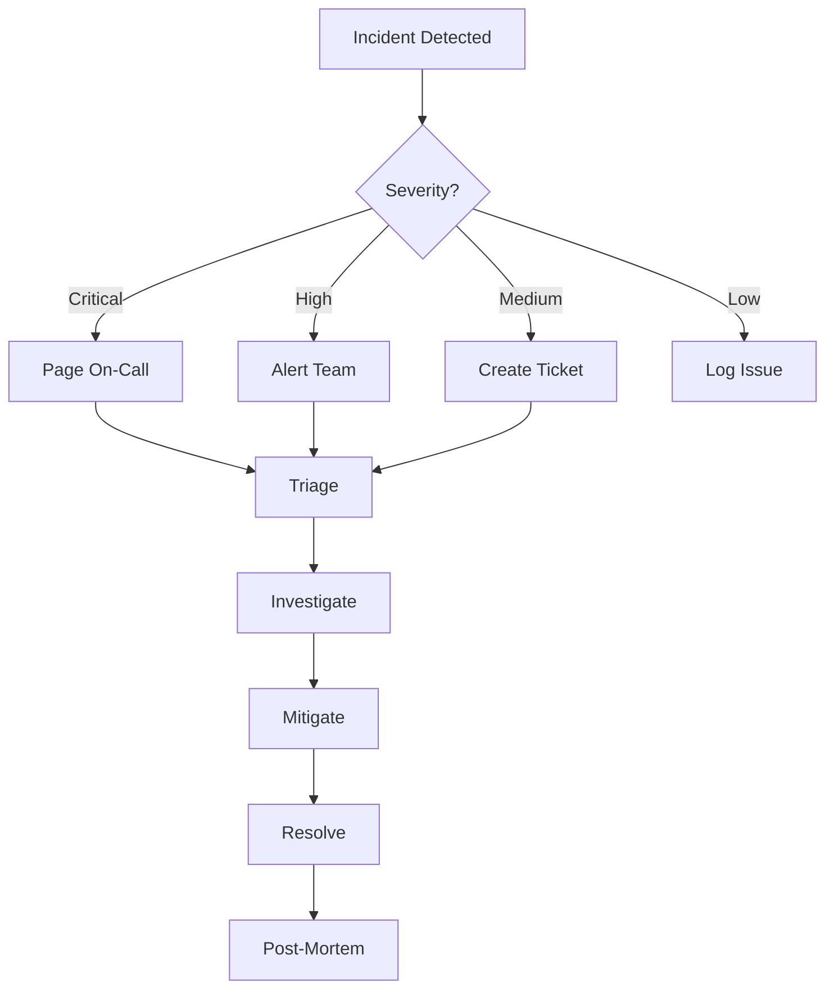

# 🔧 Operations Documentation

> __🏠 [Home](../../../../README.md)__ | __📚 [Documentation](../../../README.md)__ | __🚀 Solution__ | __🔧 Operations__

---

## 📋 Overview

Comprehensive operational procedures and guidelines for maintaining the Azure Real-Time Analytics platform in production. This documentation covers monitoring, performance optimization, disaster recovery, and routine maintenance tasks.

## 📑 Table of Contents

- [Monitoring & Observability](#monitoring-observability)
- [Performance Management](#performance-management)
- [Disaster Recovery](#disaster-recovery)
- [Maintenance Procedures](#maintenance-procedures)
- [Troubleshooting](#troubleshooting)
- [Incident Management](#incident-management)

---

## 📊 Monitoring & Observability

### System Health Dashboard

```yaml
Key Metrics:
  Availability:
    - Platform Uptime: 99.99% target
    - Service Health: All components green
    - API Response: <100ms p50, <500ms p99
    
  Performance:
    - Throughput: 1.2M events/second
    - Latency: <5 seconds end-to-end
    - Error Rate: <0.1%
    
  Resource Utilization:
    - Compute: 65% average, 85% peak
    - Storage: 2.3PB used, 5PB capacity
    - Network: 4.2GB/s sustained
```

### Monitoring Stack

| Component | Tool | Purpose |
|-----------|------|---------|
| __Infrastructure__ | Azure Monitor | Resource metrics and logs |
| __Application__ | Application Insights | Application performance |
| __Security__ | Azure Sentinel | Security monitoring |
| __Business__ | Power BI | Business KPIs |
| __Costs__ | Cost Management | Budget tracking |

### Alert Configuration

```yaml
Critical Alerts:
  - Service Down: Any core service unavailable
  - Data Loss: Missing data in pipeline
  - Security Breach: Unauthorized access detected
  - Cost Overrun: Budget exceeded by 20%

Warning Alerts:
  - High Latency: Processing >10 seconds
  - Resource Pressure: >85% utilization
  - Error Spike: Error rate >1%
  - Quota Limit: 80% of quota reached

Information Alerts:
  - Deployment Complete: New version deployed
  - Backup Success: Daily backup completed
  - Maintenance Window: Scheduled maintenance
```

---

## 🚀 Performance Management

### Performance Optimization Procedures

#### Daily Performance Review

```bash
#!/bin/bash
# daily_performance_review.sh

# Check cluster utilization
databricks clusters list --output JSON | \
  jq '.clusters[] | {cluster_id, state, num_workers}'

# Review slow queries
az monitor metrics list \
  --resource $DATABRICKS_RESOURCE_ID \
  --metric "query.duration" \
  --aggregation Average \
  --interval PT1H

# Analyze data skew
spark.sql("""
  SELECT 
    partition_id,
    COUNT(*) as record_count,
    AVG(record_count) OVER() as avg_count,
    (COUNT(*) - AVG(record_count) OVER()) / AVG(record_count) OVER() * 100 as skew_percentage
  FROM bronze.events
  GROUP BY partition_id
  HAVING skew_percentage > 20
""")
```

#### Performance Tuning Checklist

- [ ] __Cluster Optimization__
  - Right-size cluster nodes
  - Enable auto-scaling
  - Use spot instances where appropriate
  - Configure Photon acceleration

- [ ] __Query Optimization__
  - Analyze query plans
  - Add appropriate indexes
  - Implement partition pruning
  - Use broadcast joins for small tables

- [ ] __Storage Optimization__
  - Run OPTIMIZE regularly
  - Configure Z-ORDER by common filters
  - Implement data compaction
  - Archive old data

- [ ] __Network Optimization__
  - Use Azure backbone
  - Implement caching strategies
  - Optimize data serialization
  - Minimize cross-region transfers

### Capacity Planning

```python
# capacity_planning.py
import pandas as pd
from datetime import datetime, timedelta
from azure.monitor.query import MetricsQueryClient

def forecast_capacity(metric_name, days_ahead=30):
    """Forecast capacity requirements."""
    client = MetricsQueryClient(credential)
    
    # Get historical data
    end_time = datetime.now()
    start_time = end_time - timedelta(days=90)
    
    response = client.query_resource(
        resource_uri=resource_id,
        metric_names=[metric_name],
        timespan=(start_time, end_time),
        granularity=timedelta(hours=1)
    )
    
    # Create forecast
    df = pd.DataFrame(response.metrics[0].timeseries[0].data)
    df['timestamp'] = pd.to_datetime(df['timestamp'])
    df.set_index('timestamp', inplace=True)
    
    # Simple linear regression forecast
    from sklearn.linear_model import LinearRegression
    
    X = df.index.astype(int).values.reshape(-1, 1)
    y = df['average'].values
    
    model = LinearRegression()
    model.fit(X, y)
    
    # Predict future
    future_dates = pd.date_range(
        start=end_time,
        periods=days_ahead,
        freq='D'
    )
    
    predictions = model.predict(
        future_dates.astype(int).values.reshape(-1, 1)
    )
    
    return {
        'current': y[-1],
        'predicted_30d': predictions[-1],
        'growth_rate': (predictions[-1] - y[-1]) / y[-1] * 100
    }
```

---

## 🛡️ Disaster Recovery

### RPO and RTO Targets

| Component | RPO | RTO | Backup Frequency |
|-----------|-----|-----|------------------|
| __Data Lake__ | 1 hour | 4 hours | Continuous replication |
| __Databricks__ | 4 hours | 2 hours | Daily snapshots |
| __Kafka__ | 5 minutes | 30 minutes | Multi-region replication |
| __Power BI__ | 24 hours | 4 hours | Daily export |
| __Configuration__ | 1 hour | 1 hour | Git versioning |

### Backup Procedures

```yaml
Automated Backups:
  Data Lake:
    - Type: Geo-redundant storage
    - Frequency: Continuous
    - Retention: 30 days
    
  Databricks:
    - Notebooks: Git sync every commit
    - Jobs: Daily export to JSON
    - Clusters: Configuration in IaC
    
  Metadata:
    - Unity Catalog: Daily export
    - Schemas: Version controlled
    - Permissions: Backed up to Key Vault
    
  Configuration:
    - Infrastructure: Terraform state in remote backend
    - Secrets: Azure Key Vault with soft delete
    - Policies: Azure Policy definitions
```

### Recovery Procedures

#### Data Recovery

```bash
#!/bin/bash
# data_recovery.sh

# Parameters
RECOVERY_POINT="2025-01-28T12:00:00Z"
SOURCE_CONTAINER="backup"
TARGET_CONTAINER="bronze"

# Restore from backup
az storage blob copy start-batch \
  --source-account-name $BACKUP_STORAGE \
  --source-container $SOURCE_CONTAINER \
  --account-name $PRIMARY_STORAGE \
  --destination-container $TARGET_CONTAINER \
  --pattern "*" \
  --source-sas $SOURCE_SAS

# Verify restoration
az storage blob list \
  --account-name $PRIMARY_STORAGE \
  --container-name $TARGET_CONTAINER \
  --query "length(@)" \
  --output tsv
```

#### Service Recovery

```python
# service_recovery.py
import asyncio
from typing import List, Dict

class DisasterRecoveryOrchestrator:
    def __init__(self):
        self.services = [
            "storage",
            "databricks",
            "kafka",
            "powerbi"
        ]
        
    async def failover_to_secondary(self):
        """Execute failover to secondary region."""
        tasks = []
        
        for service in self.services:
            tasks.append(self.failover_service(service))
            
        results = await asyncio.gather(*tasks)
        return results
    
    async def failover_service(self, service: str) -> Dict:
        """Failover individual service."""
        try:
            # Update DNS
            await self.update_dns(service)
            
            # Start secondary instance
            await self.start_secondary(service)
            
            # Verify health
            is_healthy = await self.health_check(service)
            
            return {
                "service": service,
                "status": "success" if is_healthy else "failed",
                "timestamp": datetime.utcnow()
            }
        except Exception as e:
            return {
                "service": service,
                "status": "error",
                "error": str(e)
            }
```

---

## 🔧 Maintenance Procedures

### Scheduled Maintenance

| Task | Frequency | Duration | Impact |
|------|-----------|----------|--------|
| __Cluster Restart__ | Weekly | 15 min | Minimal - rolling restart |
| __Security Patching__ | Monthly | 2 hours | None - staged deployment |
| __Platform Upgrade__ | Quarterly | 4 hours | Read-only mode |
| __DR Testing__ | Quarterly | 8 hours | Secondary region only |
| __Capacity Review__ | Monthly | 2 hours | None |

### Maintenance Runbooks

#### Cluster Maintenance

```python
# cluster_maintenance.py
from databricks.sdk import WorkspaceClient
import time

def perform_cluster_maintenance(cluster_id: str):
    """Perform rolling cluster maintenance."""
    w = WorkspaceClient()
    
    # Step 1: Create temporary cluster
    temp_cluster = w.clusters.create(
        cluster_name=f"temp-{cluster_id}",
        spark_version="13.3.x-scala2.12",
        node_type_id="Standard_D16s_v3",
        num_workers=10
    )
    
    # Step 2: Redirect traffic
    update_load_balancer(temp_cluster.cluster_id)
    
    # Step 3: Restart original cluster
    w.clusters.restart(cluster_id)
    
    # Step 4: Wait for healthy state
    while True:
        state = w.clusters.get(cluster_id).state
        if state == "RUNNING":
            break
        time.sleep(30)
    
    # Step 5: Redirect traffic back
    update_load_balancer(cluster_id)
    
    # Step 6: Terminate temporary cluster
    w.clusters.delete(temp_cluster.cluster_id)
```

#### Storage Optimization

```sql
-- optimize_storage.sql

-- Optimize Delta tables
OPTIMIZE bronze.events
WHERE date >= current_date() - INTERVAL 7 DAYS
ZORDER BY (event_type, customer_id);

-- Vacuum old files
VACUUM bronze.events RETAIN 168 HOURS;

-- Analyze table statistics
ANALYZE TABLE bronze.events COMPUTE STATISTICS;

-- Check table health
DESCRIBE HISTORY bronze.events LIMIT 10;
```

---

## 🔍 Troubleshooting

### Common Issues and Resolutions

| Issue | Symptoms | Root Cause | Resolution |
|-------|----------|------------|------------|
| __High Latency__ | Processing >10s | Cluster undersized | Scale up cluster |
| __Data Skew__ | Uneven partitions | Poor partition key | Repartition data |
| __Memory Errors__ | OOM exceptions | Large broadcasts | Optimize joins |
| __Connection Timeout__ | Failed queries | Network issues | Check firewall rules |
| __Cost Spike__ | Budget alerts | Runaway jobs | Implement job timeout |

### Diagnostic Scripts

```python
# diagnostics.py
import pandas as pd
from typing import Dict, List

class SystemDiagnostics:
    def __init__(self):
        self.checks = [
            self.check_cluster_health,
            self.check_storage_health,
            self.check_streaming_health,
            self.check_network_health
        ]
    
    def run_diagnostics(self) -> Dict:
        """Run all diagnostic checks."""
        results = {}
        
        for check in self.checks:
            check_name = check.__name__
            try:
                results[check_name] = check()
            except Exception as e:
                results[check_name] = {
                    "status": "error",
                    "error": str(e)
                }
        
        return results
    
    def check_cluster_health(self) -> Dict:
        """Check Databricks cluster health."""
        # Implementation
        pass
    
    def check_storage_health(self) -> Dict:
        """Check storage account health."""
        # Implementation
        pass
```

---

## 🚨 Incident Management

### Incident Response Process



### Escalation Matrix

| Severity | Response Time | Escalation | Authority |
|----------|--------------|------------|-----------|
| __Critical__ | 15 minutes | Immediate page | Can stop production |
| __High__ | 1 hour | Team notification | Can modify config |
| __Medium__ | 4 hours | Next business day | Can restart services |
| __Low__ | 24 hours | Weekly review | Can update docs |

### Post-Incident Review Template

```markdown
## Incident Post-Mortem

**Incident ID:** INC-2025-001
**Date:** January 29, 2025
**Duration:** 45 minutes
**Impact:** 5% of queries failed

### Timeline
- 14:00 - Alert triggered for high error rate
- 14:05 - On-call engineer acknowledged
- 14:15 - Root cause identified
- 14:30 - Fix deployed
- 14:45 - System recovered

### Root Cause
Memory pressure on streaming cluster due to large broadcast join

### Resolution
- Increased cluster memory
- Optimized join strategy
- Added monitoring for broadcast size

### Action Items
- [ ] Implement automatic broadcast size limits
- [ ] Add pre-emptive scaling rules
- [ ] Update runbook with new procedure
```

---

## 📚 Related Documentation

- [Monitoring Setup](./monitoring.md)
- [Performance Tuning](./performance.md)
- [Disaster Recovery Plan](./disaster-recovery.md)
- [Maintenance Runbook](./maintenance.md)
- [Troubleshooting Guide](./troubleshooting.md)

---

__Last Updated:__ January 29, 2025  
__Version:__ 1.0.0  
__Maintainer:__ Platform Operations Team
