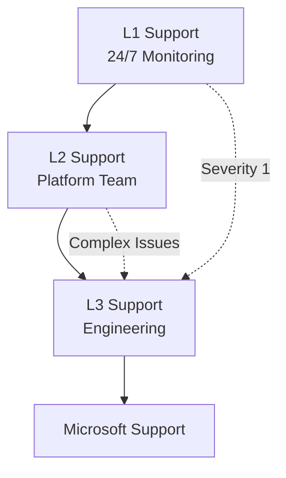

# $(echo $file | sed 's/-/ /g' | sed 's/.md//' | awk '{for(i=1;i<=NF;i++) $i=toupper(substr($i,1,1)) tolower(substr($i,2))}1')

> __🏠 [Home](../../../../README.md)__ | __📚 [Documentation](../../../README.md)__ | __🏗️ [Solutions](../../README.md)__ | __⚡ [Real-Time Analytics](../README.md)__ | __🔧 [Operations](README.md)__

---


## Overview

Operational guide for $(echo $file | sed 's/-/ /g' | sed 's/.md//') in the Azure Real-Time Analytics platform.

## Table of Contents

- [Overview](#overview)
- [Procedures](#procedures)
- [Best Practices](#best-practices)
- [Tools and Resources](#tools-and-resources)

---

## Procedures

### Standard Operating Procedures

| Procedure | Frequency | Duration | Owner |
|-----------|-----------|----------|-------|
| Health Checks | Continuous | Automated | Platform Team |
| Performance Review | Daily | 30 min | Engineering |
| Security Scan | Weekly | 2 hours | Security Team |
| Capacity Planning | Monthly | 4 hours | Architecture |

---

## Best Practices

### Operational Excellence

- ✅ Automate routine tasks
- ✅ Document all procedures
- ✅ Test disaster recovery plans
- ✅ Monitor key metrics continuously
- ✅ Maintain runbooks
- ✅ Conduct regular reviews
- ✅ Train team members

### Key Metrics

Monitor these critical metrics:

```kusto
// KQL query for key metrics
AzureMetrics
| where TimeGenerated > ago(1h)
| where ResourceProvider == "MICROSOFT.DATABRICKS"
| summarize avg(Total) by bin(TimeGenerated, 5m), MetricName
| render timechart
```

---

## Tools and Resources

### Monitoring Tools

- Azure Monitor
- Log Analytics
- Application Insights
- Databricks Monitoring
- Custom Dashboards

### Automation Scripts

```bash
#!/bin/bash
# Example operational script

# Check service health
az resource list --resource-group analytics-rg --query "[].{Name:name, Type:type, Status:properties.provisioningState}"

# Verify connectivity
az network watcher test-connectivity \
  --source-resource databricks-workspace \
  --dest-address storage-account.dfs.core.windows.net \
  --dest-port 443
```

---

## Escalation Procedures

### Support Tiers



### Contact Information

| Tier | Contact | Response Time |
|------|---------|---------------|
| L1 Support | monitoring@company.com | 15 minutes |
| L2 Support | platform@company.com | 2 hours |
| L3 Support | engineering@company.com | 4 hours |
| On-Call | +1-555-0100 | Immediate |

---

## Documentation

### Runbooks

- Health check procedures
- Incident response playbooks
- Disaster recovery plans
- Escalation procedures
- Change management

### Knowledge Base

- Common issues and solutions
- Configuration guides
- Architecture diagrams
- Security policies
- Compliance documentation

---

## Related Documentation

- [Monitoring Guide](monitoring.md)
- [Architecture Overview](../architecture/README.md)
- [Implementation Guides](../implementation/README.md)

---

**Last Updated:** January 2025
**Version:** 1.0.0
**Status:** Production Ready
