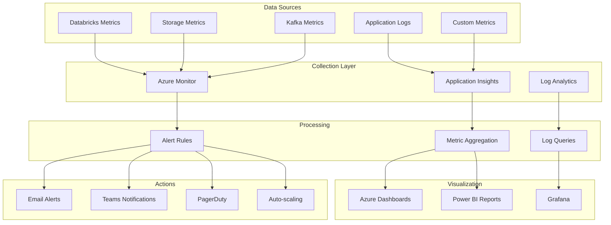

# 📊 Monitoring Setup Guide

> **🏠 [Home](../../../../README.md)** | **📚 [Documentation](../../../README.md)** | **🚀 [Solution](../README.md)** | **🔧 [Operations](./README.md)** | **📊 Monitoring**

---

## 📋 Overview

This guide provides comprehensive instructions for setting up monitoring and observability for the Azure Real-Time Analytics platform, ensuring proactive detection of issues and optimal system performance.

## 📑 Table of Contents

- [Monitoring Architecture](#monitoring-architecture)
- [Azure Monitor Configuration](#azure-monitor-configuration)
- [Application Insights Setup](#application-insights-setup)
- [Custom Metrics](#custom-metrics)
- [Alerting Rules](#alerting-rules)
- [Dashboards](#dashboards)
- [Log Analytics](#log-analytics)

---

## 🏗️ Monitoring Architecture

### Monitoring Stack Overview



### Key Metrics Categories

| Category | Metrics | Source | Frequency |
|----------|---------|--------|-----------|
| **Infrastructure** | CPU, Memory, Disk, Network | Azure Monitor | 1 minute |
| **Application** | Response time, Error rate, Throughput | App Insights | 30 seconds |
| **Business** | Events processed, Data quality, SLA | Custom metrics | 5 minutes |
| **Security** | Failed auth, Access violations, Threats | Sentinel | Real-time |
| **Cost** | Resource consumption, Budget usage | Cost Management | Hourly |

---

## 🔧 Azure Monitor Configuration

### 1. Enable Diagnostic Settings

```bash
# Enable diagnostics for Databricks
az monitor diagnostic-settings create \
  --name "databricks-diagnostics" \
  --resource $DATABRICKS_RESOURCE_ID \
  --workspace $LOG_ANALYTICS_WORKSPACE_ID \
  --logs '[
    {
      "category": "clusters",
      "enabled": true,
      "retentionPolicy": {
        "enabled": true,
        "days": 30
      }
    },
    {
      "category": "jobs",
      "enabled": true,
      "retentionPolicy": {
        "enabled": true,
        "days": 30
      }
    }
  ]' \
  --metrics '[
    {
      "category": "AllMetrics",
      "enabled": true,
      "retentionPolicy": {
        "enabled": true,
        "days": 30
      }
    }
  ]'

# Enable diagnostics for Storage
az monitor diagnostic-settings create \
  --name "storage-diagnostics" \
  --resource $STORAGE_RESOURCE_ID \
  --workspace $LOG_ANALYTICS_WORKSPACE_ID \
  --logs @storage-diagnostic-settings.json \
  --metrics @storage-metrics-settings.json
```

### 2. Configure Metrics Collection

```python
# metrics_collector.py
from azure.monitor.opentelemetry import configure_azure_monitor
from opentelemetry import metrics
from opentelemetry.metrics import Observation
import time

# Configure Azure Monitor
configure_azure_monitor(
    connection_string="InstrumentationKey=your-key;IngestionEndpoint=https://your-endpoint/"
)

# Get meter
meter = metrics.get_meter("realtime-analytics")

# Create custom metrics
events_counter = meter.create_counter(
    name="events_processed",
    description="Total events processed",
    unit="events"
)

latency_histogram = meter.create_histogram(
    name="processing_latency",
    description="Event processing latency",
    unit="ms"
)

error_counter = meter.create_counter(
    name="processing_errors",
    description="Total processing errors",
    unit="errors"
)

# Collect metrics
def collect_metrics():
    """Collect and send custom metrics."""
    while True:
        # Simulate metric collection
        events_counter.add(1000, {"source": "kafka", "environment": "prod"})
        latency_histogram.record(250, {"pipeline": "streaming", "stage": "silver"})
        
        # Send every 60 seconds
        time.sleep(60)
```

### 3. Resource Monitoring Configuration

```yaml
# monitoring-config.yaml
resources:
  databricks:
    metrics:
      - name: cluster.cpu.percentage
        aggregation: Average
        threshold: 80
        window: 5m
      - name: cluster.memory.percentage
        aggregation: Average
        threshold: 85
        window: 5m
      - name: job.duration
        aggregation: Maximum
        threshold: 3600
        window: 10m
        
  storage:
    metrics:
      - name: BlobCapacity
        aggregation: Average
        threshold: 5000000000000  # 5TB
        window: 1h
      - name: Transactions
        aggregation: Total
        threshold: 1000000
        window: 5m
      - name: Ingress
        aggregation: Total
        threshold: 100000000000  # 100GB
        window: 1h
        
  eventHubs:
    metrics:
      - name: IncomingMessages
        aggregation: Total
        threshold: 10000000
        window: 5m
      - name: OutgoingMessages
        aggregation: Total
        threshold: 10000000
        window: 5m
      - name: ThrottledRequests
        aggregation: Total
        threshold: 100
        window: 5m
```

---

## 📱 Application Insights Setup

### 1. Initialize Application Insights

```python
# app_insights_config.py
from applicationinsights import TelemetryClient
from applicationinsights.logging import LoggingHandler
import logging

class MonitoringClient:
    def __init__(self, instrumentation_key: str):
        self.tc = TelemetryClient(instrumentation_key)
        self.setup_logging()
    
    def setup_logging(self):
        """Configure logging to Application Insights."""
        handler = LoggingHandler(self.tc.instrumentation_key)
        handler.setLevel(logging.INFO)
        
        formatter = logging.Formatter(
            '%(asctime)s - %(name)s - %(levelname)s - %(message)s'
        )
        handler.setFormatter(formatter)
        
        logger = logging.getLogger()
        logger.addHandler(handler)
        logger.setLevel(logging.INFO)
    
    def track_event(self, name: str, properties: dict = None, measurements: dict = None):
        """Track custom event."""
        self.tc.track_event(name, properties, measurements)
    
    def track_metric(self, name: str, value: float, properties: dict = None):
        """Track custom metric."""
        self.tc.track_metric(name, value, properties=properties)
    
    def track_exception(self, exception: Exception, properties: dict = None):
        """Track exception."""
        self.tc.track_exception(
            type(exception).__name__,
            str(exception),
            exception.__traceback__,
            properties=properties
        )
    
    def flush(self):
        """Flush telemetry."""
        self.tc.flush()
```

### 2. Databricks Integration

```python
# databricks_monitoring.py
from pyspark.sql import SparkSession
from typing import Dict
import json

class DatabricksMonitor:
    def __init__(self, spark: SparkSession):
        self.spark = spark
        self.app_insights = MonitoringClient(instrumentation_key)
    
    def monitor_streaming_query(self, query):
        """Monitor structured streaming query."""
        def process_metrics(batch_df, batch_id):
            metrics = {
                "batch_id": batch_id,
                "input_rows": batch_df.count(),
                "processing_time": query.lastProgress["durationMs"]["triggerExecution"],
                "input_rate": query.lastProgress["inputRowsPerSecond"],
                "process_rate": query.lastProgress["processedRowsPerSecond"]
            }
            
            # Send to Application Insights
            self.app_insights.track_event(
                "streaming_batch_processed",
                properties={"query_name": query.name},
                measurements=metrics
            )
            
            # Check for issues
            if metrics["processing_time"] > 10000:  # >10 seconds
                self.app_insights.track_event(
                    "slow_batch_detected",
                    properties={
                        "query_name": query.name,
                        "batch_id": str(batch_id)
                    },
                    measurements={"duration_ms": metrics["processing_time"]}
                )
        
        return process_metrics
    
    def monitor_job_execution(self, job_id: str, job_name: str):
        """Monitor Databricks job execution."""
        from databricks.sdk import WorkspaceClient
        
        w = WorkspaceClient()
        run = w.jobs.get_run(run_id=job_id)
        
        metrics = {
            "job_id": job_id,
            "job_name": job_name,
            "state": run.state.life_cycle_state,
            "start_time": run.start_time,
            "end_time": run.end_time,
            "duration_ms": (run.end_time - run.start_time) * 1000 if run.end_time else None,
            "cluster_id": run.cluster_instance.cluster_id
        }
        
        self.app_insights.track_event(
            "databricks_job_completed",
            properties=metrics
        )
        
        if run.state.state_message:
            self.app_insights.track_event(
                "databricks_job_error",
                properties={
                    "job_id": job_id,
                    "error": run.state.state_message
                }
            )
```

---

## 📈 Custom Metrics

### Business Metrics Collection

```python
# business_metrics.py
from datetime import datetime, timedelta
import asyncio

class BusinessMetricsCollector:
    def __init__(self, spark, monitoring_client):
        self.spark = spark
        self.monitoring = monitoring_client
    
    async def collect_data_quality_metrics(self):
        """Collect data quality metrics."""
        quality_metrics = self.spark.sql("""
            SELECT
                COUNT(*) as total_records,
                SUM(CASE WHEN is_valid = true THEN 1 ELSE 0 END) as valid_records,
                SUM(CASE WHEN is_duplicate = true THEN 1 ELSE 0 END) as duplicate_records,
                SUM(CASE WHEN is_late = true THEN 1 ELSE 0 END) as late_records
            FROM silver.validated_events
            WHERE event_time >= current_timestamp() - INTERVAL 5 MINUTES
        """).collect()[0]
        
        quality_score = (quality_metrics['valid_records'] / 
                        quality_metrics['total_records'] * 100)
        
        self.monitoring.track_metric(
            "data_quality_score",
            quality_score,
            properties={"layer": "silver"}
        )
        
        self.monitoring.track_metric(
            "duplicate_rate",
            quality_metrics['duplicate_records'] / quality_metrics['total_records'] * 100,
            properties={"layer": "silver"}
        )
    
    async def collect_sla_metrics(self):
        """Collect SLA compliance metrics."""
        sla_metrics = self.spark.sql("""
            SELECT
                percentile_approx(processing_time_ms, 0.99) as p99_latency,
                percentile_approx(processing_time_ms, 0.95) as p95_latency,
                percentile_approx(processing_time_ms, 0.50) as p50_latency,
                AVG(processing_time_ms) as avg_latency
            FROM gold.processing_metrics
            WHERE timestamp >= current_timestamp() - INTERVAL 1 HOUR
        """).collect()[0]
        
        # Check SLA compliance
        sla_compliant = sla_metrics['p99_latency'] <= 5000  # 5 second SLA
        
        self.monitoring.track_event(
            "sla_compliance_check",
            properties={"compliant": str(sla_compliant)},
            measurements={
                "p99_latency": sla_metrics['p99_latency'],
                "p95_latency": sla_metrics['p95_latency'],
                "p50_latency": sla_metrics['p50_latency']
            }
        )
    
    async def run_collection_loop(self):
        """Run metrics collection loop."""
        while True:
            try:
                await asyncio.gather(
                    self.collect_data_quality_metrics(),
                    self.collect_sla_metrics()
                )
            except Exception as e:
                self.monitoring.track_exception(e)
            
            await asyncio.sleep(300)  # Collect every 5 minutes
```

---

## 🚨 Alerting Rules

### Alert Configuration

```json
{
  "alerts": [
    {
      "name": "High Error Rate",
      "description": "Error rate exceeds 1%",
      "severity": "Critical",
      "query": "customMetrics | where name == 'error_rate' | where value > 1",
      "frequency": "PT5M",
      "window": "PT5M",
      "actions": ["email", "teams", "pagerduty"]
    },
    {
      "name": "Processing Latency SLA",
      "description": "P99 latency exceeds 5 seconds",
      "severity": "High",
      "query": "customMetrics | where name == 'p99_latency' | where value > 5000",
      "frequency": "PT5M",
      "window": "PT10M",
      "actions": ["email", "teams"]
    },
    {
      "name": "Storage Capacity",
      "description": "Storage usage exceeds 80%",
      "severity": "Warning",
      "query": "AzureMetrics | where MetricName == 'BlobCapacity' | where Average > 4000000000000",
      "frequency": "PT1H",
      "window": "PT1H",
      "actions": ["email"]
    },
    {
      "name": "Cluster Auto-scale",
      "description": "Cluster CPU exceeds 85% for 10 minutes",
      "severity": "Information",
      "query": "customMetrics | where name == 'cluster_cpu' | where avg(value) > 85",
      "frequency": "PT5M",
      "window": "PT10M",
      "actions": ["autoscale"]
    }
  ]
}
```

### Alert Action Groups

```python
# alert_actions.py
from azure.monitor.query import LogsQueryClient
from azure.communication.email import EmailClient
import requests

class AlertActionHandler:
    def __init__(self):
        self.email_client = EmailClient(connection_string)
        self.teams_webhook = "https://outlook.office.com/webhook/..."
        self.pagerduty_key = "your-integration-key"
    
    def send_email_alert(self, alert: dict):
        """Send email alert."""
        message = {
            "content": {
                "subject": f"Alert: {alert['name']}",
                "plainText": f"Alert triggered: {alert['description']}\nSeverity: {alert['severity']}",
                "html": self.format_alert_html(alert)
            },
            "recipients": {
                "to": [{"address": "ops-team@company.com"}]
            },
            "senderAddress": "alerts@company.com"
        }
        
        self.email_client.send(message)
    
    def send_teams_notification(self, alert: dict):
        """Send Teams notification."""
        card = {
            "@type": "MessageCard",
            "@context": "https://schema.org/extensions",
            "summary": alert['name'],
            "themeColor": self.get_severity_color(alert['severity']),
            "sections": [{
                "activityTitle": alert['name'],
                "activitySubtitle": alert['description'],
                "facts": [
                    {"name": "Severity", "value": alert['severity']},
                    {"name": "Time", "value": alert['timestamp']},
                    {"name": "Resource", "value": alert['resource']}
                ]
            }]
        }
        
        requests.post(self.teams_webhook, json=card)
    
    def trigger_pagerduty(self, alert: dict):
        """Trigger PagerDuty incident."""
        if alert['severity'] in ['Critical', 'High']:
            payload = {
                "routing_key": self.pagerduty_key,
                "event_action": "trigger",
                "payload": {
                    "summary": alert['name'],
                    "severity": alert['severity'].lower(),
                    "source": "Azure Monitor",
                    "custom_details": alert
                }
            }
            
            requests.post(
                "https://events.pagerduty.com/v2/enqueue",
                json=payload
            )
```

---

## 📊 Dashboards

### Executive Dashboard Configuration

```json
{
  "dashboard": {
    "name": "Real-Time Analytics Executive Dashboard",
    "tiles": [
      {
        "title": "System Health",
        "type": "scorecard",
        "query": "customMetrics | where name == 'system_health_score' | summarize avg(value)",
        "visualization": "gauge",
        "thresholds": [95, 98, 100]
      },
      {
        "title": "Events Per Second",
        "type": "metric",
        "query": "customMetrics | where name == 'events_per_second' | summarize avg(value) by bin(timestamp, 1m)",
        "visualization": "line"
      },
      {
        "title": "Processing Latency",
        "type": "metric",
        "query": "customMetrics | where name in ('p50_latency', 'p95_latency', 'p99_latency') | summarize avg(value) by name, bin(timestamp, 5m)",
        "visualization": "multi-line"
      },
      {
        "title": "Error Rate",
        "type": "metric",
        "query": "customMetrics | where name == 'error_rate' | summarize avg(value) by bin(timestamp, 5m)",
        "visualization": "area",
        "alert": true
      },
      {
        "title": "Cost Trend",
        "type": "cost",
        "query": "costs | summarize sum(PreTaxCost) by bin(UsageDate, 1d)",
        "visualization": "bar"
      }
    ]
  }
}
```

---

## 📝 Log Analytics

### KQL Queries for Analysis

```kusto
// Top errors in last hour
exceptions
| where timestamp > ago(1h)
| summarize count() by type, message
| order by count_ desc
| take 10

// Slow queries
customMetrics
| where name == "query_duration"
| where value > 10000  // >10 seconds
| project timestamp, query_id = tostring(customDimensions.query_id), duration = value
| order by duration desc
| take 20

// Data quality trends
customMetrics
| where name == "data_quality_score"
| summarize avg(value) by bin(timestamp, 1h), layer = tostring(customDimensions.layer)
| render timechart

// Resource utilization
AzureMetrics
| where TimeGenerated > ago(24h)
| where MetricName in ("cpu_percent", "memory_percent", "disk_percent")
| summarize avg(Average) by bin(TimeGenerated, 5m), Resource, MetricName
| render timechart
```

---

## 📚 Related Documentation

- [Performance Tuning](./performance.md)
- [Alert Response Procedures](./incident-management.md)
- [Dashboard Templates](./dashboards.md)
- [Log Analysis Guide](./log-analysis.md)

---

**Last Updated:** January 29, 2025  
**Version:** 1.0.0  
**Maintainer:** Platform Monitoring Team