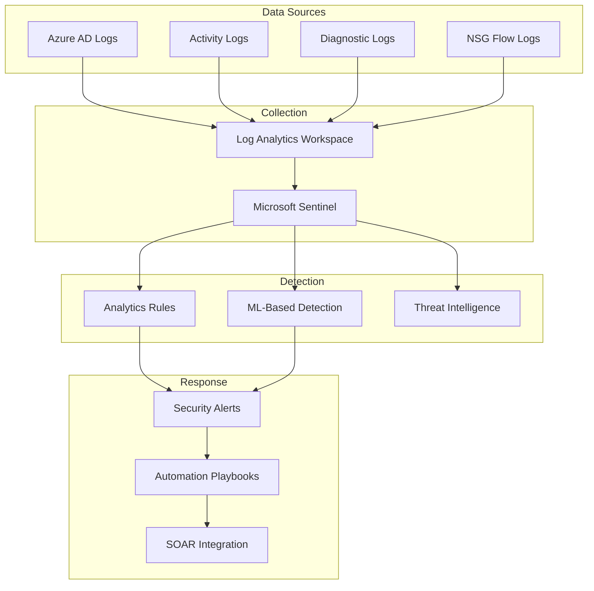

# Security Monitoring

> __[Home](../../../../README.md)__ | __[Solutions](../../../08-solutions/README.md)__ | __[Real-Time Analytics](../README.md)__ | __Security Monitoring__


Security monitoring and threat detection for real-time analytics infrastructure.

---

## Overview

Security monitoring provides:

- Real-time threat detection
- Compliance monitoring
- Access anomaly detection
- Security incident alerting

---

## Architecture



---

## Implementation

### Step 1: Enable Diagnostic Logging

```bash
# Enable diagnostics for Event Hubs
az monitor diagnostic-settings create \
    --name "security-diagnostics" \
    --resource "/subscriptions/.../eventhubs/eh-analytics" \
    --workspace "/subscriptions/.../workspaces/law-security" \
    --logs '[{"category": "ArchiveLogs", "enabled": true}, {"category": "OperationalLogs", "enabled": true}, {"category": "AutoScaleLogs", "enabled": true}]' \
    --metrics '[{"category": "AllMetrics", "enabled": true}]'

# Enable diagnostics for Stream Analytics
az monitor diagnostic-settings create \
    --name "security-diagnostics" \
    --resource "/subscriptions/.../streamingjobs/asa-analytics" \
    --workspace "/subscriptions/.../workspaces/law-security" \
    --logs '[{"category": "Execution", "enabled": true}, {"category": "Authoring", "enabled": true}]'

# Enable diagnostics for Data Lake
az monitor diagnostic-settings create \
    --name "security-diagnostics" \
    --resource "/subscriptions/.../storageAccounts/datalake" \
    --workspace "/subscriptions/.../workspaces/law-security" \
    --logs '[{"category": "StorageRead", "enabled": true}, {"category": "StorageWrite", "enabled": true}, {"category": "StorageDelete", "enabled": true}]'
```

### Step 2: Security Detection Rules

```kusto
// Suspicious data access pattern
StorageBlobLogs
| where TimeGenerated > ago(1h)
| where OperationName in ("GetBlob", "ListBlobs")
| summarize
    AccessCount = count(),
    UniqueFiles = dcount(Uri),
    DataTransferred = sum(ResponseBodySize)
    by CallerIpAddress, UserAgentHeader, bin(TimeGenerated, 5m)
| where AccessCount > 1000 or UniqueFiles > 500 or DataTransferred > 10737418240
| project
    TimeGenerated,
    CallerIpAddress,
    UserAgentHeader,
    AccessCount,
    UniqueFiles,
    DataTransferred,
    AlertType = "SuspiciousDataAccess"

// Failed authentication attempts
SigninLogs
| where TimeGenerated > ago(1h)
| where ResultType != 0
| summarize
    FailedAttempts = count(),
    DistinctUsers = dcount(UserPrincipalName),
    Applications = make_set(AppDisplayName)
    by IPAddress, bin(TimeGenerated, 10m)
| where FailedAttempts > 10
| project
    TimeGenerated,
    IPAddress,
    FailedAttempts,
    DistinctUsers,
    Applications,
    AlertType = "BruteForceAttempt"

// Privileged operation anomaly
AzureActivity
| where TimeGenerated > ago(24h)
| where CategoryValue == "Administrative"
| where OperationNameValue has_any ("delete", "write", "action")
| summarize
    Operations = count(),
    UniqueResources = dcount(ResourceId),
    OperationTypes = make_set(OperationNameValue)
    by Caller, bin(TimeGenerated, 1h)
| where Operations > 50
| project
    TimeGenerated,
    Caller,
    Operations,
    UniqueResources,
    OperationTypes,
    AlertType = "ExcessivePrivilegedOperations"
```

### Step 3: Sentinel Analytics Rules

```json
{
    "kind": "Scheduled",
    "properties": {
        "displayName": "Data Exfiltration Detection",
        "description": "Detects potential data exfiltration from storage accounts",
        "severity": "High",
        "enabled": true,
        "query": "StorageBlobLogs\n| where OperationName == 'GetBlob'\n| where CallerIpAddress !startswith '10.' and CallerIpAddress !startswith '192.168.'\n| summarize TotalBytes = sum(ResponseBodySize), FileCount = count() by CallerIpAddress, bin(TimeGenerated, 1h)\n| where TotalBytes > 5368709120",
        "queryFrequency": "PT1H",
        "queryPeriod": "PT1H",
        "triggerOperator": "GreaterThan",
        "triggerThreshold": 0,
        "tactics": ["Exfiltration"],
        "techniques": ["T1567"]
    }
}
```

### Step 4: Automated Response Playbooks

```json
{
    "definition": {
        "$schema": "https://schema.management.azure.com/providers/Microsoft.Logic/schemas/2016-06-01/workflowdefinition.json#",
        "triggers": {
            "Microsoft_Sentinel_alert": {
                "type": "ApiConnectionWebhook",
                "inputs": {
                    "body": {
                        "callback_url": "@{listCallbackUrl()}"
                    },
                    "host": {
                        "connection": {
                            "name": "@parameters('$connections')['azuresentinel']['connectionId']"
                        }
                    },
                    "path": "/subscribe"
                }
            }
        },
        "actions": {
            "Get_Alert_Details": {
                "type": "ApiConnection",
                "inputs": {
                    "host": {
                        "connection": {
                            "name": "@parameters('$connections')['azuresentinel']['connectionId']"
                        }
                    },
                    "method": "get",
                    "path": "/alerts/@{triggerBody()?['SystemAlertId']}"
                }
            },
            "Block_IP_If_Malicious": {
                "type": "If",
                "expression": {
                    "equals": ["@body('Get_Alert_Details')?['AlertType']", "BruteForceAttempt"]
                },
                "actions": {
                    "Add_IP_to_Block_List": {
                        "type": "ApiConnection",
                        "inputs": {
                            "method": "post",
                            "path": "/firewallRules",
                            "body": {
                                "ipAddress": "@body('Get_Alert_Details')?['IPAddress']",
                                "action": "Block"
                            }
                        }
                    }
                }
            },
            "Create_Incident": {
                "type": "ApiConnection",
                "inputs": {
                    "host": {
                        "connection": {
                            "name": "@parameters('$connections')['azuresentinel']['connectionId']"
                        }
                    },
                    "method": "put",
                    "path": "/incidents",
                    "body": {
                        "title": "@body('Get_Alert_Details')?['AlertDisplayName']",
                        "severity": "@body('Get_Alert_Details')?['Severity']",
                        "status": "New"
                    }
                }
            },
            "Notify_Security_Team": {
                "type": "ApiConnection",
                "inputs": {
                    "host": {
                        "connection": {
                            "name": "@parameters('$connections')['teams']['connectionId']"
                        }
                    },
                    "method": "post",
                    "path": "/v3/beta/teams/.../channels/.../messages",
                    "body": {
                        "body": {
                            "content": "Security Alert: @{body('Get_Alert_Details')?['AlertDisplayName']}"
                        }
                    }
                }
            }
        }
    }
}
```

### Step 5: Security Dashboard

```kusto
// Security overview dashboard
let timeRange = 24h;

// Alert summary
let alertSummary = SecurityAlert
| where TimeGenerated > ago(timeRange)
| summarize
    TotalAlerts = count(),
    HighSeverity = countif(AlertSeverity == "High"),
    MediumSeverity = countif(AlertSeverity == "Medium")
    by bin(TimeGenerated, 1h);

// Access anomalies
let accessAnomalies = StorageBlobLogs
| where TimeGenerated > ago(timeRange)
| summarize AccessCount = count() by CallerIpAddress, bin(TimeGenerated, 1h)
| where AccessCount > 100;

// Failed authentications
let authFailures = SigninLogs
| where TimeGenerated > ago(timeRange)
| where ResultType != 0
| summarize Failures = count() by bin(TimeGenerated, 1h);

// Combine for dashboard
alertSummary
| join kind=leftouter accessAnomalies on TimeGenerated
| join kind=leftouter authFailures on TimeGenerated
| project
    TimeGenerated,
    TotalAlerts,
    HighSeverity,
    MediumSeverity,
    AccessAnomalyCount = coalesce(AccessCount, 0),
    AuthFailures = coalesce(Failures, 0)
```

---

## Compliance Monitoring

```kusto
// Data access audit for compliance
StorageBlobLogs
| where TimeGenerated > ago(30d)
| where Uri contains "pii" or Uri contains "sensitive"
| summarize
    AccessCount = count(),
    UniqueUsers = dcount(RequesterObjectId),
    Operations = make_set(OperationName)
    by Uri, bin(TimeGenerated, 1d)
| project
    Date = TimeGenerated,
    DataAsset = Uri,
    AccessCount,
    UniqueUsers,
    Operations
| order by Date desc
```

---

## Related Documentation

- [Security Best Practices](../../../05-best-practices/cross-cutting-concerns/security/README.md)
- [Monitoring Setup](monitoring.md)
- [Incident Management](incident-management.md)

---

*Last Updated: January 2025*
