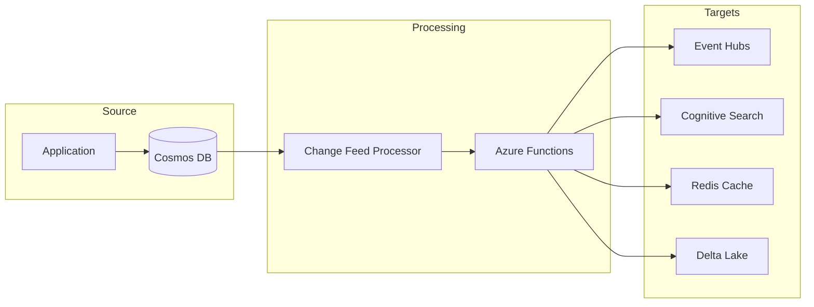

# Change Feed Processor Solution

> __[Home](../../../README.md)__ | __[Solutions](../../08-solutions/README.md)__ | __Change Feed Processor__


Event-driven data synchronization using Cosmos DB Change Feed.

---

## Overview

The Change Feed Processor solution enables:

- Real-time data synchronization across systems
- Event-driven microservices architecture
- Materialized view updates
- Cross-region data replication

---

## Architecture



---

## Implementation

### Step 1: Enable Change Feed

```python
# Cosmos DB automatically enables change feed
# No explicit configuration required

from azure.cosmos import CosmosClient

client = CosmosClient(endpoint, credential)
database = client.get_database_client("analytics")
container = database.get_container_client("orders")

# Change feed is available on all containers
```

### Step 2: Create Change Feed Processor

```python
from azure.cosmos import CosmosClient, PartitionKey
import asyncio

async def handle_changes(changes):
    """Process changes from Cosmos DB."""
    for change in changes:
        print(f"Change detected: {change['id']}")

        # Route based on operation type
        if change.get('_deleted'):
            await handle_delete(change)
        else:
            await handle_upsert(change)

async def handle_upsert(document):
    """Handle insert/update operations."""
    # Update search index
    await update_search_index(document)

    # Update cache
    await update_cache(document)

    # Publish event
    await publish_event("document.updated", document)

async def handle_delete(document):
    """Handle delete operations."""
    await remove_from_search(document['id'])
    await invalidate_cache(document['id'])
    await publish_event("document.deleted", document)

# Start processor
async def start_change_feed_processor():
    client = CosmosClient(endpoint, credential)
    database = client.get_database_client("analytics")

    # Source container
    source_container = database.get_container_client("orders")

    # Lease container for checkpointing
    lease_container = database.get_container_client("leases")

    # Create processor
    processor = source_container.get_change_feed_processor(
        lease_container=lease_container,
        lease_prefix="cfp",
        feed_handler=handle_changes,
        start_from_beginning=False
    )

    await processor.start()

    # Keep running
    while True:
        await asyncio.sleep(60)
```

### Step 3: Azure Functions Integration

```python
# function_app.py
import azure.functions as func
import json
from azure.search.documents import SearchClient
from azure.core.credentials import AzureKeyCredential

app = func.FunctionApp()

@app.cosmos_db_trigger(
    arg_name="documents",
    database_name="analytics",
    container_name="orders",
    connection="CosmosDBConnection",
    lease_container_name="leases",
    create_lease_container_if_not_exists=True
)
@app.event_hub_output(
    arg_name="eventHubOutput",
    event_hub_name="order-events",
    connection="EventHubConnection"
)
async def process_order_changes(
    documents: func.DocumentList,
    eventHubOutput: func.Out[list[str]]
):
    """Process order changes and fan out to multiple destinations."""

    events = []
    search_actions = []

    for doc in documents:
        # Create event
        event = {
            "id": doc["id"],
            "type": "OrderUpdated",
            "data": doc.to_dict(),
            "timestamp": doc.get("_ts")
        }
        events.append(json.dumps(event))

        # Prepare search update
        search_actions.append({
            "@search.action": "mergeOrUpload",
            "id": doc["id"],
            "customer_id": doc.get("customer_id"),
            "order_date": doc.get("order_date"),
            "total_amount": doc.get("total_amount"),
            "status": doc.get("status")
        })

    # Send to Event Hub
    eventHubOutput.set(events)

    # Update Search Index
    search_client = SearchClient(
        endpoint=os.environ["SEARCH_ENDPOINT"],
        index_name="orders",
        credential=AzureKeyCredential(os.environ["SEARCH_KEY"])
    )
    search_client.upload_documents(search_actions)
```

### Step 4: Delta Lake Sync

```python
# Databricks notebook for Delta Lake sync
from pyspark.sql.functions import *
from delta.tables import DeltaTable

def sync_cosmos_to_delta():
    """Sync Cosmos DB changes to Delta Lake."""

    # Read from Cosmos DB change feed
    changes = spark.readStream \
        .format("cosmos.oltp.changeFeed") \
        .option("spark.cosmos.accountEndpoint", cosmos_endpoint) \
        .option("spark.cosmos.accountKey", cosmos_key) \
        .option("spark.cosmos.database", "analytics") \
        .option("spark.cosmos.container", "orders") \
        .option("spark.cosmos.changeFeed.startFrom", "Beginning") \
        .option("spark.cosmos.changeFeed.mode", "Incremental") \
        .load()

    # Process and write to Delta
    def upsert_to_delta(batch_df, batch_id):
        if batch_df.count() == 0:
            return

        target = DeltaTable.forPath(spark, "/delta/orders")

        target.alias("target").merge(
            batch_df.alias("source"),
            "target.id = source.id"
        ).whenMatchedUpdateAll() \
         .whenNotMatchedInsertAll() \
         .execute()

    query = changes.writeStream \
        .foreachBatch(upsert_to_delta) \
        .option("checkpointLocation", "/checkpoints/cosmos_sync") \
        .trigger(processingTime="1 minute") \
        .start()

    return query
```

---

## Deployment

### ARM Template

```json
{
    "$schema": "https://schema.management.azure.com/schemas/2019-04-01/deploymentTemplate.json#",
    "resources": [
        {
            "type": "Microsoft.DocumentDB/databaseAccounts",
            "name": "[parameters('cosmosAccountName')]",
            "properties": {
                "databaseAccountOfferType": "Standard",
                "enableMultipleWriteLocations": false,
                "consistencyPolicy": {
                    "defaultConsistencyLevel": "Session"
                }
            }
        },
        {
            "type": "Microsoft.Web/sites",
            "name": "[parameters('functionAppName')]",
            "kind": "functionapp",
            "properties": {
                "siteConfig": {
                    "appSettings": [
                        {
                            "name": "CosmosDBConnection",
                            "value": "[listConnectionStrings(...)]"
                        }
                    ]
                }
            }
        }
    ]
}
```

---

## Monitoring

```kusto
// Monitor change feed lag
CosmosDBRequests
| where OperationType == "ReadFeed"
| summarize
    AvgLatencyMs = avg(DurationMs),
    P99LatencyMs = percentile(DurationMs, 99),
    RequestCount = count()
    by bin(TimeGenerated, 5m)
| order by TimeGenerated desc
```

---

## Related Documentation

- [Cosmos DB Integration](../../04-implementation-guides/integration-scenarios/README.md)
- [Event-Driven Patterns](../../03-architecture-patterns/integration-patterns/README.md)

---

*Last Updated: January 2025*
