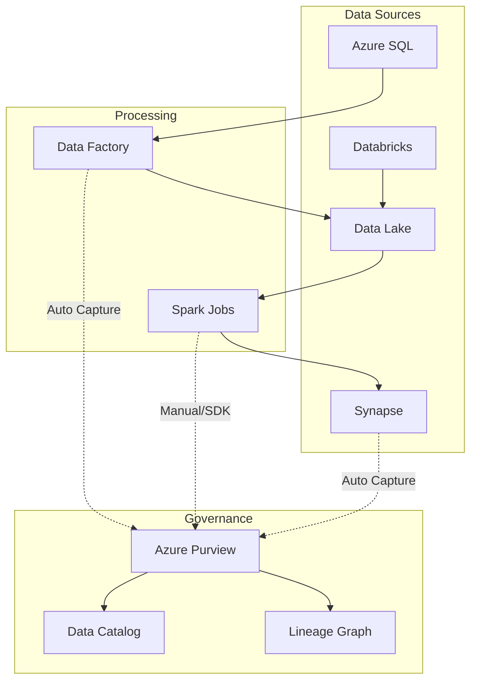

# Data Lineage Solution

> __[Home](../../../README.md)__ | __[Solutions](../../08-solutions/README.md)__ | __Data Lineage__


Enterprise data lineage tracking with Azure Purview.

---

## Overview

The Data Lineage solution provides:

- End-to-end data flow visibility
- Impact analysis for changes
- Regulatory compliance documentation
- Data quality traceability

---

## Architecture



---

## Implementation

### Step 1: Enable Automatic Lineage Capture

```bash
# Connect Synapse to Purview
az synapse workspace update \
    --name synapse-workspace \
    --resource-group rg-analytics \
    --purview-configuration purviewAccountName=purview-account

# Connect Data Factory to Purview
az datafactory update \
    --factory-name adf-analytics \
    --resource-group rg-analytics \
    --purview-configuration purviewAccountName=purview-account
```

### Step 2: Custom Lineage with Purview SDK

```python
from azure.purview.catalog import PurviewCatalogClient
from azure.identity import DefaultAzureCredential
import uuid

def create_custom_lineage(
    source_assets: list,
    target_asset: dict,
    process_name: str
):
    """Create custom lineage relationship in Purview."""

    credential = DefaultAzureCredential()
    client = PurviewCatalogClient(
        endpoint="https://purview-account.purview.azure.com",
        credential=credential
    )

    # Create process entity
    process_guid = str(uuid.uuid4())
    process_entity = {
        "typeName": "Process",
        "attributes": {
            "name": process_name,
            "qualifiedName": f"process://{process_name}",
            "description": f"Data transformation: {process_name}"
        },
        "guid": process_guid
    }

    # Create lineage relationships
    entities = [process_entity]
    relationships = []

    for source in source_assets:
        relationships.append({
            "typeName": "process_dataset_inputs",
            "end1": {"guid": process_guid},
            "end2": {"guid": source["guid"]}
        })

    relationships.append({
        "typeName": "process_dataset_outputs",
        "end1": {"guid": process_guid},
        "end2": {"guid": target_asset["guid"]}
    })

    # Submit to Purview
    client.entity.create_or_update({
        "entities": entities,
        "relationships": relationships
    })

    return process_guid

# Usage
create_custom_lineage(
    source_assets=[
        {"guid": "source-guid-1", "name": "raw_orders"},
        {"guid": "source-guid-2", "name": "customer_master"}
    ],
    target_asset={"guid": "target-guid", "name": "enriched_orders"},
    process_name="order_enrichment_job"
)
```

### Step 3: Spark Lineage Integration

```python
# Databricks notebook with OpenLineage
from openlineage.client import OpenLineageClient
from openlineage.client.run import Run, RunEvent, RunState, Job
from openlineage.client.facet import DatasetFacet

client = OpenLineageClient(url="https://purview-account.purview.azure.com/openlineage")

def track_spark_job_lineage(job_name: str, inputs: list, outputs: list):
    """Track Spark job lineage with OpenLineage."""

    job = Job(namespace="databricks", name=job_name)
    run = Run(str(uuid.uuid4()))

    # Start event
    client.emit(RunEvent(
        eventType=RunState.START,
        eventTime=datetime.utcnow().isoformat(),
        run=run,
        job=job,
        inputs=[
            Dataset(namespace="adls", name=inp) for inp in inputs
        ],
        outputs=[
            Dataset(namespace="adls", name=out) for out in outputs
        ]
    ))

    try:
        # Your Spark transformation
        result = execute_transformation()

        # Complete event
        client.emit(RunEvent(
            eventType=RunState.COMPLETE,
            eventTime=datetime.utcnow().isoformat(),
            run=run,
            job=job
        ))

        return result

    except Exception as e:
        # Fail event
        client.emit(RunEvent(
            eventType=RunState.FAIL,
            eventTime=datetime.utcnow().isoformat(),
            run=run,
            job=job
        ))
        raise

# Usage
track_spark_job_lineage(
    job_name="daily_aggregation",
    inputs=["bronze/orders", "bronze/customers"],
    outputs=["silver/order_summary"]
)
```

### Step 4: Query Lineage Graph

```python
def get_upstream_lineage(asset_qualified_name: str, depth: int = 3):
    """Get upstream lineage for an asset."""

    lineage = client.lineage.get_lineage_by_unique_attribute(
        typeName="azure_datalake_gen2_path",
        qualifiedName=asset_qualified_name,
        direction="INPUT",
        depth=depth
    )

    return lineage

def get_downstream_lineage(asset_qualified_name: str, depth: int = 3):
    """Get downstream lineage for an asset."""

    lineage = client.lineage.get_lineage_by_unique_attribute(
        typeName="azure_datalake_gen2_path",
        qualifiedName=asset_qualified_name,
        direction="OUTPUT",
        depth=depth
    )

    return lineage

def impact_analysis(asset_qualified_name: str):
    """Perform impact analysis for proposed changes."""

    downstream = get_downstream_lineage(asset_qualified_name, depth=5)

    impacted_assets = []
    for guid, entity in downstream.get("guidEntityMap", {}).items():
        impacted_assets.append({
            "name": entity["attributes"]["name"],
            "type": entity["typeName"],
            "owner": entity["attributes"].get("owner"),
            "classification": entity.get("classifications", [])
        })

    return {
        "source_asset": asset_qualified_name,
        "impacted_count": len(impacted_assets),
        "impacted_assets": impacted_assets
    }
```

### Step 5: Lineage Visualization Dashboard

```sql
-- Synapse SQL view for lineage metrics
CREATE VIEW governance.lineage_metrics AS
SELECT
    asset_type,
    COUNT(*) AS asset_count,
    SUM(CASE WHEN has_upstream THEN 1 ELSE 0 END) AS with_upstream,
    SUM(CASE WHEN has_downstream THEN 1 ELSE 0 END) AS with_downstream,
    AVG(upstream_depth) AS avg_upstream_depth,
    AVG(downstream_depth) AS avg_downstream_depth
FROM purview_lineage_summary
GROUP BY asset_type;

-- Data flow complexity analysis
CREATE VIEW governance.data_flow_complexity AS
SELECT
    source_system,
    target_system,
    COUNT(DISTINCT process_name) AS transformation_count,
    COUNT(DISTINCT intermediate_asset) AS intermediate_steps,
    MAX(total_depth) AS max_depth
FROM lineage_paths
GROUP BY source_system, target_system;
```

---

## Governance Reports

```python
def generate_lineage_report(report_type: str = "compliance"):
    """Generate lineage reports for governance."""

    if report_type == "compliance":
        # Find all PII data paths
        pii_assets = search_assets_by_classification("MICROSOFT.PERSONAL.*")

        report = {
            "report_type": "PII Data Lineage",
            "generated_at": datetime.utcnow().isoformat(),
            "pii_assets": []
        }

        for asset in pii_assets:
            lineage = get_downstream_lineage(asset["qualifiedName"])
            report["pii_assets"].append({
                "asset": asset["name"],
                "classification": asset["classifications"],
                "downstream_count": len(lineage.get("guidEntityMap", {})),
                "consumers": extract_consumers(lineage)
            })

        return report

    elif report_type == "orphan":
        # Find assets without lineage
        return find_orphan_assets()
```

---

## Related Documentation

- [Purview Integration](../../04-implementation-guides/integration-scenarios/purview-synapse.md)
- [Data Governance Best Practices](../../05-best-practices/cross-cutting-concerns/governance/data-governance.md)

---

*Last Updated: January 2025*
