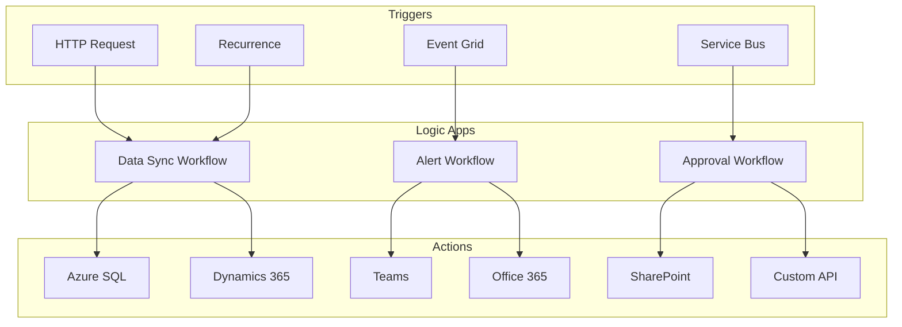

# Logic Apps Integration Solution

> __[Home](../../../README.md)__ | __[Solutions](../../08-solutions/README.md)__ | __Logic Apps Integration__


Workflow automation and system integration using Azure Logic Apps.

---

## Overview

The Logic Apps Integration solution provides:

- No-code/low-code workflow automation
- 400+ built-in connectors
- Enterprise integration patterns
- Hybrid connectivity with on-premises systems

---

## Architecture



---

## Implementation

### Step 1: Data Pipeline Orchestration

```json
{
    "definition": {
        "$schema": "https://schema.management.azure.com/providers/Microsoft.Logic/schemas/2016-06-01/workflowdefinition.json#",
        "triggers": {
            "Recurrence": {
                "type": "Recurrence",
                "recurrence": {
                    "frequency": "Day",
                    "interval": 1,
                    "schedule": {
                        "hours": ["6"],
                        "minutes": [0]
                    },
                    "timeZone": "UTC"
                }
            }
        },
        "actions": {
            "Get_Source_Data": {
                "type": "ApiConnection",
                "inputs": {
                    "host": {
                        "connection": {
                            "name": "@parameters('$connections')['sql']['connectionId']"
                        }
                    },
                    "method": "get",
                    "path": "/datasets/default/tables/@{encodeURIComponent('[dbo].[SourceData]')}/items",
                    "queries": {
                        "$filter": "ModifiedDate gt '@{addDays(utcNow(), -1)}'"
                    }
                }
            },
            "For_Each_Record": {
                "type": "Foreach",
                "foreach": "@body('Get_Source_Data')?['value']",
                "actions": {
                    "Transform_Data": {
                        "type": "Compose",
                        "inputs": {
                            "id": "@items('For_Each_Record')?['Id']",
                            "name": "@items('For_Each_Record')?['Name']",
                            "value": "@mul(items('For_Each_Record')?['Value'], 1.1)",
                            "processedAt": "@utcNow()"
                        }
                    },
                    "Insert_To_Target": {
                        "type": "ApiConnection",
                        "runAfter": {
                            "Transform_Data": ["Succeeded"]
                        },
                        "inputs": {
                            "host": {
                                "connection": {
                                    "name": "@parameters('$connections')['cosmosdb']['connectionId']"
                                }
                            },
                            "method": "post",
                            "path": "/dbs/analytics/colls/processed/docs",
                            "body": "@outputs('Transform_Data')"
                        }
                    }
                },
                "runAfter": {
                    "Get_Source_Data": ["Succeeded"]
                }
            },
            "Send_Completion_Email": {
                "type": "ApiConnection",
                "runAfter": {
                    "For_Each_Record": ["Succeeded"]
                },
                "inputs": {
                    "host": {
                        "connection": {
                            "name": "@parameters('$connections')['office365']['connectionId']"
                        }
                    },
                    "method": "post",
                    "path": "/v2/Mail",
                    "body": {
                        "To": "data-team@company.com",
                        "Subject": "Daily Data Sync Completed",
                        "Body": "Processed @{length(body('Get_Source_Data')?['value'])} records"
                    }
                }
            }
        }
    }
}
```

### Step 2: Event-Driven Alert Workflow

```json
{
    "definition": {
        "triggers": {
            "When_Event_Grid_event_occurs": {
                "type": "ApiConnectionWebhook",
                "inputs": {
                    "host": {
                        "connection": {
                            "name": "@parameters('$connections')['azureeventgrid']['connectionId']"
                        }
                    },
                    "body": {
                        "properties": {
                            "topic": "/subscriptions/.../resourceGroups/.../providers/Microsoft.Storage/storageAccounts/datalake",
                            "filter": {
                                "includedEventTypes": ["Microsoft.Storage.BlobCreated"]
                            }
                        }
                    }
                }
            }
        },
        "actions": {
            "Parse_Event": {
                "type": "ParseJson",
                "inputs": {
                    "content": "@triggerBody()",
                    "schema": {
                        "type": "object",
                        "properties": {
                            "subject": {"type": "string"},
                            "data": {
                                "type": "object",
                                "properties": {
                                    "url": {"type": "string"},
                                    "contentLength": {"type": "integer"}
                                }
                            }
                        }
                    }
                }
            },
            "Condition_Large_File": {
                "type": "If",
                "expression": {
                    "greater": [
                        "@body('Parse_Event')?['data']?['contentLength']",
                        1073741824
                    ]
                },
                "actions": {
                    "Post_to_Teams": {
                        "type": "ApiConnection",
                        "inputs": {
                            "host": {
                                "connection": {
                                    "name": "@parameters('$connections')['teams']['connectionId']"
                                }
                            },
                            "method": "post",
                            "path": "/v3/beta/teams/.../channels/.../messages",
                            "body": {
                                "body": {
                                    "content": "Large file uploaded (>1GB): @{body('Parse_Event')?['subject']}"
                                }
                            }
                        }
                    }
                }
            }
        }
    }
}
```

### Step 3: Approval Workflow

```json
{
    "definition": {
        "triggers": {
            "When_HTTP_request_received": {
                "type": "Request",
                "kind": "Http",
                "inputs": {
                    "schema": {
                        "type": "object",
                        "properties": {
                            "requestId": {"type": "string"},
                            "requestType": {"type": "string"},
                            "requestedBy": {"type": "string"},
                            "details": {"type": "string"}
                        }
                    }
                }
            }
        },
        "actions": {
            "Send_Approval_Email": {
                "type": "ApiConnectionWebhook",
                "inputs": {
                    "host": {
                        "connection": {
                            "name": "@parameters('$connections')['office365']['connectionId']"
                        }
                    },
                    "body": {
                        "NotificationUrl": "@{listCallbackUrl()}",
                        "Message": {
                            "To": "manager@company.com",
                            "Subject": "Approval Required: @{triggerBody()?['requestType']}",
                            "Options": "Approve, Reject",
                            "Body": "Request from: @{triggerBody()?['requestedBy']}\n\nDetails: @{triggerBody()?['details']}"
                        }
                    },
                    "path": "/approvalmail/$subscriptions"
                }
            },
            "Switch_on_Approval": {
                "type": "Switch",
                "expression": "@body('Send_Approval_Email')?['SelectedOption']",
                "cases": {
                    "Approved": {
                        "case": "Approve",
                        "actions": {
                            "Execute_Request": {
                                "type": "Http",
                                "inputs": {
                                    "method": "POST",
                                    "uri": "https://api.company.com/execute",
                                    "body": "@triggerBody()"
                                }
                            },
                            "Notify_Requester_Approved": {
                                "type": "ApiConnection",
                                "inputs": {
                                    "body": {
                                        "To": "@triggerBody()?['requestedBy']",
                                        "Subject": "Request Approved",
                                        "Body": "Your request has been approved."
                                    }
                                }
                            }
                        }
                    },
                    "Rejected": {
                        "case": "Reject",
                        "actions": {
                            "Notify_Requester_Rejected": {
                                "type": "ApiConnection",
                                "inputs": {
                                    "body": {
                                        "To": "@triggerBody()?['requestedBy']",
                                        "Subject": "Request Rejected",
                                        "Body": "Your request has been rejected."
                                    }
                                }
                            }
                        }
                    }
                }
            }
        }
    }
}
```

### Step 4: Data Factory Integration

```json
{
    "actions": {
        "Run_Data_Factory_Pipeline": {
            "type": "ApiConnection",
            "inputs": {
                "host": {
                    "connection": {
                        "name": "@parameters('$connections')['azuredatafactory']['connectionId']"
                    }
                },
                "method": "post",
                "path": "/subscriptions/.../resourceGroups/.../providers/Microsoft.DataFactory/factories/adf-analytics/pipelines/daily-etl/createRun",
                "body": {
                    "processDate": "@formatDateTime(utcNow(), 'yyyy-MM-dd')"
                }
            }
        },
        "Wait_For_Pipeline": {
            "type": "Until",
            "expression": "@or(equals(body('Get_Pipeline_Status')?['status'], 'Succeeded'), equals(body('Get_Pipeline_Status')?['status'], 'Failed'))",
            "limit": {
                "count": 60,
                "timeout": "PT2H"
            },
            "actions": {
                "Get_Pipeline_Status": {
                    "type": "ApiConnection",
                    "inputs": {
                        "method": "get",
                        "path": "/subscriptions/.../pipelineruns/@{body('Run_Data_Factory_Pipeline')?['runId']}"
                    }
                },
                "Delay": {
                    "type": "Wait",
                    "inputs": {
                        "interval": {
                            "count": 2,
                            "unit": "Minute"
                        }
                    }
                }
            }
        }
    }
}
```

---

## Common Patterns

### Error Handling

```json
{
    "Scope_Try": {
        "type": "Scope",
        "actions": {
            "Risky_Operation": {}
        }
    },
    "Scope_Catch": {
        "type": "Scope",
        "runAfter": {
            "Scope_Try": ["Failed", "TimedOut"]
        },
        "actions": {
            "Log_Error": {},
            "Send_Alert": {}
        }
    }
}
```

### Retry Policy

```json
{
    "retryPolicy": {
        "type": "exponential",
        "count": 4,
        "interval": "PT10S",
        "minimumInterval": "PT5S",
        "maximumInterval": "PT1H"
    }
}
```

---

## Related Documentation

- [EventGrid + Logic Apps](../../04-implementation-guides/integration-scenarios/eventgrid-logicapps.md)
- [Integration Patterns](../../03-architecture-patterns/integration-patterns/README.md)

---

*Last Updated: January 2025*
