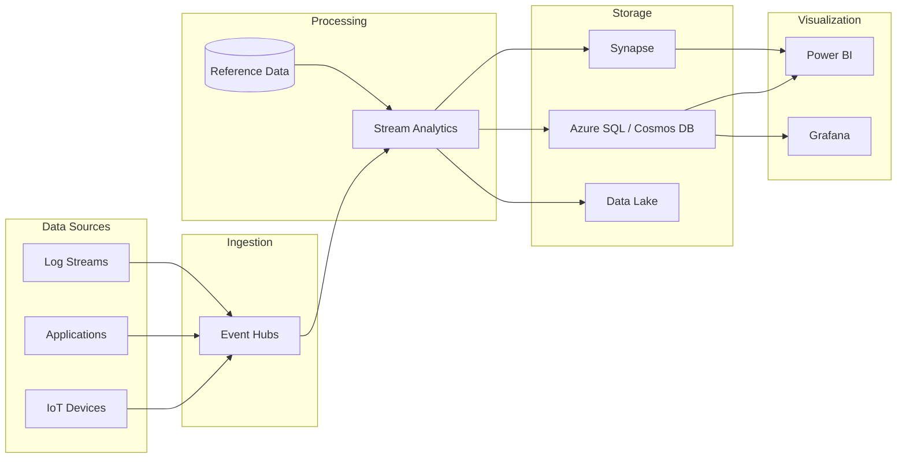

# Real-Time Dashboards Solution

> __[Home](../../../README.md)__ | __[Solutions](../../08-solutions/README.md)__ | __Real-Time Dashboards__


Live operational dashboards with sub-second refresh using streaming data.

---

## Overview

The Real-Time Dashboards solution enables:

- Live metrics with sub-second latency
- Automatic data refresh without manual intervention
- Alert integration for threshold breaches
- Historical trend analysis alongside real-time data

---

## Architecture



---

## Implementation

### Step 1: Stream Analytics Job

```sql
-- Real-time aggregation for dashboard
WITH AggregatedMetrics AS (
    SELECT
        region,
        device_type,
        System.Timestamp() AS window_end,
        COUNT(*) AS event_count,
        AVG(value) AS avg_value,
        MAX(value) AS max_value,
        MIN(value) AS min_value,
        PERCENTILE_CONT(0.95) WITHIN GROUP (ORDER BY value) OVER (
            PARTITION BY region, device_type
        ) AS p95_value
    FROM [event-input]
    GROUP BY
        region,
        device_type,
        TumblingWindow(second, 10)
)

-- Output to Power BI streaming dataset
SELECT
    region,
    device_type,
    window_end,
    event_count,
    avg_value,
    max_value,
    p95_value
INTO [powerbi-output]
FROM AggregatedMetrics

-- Output to SQL for historical trends
SELECT
    region,
    device_type,
    window_end,
    event_count,
    avg_value,
    max_value,
    min_value,
    p95_value
INTO [sql-output]
FROM AggregatedMetrics

-- Alert output for threshold breaches
SELECT
    region,
    device_type,
    window_end,
    max_value,
    'HIGH_VALUE_ALERT' AS alert_type
INTO [alert-output]
FROM AggregatedMetrics
WHERE max_value > 100
```

### Step 2: Power BI Streaming Dataset

```python
import requests
import json
from datetime import datetime

POWERBI_PUSH_URL = "https://api.powerbi.com/beta/..."

def push_to_powerbi(metrics: list):
    """Push real-time metrics to Power BI streaming dataset."""

    rows = []
    for metric in metrics:
        rows.append({
            "timestamp": datetime.utcnow().isoformat(),
            "region": metric["region"],
            "device_type": metric["device_type"],
            "event_count": metric["event_count"],
            "avg_value": metric["avg_value"],
            "max_value": metric["max_value"],
            "p95_value": metric["p95_value"]
        })

    response = requests.post(
        POWERBI_PUSH_URL,
        headers={"Content-Type": "application/json"},
        data=json.dumps(rows)
    )

    return response.status_code == 200

# Create streaming dataset via API
def create_streaming_dataset(workspace_id: str, dataset_name: str):
    """Create Power BI streaming dataset."""

    dataset_definition = {
        "name": dataset_name,
        "defaultMode": "PushStreaming",
        "tables": [{
            "name": "RealTimeMetrics",
            "columns": [
                {"name": "timestamp", "dataType": "DateTime"},
                {"name": "region", "dataType": "String"},
                {"name": "device_type", "dataType": "String"},
                {"name": "event_count", "dataType": "Int64"},
                {"name": "avg_value", "dataType": "Double"},
                {"name": "max_value", "dataType": "Double"},
                {"name": "p95_value", "dataType": "Double"}
            ]
        }]
    }

    # Use Power BI REST API to create dataset
    # Returns push URL for streaming
```

### Step 3: Azure SQL for Hot Storage

```sql
-- Create optimized table for real-time queries
CREATE TABLE dbo.RealTimeMetrics (
    id BIGINT IDENTITY(1,1) PRIMARY KEY,
    region NVARCHAR(50) NOT NULL,
    device_type NVARCHAR(50) NOT NULL,
    window_end DATETIME2 NOT NULL,
    event_count INT NOT NULL,
    avg_value DECIMAL(18,4),
    max_value DECIMAL(18,4),
    min_value DECIMAL(18,4),
    p95_value DECIMAL(18,4),
    INDEX IX_RealTimeMetrics_WindowEnd (window_end DESC),
    INDEX IX_RealTimeMetrics_Region_Device (region, device_type, window_end DESC)
) WITH (
    DATA_COMPRESSION = PAGE
);

-- Create view for latest metrics
CREATE VIEW dbo.vw_LatestMetrics AS
SELECT
    region,
    device_type,
    window_end,
    event_count,
    avg_value,
    max_value,
    p95_value
FROM (
    SELECT
        *,
        ROW_NUMBER() OVER (PARTITION BY region, device_type ORDER BY window_end DESC) AS rn
    FROM dbo.RealTimeMetrics
    WHERE window_end > DATEADD(minute, -5, GETUTCDATE())
) t
WHERE rn = 1;

-- Create materialized view for aggregates (refresh every minute)
CREATE VIEW dbo.vw_HourlyTrends AS
SELECT
    region,
    device_type,
    DATEADD(hour, DATEDIFF(hour, 0, window_end), 0) AS hour,
    SUM(event_count) AS total_events,
    AVG(avg_value) AS avg_value,
    MAX(max_value) AS max_value
FROM dbo.RealTimeMetrics
WHERE window_end > DATEADD(day, -7, GETUTCDATE())
GROUP BY
    region,
    device_type,
    DATEADD(hour, DATEDIFF(hour, 0, window_end), 0);
```

### Step 4: Grafana Integration

```yaml
# Grafana dashboard configuration
apiVersion: 1
datasources:
  - name: AzureSQL
    type: mssql
    url: server.database.windows.net
    database: analytics
    user: grafana_reader
    jsonData:
      maxOpenConns: 10
      maxIdleConns: 5
      connMaxLifetime: 14400

panels:
  - title: "Real-Time Event Rate"
    type: graph
    datasource: AzureSQL
    targets:
      - rawSql: |
          SELECT
            window_end AS time,
            region,
            event_count
          FROM dbo.RealTimeMetrics
          WHERE window_end > DATEADD(minute, -30, GETUTCDATE())
          ORDER BY window_end
        format: time_series

  - title: "Current P95 by Region"
    type: gauge
    datasource: AzureSQL
    targets:
      - rawSql: |
          SELECT region, p95_value
          FROM dbo.vw_LatestMetrics
        format: table
```

### Step 5: Alert Configuration

```python
# Azure Function for alerting
import azure.functions as func
from azure.communication.email import EmailClient

app = func.FunctionApp()

@app.event_hub_message_trigger(
    arg_name="alerts",
    event_hub_name="alerts",
    connection="EventHubConnection"
)
async def process_alerts(alerts: list[func.EventHubEvent]):
    """Process real-time alerts from Stream Analytics."""

    email_client = EmailClient.from_connection_string(
        os.environ["COMMUNICATION_CONNECTION"]
    )

    for alert in alerts:
        data = json.loads(alert.get_body().decode())

        if data["alert_type"] == "HIGH_VALUE_ALERT":
            message = {
                "senderAddress": "alerts@company.com",
                "recipients": {
                    "to": [{"address": "ops-team@company.com"}]
                },
                "content": {
                    "subject": f"High Value Alert - {data['region']}",
                    "plainText": f"""
                    Alert: High value detected
                    Region: {data['region']}
                    Device Type: {data['device_type']}
                    Max Value: {data['max_value']}
                    Time: {data['window_end']}
                    """
                }
            }

            email_client.begin_send(message)
```

---

## Dashboard Design Best Practices

| Metric Type | Refresh Rate | Storage | Visualization |
|-------------|--------------|---------|---------------|
| Real-time counters | 1-10 seconds | Streaming dataset | Card/Gauge |
| Trend lines | 30-60 seconds | SQL/Cosmos | Line chart |
| Aggregations | 1-5 minutes | SQL | Bar/Column |
| Historical | On-demand | Data Lake | Table/Report |

---

## Related Documentation

- [EventHub + Stream Analytics](../../04-implementation-guides/integration-scenarios/eventhub-stream-analytics.md)
- [Streaming Architectures](../../03-architecture-patterns/streaming-architectures/README.md)

---

*Last Updated: January 2025*
