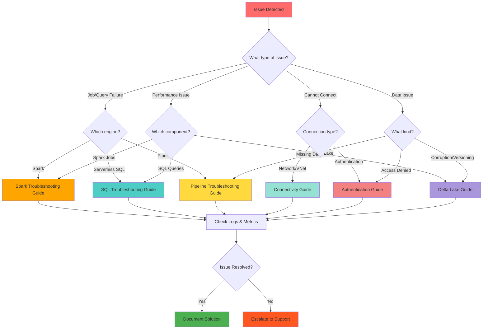

# 🔧 Troubleshooting Azure Synapse Analytics

[🏠 Home](../../README.md) > 🔧 Troubleshooting

> 🗺️ __Quick Navigation__
> Use the sidebar navigation to quickly find specific troubleshooting guides, or refer to the common solutions below.
>
> ⚠️ __Problem Resolution Hub__
> This section provides comprehensive troubleshooting guides for common issues encountered when working with Azure Synapse Analytics. Use these guides to diagnose and resolve problems across different components of your Synapse workspace.

---

## 🎯 Troubleshooting Areas

> 📊 __Component-Specific Guides__  
> Azure Synapse Analytics is a complex ecosystem with multiple integrated components. Our troubleshooting guides are organized by component area to help you quickly find relevant solutions:

### 🔍 Issue Category Overview

| Issue Category | Description | Common Problems | Resolution Guide |
|----------------|-------------|-----------------|------------------|
| 🔥 __Spark Pool Issues__ | Diagnose and resolve common Apache Spark errors | Memory errors, job failures, performance | [](spark-troubleshooting.md) |
| 📊 __Serverless SQL Issues__ | Address performance and query problems with Serverless SQL pools | Query timeouts, cost optimization, errors | [](serverless-sql-troubleshooting.md) |
| 🌐 __Connectivity Issues__ | Solve network-related problems and connection failures | VNet, firewall, private endpoints | [](connectivity-troubleshooting.md) |
| 🔐 __Authentication Issues__ | Fix identity and access management problems | AAD, permissions, RBAC | [](authentication-troubleshooting.md) |
| 🏞️ __Delta Lake Issues__ | Troubleshoot Delta Lake operations and performance | Table corruption, optimization, versioning | [](delta-lake-troubleshooting.md) |
| 📊 __Pipeline Issues__ | Debug pipeline execution errors and performance bottlenecks | ETL failures, scheduling, monitoring | [](pipeline-troubleshooting.md) |

---

## 🔍 General Troubleshooting Process

> 🎠 __Systematic Approach__
> When troubleshooting issues in Azure Synapse Analytics, follow this general process:

### Troubleshooting Decision Tree

Use this decision tree to quickly identify the appropriate troubleshooting guide:



### 📋 Troubleshooting Workflow

| Step | Action | Outcome | Next Step |
|------|--------|---------|----------|
| 1️⃣ | __🔍 Identify Issue__ | Problem definition | Collect diagnostics |
| 2️⃣ | __📊 Collect Diagnostic Information__ | Logs, metrics, error messages | Check documentation |
| 3️⃣ | __📚 Check Documentation & Known Issues__ | Known solutions | Apply or investigate further |
| 4️⃣ | __🔍 Check Logs & Metrics__ | System behavior analysis | Isolate components |
| 5️⃣ | __⚙️ Isolate Problem Component__ | Root cause identification | Apply specific steps |
| 6️⃣ | __🔧 Apply Specific Troubleshooting Steps__ | Component-specific resolution | Test solution |
| 7️⃣ | __📝 Document Solution__ | Knowledge capture | Issue resolved |

> ℹ️ __Support Escalation__  
> If issue persists after following component-specific guides, contact Azure Support with collected diagnostics.

---

## 📊 Collecting Diagnostic Information

> 🗺️ __Essential Information to Gather__  
> Before diving into specific troubleshooting steps, gather the following information:

### 📋 Diagnostic Checklist

| Information Type | Details to Collect | Why It's Important |
|------------------|-------------------|--------------------|
| ⚠️ __Error Messages__ | Capture the full text of any error messages | Identifies specific failure points |
| ⏰ __Timestamp__ | Note when the issue occurred (include timezone) | Correlates with logs and system events |
| 🏗️ __Resource Details__ | Workspace name, pool configuration, operation being performed | Provides context for the issue |
| 🌐 __Environment Information__ | Network configuration, firewall settings, resource constraints | Identifies environmental factors |
| 🔄 __Recent Changes__ | Any recent changes to configurations, code, or infrastructure | Potential root cause identification |

> ⚠️ __Timezone Alert__  
> When reviewing logs, pay attention to the timezone of log entries. Azure logs may use UTC time rather than your local time zone.

---

## 📊 Using Azure Monitor for Troubleshooting

> 📊 __Monitoring Tools__  
> Azure Monitor provides powerful tools for diagnosing issues in Azure Synapse Analytics:

### 🔍 Monitoring Resources

| Tool | Purpose | Key Features | Access Link |
|------|---------|--------------|-------------|
| 📊 __Logging and Monitoring__ | Comprehensive guide for monitoring your Synapse workspace | Logs, metrics, workbooks | [](../monitoring/logging-monitoring-guide.md) |
| 🔔 __Alerts Configuration__ | Set up proactive alerts and diagnostic settings | Real-time notifications, thresholds | [](../monitoring/logging-monitoring-guide.md#configuring-diagnostic-settings) |

### 📋 Sample Kusto Queries

> 🔍 __Pipeline Failure Investigation__  
> Sample query for failed pipeline runs:

```kusto
SynapseIntegrationPipelineRuns
| where Status == "Failed"
| where TimeGenerated > ago(24h)
| project TimeGenerated, PipelineName, RunId, ErrorMessage
| order by TimeGenerated desc
```

---

## 🔗 Related Resources

### 📚 External Resources

| Resource | Type | Description | Quick Access |
|----------|------|-------------|--------------|
| 📚 __Official Troubleshooting Guide__ | Microsoft Docs | Comprehensive official troubleshooting documentation | [](https://docs.microsoft.com/en-us/azure/synapse-analytics/troubleshoot/troubleshoot-synapse-analytics) |
| 💬 __Azure Synapse Community Forum__ | Community Support | Community discussions and solutions | [](https://techcommunity.microsoft.com/t5/azure-synapse-analytics/bd-p/AzureSynapseAnalytics) |
| ❓ __Stack Overflow__ | Q&A Platform | Developer community questions and answers | [](https://stackoverflow.com/questions/tagged/azure-synapse) |
| 🔔 __Custom Alerts Setup__ | Monitoring Guide | Creating custom alerts for proactive monitoring | [](../monitoring/logging-monitoring-guide.md#setting-up-alerts) |

---

> 🚀 __Quick Resolution__  
> Start with the component-specific guide that matches your issue. Each guide provides step-by-step resolution procedures with common solutions and escalation paths.
