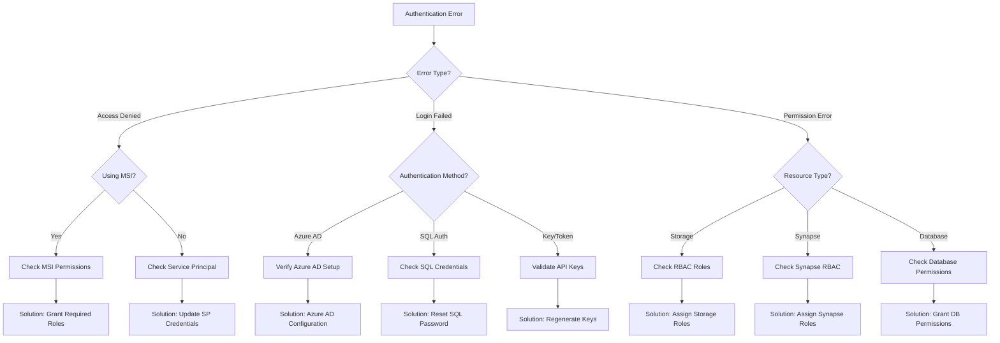
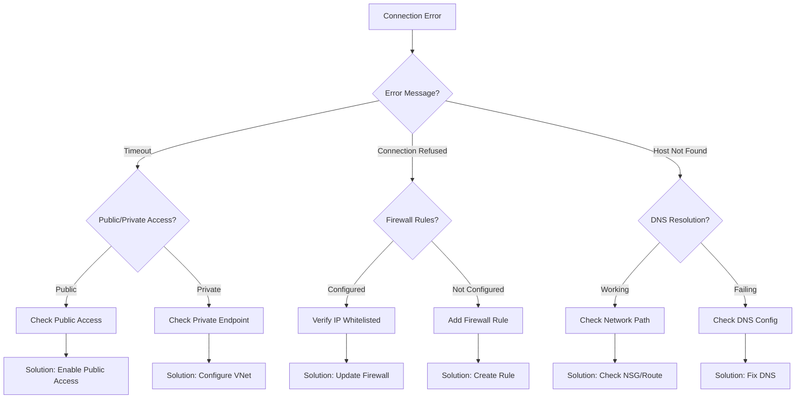
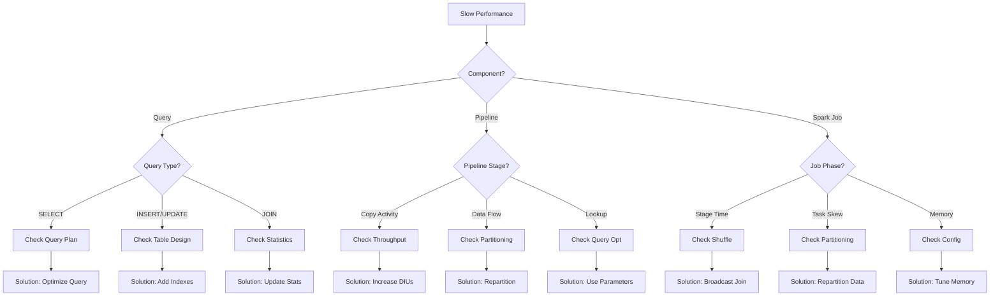

# Guided Troubleshooting

[🏠 Home](../../README.md) > [🔧 Troubleshooting](./README.md) > 🧭 Guided Troubleshooting

> 🧭 __Interactive Diagnostic Guide__
> Follow this step-by-step decision tree to diagnose and resolve common Azure Synapse Analytics issues quickly and effectively.

---

## 🎯 Quick Issue Identification

Start by identifying your issue category:

| Issue Type | Symptoms | Quick Link |
|------------|----------|------------|
| 🔑 __Authentication__ | Access denied, login failures, permission errors | [Authentication Issues](#authentication-issues) |
| 🌐 __Connectivity__ | Connection timeouts, network errors, VNet issues | [Connectivity Issues](#connectivity-issues) |
| ⚡ __Performance__ | Slow queries, high latency, resource bottlenecks | [Performance Issues](#performance-issues) |
| 🏞️ __Delta Lake__ | Table corruption, versioning issues, ACID failures | [Delta Lake Issues](#delta-lake-issues) |
| 🔄 __Pipelines__ | Pipeline failures, activity errors, orchestration issues | [Pipeline Issues](#pipeline-issues) |
| ☁️ __Serverless SQL__ | Query failures, data access issues, quota exceeded | [Serverless SQL Issues](#serverless-sql-issues) |
| 🔥 __Spark__ | Job failures, executor errors, memory issues | [Spark Issues](#spark-issues) |

---

## 🔑 Authentication Issues

### Decision Tree



### Diagnostic Steps

#### Step 1: Identify Authentication Method

__Question:__ What authentication method are you using?

- __Azure AD (Recommended)__ → Go to [Step 2A](#step-2a-azure-ad-authentication)
- __Managed Identity__ → Go to [Step 2B](#step-2b-managed-identity)
- __Service Principal__ → Go to [Step 2C](#step-2c-service-principal)
- __SQL Authentication__ → Go to [Step 2D](#step-2d-sql-authentication)

#### Step 2A: Azure AD Authentication

__Symptoms:__ `AADSTS*` error codes, token expiration, consent errors

__Diagnostic Actions:__

1. Verify Azure AD registration:

   ```bash
   az ad app show --id <application-id>
   ```

2. Check token validity:

   ```bash
   az account get-access-token --resource https://database.windows.net/
   ```

3. Verify user permissions:

   ```bash
   az role assignment list --assignee <user-id> --scope <resource-id>
   ```

__Solutions:__

- __Error AADSTS50105 (User not assigned):__ Assign user to application
- __Error AADSTS50126 (Invalid credentials):__ Reset password or credentials
- __Error AADSTS65001 (Consent required):__ Grant admin consent

📚 __Related:__ [Authentication Troubleshooting](./authentication-troubleshooting.md)

#### Step 2B: Managed Identity

__Symptoms:__ Access denied with MSI, identity not found

__Diagnostic Actions:__

1. Verify MSI is enabled:

   ```bash
   az synapse workspace show --name <workspace-name> --resource-group <rg-name> --query identity
   ```

2. Check MSI role assignments:

   ```bash
   az role assignment list --assignee <principal-id>
   ```

__Solutions:__

- Enable managed identity on Synapse workspace
- Assign required roles: `Storage Blob Data Contributor`, `Synapse Contributor`
- Wait up to 5 minutes for role propagation

📚 __Related:__ [Security Best Practices](../best-practices/security.md)

#### Step 2C: Service Principal

__Symptoms:__ Client credential flow errors, secret expiration

__Diagnostic Actions:__

1. Verify service principal exists:

   ```bash
   az ad sp show --id <app-id>
   ```

2. Check secret expiration:

   ```bash
   az ad app credential list --id <app-id>
   ```

__Solutions:__

- Regenerate expired secrets
- Update application credentials in Key Vault
- Verify client ID and tenant ID are correct

📚 __Related:__ [Reference Security](../reference/security.md)

#### Step 2D: SQL Authentication

__Symptoms:__ Login failed for user, password policy errors

__Diagnostic Actions:__

1. Test SQL connection:

   ```sql
   SELECT SYSTEM_USER, ORIGINAL_LOGIN();
   ```

2. Check login exists:

   ```sql
   SELECT name, type_desc FROM sys.server_principals WHERE name = '<username>';
   ```

__Solutions:__

- Reset SQL admin password via Azure Portal
- Ensure password meets complexity requirements
- Check if account is locked or disabled

📚 __Related:__ [SQL Performance](../best-practices/sql-performance.md)

---

## 🌐 Connectivity Issues

### Decision Tree



### Diagnostic Steps

#### Step 1: Test Basic Connectivity

__Question:__ Can you reach the endpoint?

```bash
# Test DNS resolution
nslookup <workspace-name>.sql.azuresynapse.net

# Test port connectivity
Test-NetConnection -ComputerName <workspace-name>.sql.azuresynapse.net -Port 1433

# Test HTTPS endpoint
curl https://<workspace-name>.dev.azuresynapse.net
```

__Results:__

- ✅ __Success__ → Go to [Step 2](#step-2-verify-authentication-1)
- ❌ __DNS Failed__ → Go to [DNS Issues](#dns-issues)
- ❌ __Port Blocked__ → Go to [Firewall Issues](#firewall-issues)
- ❌ __HTTPS Failed__ → Go to [Certificate Issues](#certificate-issues)

#### DNS Issues

__Diagnostic Actions:__

1. Verify DNS settings:

   ```bash
   ipconfig /all
   ```

2. Check private DNS zone:

   ```bash
   az network private-dns zone show --name privatelink.sql.azuresynapse.net --resource-group <rg-name>
   ```

3. Verify DNS record:

   ```bash
   az network private-dns record-set a list --zone-name privatelink.sql.azuresynapse.net --resource-group <rg-name>
   ```

__Solutions:__

- Create private DNS zone if using Private Link
- Link DNS zone to VNet
- Flush DNS cache: `ipconfig /flushdns`

📚 __Related:__ [Connectivity Troubleshooting](./connectivity-troubleshooting.md)

#### Firewall Issues

__Diagnostic Actions:__

1. Check workspace firewall rules:

   ```bash
   az synapse workspace firewall-rule list --workspace-name <workspace-name> --resource-group <rg-name>
   ```

2. Verify client IP:

   ```bash
   curl ifconfig.me
   ```

__Solutions:__

- Add client IP to firewall rules
- Enable "Allow Azure services and resources to access this workspace"
- For private endpoints, disable public network access

📚 __Related:__ [Network Security](../best-practices/network-security.md)

#### Certificate Issues

__Symptoms:__ SSL/TLS errors, certificate validation failures

__Solutions:__

- Update root certificates on client machine
- Add connection string parameter: `TrustServerCertificate=True` (development only)
- Verify server certificate is valid

---

## ⚡ Performance Issues

### Decision Tree



### Diagnostic Steps

#### Step 1: Identify Performance Bottleneck

__Question:__ What type of operation is slow?

- __SQL Query__ → [SQL Performance Diagnostics](#sql-performance-diagnostics)
- __Spark Job__ → [Spark Performance Diagnostics](#spark-performance-diagnostics)
- __Pipeline__ → [Pipeline Performance Diagnostics](#pipeline-performance-diagnostics)

#### SQL Performance Diagnostics

__Collect Query Metrics:__

```sql
-- Get query execution plan
SET STATISTICS PROFILE ON;
<your-query>
SET STATISTICS PROFILE OFF;

-- Check query statistics
SELECT
    query_id,
    start_time,
    end_time,
    total_elapsed_time_ms,
    row_count
FROM sys.dm_exec_requests
WHERE session_id = @@SPID;

-- Identify expensive operations
SELECT TOP 10
    text,
    total_worker_time/execution_count AS avg_cpu_time,
    total_elapsed_time/execution_count AS avg_elapsed_time
FROM sys.dm_exec_query_stats
CROSS APPLY sys.dm_exec_sql_text(sql_handle)
ORDER BY avg_elapsed_time DESC;
```

__Common Issues:__

| Symptom | Likely Cause | Solution |
|---------|--------------|----------|
| Full table scan | Missing statistics | Update statistics |
| High CPU time | Complex joins | Simplify query, add indexes |
| Memory spills | Insufficient memory grant | Increase DWU, optimize query |
| Lock waits | Concurrent operations | Use snapshot isolation |

📚 __Related:__ [SQL Performance Best Practices](../best-practices/sql-performance.md)

#### Spark Performance Diagnostics

__Collect Job Metrics:__

1. Access Spark UI: `https://<workspace-name>.dev.azuresynapse.net/sparkui`
2. Review job timeline and stages
3. Check executor metrics

__Common Issues:__

| Symptom | Likely Cause | Solution |
|---------|--------------|----------|
| Long stage time | Data shuffle | Use broadcast join |
| Task skew | Uneven partitioning | Repartition data |
| OOM errors | Insufficient memory | Increase executor memory |
| Spill to disk | Memory pressure | Optimize transformations |

📚 __Related:__ [Spark Performance Best Practices](../best-practices/spark-performance.md)

#### Pipeline Performance Diagnostics

__Check Pipeline Metrics:__

1. Navigate to Monitor → Pipeline runs
2. Review activity durations
3. Check data integration units (DIUs)

__Common Issues:__

| Symptom | Likely Cause | Solution |
|---------|--------------|----------|
| Slow copy activity | Low DIUs | Increase DIU count |
| Mapping data flow slow | Small cluster | Scale up integration runtime |
| Lookup timeout | Large result set | Use query optimization |

📚 __Related:__ [Pipeline Optimization](../best-practices/pipeline-optimization.md)

---

## 🏞️ Delta Lake Issues

### Common Scenarios

#### Scenario 1: Table Not Found

__Symptoms:__ `Table or view not found` errors

__Diagnostic Steps:__

```python
# Check if table exists in metastore
spark.sql("SHOW TABLES IN <database>").display()

# Check Delta Lake path
dbutils.fs.ls("/mnt/delta/<table-path>")

# Verify Delta log
dbutils.fs.ls("/mnt/delta/<table-path>/_delta_log")
```

__Solutions:__

- Refresh table metadata: `REFRESH TABLE <table_name>`
- Repair table: `MSCK REPAIR TABLE <table_name>`
- Recreate table if corrupted

📚 __Related:__ [Delta Lake Troubleshooting](./delta-lake-troubleshooting.md)

#### Scenario 2: Concurrent Write Conflicts

__Symptoms:__ `ConcurrentAppendException`, `ConcurrentDeleteException`

__Solutions:__

- Implement optimistic concurrency control
- Use merge operations instead of separate update/insert
- Enable auto-optimize for Delta tables

```python
# Enable optimized writes
spark.conf.set("spark.databricks.delta.optimizeWrite.enabled", "true")

# Use merge for upserts
deltaTable.alias("target").merge(
    source.alias("source"),
    "target.id = source.id"
).whenMatchedUpdateAll().whenNotMatchedInsertAll().execute()
```

#### Scenario 3: Performance Degradation

__Symptoms:__ Slow reads, increasing query time

__Diagnostic Steps:__

```python
# Check table statistics
spark.sql("DESCRIBE DETAIL <table_name>").display()

# Check file sizes
spark.sql("DESCRIBE DETAIL <table_name>").select("numFiles", "sizeInBytes").display()
```

__Solutions:__

- Run OPTIMIZE: `OPTIMIZE <table_name>`
- Z-ORDER on frequently filtered columns: `OPTIMIZE <table_name> ZORDER BY (column1, column2)`
- Vacuum old files: `VACUUM <table_name> RETAIN 168 HOURS`

📚 __Related:__ [Delta Lake Optimization](../best-practices/delta-lake-optimization.md)

---

## 🔄 Pipeline Issues

### Common Failure Patterns

#### Pattern 1: Copy Activity Failures

__Diagnostic Questions:__

1. What's the error message?
2. Is it source or sink failure?
3. Is it data-related or connectivity-related?

__Common Errors:__

| Error Code | Description | Solution |
|------------|-------------|----------|
| `UserErrorFailedToReadFromSqlSource` | SQL query error | Validate SQL syntax |
| `UserErrorInvalidColumnMapping` | Schema mismatch | Update column mappings |
| `UserErrorSinkPathNotFound` | Destination path missing | Create target container |
| `UserErrorQuotaExceeded` | DIU limit reached | Request quota increase |

#### Pattern 2: Data Flow Failures

__Diagnostic Steps:__

1. Enable debug mode in Data Flow
2. Review data preview at each transformation
3. Check cluster logs

__Common Issues:__

- Schema drift not handled → Enable "Allow schema drift"
- Null values causing errors → Add derived column with null handling
- Memory errors → Increase cluster size or optimize transformations

📚 __Related:__ [Pipeline Troubleshooting](./pipeline-troubleshooting.md)

---

## ☁️ Serverless SQL Issues

### Common Problems

#### Problem 1: File Format Errors

__Error:__ `Failed to read parquet file` or `CSV parsing error`

__Solutions:__

```sql
-- Test file format with OPENROWSET
SELECT TOP 100 *
FROM OPENROWSET(
    BULK 'https://<storage>.dfs.core.windows.net/container/file.parquet',
    FORMAT = 'PARQUET'
) AS [result];

-- Handle CSV with custom settings
SELECT *
FROM OPENROWSET(
    BULK 'https://<storage>.dfs.core.windows.net/container/file.csv',
    FORMAT = 'CSV',
    PARSER_VERSION = '2.0',
    FIRSTROW = 2,
    FIELDTERMINATOR = ',',
    ROWTERMINATOR = '\n'
) AS [result];
```

#### Problem 2: Performance Issues

__Symptoms:__ Slow queries on data lake files

__Solutions:__

- Create external tables instead of OPENROWSET
- Use partitioned data sources
- Create statistics on external tables
- Use CETAS to cache results

📚 __Related:__ [Serverless SQL Troubleshooting](./serverless-sql-troubleshooting.md)

---

## 🔥 Spark Issues

### Common Job Failures

#### Failure Type 1: Out of Memory

__Symptoms:__ `java.lang.OutOfMemoryError`, executor failures

__Diagnostic Steps:__

```python
# Check executor memory configuration
spark.conf.get("spark.executor.memory")
spark.conf.get("spark.driver.memory")

# Monitor memory usage
spark.sparkContext.statusTracker().getExecutorInfos()
```

__Solutions:__

- Increase executor memory: `spark.conf.set("spark.executor.memory", "8g")`
- Increase driver memory: `spark.conf.set("spark.driver.memory", "4g")`
- Optimize data structures (use arrays instead of lists)
- Process data in smaller batches

#### Failure Type 2: Shuffle Failures

__Symptoms:__ `Fetch failed`, shuffle read errors

__Solutions:__

- Increase shuffle partitions: `spark.conf.set("spark.sql.shuffle.partitions", "200")`
- Enable adaptive query execution: `spark.conf.set("spark.sql.adaptive.enabled", "true")`
- Use broadcast joins for small tables

📚 __Related:__ [Spark Troubleshooting](./spark-troubleshooting.md)

---

## 🆘 Emergency Checklist

When all else fails, work through this checklist:

- [ ] Check [Azure Service Health](https://status.azure.com/)
- [ ] Review [Azure Monitor](https://portal.azure.com/#blade/Microsoft_Azure_Monitoring/AzureMonitoringBrowseBlade/overview) alerts
- [ ] Check recent changes in deployment history
- [ ] Verify quota limits haven't been reached
- [ ] Review activity logs for error patterns
- [ ] Test from different network location
- [ ] Compare working vs. non-working configuration
- [ ] Create minimal reproduction case
- [ ] Gather diagnostic information
- [ ] Open Azure support ticket

---

## 📚 Additional Resources

| Resource | Description | Link |
|----------|-------------|------|
| 🔧 __Troubleshooting Hub__ | All troubleshooting guides | [Troubleshooting](./README.md) |
| 📖 __Best Practices__ | Prevention strategies | [Best Practices](../best-practices/README.md) |
| 📊 __Monitoring Setup__ | Proactive monitoring | [Monitoring](../monitoring/README.md) |
| 💬 __FAQ__ | Common questions | [FAQ](../faq.md) |

---

> 💡 __Pro Tip:__ Keep a troubleshooting journal documenting issues and resolutions. Patterns often emerge that help prevent future problems.

*Last Updated: January 2025*
