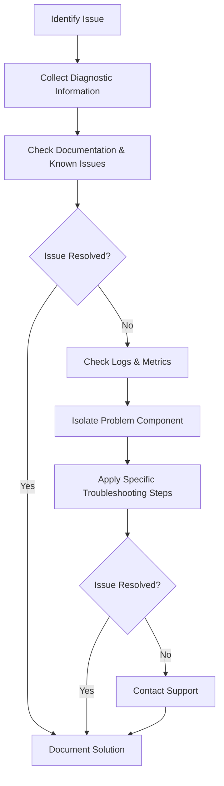

# Troubleshooting Azure Synapse Analytics

!!! tip "Quick Navigation"
    Use the sidebar navigation to quickly find specific troubleshooting guides, or refer to the common solutions below.

This section provides comprehensive troubleshooting guides for common issues encountered when working with Azure Synapse Analytics. Use these guides to diagnose and resolve problems across different components of your Synapse workspace.

## Troubleshooting Areas

!!! abstract "Component-Specific Guides"
    Azure Synapse Analytics is a complex ecosystem with multiple integrated components. Our troubleshooting guides are organized by component area to help you quickly find relevant solutions:

```html
    <div class="grid cards" markdown>
```

    - :fontawesome-solid-fire: __Spark Pool Issues__
      
      Diagnose and resolve common Apache Spark errors
      
      [:octicons-arrow-right-24: Spark Troubleshooting](spark-troubleshooting.md)
    
    - :material-database-search: __Serverless SQL Issues__
      
      Address performance and query problems with Serverless SQL pools
      
      [:octicons-arrow-right-24: SQL Troubleshooting](serverless-sql-troubleshooting.md)
    
    - :material-lan-connect: __Connectivity Issues__
      
      Solve network-related problems and connection failures
      
      [:octicons-arrow-right-24: Connectivity Guide](connectivity-troubleshooting.md)
      
    - :material-account-key: __Authentication Issues__
      
      Fix identity and access management problems
      
      [:octicons-arrow-right-24: Authentication Guide](authentication-troubleshooting.md)
    
    - :material-delta: __Delta Lake Issues__
      
      Troubleshoot Delta Lake operations and performance
      
      [:octicons-arrow-right-24: Delta Lake Guide](delta-lake-troubleshooting.md)
      
    - :material-pipe: __Pipeline Issues__
      
      Debug pipeline execution errors and performance bottlenecks
      
      [:octicons-arrow-right-24: Pipeline Guide](pipeline-troubleshooting.md)
    </div>

## General Troubleshooting Process

When troubleshooting issues in Azure Synapse Analytics, follow this general process:



## Collecting Diagnostic Information

!!! info "Essential Information to Gather"
    Before diving into specific troubleshooting steps, gather the following information:

```markdown
    1. **Error Messages**: Capture the full text of any error messages
    2. **Timestamp**: Note when the issue occurred
    3. **Resource Details**: Workspace name, pool configuration, operation being performed
    4. **Environment Information**: Network configuration, firewall settings, resource constraints
    5. **Recent Changes**: Any recent changes to configurations, code, or infrastructure
```

!!! warning "Don't Overlook Log Timestamps"
    When reviewing logs, pay attention to the timezone of log entries. Azure logs may use UTC time rather than your local time zone.

## Using Azure Monitor for Troubleshooting

!!! tip "Monitoring Tools"
    Azure Monitor provides powerful tools for diagnosing issues in Azure Synapse Analytics:

```html
    <div class="grid cards" markdown>
```

    - :material-monitor-dashboard: __Logging and Monitoring__
      
      Comprehensive guide for monitoring your Synapse workspace
      
      [:octicons-arrow-right-24: Monitoring Guide](../monitoring/logging-monitoring-guide.md)
      
    - :material-bell-alert: __Alerts Configuration__
      
      Set up proactive alerts and diagnostic settings
      
      [:octicons-arrow-right-24: Alert Setup](../monitoring/logging-monitoring-guide.md#setting-up-diagnostic-settings)
    
    </div>

!!! example "Sample Query for Failed Pipeline Runs"
    ```kusto
    SynapseIntegrationPipelineRuns
    | where Status == "Failed"
    | where TimeGenerated > ago(24h)
    | project TimeGenerated, PipelineName, RunId, ErrorMessage
    | order by TimeGenerated desc
    ```

* [Creating Custom Alerts](../monitoring/logging-monitoring-guide.md#creating-custom-alerts)

## Related Resources

* [Azure Synapse Analytics Official Troubleshooting Guide](https://docs.microsoft.com/en-us/azure/synapse-analytics/troubleshoot/troubleshoot-synapse-analytics)
* [Azure Synapse Community Forum](https://techcommunity.microsoft.com/t5/azure-synapse-analytics/bd-p/AzureSynapseAnalytics)
* [Stack Overflow Azure Synapse Questions](https://stackoverflow.com/questions/tagged/azure-synapse)
