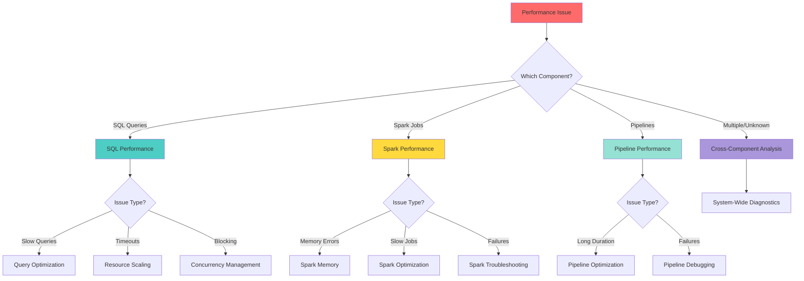

# General Performance Troubleshooting

> **[🏠 Home](../../README.md)** | **[📖 Documentation](../README.md)** | **[🔧 Troubleshooting](README.md)** | **👤 Performance Issues**

 

Comprehensive guide for diagnosing and resolving general performance issues across Azure Synapse Analytics components.

## Table of Contents

- [Overview](#overview)
- [Performance Issue Categories](#performance-issue-categories)
- [Diagnostic Approach](#diagnostic-approach)
- [Common Performance Bottlenecks](#common-performance-bottlenecks)
- [Cross-Component Performance](#cross-component-performance)
- [Monitoring and Metrics](#monitoring-and-metrics)
- [Resolution Procedures](#resolution-procedures)

---

## Overview

Performance issues in Azure Synapse can manifest across multiple components: SQL pools, Spark pools, pipelines, and data movement. This guide provides a systematic approach to identifying and resolving performance problems that span multiple services or don't fit into a specific component category.

> **💡 Tip:** Start with broad diagnostics to identify which component is causing the bottleneck, then drill down with component-specific troubleshooting.

---

## Performance Issue Categories

### Performance Issue Decision Tree



---

## Diagnostic Approach

### Step 1: Identify Scope of Issue

**Questions to Answer:**
- Is it affecting all users or specific users?
- Does it occur for all queries/jobs or specific ones?
- Is it time-based (certain hours, days)?
- Did it start after a recent change?

**Initial Diagnostic Queries:**

```sql
-- Check overall workspace activity
SELECT
    DATEPART(HOUR, start_time) AS hour,
    COUNT(*) AS total_operations,
    AVG(total_elapsed_time)/1000.0 AS avg_seconds,
    MAX(total_elapsed_time)/1000.0 AS max_seconds
FROM sys.dm_pdw_exec_requests
WHERE start_time >= DATEADD(DAY, -1, GETDATE())
GROUP BY DATEPART(HOUR, start_time)
ORDER BY hour;

-- Check for anomalies
SELECT
    CAST(start_time AS DATE) AS date,
    COUNT(*) AS operation_count,
    AVG(total_elapsed_time)/1000.0 AS avg_duration_seconds,
    SUM(CASE WHEN status = 'Failed' THEN 1 ELSE 0 END) AS failed_count,
    SUM(CASE WHEN status = 'Failed' THEN 1 ELSE 0 END) * 100.0 / COUNT(*) AS failure_rate_pct
FROM sys.dm_pdw_exec_requests
WHERE start_time >= DATEADD(DAY, -7, GETDATE())
GROUP BY CAST(start_time AS DATE)
ORDER BY date DESC;
```

---

### Step 2: Collect Performance Baseline

**Establish Normal Performance:**

```sql
-- Baseline query performance (last 30 days)
WITH baseline AS (
    SELECT
        command,
        AVG(total_elapsed_time)/1000.0 AS avg_seconds,
        STDEV(total_elapsed_time)/1000.0 AS stdev_seconds,
        MIN(total_elapsed_time)/1000.0 AS min_seconds,
        MAX(total_elapsed_time)/1000.0 AS max_seconds,
        COUNT(*) AS execution_count
    FROM sys.dm_pdw_exec_requests
    WHERE start_time >= DATEADD(DAY, -30, GETDATE())
        AND start_time < DATEADD(DAY, -1, GETDATE())
        AND status = 'Completed'
    GROUP BY command
    HAVING COUNT(*) > 5  -- Only queries run multiple times
)
SELECT
    command,
    avg_seconds,
    stdev_seconds,
    min_seconds,
    max_seconds,
    execution_count,
    CASE
        WHEN stdev_seconds > avg_seconds * 0.5 THEN 'High Variance'
        WHEN stdev_seconds > avg_seconds * 0.3 THEN 'Medium Variance'
        ELSE 'Low Variance'
    END AS consistency
FROM baseline
ORDER BY avg_seconds DESC;
```

---

### Step 3: Resource Utilization Check

**Monitor Resource Consumption:**

```bash
#!/bin/bash
# Performance-Monitor.sh

WORKSPACE="<workspace-name>"
RESOURCE_GROUP="<rg-name>"

echo "=== Azure Synapse Performance Monitor ==="
echo ""

# 1. SQL Pool Status
echo "1. SQL Pool Status:"
az synapse sql pool list \
    --workspace-name $WORKSPACE \
    --resource-group $RESOURCE_GROUP \
    --query "[].{Name:name, Status:status, DWU:sku.capacity}" \
    --output table
echo ""

# 2. Spark Pool Status
echo "2. Spark Pool Status:"
az synapse spark pool list \
    --workspace-name $WORKSPACE \
    --resource-group $RESOURCE_GROUP \
    --query "[].{Name:name, AutoScale:autoScale, NodeSize:nodeSize}" \
    --output table
echo ""

# 3. Recent Activity
echo "3. Recent Activity Logs (Errors/Warnings):"
az monitor activity-log list \
    --resource-group $RESOURCE_GROUP \
    --namespace Microsoft.Synapse \
    --start-time $(date -u -d '1 hour ago' +%Y-%m-%dT%H:%M:%SZ) \
    --query "[?level=='Error' || level=='Warning'].{Time:eventTimestamp, Level:level, Operation:operationName.localizedValue, Status:status.localizedValue}" \
    --output table
echo ""

# 4. Metrics
echo "4. Pipeline Run Status:"
az monitor metrics list \
    --resource "/subscriptions/<sub-id>/resourceGroups/$RESOURCE_GROUP/providers/Microsoft.Synapse/workspaces/$WORKSPACE" \
    --metric "IntegrationPipelineRunsEnded" \
    --start-time $(date -u -d '1 hour ago' +%Y-%m-%dT%H:%M:%SZ) \
    --interval PT1H \
    --aggregation Count \
    --output table

echo ""
echo "=== Monitor Complete ==="
```

---

## Common Performance Bottlenecks

### Bottleneck 1: Data Movement Overhead

**Symptoms:**
- Slow data loading
- High network I/O
- Delays in pipeline execution

**Diagnostic Queries:**

```sql
-- Check data movement operations
SELECT
    r.request_id,
    r.command,
    s.step_index,
    s.operation_type,
    s.row_count,
    s.total_elapsed_time/1000.0 AS elapsed_seconds,
    CASE
        WHEN s.operation_type LIKE '%Move%' THEN 'Data Movement'
        WHEN s.operation_type LIKE '%Shuffle%' THEN 'Data Shuffle'
        WHEN s.operation_type LIKE '%Broadcast%' THEN 'Data Broadcast'
        ELSE 'Other'
    END AS operation_category
FROM sys.dm_pdw_exec_requests r
INNER JOIN sys.dm_pdw_request_steps s ON r.request_id = s.request_id
WHERE r.start_time >= DATEADD(HOUR, -1, GETDATE())
    AND s.operation_type IN ('BroadcastMoveOperation', 'ShuffleMoveOperation', 'TrimMoveOperation')
ORDER BY s.total_elapsed_time DESC;
```

**Solutions:**

1. **Optimize Table Distribution:**
   ```sql
   -- Check current distribution
   SELECT
       s.name AS schema_name,
       t.name AS table_name,
       t.distribution_policy_desc,
       COUNT(p.partition_number) AS partition_count
   FROM sys.tables t
   INNER JOIN sys.schemas s ON t.schema_id = s.schema_id
   LEFT JOIN sys.pdw_table_mappings tm ON t.object_id = tm.object_id
   LEFT JOIN sys.pdw_nodes_tables nt ON tm.physical_name = nt.name
   LEFT JOIN sys.partitions p ON nt.object_id = p.object_id
   WHERE t.is_external = 0
   GROUP BY s.name, t.name, t.distribution_policy_desc
   ORDER BY s.name, t.name;

   -- Redistribute table on join key
   CREATE TABLE dbo.FactSales_Optimized
   WITH (
       DISTRIBUTION = HASH(CustomerKey),  -- Match dimension join key
       CLUSTERED COLUMNSTORE INDEX
   )
   AS
   SELECT * FROM dbo.FactSales;
   ```

2. **Use Replicated Tables for Small Dimensions:**
   ```sql
   -- Create replicated dimension table
   CREATE TABLE dbo.DimSmall
   WITH (
       DISTRIBUTION = REPLICATE,
       CLUSTERED COLUMNSTORE INDEX
   )
   AS
   SELECT * FROM dbo.Dimension
   WHERE CategoryType = 'Reference';
   ```

---

### Bottleneck 2: Memory Pressure

**Symptoms:**
- Out of memory errors
- Spilling to disk
- Slow aggregations

**Diagnostic Queries:**

```sql
-- Check memory grants
SELECT
    r.request_id,
    r.command,
    mg.requested_memory_kb/1024.0 AS requested_memory_mb,
    mg.granted_memory_kb/1024.0 AS granted_memory_mb,
    mg.used_memory_kb/1024.0 AS used_memory_mb,
    mg.max_used_memory_kb/1024.0 AS max_used_memory_mb,
    mg.grant_time,
    DATEDIFF(SECOND, mg.grant_time, GETDATE()) AS grant_age_seconds
FROM sys.dm_pdw_exec_requests r
INNER JOIN sys.dm_pdw_nodes_exec_query_memory_grants mg
    ON r.request_id = mg.request_id
WHERE r.status IN ('Running', 'Suspended')
ORDER BY requested_memory_mb DESC;

-- Check for memory waits
SELECT
    wait_type,
    COUNT(*) AS wait_count,
    SUM(wait_time_ms)/1000.0 AS total_wait_seconds
FROM sys.dm_pdw_waits
WHERE wait_type LIKE '%MEMORY%'
    OR wait_type LIKE '%RESOURCE%'
GROUP BY wait_type
ORDER BY total_wait_seconds DESC;
```

**Solutions:**

1. **Increase Resource Class:**
   ```sql
   -- Assign user to larger resource class
   EXEC sp_addrolemember 'largerc', 'analytics_user@domain.com';

   -- Verify assignment
   SELECT
       s.login_name,
       r.resource_class
   FROM sys.dm_pdw_exec_sessions s
   LEFT JOIN sys.dm_pdw_exec_requests r ON s.session_id = r.session_id
   WHERE s.login_name = 'analytics_user@domain.com';
   ```

2. **Optimize Query for Memory:**
   ```sql
   -- Bad: Large sort operation
   SELECT *
   FROM FactSales
   ORDER BY SaleDate, ProductKey, CustomerKey;

   -- Good: Reduce columns, filter first
   SELECT SaleDate, ProductKey, Amount
   FROM FactSales
   WHERE SaleDate >= '2024-01-01'
   ORDER BY SaleDate;
   ```

---

### Bottleneck 3: Inefficient Joins

**Symptoms:**
- Long-running join operations
- High CPU during joins
- Excessive data movement

**Diagnostic Queries:**

```sql
-- Identify expensive joins
SELECT
    r.request_id,
    s.step_index,
    s.operation_type,
    s.row_count,
    s.total_elapsed_time/1000.0 AS elapsed_seconds,
    s.estimated_rows
FROM sys.dm_pdw_exec_requests r
INNER JOIN sys.dm_pdw_request_steps s ON r.request_id = s.request_id
WHERE s.operation_type LIKE '%Join%'
    AND r.start_time >= DATEADD(HOUR, -1, GETDATE())
ORDER BY s.total_elapsed_time DESC;

-- Check join types used
SELECT
    r.request_id,
    r.command,
    s.step_index,
    s.operation_type,
    CASE
        WHEN s.operation_type LIKE '%Hash%' THEN 'Hash Join'
        WHEN s.operation_type LIKE '%Merge%' THEN 'Merge Join'
        WHEN s.operation_type LIKE '%Nested%' THEN 'Nested Loop'
        ELSE 'Other'
    END AS join_type,
    s.row_count,
    s.total_elapsed_time/1000.0 AS elapsed_seconds
FROM sys.dm_pdw_exec_requests r
INNER JOIN sys.dm_pdw_request_steps s ON r.request_id = s.request_id
WHERE s.operation_type LIKE '%Join%'
ORDER BY s.total_elapsed_time DESC;
```

**Solutions:**

1. **Align Distribution Keys:**
   ```sql
   -- Check table distribution alignment
   SELECT
       t1.name AS table1,
       t2.name AS table2,
       c1.name AS t1_dist_col,
       c2.name AS t2_dist_col,
       CASE
           WHEN c1.name = c2.name THEN 'Aligned'
           ELSE 'Not Aligned'
       END AS distribution_status
   FROM sys.tables t1
   CROSS JOIN sys.tables t2
   INNER JOIN sys.pdw_table_distribution_properties tdp1 ON t1.object_id = tdp1.object_id
   INNER JOIN sys.pdw_table_distribution_properties tdp2 ON t2.object_id = tdp2.object_id
   LEFT JOIN sys.columns c1 ON t1.object_id = c1.object_id AND tdp1.distribution_ordinal = c1.column_id
   LEFT JOIN sys.columns c2 ON t2.object_id = c2.object_id AND tdp2.distribution_ordinal = c2.column_id
   WHERE t1.name = 'FactSales' AND t2.name = 'DimCustomer';
   ```

2. **Use Broadcast Join for Small Tables:**
   ```sql
   -- Force broadcast join (Synapse will auto-optimize, but can hint)
   SELECT /*+ BROADCAST(d) */
       f.SaleKey,
       d.CustomerName,
       f.Amount
   FROM FactSales f
   INNER JOIN DimCustomer d ON f.CustomerKey = d.CustomerKey
   WHERE d.Region = 'West';
   ```

---

## Cross-Component Performance

### End-to-End Pipeline Performance

**Monitor Complete Pipeline:**

```sql
-- Pipeline execution timeline
WITH pipeline_steps AS (
    SELECT
        pipeline_run_id,
        activity_name,
        activity_type,
        start_time,
        end_time,
        DATEDIFF(SECOND, start_time, end_time) AS duration_seconds,
        status
    FROM sys.dm_synapse_integration_pipeline_activities
    WHERE pipeline_run_id = '<run-id>'
)
SELECT
    activity_name,
    activity_type,
    start_time,
    end_time,
    duration_seconds,
    status,
    LAG(end_time) OVER (ORDER BY start_time) AS previous_end_time,
    DATEDIFF(SECOND,
        LAG(end_time) OVER (ORDER BY start_time),
        start_time) AS gap_seconds
FROM pipeline_steps
ORDER BY start_time;
```

**Azure CLI Pipeline Monitoring:**

```bash
# Get pipeline run details
az synapse pipeline-run show \
    --workspace-name <workspace-name> \
    --run-id <run-id> \
    --output json | jq '{
        RunId: .runId,
        Status: .status,
        Duration: .durationInMs,
        Message: .message
    }'

# List recent pipeline runs
az synapse pipeline-run query-by-workspace \
    --workspace-name <workspace-name> \
    --last-updated-after "2025-12-08T00:00:00Z" \
    --last-updated-before "2025-12-09T00:00:00Z" \
    --query "[?status=='Failed' || status=='TimedOut'].{PipelineName:pipelineName, RunId:runId, Status:status, Duration:durationInMs}" \
    --output table
```

---

### Spark to SQL Integration Performance

**Monitor Spark-SQL Data Transfer:**

```python
# PySpark monitoring
from pyspark.sql import SparkSession

spark = SparkSession.builder.getOrCreate()

# Enable detailed logging
spark.sparkContext.setLogLevel("INFO")

# Monitor DataFrame operations
df = spark.read.format("synapsesql").load("dbo.FactSales")

# Check partition count
print(f"Partitions: {df.rdd.getNumPartitions()}")

# Optimize partitions for write
df.repartition(60).write \
    .format("synapsesql") \
    .mode("overwrite") \
    .option("tableName", "dbo.FactSales_Optimized") \
    .save()
```

**Performance Tuning:**

```python
# Optimize Spark-SQL connector settings
spark.conf.set("spark.synapse.sql.writeMode", "bulk")
spark.conf.set("spark.synapse.sql.batchSize", "100000")
spark.conf.set("spark.synapse.sql.isolationLevel", "READ_UNCOMMITTED")

# Use staging for large writes
spark.conf.set("spark.synapse.sql.stagingStorageAccount", "<storage-account>")
spark.conf.set("spark.synapse.sql.stagingContainer", "<container>")
```

---

## Monitoring and Metrics

### Key Performance Indicators

**Azure Monitor Metrics:**

```bash
# Query performance metrics
az monitor metrics list \
    --resource "/subscriptions/<sub-id>/resourceGroups/<rg-name>/providers/Microsoft.Synapse/workspaces/<workspace-name>" \
    --metric-names \
        "IntegrationActivityRunsEnded" \
        "IntegrationPipelineRunsEnded" \
        "IntegrationTriggerRunsEnded" \
        "SQLStreamingBackloggedInputEventSources" \
    --start-time 2025-12-08T00:00:00Z \
    --end-time 2025-12-09T00:00:00Z \
    --interval PT1H \
    --aggregation Total \
    --output table
```

### Custom Performance Dashboard

**Kusto Query (Log Analytics):**

```kusto
// Performance overview dashboard
SynapseIntegrationPipelineRuns
| where TimeGenerated > ago(24h)
| summarize
    TotalRuns = count(),
    SuccessfulRuns = countif(Status == "Succeeded"),
    FailedRuns = countif(Status == "Failed"),
    AvgDurationMinutes = avg(DurationMs) / 60000,
    MaxDurationMinutes = max(DurationMs) / 60000
by bin(TimeGenerated, 1h), PipelineName
| project
    TimeGenerated,
    PipelineName,
    TotalRuns,
    SuccessRate = round((SuccessfulRuns * 100.0 / TotalRuns), 2),
    AvgDurationMinutes = round(AvgDurationMinutes, 2),
    MaxDurationMinutes = round(MaxDurationMinutes, 2)
| order by TimeGenerated desc

// Slow query detection
SynapseSqlPoolExecRequests
| where TimeGenerated > ago(1h)
| where DurationMs > 60000  // Queries > 1 minute
| project
    TimeGenerated,
    RequestId,
    Command,
    DurationSeconds = DurationMs / 1000,
    Status,
    LoginName
| order by DurationSeconds desc
| take 20
```

---

## Resolution Procedures

### Procedure 1: Performance Triage

**When to Use:** General slowdown across workspace

**Steps:**

1. **Check Workspace Health:**
   ```bash
   az synapse workspace show \
       --name <workspace-name> \
       --resource-group <rg-name> \
       --query "{Name:name, State:provisioningState, Region:location}"
   ```

2. **Identify Bottleneck Component:**
   ```sql
   -- Check component activity
   SELECT
       'SQL' AS component,
       COUNT(*) AS operations,
       AVG(total_elapsed_time)/1000.0 AS avg_seconds
   FROM sys.dm_pdw_exec_requests
   WHERE start_time >= DATEADD(HOUR, -1, GETDATE());

   -- Pipeline metrics via Azure CLI
   ```

3. **Drill Down:**
   - SQL slow → See [Query Performance](../07-troubleshooting/service-troubleshooting/synapse/query-performance.md)
   - Spark slow → See [Spark Troubleshooting](spark-troubleshooting.md)
   - Pipeline slow → See [Pipeline Troubleshooting](pipeline-troubleshooting.md)

---

### Procedure 2: Performance Baseline Reset

**When to Use:** After major changes or upgrades

**Steps:**

1. **Clear Caches:**
   ```sql
   DBCC FREEPROCCACHE;
   DBCC DROPCLEANBUFFERS;
   ```

2. **Update All Statistics:**
   ```sql
   -- Generate and execute update commands
   DECLARE @sql NVARCHAR(MAX);
   DECLARE update_cursor CURSOR FOR
   SELECT 'UPDATE STATISTICS [' + s.name + '].[' + t.name + '] WITH FULLSCAN;'
   FROM sys.tables t
   INNER JOIN sys.schemas s ON t.schema_id = s.schema_id
   WHERE t.is_external = 0;

   OPEN update_cursor;
   FETCH NEXT FROM update_cursor INTO @sql;

   WHILE @@FETCH_STATUS = 0
   BEGIN
       EXEC sp_executesql @sql;
       FETCH NEXT FROM update_cursor INTO @sql;
   END

   CLOSE update_cursor;
   DEALLOCATE update_cursor;
   ```

3. **Rebuild Indexes:**
   ```sql
   -- Rebuild all columnstore indexes
   ALTER INDEX ALL ON dbo.FactSales REBUILD;
   ```

4. **Re-establish Baseline:**
   ```sql
   -- Run representative queries and record timings
   ```

---

## When to Contact Support

Contact Microsoft Support if:

- [ ] Performance degradation affects multiple components
- [ ] Issue started after Azure platform update
- [ ] Consistent slowdown despite optimization efforts
- [ ] Metrics show abnormal patterns
- [ ] Resource limits seem incorrect
- [ ] Suspected platform-level issue

**Information to Provide:**
- Workspace name and resource details
- Timeline of performance degradation
- Baseline vs current performance metrics
- Recent changes or deployments
- Diagnostic query results
- Azure Monitor metrics screenshots

---

## Related Resources

- [Synapse Query Performance](../07-troubleshooting/service-troubleshooting/synapse/query-performance.md)
- [Spark Performance](spark-troubleshooting.md)
- [Pipeline Optimization](../best-practices/pipeline-optimization.md)
- [Performance Best Practices](../best-practices/performance-optimization.md)
- [Monitoring Setup](../monitoring/monitoring-setup.md)

---

> **💡 Performance Philosophy:** Optimize for the common case, monitor continuously, and maintain performance baselines for comparison.
