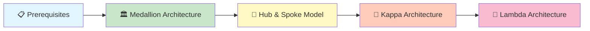

# 🏗️ Architecture Pattern Tutorials

> __🏠 [Home](../../README.md)__ | __📖 [Documentation](../../README.md)__ | __🎓 [Tutorials](../README.md)__ | __🏗️ Architecture Pattern Tutorials__


Complete, hands-on walkthrough tutorials for implementing Azure Cloud Scale Analytics architecture patterns. Each tutorial includes Azure deployment scripts, interactive notebooks, sample data, and step-by-step guidance.

---

## 🎯 Overview

These tutorials provide complete, production-ready implementations of the architecture patterns documented in the [Architecture Patterns](../../03-architecture-patterns/README.md) section. Each tutorial is designed to be:

- __🎓 Beginner-Friendly__: Assumes no prior Azure experience
- __🚀 Deployable__: Includes complete Infrastructure as Code (IaC)
- __💻 Interactive__: Polyglot notebooks for hands-on learning
- __📊 Data-Driven__: Realistic sample data included
- __🔒 Production-Ready__: Follows security and best practices
- __📖 Comprehensive__: Prerequisites, setup, deployment, and validation

---

## 📚 Tutorial Categories

### ⚡ Streaming Architecture Patterns

Real-time data processing patterns for event-driven analytics.

| Pattern | Complexity | Duration | Key Services |
| --------- | ------------ | ---------- | -------------- |
| [🌊 Lambda Architecture](streaming/lambda-architecture-tutorial.md) |  | 3-4 hours | Event Hubs, Stream Analytics, Synapse, Data Lake |
| [🔄 Kappa Architecture](streaming/kappa-architecture-tutorial.md) |  | 2-3 hours | Event Hubs, Stream Analytics, Cosmos DB |
| [📊 Event Sourcing](streaming/event-sourcing-tutorial.md) |  | 3-4 hours | Event Hubs, Cosmos DB, Azure Functions |
| [🔀 CQRS Pattern](streaming/cqrs-pattern-tutorial.md) |  | 3-4 hours | Cosmos DB, Synapse, Event Grid |

### 📊 Batch Architecture Patterns

Large-scale batch data processing and warehouse patterns.

| Pattern | Complexity | Duration | Key Services |
| --------- | ------------ | ---------- | -------------- |
| [🏛️ Medallion Architecture](batch/medallion-architecture-tutorial.md) |  | 2-3 hours | Synapse Spark, Data Lake Gen2, Delta Lake |
| [🕸️ Data Mesh](batch/data-mesh-tutorial.md) |  | 4-5 hours | Synapse, Data Factory, Purview, Power Platform |
| [🌟 Hub & Spoke Model](batch/hub-spoke-tutorial.md) |  | 2-3 hours | Synapse Dedicated SQL, Data Factory, Analysis Services |

### 🔄 Hybrid Architecture Patterns

Combined streaming and batch processing patterns.

| Pattern | Complexity | Duration | Key Services |
| --------- | ------------ | ---------- | -------------- |
| [⚡🌊 Lambda-Kappa Hybrid](hybrid/lambda-kappa-hybrid-tutorial.md) |  | 4-5 hours | Synapse (all engines), Event Hubs, Data Lake |
| [🗄️ Polyglot Persistence](hybrid/polyglot-persistence-tutorial.md) |  | 3-4 hours | Azure SQL, Cosmos DB, Data Explorer, Synapse |
| [🔄 HTAP Patterns](hybrid/htap-patterns-tutorial.md) |  | 3-4 hours | Cosmos DB, Synapse Link, Power BI |

### 🌐 Reference Architecture Patterns

Industry-specific complete implementations.

| Pattern | Complexity | Duration | Key Services |
| --------- | ------------ | ---------- | -------------- |
| [🏭 IoT Analytics](reference/iot-analytics-tutorial.md) |  | 4-5 hours | IoT Hub, Event Hubs, Stream Analytics, Data Lake, Synapse |
| [🛒 Retail Analytics](reference/retail-analytics-tutorial.md) |  | 3-4 hours | Data Factory, Data Lake, Synapse, ML, Power BI |
| [🏦 Financial Services](reference/financial-services-tutorial.md) |  | 4-5 hours | Event Hubs, Stream Analytics, Risk Engine, Compliance |
| [🏥 Healthcare Analytics](reference/healthcare-analytics-tutorial.md) |  | 4-5 hours | FHIR API, Data Factory, Data Lake, Analytics, Dashboards |

---

## 🎓 Learning Path

### 🌱 Beginners Start Here

If you're new to Azure Cloud Scale Analytics, follow this learning path:


```mermaid
graph LR
    A[📋 Prerequisites] --> B[🏛️ Medallion Architecture]
    B --> C[🌟 Hub & Spoke Model]
    C --> D[🔄 Kappa Architecture]
    D --> E[🌊 Lambda Architecture]
    
    style A fill:#e1f5fe
    style B fill:#c8e6c9
    style C fill:#fff9c4
    style D fill:#ffccbc
    style E fill:#f8bbd0
```

__Week 1-2__: [Prerequisites & Setup](PREREQUISITES.md) + [Medallion Architecture](batch/medallion-architecture-tutorial.md)

__Week 3-4__: [Hub & Spoke Model](batch/hub-spoke-tutorial.md) + Start streaming with [Kappa Architecture](streaming/kappa-architecture-tutorial.md)

__Week 5-6__: [Lambda Architecture](streaming/lambda-architecture-tutorial.md) + Choose your industry [Reference Architecture](reference/README.md)

### 🔧 Intermediate Path

Already familiar with Azure? Focus on advanced patterns:

1. __Hybrid Patterns__: Start with [Lambda-Kappa Hybrid](hybrid/lambda-kappa-hybrid-tutorial.md)
2. __Advanced Streaming__: Explore [Event Sourcing](streaming/event-sourcing-tutorial.md) and [CQRS](streaming/cqrs-pattern-tutorial.md)
3. __Enterprise Scale__: Implement [Data Mesh](batch/data-mesh-tutorial.md)

### 🚀 Advanced Path

Building production systems? Deep dive into:

1. __Multi-Database__: [Polyglot Persistence](hybrid/polyglot-persistence-tutorial.md)
2. __Real-Time Analytics__: [HTAP Patterns](hybrid/htap-patterns-tutorial.md)
3. __Industry Solutions__: Choose your domain-specific [Reference Architecture](reference/README.md)

---

## 📋 Prerequisites

Before starting any tutorial, ensure you have:

### 🔑 Required Access

- [ ] __Azure Subscription__ with Owner or Contributor role
- [ ] __Azure CLI__ installed and configured
- [ ] __Git__ installed for version control

### 💻 Development Environment

- [ ] __VS Code__ with recommended extensions (see [Setup Guide](PREREQUISITES.md#vs-code-setup))
- [ ] __Python 3.8+__ for running notebooks
- [ ] __Azure PowerShell__ or __Azure CLI__ for deployments

### 📦 Optional Tools

- [ ] __Azure Storage Explorer__ for data visualization
- [ ] __Postman__ for API testing
- [ ] __Power BI Desktop__ for report development

> 💡 __Tip__: See the complete [Prerequisites and Setup Guide](PREREQUISITES.md) for detailed installation instructions.

---

## 🚀 Getting Started

### Quick Start (5 minutes)

1. __Choose a tutorial__ from the tables above based on your experience level
2. __Review prerequisites__ in the [Prerequisites Guide](PREREQUISITES.md)
3. __Clone the repository__ and navigate to the tutorial
4. __Follow the tutorial__ step-by-step

### Tutorial Structure

Each tutorial follows a consistent structure:

```text
📁 tutorial-name/
├── 📄 README.md                    # Complete walkthrough guide
├── 📁 infrastructure/              # Azure deployment scripts
│   ├── main.bicep                  # Main IaC template
│   ├── parameters.json             # Configuration parameters
│   └── deploy.sh                   # Deployment script
├── 📁 notebooks/                   # Interactive notebooks
│   ├── 01-setup.ipynb             # Setup and configuration
│   ├── 02-deploy.ipynb            # Deployment walkthrough
│   ├── 03-validate.ipynb          # Validation and testing
│   └── 04-examples.ipynb          # Usage examples
├── 📁 data/                       # Sample data
│   └── sample-data.json           # Realistic test data
└── 📁 diagrams/                   # Architecture diagrams
    └── architecture.png           # Visual representation
```

---

## 💡 Tutorial Features

### 🎯 What You'll Learn

Each tutorial provides:

- __Architecture Understanding__: Deep dive into the pattern's design principles
- __Azure Services__: Hands-on experience with relevant Azure services
- __Infrastructure as Code__: Deploy using Bicep templates
- __Data Engineering__: Process sample data through the pipeline
- __Monitoring & Operations__: Set up observability and alerts
- __Security Best Practices__: Implement production-grade security
- __Cost Optimization__: Understand and optimize Azure costs

### 🛠️ What You'll Build

By completing a tutorial, you'll have:

- ✅ __Fully deployed Azure infrastructure__
- ✅ __Working data pipeline__ processing sample data
- ✅ __Monitoring and alerts__ configured
- ✅ __Security__ best practices implemented
- ✅ __Documentation__ of your implementation
- ✅ __Reusable code__ for your own projects

---

## 📖 Tutorial Conventions

### Icons and Badges

- 🎯 __Objectives__: Learning goals for the section
- 📋 __Prerequisites__: Required before proceeding
- 💻 __Code__: Commands or code to execute
- 💡 __Tip__: Helpful information or pro tips
- ⚠️ __Warning__: Important information to avoid issues
- 🔒 __Security__: Security-related information
- 💰 __Cost__: Cost considerations

### Complexity Levels

- : 1-2 hours, few services, beginner-friendly
- : 2-3 hours, multiple services, some Azure experience
- : 3-5 hours, many services, production patterns

---

## 🧪 Testing and Validation

All tutorials include:

- __Deployment validation scripts__ to verify resources
- __Data validation__ to confirm pipeline functionality
- __Performance testing__ guidelines
- __Cleanup scripts__ to remove resources

---

## 💰 Cost Considerations

Each tutorial includes:

- __Estimated costs__ for running the tutorial
- __Cost optimization tips__ for production
- __Cleanup instructions__ to avoid ongoing charges

> ⚠️ __Important__: Remember to clean up Azure resources after completing tutorials to avoid unnecessary charges.

---

## 🤝 Contributing

Want to contribute a new tutorial or improve existing ones?

1. Review the [Contributing Guide](../../guides/CONTRIBUTING_GUIDE.md)
2. Follow the [Markdown Style Guide](../../guides/MARKDOWN_STYLE_GUIDE.md)
3. Use the [Tutorial Template](TUTORIAL_TEMPLATE.md)
4. Submit a pull request

---

## 📚 Additional Resources

### 📖 Documentation

- [Architecture Patterns](../../03-architecture-patterns/README.md) - Pattern documentation
- [Service Guides](../../02-services/README.md) - Individual service documentation
- [Best Practices](../../05-best-practices/README.md) - Production best practices

### 🎓 Learning Resources

- [Azure Learn](https://learn.microsoft.com/en-us/azure/) - Microsoft's official learning platform
- [Azure Architecture Center](https://learn.microsoft.com/en-us/azure/architecture/) - Architecture guidance
- [Azure Samples](https://github.com/Azure-Samples) - Code samples and examples

### 🛠️ Tools and Utilities

- [Azure Portal](https://portal.azure.com) - Azure management console
- [Azure CLI Documentation](https://learn.microsoft.com/en-us/cli/azure/) - CLI reference
- [Bicep Documentation](https://learn.microsoft.com/en-us/azure/azure-resource-manager/bicep/) - IaC language

---

## 🆘 Getting Help

### 📞 Support Channels

- __Issues__: Open an [issue on GitHub](https://github.com/fgarofalo56/csa-inabox-docs/issues)
- __Discussions__: Join [GitHub Discussions](https://github.com/fgarofalo56/csa-inabox-docs/discussions)
- __Azure Support__: [Azure Support Plans](https://azure.microsoft.com/en-us/support/plans/)

### ❓ FAQ

__Q: Do I need an Azure subscription to follow these tutorials?__
A: Yes, an active Azure subscription is required. You can start with a [free account](https://azure.microsoft.com/en-us/free/).

__Q: Will following these tutorials incur costs?__
A: Yes, Azure resources do incur costs. Each tutorial includes cost estimates and cleanup instructions.

__Q: Can I use these patterns in production?__
A: Yes! These tutorials follow production best practices. However, always review security and compliance requirements for your specific use case.

__Q: What if I get stuck?__
A: Check the troubleshooting section in each tutorial, review the FAQ, or open an issue on GitHub.

---

## 🗺️ Roadmap

### ✅ Completed

- Documentation structure and templates
- Tutorial framework and guidelines

### 🚧 In Progress

- Streaming architecture tutorials
- Batch architecture tutorials
- Hybrid architecture tutorials
- Reference architecture tutorials

### 📅 Planned

- Video walkthroughs for each tutorial
- Community-contributed industry patterns
- Advanced optimization guides
- Multi-region deployment patterns

---

__Last Updated__: 2025-12-12  
__Status__: Active Development  
__Maintainer__: Cloud Scale Analytics Team

---

> 💡 __Ready to start?__ Choose a tutorial from the tables above and begin your Azure Cloud Scale Analytics journey!
