# 🏛️ Medallion Architecture - Complete Tutorial

> __🏠 [Home](../../../../README.md)__ | __📖 [Documentation](../../../README.md)__ | __🎓 [Tutorials](../../README.md)__ | __🏗️ [Architecture Tutorials](../README.md)__ | __🏛️ Medallion Architecture__


Complete walkthrough tutorial for implementing the Medallion Architecture pattern on Azure. Build a production-ready data lakehouse with Bronze, Silver, and Gold layers using Azure Synapse Analytics, Data Lake Gen2, and Delta Lake.

---

## 🎯 Tutorial Overview

### What You'll Build

A complete data lakehouse implementing the Medallion Architecture with three data quality layers:

```mermaid
graph LR
    A[Raw Data Sources] --> B[🥉 Bronze Layer<br/>Raw Ingestion]
    B --> C[🥈 Silver Layer<br/>Cleaned & Validated]
    C --> D[🥇 Gold Layer<br/>Business Ready]
    D --> E[Analytics & BI]
    D --> F[ML Models]
    D --> G[Applications]
    
    style A fill:#e3f2fd
    style B fill:#cd7f32
    style C fill:#c0c0c0
    style D fill:#ffd700
    style E fill:#c8e6c9
    style F fill:#ffccbc
    style G fill:#f8bbd0
```



### Learning Objectives

By completing this tutorial, you will:

- ✅ __Understand__ the Medallion Architecture pattern and its benefits
- ✅ __Deploy__ Azure Synapse Analytics workspace with Spark pools
- ✅ __Configure__ Data Lake Gen2 with proper folder structure
- ✅ __Implement__ Bronze, Silver, and Gold data layers
- ✅ __Process__ data through quality stages using Delta Lake
- ✅ __Query__ data using Synapse SQL Serverless
- ✅ __Monitor__ data pipelines and quality metrics
- ✅ __Secure__ data access with proper RBAC and encryption

### Architecture Components

| Component | Purpose | Azure Service |
| ----------- | --------- | --------------- |
| __Data Ingestion__ | Load raw data | Azure Data Factory |
| __Bronze Layer__ | Raw data storage | Data Lake Gen2 + Delta Lake |
| __Silver Layer__ | Cleaned data | Data Lake Gen2 + Delta Lake |
| __Gold Layer__ | Business aggregates | Data Lake Gen2 + Delta Lake |
| __Processing Engine__ | Transform data | Synapse Spark Pools |
| __Query Engine__ | Ad-hoc queries | Synapse SQL Serverless |
| __Orchestration__ | Pipeline management | Synapse Pipelines |
| __Monitoring__ | Observability | Azure Monitor + Log Analytics |

---

## 📋 Prerequisites

Before starting this tutorial, ensure you have completed the [Prerequisites Guide](../PREREQUISITES.md) and have:

- [ ] __Azure Subscription__ with Contributor access
- [ ] __Azure CLI__ installed and configured
- [ ] __VS Code__ with Azure extensions
- [ ] __Python 3.8+__ environment set up
- [ ] __Jupyter__ notebook environment ready
- [ ] __Git__ repository cloned locally

__Estimated Cost__: $10-20 for completing this tutorial (remember to clean up resources after)

---

## 📖 Table of Contents

1. [Architecture Deep Dive](#1-architecture-deep-dive)
2. [Environment Setup](#2-environment-setup)
3. [Deploy Infrastructure](#3-deploy-infrastructure)
4. [Create Bronze Layer](#4-create-bronze-layer)
5. [Build Silver Layer](#5-build-silver-layer)
6. [Construct Gold Layer](#6-construct-gold-layer)
7. [Query and Analyze Data](#7-query-and-analyze-data)
8. [Implement Monitoring](#8-implement-monitoring)
9. [Security and Governance](#9-security-and-governance)
10. [Cleanup and Cost Management](#10-cleanup-and-cost-management)

---

## 1. Architecture Deep Dive

### 🏛️ Medallion Architecture Explained

The Medallion Architecture is a data design pattern that organizes data in a lakehouse into three layers of increasing quality and refinement:

#### 🥉 Bronze Layer (Raw)

__Purpose__: Preserve raw data exactly as received from source systems.

__Characteristics__:

- Immutable raw data
- Original format and structure
- Minimal transformations
- Audit trail preservation
- Schema-on-read approach

__Use Cases__:

- Data lineage and auditing
- Reprocessing with new logic
- Debugging data quality issues
- Regulatory compliance

#### 🥈 Silver Layer (Refined)

__Purpose__: Cleaned, validated, and enriched data ready for analytics.

__Characteristics__:

- Data quality rules applied
- Deduplication and cleansing
- Schema validation
- Type conversions
- Business key enrichment

__Use Cases__:

- Data science and ML features
- Departmental analytics
- Data exploration
- Report data sources

#### 🥇 Gold Layer (Curated)

__Purpose__: Business-level aggregates optimized for consumption.

__Characteristics__:

- Denormalized structures
- Pre-aggregated metrics
- Dimension conforming
- Star/snowflake schemas
- Performance optimized

__Use Cases__:

- BI dashboards and reports
- Executive KPIs
- Application integration
- Real-time applications

### Key Benefits

| Benefit | Description |
| --------- | ------------- |
| __Data Quality__ | Progressive improvement through layers |
| __Flexibility__ | Reprocess data without affecting sources |
| __Performance__ | Query optimized curated data |
| __Governance__ | Clear lineage and ownership |
| __Scalability__ | Handle petabyte-scale data |
| __Cost Effective__ | Optimize storage and compute separately |

---

## 2. Environment Setup

### Set Environment Variables

Create a `.env` file or export these variables:

```bash
# Azure Configuration
export AZURE_SUBSCRIPTION_ID="your-subscription-id"
export AZURE_TENANT_ID="your-tenant-id"
export LOCATION="eastus"
export RESOURCE_GROUP_NAME="rg-medallion-tutorial"

# Resource Names (must be globally unique)
export SYNAPSE_WORKSPACE_NAME="synapse-medallion-$(whoami)-${RANDOM}"
export STORAGE_ACCOUNT_NAME="samedallion$(whoami)${RANDOM}"
export DATA_LAKE_NAME="datalake-medallion"

# Configuration
export SPARK_POOL_NAME="sparkpool01"
export SQL_ADMIN_USER="sqladmin"
export SQL_ADMIN_PASSWORD="$(openssl rand -base64 32)"

# Save SQL password securely
echo $SQL_ADMIN_PASSWORD > .sql_password.txt
chmod 600 .sql_password.txt
```

### Verify Azure Login

```bash
# Login to Azure
az login

# Set subscription
az account set --subscription $AZURE_SUBSCRIPTION_ID

# Verify current account
az account show --output table
```

### Create Resource Group

```bash
# Create resource group
az group create \
  --name $RESOURCE_GROUP_NAME \
  --location $LOCATION \
  --tags "Environment=Tutorial" "Pattern=Medallion" "CostCenter=Learning"

# Verify creation
az group show --name $RESOURCE_GROUP_NAME --output table
```

---

## 3. Deploy Infrastructure

### Option A: Deploy Using Bicep (Recommended)

The Infrastructure as Code (IaC) approach for repeatable deployments.

__Step 1: Review the Bicep Template__

The complete Bicep template is located at:
`infrastructure/tutorials/batch/medallion-architecture/main.bicep`

Key resources deployed:

- Azure Data Lake Gen2 storage account
- Azure Synapse Analytics workspace
- Apache Spark pool (auto-scaling)
- SQL Serverless endpoint
- Log Analytics workspace
- Azure Key Vault for secrets

__Step 2: Deploy Infrastructure__

```bash
# Navigate to infrastructure directory
cd infrastructure/tutorials/batch/medallion-architecture/

# Validate Bicep template
az deployment group validate \
  --resource-group $RESOURCE_GROUP_NAME \
  --template-file main.bicep \
  --parameters parameters.json

# Deploy infrastructure
az deployment group create \
  --name medallion-deployment-$(date +%Y%m%d-%H%M%S) \
  --resource-group $RESOURCE_GROUP_NAME \
  --template-file main.bicep \
  --parameters parameters.json \
  --parameters \
    synapseWorkspaceName=$SYNAPSE_WORKSPACE_NAME \
    storageAccountName=$STORAGE_ACCOUNT_NAME \
    sqlAdministratorLogin=$SQL_ADMIN_USER \
    sqlAdministratorLoginPassword=$SQL_ADMIN_PASSWORD \
    location=$LOCATION

# Monitor deployment
az deployment group list \
  --resource-group $RESOURCE_GROUP_NAME \
  --output table
```

__Deployment Time__: 10-15 minutes

### Option B: Deploy Using Azure CLI

Quick deployment using CLI commands:

```bash
# Create storage account with Data Lake Gen2
az storage account create \
  --name $STORAGE_ACCOUNT_NAME \
  --resource-group $RESOURCE_GROUP_NAME \
  --location $LOCATION \
  --sku Standard_LRS \
  --kind StorageV2 \
  --hierarchical-namespace true \
  --enable-large-file-share \
  --tags "Layer=Storage" "Pattern=Medallion"

# Create Synapse workspace
az synapse workspace create \
  --name $SYNAPSE_WORKSPACE_NAME \
  --resource-group $RESOURCE_GROUP_NAME \
  --location $LOCATION \
  --storage-account $STORAGE_ACCOUNT_NAME \
  --file-system $DATA_LAKE_NAME \
  --sql-admin-login-user $SQL_ADMIN_USER \
  --sql-admin-login-password $SQL_ADMIN_PASSWORD \
  --tags "Service=Synapse" "Pattern=Medallion"

# Create Spark pool
az synapse spark pool create \
  --name $SPARK_POOL_NAME \
  --resource-group $RESOURCE_GROUP_NAME \
  --workspace-name $SYNAPSE_WORKSPACE_NAME \
  --node-count 3 \
  --node-size Small \
  --enable-auto-scale true \
  --min-node-count 3 \
  --max-node-count 10 \
  --spark-version 3.3

# Enable firewall rule for your IP
MY_IP=$(curl -s https://ifconfig.me)
az synapse workspace firewall-rule create \
  --name AllowMyIP \
  --resource-group $RESOURCE_GROUP_NAME \
  --workspace-name $SYNAPSE_WORKSPACE_NAME \
  --start-ip-address $MY_IP \
  --end-ip-address $MY_IP
```

### Verify Deployment

```bash
# List deployed resources
az resource list \
  --resource-group $RESOURCE_GROUP_NAME \
  --output table

# Get Synapse workspace URL
az synapse workspace show \
  --name $SYNAPSE_WORKSPACE_NAME \
  --resource-group $RESOURCE_GROUP_NAME \
  --query connectivityEndpoints.web \
  --output tsv
```

---

## 4. Create Bronze Layer

### Bronze Layer Structure

Create the folder structure in Data Lake Gen2:

```bash
# Get storage account key
STORAGE_KEY=$(az storage account keys list \
  --resource-group $RESOURCE_GROUP_NAME \
  --account-name $STORAGE_ACCOUNT_NAME \
  --query "[0].value" \
  --output tsv)

# Create bronze layer folders
az storage fs directory create \
  --name bronze/sales/2024 \
  --file-system $DATA_LAKE_NAME \
  --account-name $STORAGE_ACCOUNT_NAME \
  --account-key $STORAGE_KEY

az storage fs directory create \
  --name bronze/customers/2024 \
  --file-system $DATA_LAKE_NAME \
  --account-name $STORAGE_ACCOUNT_NAME \
  --account-key $STORAGE_KEY

az storage fs directory create \
  --name bronze/products/2024 \
  --file-system $DATA_LAKE_NAME \
  --account-name $STORAGE_ACCOUNT_NAME \
  --account-key $STORAGE_KEY
```

### Upload Sample Data

Use the provided sample data or generate your own:

```bash
# Navigate to sample data directory
cd examples/architecture-patterns/batch/data/

# Upload bronze layer data
az storage blob upload-batch \
  --destination $DATA_LAKE_NAME/bronze/sales/2024 \
  --source ./bronze/sales/ \
  --account-name $STORAGE_ACCOUNT_NAME \
  --account-key $STORAGE_KEY

az storage blob upload-batch \
  --destination $DATA_LAKE_NAME/bronze/customers/2024 \
  --source ./bronze/customers/ \
  --account-name $STORAGE_ACCOUNT_NAME \
  --account-key $STORAGE_KEY

az storage blob upload-batch \
  --destination $DATA_LAKE_NAME/bronze/products/2024 \
  --source ./bronze/products/ \
  --account-name $STORAGE_ACCOUNT_NAME \
  --account-key $STORAGE_KEY
```

### Bronze Layer Notebook

Open and run the Jupyter notebook:
`examples/architecture-patterns/batch/notebooks/01-bronze-layer.ipynb`

__Key Concepts Demonstrated__:

- Read raw CSV/JSON/Parquet files
- Write to Delta Lake format
- Preserve original structure
- Add audit columns (ingestion_timestamp, source_system)
- Implement idempotent loads

---

## 5. Build Silver Layer

### Silver Layer Transformations

The Silver layer applies data quality rules and standardization.

__Notebook__: `examples/architecture-patterns/batch/notebooks/02-silver-layer.ipynb`

### Key Transformations

```python
from pyspark.sql import SparkSession
from pyspark.sql.functions import *
from delta.tables import *

# Initialize Spark session
spark = SparkSession.builder \
    .appName("Medallion-Silver-Layer") \
    .config("spark.sql.extensions", "io.delta.sql.DeltaSparkSessionExtension") \
    .config("spark.sql.catalog.spark_catalog", "org.apache.spark.sql.delta.catalog.DeltaCatalog") \
    .getOrCreate()

# Read from Bronze
bronze_sales = spark.read.format("delta").load("abfss://datalake@storage/bronze/sales")

# Silver transformations
silver_sales = bronze_sales \
    .dropDuplicates(["transaction_id"]) \
    .filter(col("amount") > 0) \
    .withColumn("transaction_date", to_date(col("transaction_timestamp"))) \
    .withColumn("amount_usd", col("amount").cast("decimal(18,2)")) \
    .withColumn("processed_timestamp", current_timestamp()) \
    .select(
        "transaction_id",
        "customer_id",
        "product_id",
        "transaction_date",
        "amount_usd",
        "quantity",
        "processed_timestamp"
    )

# Write to Silver Delta table
silver_sales.write \
    .format("delta") \
    .mode("overwrite") \
    .option("mergeSchema", "true") \
    .save("abfss://datalake@storage/silver/sales")
```

### Data Quality Checks

Implement quality validations:

```python
# Quality checks
total_bronze_records = bronze_sales.count()
total_silver_records = silver_sales.count()
rejected_records = total_bronze_records - total_silver_records

# Log quality metrics
quality_metrics = {
    "layer": "silver",
    "table": "sales",
    "timestamp": datetime.now(),
    "bronze_records": total_bronze_records,
    "silver_records": total_silver_records,
    "rejected_records": rejected_records,
    "quality_score": (total_silver_records / total_bronze_records) * 100
}

print(f"Quality Score: {quality_metrics['quality_score']:.2f}%")
```

---

## 6. Construct Gold Layer

### Gold Layer Aggregations

Create business-ready aggregates and star schema.

__Notebook__: `examples/architecture-patterns/batch/notebooks/03-gold-layer.ipynb`

### Create Fact Tables

```python
# Daily sales aggregates
gold_daily_sales = silver_sales \
    .groupBy("transaction_date", "customer_id", "product_id") \
    .agg(
        sum("amount_usd").alias("total_amount"),
        sum("quantity").alias("total_quantity"),
        count("transaction_id").alias("transaction_count"),
        avg("amount_usd").alias("avg_transaction_amount")
    ) \
    .withColumn("processed_timestamp", current_timestamp())

# Write to Gold layer
gold_daily_sales.write \
    .format("delta") \
    .mode("overwrite") \
    .partitionBy("transaction_date") \
    .save("abfss://datalake@storage/gold/sales_daily")
```

### Create Dimension Tables

```python
# Customer dimension
dim_customers = silver_customers \
    .select(
        "customer_id",
        "customer_name",
        "customer_email",
        "customer_segment",
        "registration_date",
        "lifetime_value"
    ) \
    .dropDuplicates(["customer_id"])

dim_customers.write \
    .format("delta") \
    .mode("overwrite") \
    .save("abfss://datalake@storage/gold/dim_customers")
```

---

## 7. Query and Analyze Data

### Create SQL Serverless Views

Connect to Synapse SQL Serverless and create views:

```sql
-- Create database
CREATE DATABASE MedallionGold;
GO

USE MedallionGold;
GO

-- Create external data source
CREATE EXTERNAL DATA SOURCE DataLakeStorage
WITH (
    LOCATION = 'abfss://datalake@{storage_account}.dfs.core.windows.net/'
);
GO

-- Create gold layer view
CREATE OR ALTER VIEW vw_sales_daily
AS
SELECT 
    transaction_date,
    customer_id,
    product_id,
    total_amount,
    total_quantity,
    transaction_count,
    avg_transaction_amount
FROM OPENROWSET(
    BULK 'gold/sales_daily',
    DATA_SOURCE = 'DataLakeStorage',
    FORMAT = 'DELTA'
) AS [result];
GO

-- Query the view
SELECT 
    transaction_date,
    SUM(total_amount) as daily_revenue,
    SUM(transaction_count) as daily_transactions
FROM vw_sales_daily
GROUP BY transaction_date
ORDER BY transaction_date DESC;
```

### Power BI Integration

__Notebook__: `examples/architecture-patterns/batch/notebooks/04-powerbi-integration.ipynb`

Connect Power BI Desktop to Synapse SQL Serverless:

1. __Open Power BI Desktop__
2. __Get Data__ → __Azure__ → __Azure Synapse Analytics SQL__
3. __Server__: `{synapse-workspace}.sql.azuresynapse.net`
4. __Database__: `MedallionGold`
5. __Select__ views: `vw_sales_daily`, `vw_customer_metrics`
6. __Load__ data and create visualizations

---

## 8. Implement Monitoring

### Configure Azure Monitor

```bash
# Create Log Analytics workspace
az monitor log-analytics workspace create \
  --resource-group $RESOURCE_GROUP_NAME \
  --workspace-name law-medallion-tutorial \
  --location $LOCATION

# Link to Synapse workspace
WORKSPACE_ID=$(az monitor log-analytics workspace show \
  --resource-group $RESOURCE_GROUP_NAME \
  --workspace-name law-medallion-tutorial \
  --query customerId \
  --output tsv)

az synapse workspace update \
  --name $SYNAPSE_WORKSPACE_NAME \
  --resource-group $RESOURCE_GROUP_NAME \
  --workspace-log-analytics-workspace $WORKSPACE_ID
```

### Create Alerts

```bash
# Alert on pipeline failures
az monitor metrics alert create \
  --name "Pipeline-Failure-Alert" \
  --resource-group $RESOURCE_GROUP_NAME \
  --scopes "/subscriptions/$AZURE_SUBSCRIPTION_ID/resourceGroups/$RESOURCE_GROUP_NAME/providers/Microsoft.Synapse/workspaces/$SYNAPSE_WORKSPACE_NAME" \
  --condition "count PipelineFailedRuns > 0" \
  --window-size 5m \
  --evaluation-frequency 1m \
  --severity 2 \
  --description "Alert when pipeline runs fail"
```

### Monitor Notebook

__Notebook__: `examples/architecture-patterns/batch/notebooks/05-monitoring.ipynb`

Query logs and metrics:

```python
from azure.monitor.query import LogsQueryClient
from azure.identity import DefaultAzureCredential

# Initialize client
credential = DefaultAzureCredential()
client = LogsQueryClient(credential)

# Query pipeline metrics
query = """
SynapsePipelineRuns
| where TimeGenerated > ago(24h) |
| summarize |
    TotalRuns = count(),
    SuccessfulRuns = countif(Status == 'Succeeded'),
    FailedRuns = countif(Status == 'Failed')
| project 
    TotalRuns,
    SuccessfulRuns,
    FailedRuns,
    SuccessRate = (SuccessfulRuns * 100.0) / TotalRuns
"""

response = client.query_workspace(workspace_id=WORKSPACE_ID, query=query, timespan=timedelta(days=1))
```

---

## 9. Security and Governance

### Implement RBAC

```bash
# Assign Storage Blob Data Contributor to Synapse workspace
az role assignment create \
  --assignee-object-id $(az synapse workspace show --name $SYNAPSE_WORKSPACE_NAME --resource-group $RESOURCE_GROUP_NAME --query identity.principalId --output tsv) \
  --assignee-principal-type ServicePrincipal \
  --role "Storage Blob Data Contributor" \
  --scope "/subscriptions/$AZURE_SUBSCRIPTION_ID/resourceGroups/$RESOURCE_GROUP_NAME/providers/Microsoft.Storage/storageAccounts/$STORAGE_ACCOUNT_NAME"
```

### Enable Encryption

```bash
# Enable encryption at rest
az storage account update \
  --name $STORAGE_ACCOUNT_NAME \
  --resource-group $RESOURCE_GROUP_NAME \
  --encryption-services blob file

# Enable TDE for Synapse dedicated pools
# (Configure in Synapse Studio)
```

### Data Catalog Integration

Document tables in Azure Purview or Synapse:

```python
# Add table descriptions and metadata
spark.sql("""
  ALTER TABLE gold.sales_daily 
  SET TBLPROPERTIES (
    'description' = 'Daily aggregated sales metrics',
    'owner' = 'DataEngineering',
    'refresh_frequency' = 'daily',
    'data_classification' = 'internal'
  )
""")
```

---

## 10. Cleanup and Cost Management

### Delete Resources

__⚠️ Warning__: This will permanently delete all resources and data.

```bash
# Delete resource group and all resources
az group delete \
  --name $RESOURCE_GROUP_NAME \
  --yes \
  --no-wait

# Verify deletion
az group show --name $RESOURCE_GROUP_NAME
```

### Cost Analysis

Review costs incurred during the tutorial:

```bash
# Get cost analysis
az consumption usage list \
  --start-date $(date -d '1 day ago' +%Y-%m-%d) \
  --end-date $(date +%Y-%m-%d) \
  --query "[?tags.Environment=='Tutorial'].{Service:meterName, Cost:pretaxCost}" \
  --output table
```

### Cost Optimization Tips

For production deployments:

1. __Auto-pause Spark pools__ when not in use
2. __Use Azure Synapse Serverless__ for ad-hoc queries
3. __Implement data lifecycle policies__ (hot/cool/archive tiers)
4. __Right-size compute resources__ based on workload
5. __Use Reserved Capacity__ for predictable workloads
6. __Enable Azure Hybrid Benefit__ if applicable

---

## 📚 Additional Resources

### Documentation

- [Medallion Architecture Pattern](../../../03-architecture-patterns/batch-architectures/medallion-architecture.md)
- [Azure Synapse Analytics](https://learn.microsoft.com/en-us/azure/synapse-analytics/)
- [Delta Lake](https://delta.io/)
- [Data Lake Gen2](https://learn.microsoft.com/en-us/azure/storage/blobs/data-lake-storage-introduction)

### Sample Code

- __Notebooks__: `examples/architecture-patterns/batch/notebooks/`
- __Infrastructure__: `infrastructure/tutorials/batch/medallion-architecture/`
- __Sample Data__: `examples/architecture-patterns/batch/data/`

### Next Steps

- [Hub & Spoke Tutorial](hub-spoke-tutorial.md) - Traditional data warehouse
- [Lambda Architecture Tutorial](../streaming/lambda-architecture-tutorial.md) - Add streaming
- [Data Mesh Tutorial](data-mesh-tutorial.md) - Scale to enterprise

---

## 🎉 Congratulations

You've successfully built a production-ready Medallion Architecture on Azure! You now have:

- ✅ __Three-tier data lakehouse__ with Bronze, Silver, and Gold layers
- ✅ __Data quality__ progressive improvement pipeline
- ✅ __Scalable processing__ using Synapse Spark
- ✅ __Ad-hoc querying__ with SQL Serverless
- ✅ __Monitoring and alerting__ configured
- ✅ __Security best practices__ implemented

__Share your success!__ Tweet your completed architecture diagram with #AzureSynapseAnalytics #MedallionArchitecture

---

__Last Updated__: 2025-12-12  
__Tutorial Version__: 1.0  
__Estimated Completion Time__: 2-3 hours  
__Difficulty__: 
