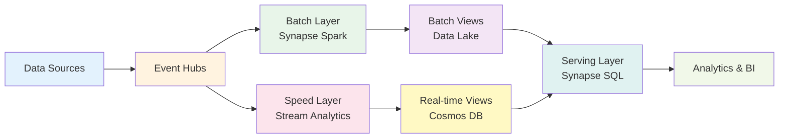

# 🌊 Lambda Architecture - Complete Tutorial

> **🏠 [Home](../../../../README.md)** | **📖 [Documentation](../../../README.md)** | **🎓 [Tutorials](../../README.md)** | **🏗️ [Architecture Tutorials](../README.md)** | **🌊 Lambda Architecture**

> **📝 Note**: This tutorial is currently in development. Check back soon!

## 🎯 Coming Soon

This tutorial will provide a complete walkthrough for implementing the Lambda Architecture pattern on Azure, combining batch and stream processing for comprehensive analytics.

### What You'll Learn

- **Lambda Architecture** fundamentals and design principles
- **Batch Layer** implementation with Azure Synapse Spark
- **Speed Layer** implementation with Stream Analytics
- **Serving Layer** with Azure SQL and Synapse Serverless
- **Data reconciliation** between batch and streaming paths
- **End-to-end data pipeline** from ingestion to visualization

### What You'll Build

### Tutorial Contents (Planned)

- ✅ **Complete tutorial documentation** with step-by-step instructions
- ✅ **Azure Bicep IaC templates** for automated deployment
- ✅ **Jupyter notebooks** for interactive learning
- ✅ **Sample IoT/streaming data** generators
- ✅ **Monitoring and alerting** configuration
- ✅ **Performance tuning** guidance

### Architecture Components

| Component | Azure Service | Purpose |
|-----------|---------------|---------|
| **Data Ingestion** | Event Hubs | Streaming data collection |
| **Batch Processing** | Synapse Spark | Historical data processing |
| **Stream Processing** | Stream Analytics | Real-time processing |
| **Batch Storage** | Data Lake Gen2 | Batch views storage |
| **Speed Storage** | Cosmos DB | Real-time views storage |
| **Serving Layer** | Synapse SQL Serverless | Unified query interface |
| **Orchestration** | Data Factory | Batch job scheduling |
| **Visualization** | Power BI | Analytics dashboards |

### Prerequisites

Before starting this tutorial:

- Complete the [Prerequisites Guide](../PREREQUISITES.md)
- Recommended: Complete [Medallion Architecture Tutorial](../batch/medallion-architecture-tutorial.md)
- Familiarity with streaming concepts
- Understanding of batch vs. real-time processing

### Estimated Costs

**Tutorial Completion**: $15-25  
**Monthly Production**: $200-500 (varies by data volume)

---

## 📚 Related Resources

While this tutorial is in development, explore these resources:

### Related Tutorials

- [Kappa Architecture](kappa-architecture-tutorial.md) - Stream-first alternative
- [Medallion Architecture](../batch/medallion-architecture-tutorial.md) - Batch lakehouse pattern
- [Lambda-Kappa Hybrid](../hybrid/lambda-kappa-hybrid-tutorial.md) - Combined approach

### Documentation

- [Lambda Architecture Pattern](../../../03-architecture-patterns/streaming-architectures/lambda-architecture.md)
- [Event Hubs Documentation](https://learn.microsoft.com/en-us/azure/event-hubs/)
- [Stream Analytics Documentation](https://learn.microsoft.com/en-us/azure/stream-analytics/)

### External Resources

- [Lambda Architecture by Nathan Marz](http://nathanmarz.com/blog/how-to-beat-the-cap-theorem.html)
- [Azure Architecture Center - Lambda Architecture](https://learn.microsoft.com/en-us/azure/architecture/data-guide/big-data/#lambda-architecture)

---

## 📧 Stay Updated

Want to be notified when this tutorial is available?

- ⭐ **Star this repository** to get notifications
- 👀 **Watch releases** for tutorial updates
- 📬 **Follow the project** for announcements

---

**Status**: In Development  
**Expected Release**: Q1 2025  
**Last Updated**: 2025-12-12
