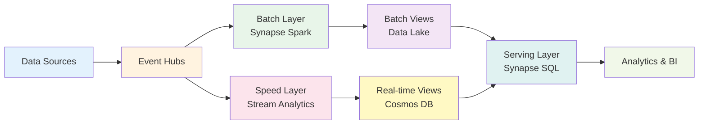

# 🌊 Lambda Architecture - Complete Tutorial

> __🏠 [Home](../../../../README.md)__ | __📖 [Documentation](../../../README.md)__ | __🎓 [Tutorials](../../README.md)__ | __🏗️ [Architecture Tutorials](../README.md)__ | __🌊 Lambda Architecture__

> __📝 Note__: This tutorial is currently in development. Check back soon!

## 🎯 Coming Soon

This tutorial will provide a complete walkthrough for implementing the Lambda Architecture pattern on Azure, combining batch and stream processing for comprehensive analytics.

### What You'll Learn

- __Lambda Architecture__ fundamentals and design principles
- __Batch Layer__ implementation with Azure Synapse Spark
- __Speed Layer__ implementation with Stream Analytics
- __Serving Layer__ with Azure SQL and Synapse Serverless
- __Data reconciliation__ between batch and streaming paths
- __End-to-end data pipeline__ from ingestion to visualization

### What You'll Build

### Tutorial Contents (Planned)

- ✅ __Complete tutorial documentation__ with step-by-step instructions
- ✅ __Azure Bicep IaC templates__ for automated deployment
- ✅ __Jupyter notebooks__ for interactive learning
- ✅ __Sample IoT/streaming data__ generators
- ✅ __Monitoring and alerting__ configuration
- ✅ __Performance tuning__ guidance

### Architecture Components

| Component | Azure Service | Purpose |
| ----------- | --------------- | --------- |
| __Data Ingestion__ | Event Hubs | Streaming data collection |
| __Batch Processing__ | Synapse Spark | Historical data processing |
| __Stream Processing__ | Stream Analytics | Real-time processing |
| __Batch Storage__ | Data Lake Gen2 | Batch views storage |
| __Speed Storage__ | Cosmos DB | Real-time views storage |
| __Serving Layer__ | Synapse SQL Serverless | Unified query interface |
| __Orchestration__ | Data Factory | Batch job scheduling |
| __Visualization__ | Power BI | Analytics dashboards |

### Prerequisites

Before starting this tutorial:

- Complete the [Prerequisites Guide](../PREREQUISITES.md)
- Recommended: Complete [Medallion Architecture Tutorial](../batch/medallion-architecture-tutorial.md)
- Familiarity with streaming concepts
- Understanding of batch vs. real-time processing

### Estimated Costs

__Tutorial Completion__: $15-25  
**Monthly Production**: $200-500 (varies by data volume)

---

## 📚 Related Resources

While this tutorial is in development, explore these resources:

### Related Tutorials

- [Kappa Architecture](kappa-architecture-tutorial.md) - Stream-first alternative
- [Medallion Architecture](../batch/medallion-architecture-tutorial.md) - Batch lakehouse pattern
- [Lambda-Kappa Hybrid](../hybrid/lambda-kappa-hybrid-tutorial.md) - Combined approach

### Documentation

- [Lambda Architecture Pattern](../../../03-architecture-patterns/streaming-architectures/lambda-architecture.md)
- [Event Hubs Documentation](https://learn.microsoft.com/en-us/azure/event-hubs/)
- [Stream Analytics Documentation](https://learn.microsoft.com/en-us/azure/stream-analytics/)

### External Resources

- [Lambda Architecture by Nathan Marz](http://nathanmarz.com/blog/how-to-beat-the-cap-theorem.html)
- [Azure Architecture Center - Lambda Architecture](https://learn.microsoft.com/en-us/azure/architecture/data-guide/big-data/#lambda-architecture)

---

## 📧 Stay Updated

Want to be notified when this tutorial is available?

- ⭐ __Star this repository__ to get notifications
- 👀 __Watch releases__ for tutorial updates
- 📬 __Follow the project__ for announcements

---

__Status__: In Development  
__Expected Release__: Q1 2025  
__Last Updated__: 2025-12-12
