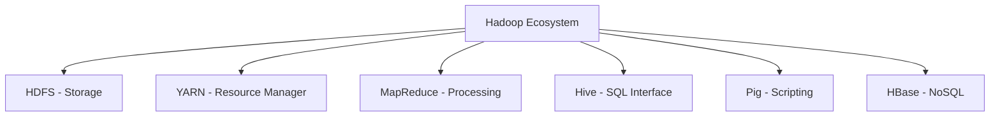

# 🐘 HDInsight Hadoop Introduction

> __🏠 [Home](../../../README.md)__ | __📖 [Documentation](../../README.md)__ | __🎓 [Tutorials](../README.md)__ | __🎯 Beginner__ | __🐘 Hadoop Intro__


__Deep dive into Hadoop on HDInsight. Learn HDFS, MapReduce, YARN, and Hive for distributed data processing.__

## 🎯 Learning Objectives

After completing this tutorial, you will be able to:

- Understand Hadoop ecosystem components
- Work with HDFS (Hadoop Distributed File System)
- Write and run MapReduce jobs
- Use YARN for resource management
- Build data pipelines with Hive
- Implement data ingestion patterns

## 📋 Prerequisites

- [ ] __HDInsight cluster__ - [Create one](hdinsight-quickstart.md)
- [ ] __Basic Linux commands__ - cd, ls, cat
- [ ] __Basic Java or Python__ - For MapReduce examples
- [ ] __SQL knowledge__ - For Hive queries

## 🔍 Hadoop Ecosystem Overview

### __Core Components__



__HDFS__ - Distributed file system
__YARN__ - Resource scheduler
__MapReduce__ - Batch processing framework
__Hive__ - SQL-like query language
__Pig__ - Data flow scripting
__HBase__ - Column-family NoSQL database

## 📁 Working with HDFS

### __HDFS Architecture__

- __NameNode__ - Manages metadata, directory structure
- __DataNodes__ - Store actual data blocks
- __Replication__ - Data replicated 3x by default
- __Block Size__ - Files split into 128MB blocks

### __Basic HDFS Commands__

```bash
# SSH into cluster
ssh sshuser@your-cluster-ssh.azurehdinsight.net

# List files
hdfs dfs -ls /

# Create directory
hdfs dfs -mkdir /user/sshuser/data

# Upload file
hdfs dfs -put sales.csv /user/sshuser/data/

# View file content
hdfs dfs -cat /user/sshuser/data/sales.csv

# Download file
hdfs dfs -get /user/sshuser/data/sales.csv ./local-sales.csv

# Delete file
hdfs dfs -rm /user/sshuser/data/sales.csv

# View disk usage
hdfs dfs -du -h /user/sshuser/

# Get file status
hdfs dfs -stat "%n %o %r" /user/sshuser/data/sales.csv
```

### __HDFS Best Practices__

```bash
# Check HDFS health
hdfs dfsadmin -report

# Check replication factor
hdfs dfs -stat "%r" /user/sshuser/data/sales.csv

# Change replication
hdfs dfs -setrep -w 3 /user/sshuser/data/sales.csv
```

## 🗺️ MapReduce Programming

### __MapReduce Concept__

1. __Map Phase__ - Process input data in parallel
2. __Shuffle & Sort__ - Group data by key
3. __Reduce Phase__ - Aggregate results

### __Python Streaming Example**

Create `mapper.py`:

```python
#!/usr/bin/env python3
"""
Mapper: Read sales data and emit category-amount pairs
"""
import sys

for line in sys.stdin:
    line = line.strip()
    if not line or line.startswith('order_id'):  # Skip header
        continue

    fields = line.split(',')
    if len(fields) >= 4:
        category = fields[2]
        amount = fields[3]
        print(f"{category}\t{amount}")
```

Create `reducer.py`:

```python
#!/usr/bin/env python3
"""
Reducer: Sum amounts by category
"""
import sys
from collections import defaultdict

category_totals = defaultdict(float)

for line in sys.stdin:
    line = line.strip()
    category, amount = line.split('\t')
    category_totals[category] += float(amount)

for category, total in category_totals.items():
    print(f"{category}\t{total:.2f}")
```

### __Run MapReduce Job__

```bash
# Make scripts executable
chmod +x mapper.py reducer.py

# Upload to HDFS
hdfs dfs -put mapper.py reducer.py /user/sshuser/

# Run Hadoop Streaming job
hadoop jar \
  /usr/hdp/current/hadoop-mapreduce-client/hadoop-streaming.jar \
  -files mapper.py,reducer.py \
  -mapper mapper.py \
  -reducer reducer.py \
  -input /user/sshuser/data/sales.csv \
  -output /user/sshuser/output/sales-by-category

# View results
hdfs dfs -cat /user/sshuser/output/sales-by-category/part-00000
```

## 🐝 Advanced Hive Usage

### __Complex Queries**

```sql
-- Sales analysis with multiple aggregations
SELECT
    category,
    COUNT(DISTINCT product) as unique_products,
    COUNT(*) as total_orders,
    SUM(amount) as total_revenue,
    AVG(amount) as avg_order_value,
    MIN(amount) as min_order,
    MAX(amount) as max_order
FROM sales
GROUP BY category;
```

```sql
-- Window functions for ranking
SELECT
    product,
    category,
    amount,
    RANK() OVER (PARTITION BY category ORDER BY amount DESC) as rank_in_category
FROM sales;
```

### __User-Defined Functions (UDF)**

```sql
-- Create temporary function
ADD JAR /path/to/my-udf.jar;
CREATE TEMPORARY FUNCTION my_upper AS 'com.example.MyUpper';

-- Use UDF
SELECT my_upper(product) FROM sales;
```

### __Optimization Techniques__

```sql
-- Enable cost-based optimization
SET hive.cbo.enable=true;
SET hive.compute.query.using.stats=true;
SET hive.stats.fetch.column.stats=true;

-- Enable vectorization
SET hive.vectorized.execution.enabled=true;
SET hive.vectorized.execution.reduce.enabled=true;

-- Parallel execution
SET hive.exec.parallel=true;
SET hive.exec.parallel.thread.number=8;
```

## 🔄 YARN Resource Management

### __Monitor Applications__

```bash
# List running applications
yarn application -list

# Get application status
yarn application -status application_1234567890_0001

# Kill application
yarn application -kill application_1234567890_0001

# View logs
yarn logs -applicationId application_1234567890_0001
```

### __Configure Resources__

```bash
# Check cluster capacity
yarn node -list

# Queue configuration
yarn queue -status default

# Resource allocation
yarn applicationattempt -list application_1234567890_0001
```

## 📊 Data Pipelines with Hive

### __ETL Pipeline Example**

```sql
-- Step 1: Create staging table
CREATE EXTERNAL TABLE sales_staging (
    order_id INT,
    product STRING,
    category STRING,
    amount DECIMAL(10,2),
    order_date DATE
)
ROW FORMAT DELIMITED FIELDS TERMINATED BY ','
LOCATION '/user/sshuser/staging/';

-- Step 2: Data quality checks
CREATE TABLE data_quality_issues AS
SELECT * FROM sales_staging
WHERE amount < 0
   OR order_id IS NULL
   OR product IS NULL;

-- Step 3: Clean and load to production
INSERT INTO TABLE sales_production
SELECT * FROM sales_staging
WHERE order_id IS NOT NULL
  AND amount >= 0;

-- Step 4: Create aggregates
CREATE TABLE daily_sales AS
SELECT
    order_date,
    category,
    COUNT(*) as order_count,
    SUM(amount) as total_sales
FROM sales_production
GROUP BY order_date, category;
```

### __Incremental Loading**

```sql
-- Load only new data
INSERT INTO TABLE sales_production
SELECT * FROM sales_staging
WHERE order_date > (SELECT MAX(order_date) FROM sales_production);
```

## 💡 Performance Tuning

### __Partitioning Strategy**

```sql
-- Create partitioned table
CREATE TABLE sales_partitioned (
    order_id INT,
    product STRING,
    category STRING,
    amount DECIMAL(10,2)
)
PARTITIONED BY (year INT, month INT)
STORED AS ORC;

-- Load with dynamic partitioning
SET hive.exec.dynamic.partition=true;
SET hive.exec.dynamic.partition.mode=nonstrict;

INSERT INTO sales_partitioned PARTITION (year, month)
SELECT
    order_id,
    product,
    category,
    amount,
    YEAR(order_date) as year,
    MONTH(order_date) as month
FROM sales;
```

### __Bucketing**

```sql
-- Create bucketed table for efficient joins
CREATE TABLE sales_bucketed (
    order_id INT,
    product STRING,
    category STRING,
    amount DECIMAL(10,2),
    order_date DATE
)
CLUSTERED BY (category) INTO 4 BUCKETS
STORED AS ORC;
```

### __Indexing**

```sql
-- Create bitmap index
CREATE INDEX idx_category
ON TABLE sales (category)
AS 'BITMAP'
WITH DEFERRED REBUILD;

-- Rebuild index
ALTER INDEX idx_category ON sales REBUILD;
```

## 🔧 Troubleshooting

### __Common Issues**

__Job Fails with Container Killed**

- ✅ Increase container memory
- ✅ Check YARN logs
- ✅ Reduce data size

__Hive Query Hangs**

- ✅ Check YARN Resource Manager
- ✅ Review query execution plan
- ✅ Optimize joins

__HDFS Out of Space**

- ✅ Clean old data
- ✅ Check replication factor
- ✅ Add storage nodes

## 🎓 Practice Exercises

### __Exercise 1: Build ETL Pipeline**

- [ ] Create staging tables
- [ ] Implement data validation
- [ ] Load to production tables
- [ ] Create aggregates

### __Exercise 2: Optimize Queries**

- [ ] Partition large table
- [ ] Implement bucketing
- [ ] Test query performance
- [ ] Compare execution times

### __Exercise 3: MapReduce Job**

- [ ] Write custom mapper
- [ ] Write custom reducer
- [ ] Run on cluster
- [ ] Analyze results

## 📚 Additional Resources

### __Documentation__

- [Hadoop Documentation](https://hadoop.apache.org/docs/current/)
- [Hive Language Manual](https://cwiki.apache.org/confluence/display/Hive/LanguageManual)
- [HDFS Architecture](https://hadoop.apache.org/docs/current/hadoop-project-dist/hadoop-hdfs/HdfsDesign.html)

### __Next Tutorials**

- [HDInsight Spark](../intermediate/hdinsight-spark.md)
- [Hadoop Migration](../advanced/hadoop-migration-workshop.md)
- [Data Engineer Path](../learning-paths/data-engineer-path.md)

## 🎉 Summary

You've learned:

✅ HDFS file system operations
✅ MapReduce programming
✅ YARN resource management
✅ Advanced Hive queries
✅ Performance optimization
✅ ETL pipeline patterns

Ready for enterprise Hadoop workloads!

---

*Last Updated: January 2025*
*Tutorial Version: 1.0*
