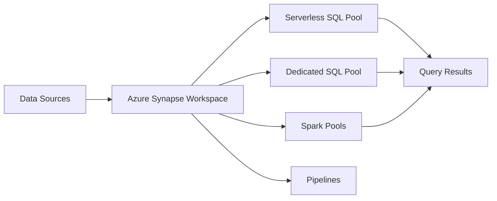

# = Azure Synapse Analytics Quickstart

> __< [Home](../../../README.md)__ | __= [Documentation](../../README.md)__ | __< [Tutorials](../README.md)__ | __< Beginner__ | __= Synapse__


__Get started with Azure Synapse Analytics in under an hour. Create your first workspace, load data, and run your first analytics query.__

## < Learning Objectives

After completing this quickstart, you will be able to:

- Understand what Azure Synapse Analytics is and its components
- Create and configure a Synapse workspace
- Load data into Data Lake Storage
- Query data using Serverless SQL Pool
- Visualize results in Azure Portal

## = Prerequisites

- [ ] __Azure subscription__ - [Create free account](https://azure.microsoft.com/free/)
- [ ] __Basic SQL knowledge__ - Understanding of SELECT, WHERE, JOIN
- [ ] __Azure Portal access__ - [portal.azure.com](https://portal.azure.com)
- [ ] __5-10 minutes__ to complete setup

## =
 What is Azure Synapse Analytics?

Azure Synapse is a unified analytics platform that brings together:

- __Data Integration__: Pipelines for ETL/ELT
- __Data Warehousing__: Dedicated and Serverless SQL pools
- __Big Data Analytics__: Apache Spark pools for distributed processing
- __Data Exploration__: Integrated notebooks and SQL scripts
- __Visualization__: Power BI integration

### __Key Components__



## = Step 1: Create Synapse Workspace

### __Using Azure Portal__

1. __Navigate to Azure Portal__
   - Go to [portal.azure.com](https://portal.azure.com)
   - Click "Create a resource"
   - Search for "Azure Synapse Analytics"
   - Click "Create"

2. __Configure Basics__
   - __Subscription__: Select your subscription
   - __Resource Group__: Create new "rg-synapse-quickstart"
   - __Workspace Name__: "synapse-quickstart-[yourname]" (must be globally unique)
   - __Region__: Select nearest region
   - __Account Name__: Create new storage account (auto-generated)
   - __File System Name__: "data"

3. __Configure Security__
   - __SQL Administrator Login__: "sqladmin"
   - __Password__: Create strong password (save it!)
   - __Allow connections from__: Select "All networks" for quickstart

4. __Review and Create__
   - Click "Review + create"
   - Click "Create"
   - Wait 5-10 minutes for deployment

### __Verify Deployment__

Once deployment completes:

1. Click "Go to resource"
2. Click "Open Synapse Studio"
3. You should see the Synapse Studio interface

__Tip:__ Bookmark the Synapse Studio URL for easy access

## = Step 2: Prepare Sample Data

We'll use a sample CSV file with sales data.

### __Create Sample Data File__

Create a file named `sales_data.csv`:

```csv
order_id,product,category,amount,order_date,customer_id
1001,Laptop,Electronics,1299.99,2024-01-15,C101
1002,Chair,Furniture,249.99,2024-01-15,C102
1003,Monitor,Electronics,399.99,2024-01-16,C101
1004,Desk,Furniture,549.99,2024-01-16,C103
1005,Keyboard,Electronics,89.99,2024-01-17,C102
1006,Mouse,Electronics,39.99,2024-01-17,C104
1007,Lamp,Furniture,79.99,2024-01-18,C101
1008,Tablet,Electronics,599.99,2024-01-18,C105
1009,Bookshelf,Furniture,299.99,2024-01-19,C103
1010,Phone,Electronics,899.99,2024-01-19,C102
```

### __Upload to Data Lake Storage__

1. __Open Synapse Studio__
   - Click "Data" hub (database icon on left)
   - Select "Linked" tab
   - Expand "Azure Data Lake Storage Gen2"
   - Expand your storage account
   - Expand "data" container

2. __Create Folder__
   - Right-click on "data"
   - Select "New folder"
   - Name it "sales"

3. __Upload File__
   - Right-click "sales" folder
   - Select "Upload files"
   - Choose `sales_data.csv`
   - Click "Upload"

## =
 Step 3: Query Data with Serverless SQL

Serverless SQL Pool lets you query data directly in storage without loading it first.

### __Create SQL Script__

1. __Open Develop Hub__
   - Click "Develop" hub (document icon on left)
   - Click "+" to add new resource
   - Select "SQL script"

2. __Write Query__

```sql
-- Query sales data from CSV file
SELECT
    *
FROM OPENROWSET(
    BULK 'https://[your-storage-account].dfs.core.windows.net/data/sales/sales_data.csv',
    FORMAT = 'CSV',
    PARSER_VERSION = '2.0',
    HEADER_ROW = TRUE
) AS sales_data;
```

3. __Update Storage Account Name__
   - Replace `[your-storage-account]` with your actual storage account name
   - Find it in the Data hub under Linked > Azure Data Lake Storage Gen2

4. __Run Query__
   - Click "Run" button
   - View results in the output pane

### __Analyze Sales Data__

Try these example queries:

__Total Sales by Category:__

```sql
SELECT
    category,
    COUNT(*) AS order_count,
    SUM(CAST(amount AS DECIMAL(10,2))) AS total_sales,
    AVG(CAST(amount AS DECIMAL(10,2))) AS avg_order_value
FROM OPENROWSET(
    BULK 'https://[your-storage-account].dfs.core.windows.net/data/sales/sales_data.csv',
    FORMAT = 'CSV',
    PARSER_VERSION = '2.0',
    HEADER_ROW = TRUE
) AS sales_data
GROUP BY category
ORDER BY total_sales DESC;
```

__Top Customers by Spend:__

```sql
SELECT
    customer_id,
    COUNT(*) AS order_count,
    SUM(CAST(amount AS DECIMAL(10,2))) AS total_spent
FROM OPENROWSET(
    BULK 'https://[your-storage-account].dfs.core.windows.net/data/sales/sales_data.csv',
    FORMAT = 'CSV',
    PARSER_VERSION = '2.0',
    HEADER_ROW = TRUE
) AS sales_data
GROUP BY customer_id
ORDER BY total_spent DESC;
```

__Daily Sales Trend:__

```sql
SELECT
    CAST(order_date AS DATE) AS sale_date,
    COUNT(*) AS orders,
    SUM(CAST(amount AS DECIMAL(10,2))) AS daily_sales
FROM OPENROWSET(
    BULK 'https://[your-storage-account].dfs.core.windows.net/data/sales/sales_data.csv',
    FORMAT = 'CSV',
    PARSER_VERSION = '2.0',
    HEADER_ROW = TRUE
) AS sales_data
GROUP BY CAST(order_date AS DATE)
ORDER BY sale_date;
```

## = Step 4: Create a Database View

Make queries easier by creating a view.

```sql
-- Create database for views
CREATE DATABASE SalesDB;
GO

-- Use the new database
USE SalesDB;
GO

-- Create external data source
CREATE EXTERNAL DATA SOURCE SalesData
WITH (
    LOCATION = 'https://[your-storage-account].dfs.core.windows.net/data/sales/'
);
GO

-- Create view
CREATE VIEW vw_Sales AS
SELECT
    CAST(order_id AS INT) AS order_id,
    product,
    category,
    CAST(amount AS DECIMAL(10,2)) AS amount,
    CAST(order_date AS DATE) AS order_date,
    customer_id
FROM OPENROWSET(
    BULK 'sales_data.csv',
    DATA_SOURCE = 'SalesData',
    FORMAT = 'CSV',
    PARSER_VERSION = '2.0',
    HEADER_ROW = TRUE
) AS sales_data;
GO
```

__Now query the view:__

```sql
-- Much simpler query!
SELECT
    category,
    SUM(amount) AS total_sales
FROM vw_Sales
GROUP BY category
ORDER BY total_sales DESC;
```

## = Step 5: Visualize Results

### __Built-in Chart Visualization__

1. Run a query
2. Click "Chart" tab in results pane
3. Configure chart:
   - __Chart Type__: Column chart
   - __Category Column__: category
   - __Legend__: None
   - __Value__: total_sales

### __Export Results__

- __CSV__: Click "Export" > "CSV"
- __Excel__: Click "Export" > "Excel"
- __Power BI__: Click "Chart" > "Export to Power BI"

## = Understanding Serverless SQL

### __Key Benefits__

 __No Infrastructure Management__

- No servers to provision or manage
- Automatically scales based on query complexity

 __Pay-Per-Query__

- Only pay for data processed (per TB scanned)
- No idle costs when not querying

 __Query Data in Place__

- No need to load/copy data
- Query files directly in storage

 __Support Multiple Formats__

- CSV, Parquet, JSON, Delta Lake
- Compressed files (gzip, snappy)

### __Best Practices__

1. __Use Parquet for Large Datasets__
   - More efficient than CSV
   - Built-in compression
   - Columnar format (better for analytics)

2. __Partition Your Data__
   - Organize by date: `/year=2024/month=01/day=15/`
   - Use folder partition elimination in queries

3. __Create Statistics__
   - Improves query performance
   - Auto-creates for frequently queried columns

## =' Troubleshooting

### __Common Issues__

__Error: "External table access failed"__

-  Check storage account name and container
-  Verify file exists in specified path
-  Ensure Synapse workspace has storage access

__Error: "Permission denied"__

-  Grant "Storage Blob Data Contributor" role to Synapse workspace MSI
-  Go to Storage Account > Access Control (IAM) > Add role assignment

__Query Returns No Results__

-  Verify CSV header row matches query
-  Check file path and name spelling
-  Ensure file uploaded successfully

## < Next Steps

### __Beginner Practice__

- [ ] Upload your own CSV files
- [ ] Create additional views
- [ ] Join multiple files in a query
- [ ] Export results to Power BI

### __Intermediate Challenges__

- [ ] Query Parquet files instead of CSV
- [ ] Create partitioned folder structure
- [ ] Build external tables
- [ ] Use CETAS to save query results

### __Advanced Topics__

- [ ] Create Spark Pool for big data processing
- [ ] Build data pipeline with Data Factory
- [ ] Implement row-level security
- [ ] Integrate with Azure Purview

## = Additional Resources

### __Documentation__

- [Synapse Overview](https://learn.microsoft.com/azure/synapse-analytics/overview-what-is)
- [Serverless SQL Pool Documentation](https://learn.microsoft.com/azure/synapse-analytics/sql/on-demand-workspace-overview)
- [OPENROWSET Reference](https://learn.microsoft.com/azure/synapse-analytics/sql/develop-openrowset)

### __Next Tutorials__

- [Synapse Complete Tutorial](../synapse/README.md) - Deep dive into all features
- [Data Engineer Learning Path](../learning-paths/data-engineer-path.md)
- [Serverless SQL Best Practices](../../best-practices/serverless-sql-best-practices.md)

## > Cleanup

To avoid Azure charges:

### __Delete Resource Group__

```bash
# Using Azure CLI
az group delete --name rg-synapse-quickstart --yes --no-wait
```

Or in Azure Portal:

1. Navigate to Resource Groups
2. Select "rg-synapse-quickstart"
3. Click "Delete resource group"
4. Type resource group name to confirm
5. Click "Delete"

__Note:__ This deletes the workspace, storage account, and all data!

## < Congratulations!

You've successfully:

 Created Azure Synapse Analytics workspace
 Uploaded data to Data Lake Storage
 Queried data with Serverless SQL Pool
 Created database views for easier analysis
 Visualized query results

You're ready to build more complex analytics solutions with Azure Synapse!

---

__Ready for more?__ Try the [Complete Synapse Tutorial](../synapse/README.md)

---

*Last Updated: January 2025*
*Tutorial Version: 1.0*
*Tested with: Azure Synapse Analytics (December 2024 release)*
