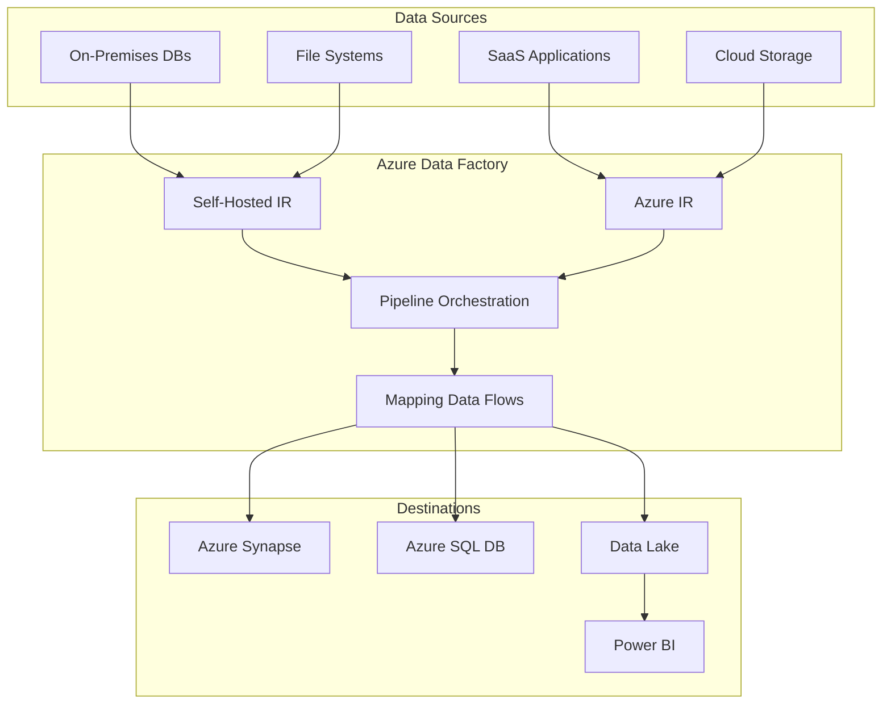
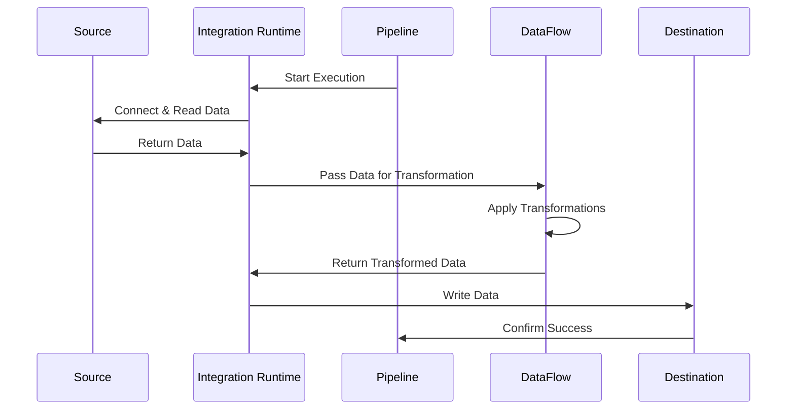

# 🎯 Azure Data Factory Fundamentals

> __🏠 [Home](../../../README.md)__ | __📖 [Documentation](../../README.md)__ | __🎓 [Tutorials](../README.md)__ | __🔄 [Data Factory](README.md)__ | __Fundamentals__


__Master the foundational concepts of Azure Data Factory (ADF) including architecture, components, and design patterns for enterprise data integration.__

## 📋 Table of Contents

- [What is Azure Data Factory?](#what-is-azure-data-factory)
- [Core Components](#core-components)
- [Architecture Overview](#architecture-overview)
- [Integration Patterns](#integration-patterns)
- [Use Cases](#use-cases)
- [When to Use ADF](#when-to-use-adf)
- [Next Steps](#next-steps)

## 🌟 What is Azure Data Factory?

Azure Data Factory is a cloud-based data integration service that allows you to create data-driven workflows for orchestrating and automating data movement and data transformation.

### Key Capabilities

- __Data Movement__: Copy data between 90+ supported data sources
- __Data Transformation__: Transform data using compute services like Azure Databricks, HDInsight, and Synapse
- __Orchestration__: Build complex workflows with conditional logic and dependencies
- __Scheduling__: Execute pipelines on-demand or with automated triggers
- __Monitoring__: Track pipeline execution and performance metrics

### ADF vs Traditional ETL Tools

| Feature | Traditional ETL | Azure Data Factory |
|---------|----------------|-------------------|
| __Infrastructure__ | On-premises servers | Serverless cloud service |
| __Scalability__ | Manual scaling | Auto-scaling |
| __Pricing Model__ | License + hardware costs | Pay-per-use |
| __Maintenance__ | Manual updates | Managed service |
| __Integration__ | Limited connectors | 90+ native connectors |
| __Development__ | Code-heavy | Visual + code options |

## 🏗️ Core Components

### Pipelines

A pipeline is a logical grouping of activities that together perform a task.

```json
{
  "name": "CopyPipeline",
  "properties": {
    "activities": [
      {
        "name": "CopyFromBlobToSQL",
        "type": "Copy",
        "inputs": [{"referenceName": "BlobDataset"}],
        "outputs": [{"referenceName": "SQLDataset"}]
      }
    ]
  }
}
```

__Pipeline Characteristics__:

- Contain one or more activities
- Can be parameterized for reusability
- Support dependencies and conditional execution
- Can be triggered manually or automatically

### Activities

Activities represent processing steps within a pipeline.

__Activity Categories__:

1. __Data Movement Activities__
   - Copy Activity: Move data between sources
   - Data Flow: Transform data at scale

2. __Data Transformation Activities__
   - Databricks Notebook
   - HDInsight Hive/Pig/Spark
   - Stored Procedure
   - Custom Activity

3. __Control Activities__
   - ForEach: Iterate over collections
   - If Condition: Conditional branching
   - Wait: Add delays
   - Web Activity: Call REST APIs

### Datasets

Datasets identify data within data stores.

```json
{
  "name": "AzureSQLDataset",
  "properties": {
    "linkedServiceName": {
      "referenceName": "AzureSQLLinkedService",
      "type": "LinkedServiceReference"
    },
    "type": "AzureSqlTable",
    "typeProperties": {
      "tableName": "dbo.Customer"
    }
  }
}
```

__Dataset Properties__:

- __Schema__: Structure of the data
- __Location__: Where the data resides
- __Format__: Parquet, CSV, JSON, Avro, etc.
- __Partitioning__: How data is organized

### Linked Services

Linked services define connection information to data sources.

__Types of Linked Services__:

1. __Data Stores__: Azure Blob, Azure SQL, On-premises SQL Server
2. __Compute Services__: Azure Databricks, HDInsight, Synapse
3. __Other Services__: Azure Key Vault, Azure Function

```json
{
  "name": "AzureSQLLinkedService",
  "properties": {
    "type": "AzureSqlDatabase",
    "typeProperties": {
      "connectionString": "Server=tcp:myserver.database.windows.net,1433;Database=mydb;",
      "authenticationType": "ServicePrincipal",
      "servicePrincipalId": "xxxx-xxxx-xxxx-xxxx",
      "servicePrincipalKey": {
        "type": "AzureKeyVaultSecret",
        "store": {
          "referenceName": "AzureKeyVault",
          "type": "LinkedServiceReference"
        },
        "secretName": "sql-password"
      },
      "tenant": "xxxx-xxxx-xxxx-xxxx"
    }
  }
}
```

### Integration Runtime

The Integration Runtime (IR) provides the compute infrastructure for data movement and transformation.

__IR Types__:

1. __Azure Integration Runtime__
   - Serverless compute
   - Data movement between cloud data stores
   - Dispatch activities to compute services

2. __Self-Hosted Integration Runtime__
   - Installed on on-premises or VM
   - Access data behind firewalls
   - Private network connectivity

3. __Azure-SSIS Integration Runtime__
   - Execute SSIS packages in the cloud
   - Lift-and-shift SSIS workloads

### Triggers

Triggers determine when pipeline execution should start.

__Trigger Types__:

| Trigger Type | Description | Use Case |
|--------------|-------------|----------|
| __Schedule__ | Time-based execution | Daily batch processing |
| __Tumbling Window__ | Fixed-size, non-overlapping intervals | Hourly aggregations |
| __Event-Based__ | Responds to events (file arrival) | Real-time processing |
| __Manual__ | On-demand execution | Ad-hoc processing |

## 🎨 Architecture Overview

### High-Level Architecture



### Data Factory Workflow



## 🔄 Integration Patterns

### Pattern 1: Extract-Load-Transform (ELT)

Load raw data first, then transform in the destination system.

__Benefits__:

- Preserve raw data for reprocessing
- Leverage destination compute power
- Faster initial data loading

__When to Use__:

- Working with cloud data warehouses (Synapse, Snowflake)
- Need to preserve raw data
- Transformations are complex and compute-intensive

### Pattern 2: Extract-Transform-Load (ETL)

Transform data during the movement process.

__Benefits__:

- Reduced storage requirements
- Data quality validation before loading
- Pre-aggregated data

__When to Use__:

- Simple transformations
- Limited destination storage
- Need data validation before loading

### Pattern 3: Incremental Loading

Load only new or changed data since last execution.

```json
{
  "source": {
    "type": "AzureSqlSource",
    "sqlReaderQuery": "SELECT * FROM Sales WHERE ModifiedDate > '@{pipeline().parameters.LastRunTime}'"
  }
}
```

__Benefits__:

- Reduced data transfer
- Lower processing costs
- Faster execution times

### Pattern 4: Event-Driven Processing

Trigger pipelines based on data arrival or business events.

__Components__:

- Event Grid for file arrival detection
- Storage Event Triggers
- Service Bus for business events

## 💼 Use Cases

### Use Case 1: Data Warehouse Migration

__Scenario__: Migrate on-premises SQL Server data warehouse to Azure Synapse.

__ADF Solution__:

- Self-hosted IR for secure connectivity
- Incremental copy activities for large tables
- Mapping data flows for transformation logic
- Scheduling triggers for automated sync

### Use Case 2: Multi-Cloud Data Integration

__Scenario__: Consolidate data from AWS, GCP, and Azure into a unified data lake.

__ADF Solution__:

- Amazon S3 and Google Cloud Storage connectors
- Azure Data Lake Storage Gen2 as destination
- Data flows for standardization and cleansing
- Azure Purview for metadata management

### Use Case 3: Real-Time Analytics Pipeline

__Scenario__: Process streaming IoT data for real-time dashboards.

__ADF Solution__:

- Event Hub or IoT Hub as source
- Stream Analytics for real-time processing
- ADF for batch aggregation and archival
- Power BI for visualization

### Use Case 4: SaaS Data Consolidation

__Scenario__: Integrate data from Salesforce, Dynamics 365, and ServiceNow.

__ADF Solution__:

- Built-in SaaS connectors
- Scheduled triggers for daily sync
- Data flows for normalization
- Azure SQL Database for consolidated view

## ✅ When to Use ADF

### ADF is Ideal For:

- __Cloud-Native Data Integration__: Moving data between Azure services
- __Hybrid Scenarios__: Connecting on-premises and cloud data sources
- __Complex Orchestration__: Multi-step workflows with dependencies
- __Scalable Processing__: Large-volume data movement and transformation
- __Managed Service Benefits__: Minimal infrastructure management

### Consider Alternatives When:

- __Real-Time Streaming__: Use Azure Stream Analytics or Event Hubs
- __Complex Transformations__: Consider Azure Databricks or Synapse Spark
- __Simple File Transfers__: AzCopy or Storage Explorer might suffice
- __Code-First Development__: Azure Functions or custom applications

## 🎯 Key Concepts Summary

| Concept | Description | Example |
|---------|-------------|---------|
| __Pipeline__ | Logical workflow container | Daily sales data processing |
| __Activity__ | Processing step | Copy data from blob to SQL |
| __Dataset__ | Data reference | Customer table in SQL database |
| __Linked Service__ | Connection definition | Azure SQL Database connection |
| __Integration Runtime__ | Compute infrastructure | Self-hosted IR for on-premises access |
| __Trigger__ | Execution initiator | Daily at 2 AM schedule |
| __Parameter__ | Dynamic configuration | Date range for data extraction |

## 📚 Additional Resources

- [Azure Data Factory Documentation](https://docs.microsoft.com/azure/data-factory/)
- [ADF Pricing Calculator](https://azure.microsoft.com/pricing/details/data-factory/)
- [ADF Best Practices](../../best-practices/README.md)
- [ADF Design Patterns](https://docs.microsoft.com/azure/architecture/data-guide/)

## 🎯 Knowledge Check

Before proceeding, ensure you understand:

- [ ] What Azure Data Factory is and its core capabilities
- [ ] The six main components of ADF (Pipeline, Activity, Dataset, Linked Service, IR, Trigger)
- [ ] Difference between ETL and ELT patterns
- [ ] When to use Azure IR vs Self-Hosted IR
- [ ] Common ADF use cases and integration patterns

## 🚀 Next Steps

Now that you understand ADF fundamentals, proceed to:

__→ [02. Environment Setup](02-environment-setup.md)__ - Create and configure your first Data Factory

---

__Module Progress__: 1 of 18 complete

*Tutorial Version: 1.0*
*Last Updated: January 2025*
