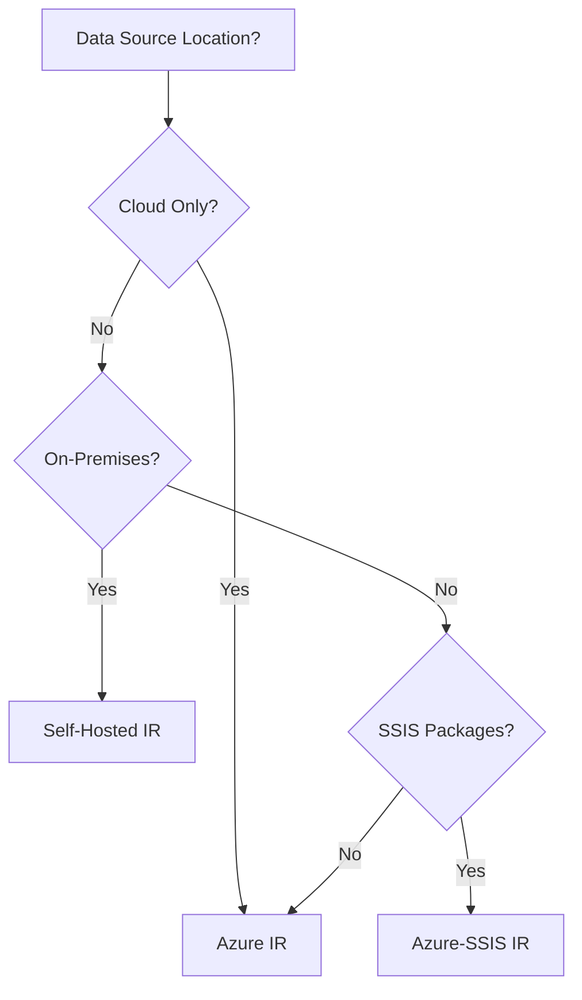
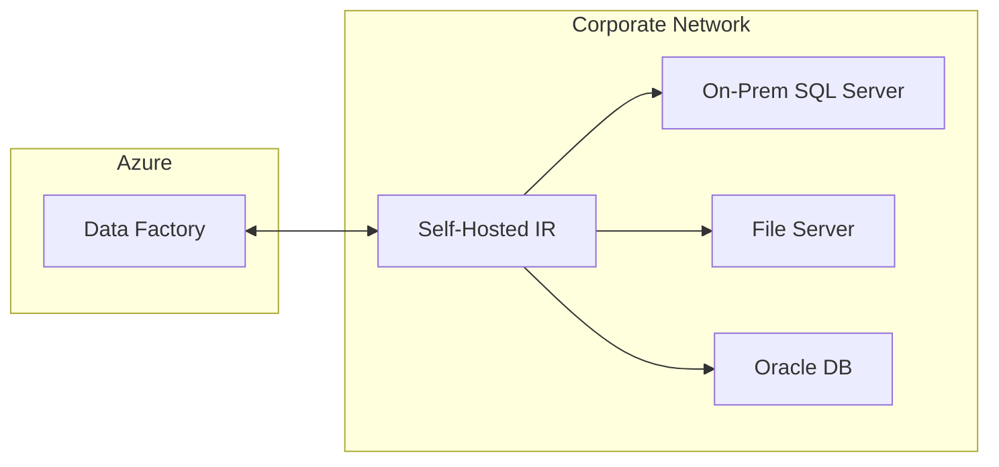

# ⚡ Integration Runtime Configuration

> __🏠 [Home](../../../README.md)__ | __📖 [Documentation](../../README.md)__ | __🎓 [Tutorials](../README.md)__ | __🔄 [Data Factory](README.md)__ | __Integration Runtime__


__Configure Azure Integration Runtime and Self-Hosted Integration Runtime for secure data movement across cloud and on-premises environments.__

## 📋 Table of Contents

- [Integration Runtime Overview](#integration-runtime-overview)
- [Azure Integration Runtime](#azure-integration-runtime)
- [Self-Hosted Integration Runtime](#self-hosted-integration-runtime)
- [Azure-SSIS Integration Runtime](#azure-ssis-integration-runtime)
- [Best Practices](#best-practices)
- [Next Steps](#next-steps)

## 🌟 Integration Runtime Overview

The Integration Runtime (IR) is the compute infrastructure used by Azure Data Factory to provide data integration capabilities across different network environments.

### IR Types Comparison

| Feature | Azure IR | Self-Hosted IR | Azure-SSIS IR |
|---------|----------|----------------|---------------|
| __Location__ | Azure cloud | On-premises/VM | Azure cloud |
| __Management__ | Fully managed | Self-managed | Partially managed |
| __Network__ | Public internet | Private network | Public/Private |
| __Use Case__ | Cloud data movement | On-premises access | SSIS package execution |
| __Scaling__ | Auto-scale | Manual scale | Manual scale |
| __Cost__ | Pay per use | VM costs + licensing | Compute + licensing |

### When to Use Each IR Type



## ☁️ Azure Integration Runtime

Azure IR is a fully managed, serverless compute infrastructure.

### Create Azure Integration Runtime

#### Using Azure Portal

1. Navigate to ADF Studio
2. Click __Manage__ (toolbox icon)
3. Click __Integration runtimes__
4. Click __+ New__
5. Select __Azure, Self-Hosted__
6. Select __Azure__
7. Configure settings:

```text
Azure IR Configuration:
├── Name: AzureIR-EastUS2
├── Description: Auto-resolve Azure IR for East US 2
├── Region: Auto Resolve (recommended)
├── Virtual Network: None (default)
└── Data Flow Runtime:
    ├── Compute type: General purpose
    ├── Core count: 4 cores
    └── Time to live: 10 minutes
```

#### Using PowerShell

```powershell
# Create Azure Integration Runtime
$ResourceGroupName = "rg-adf-tutorial-dev"
$DataFactoryName = "adf-tutorial-dev-001"
$IntegrationRuntimeName = "AzureIR-AutoResolve"

Set-AzDataFactoryV2IntegrationRuntime `
    -ResourceGroupName $ResourceGroupName `
    -DataFactoryName $DataFactoryName `
    -Name $IntegrationRuntimeName `
    -Type Managed `
    -Location "AutoResolve"

# Verify creation
Get-AzDataFactoryV2IntegrationRuntime `
    -ResourceGroupName $ResourceGroupName `
    -DataFactoryName $DataFactoryName `
    -Name $IntegrationRuntimeName
```

### Configure Region-Specific Azure IR

For better performance, create region-specific IRs:

```powershell
# Create East US 2 Integration Runtime
Set-AzDataFactoryV2IntegrationRuntime `
    -ResourceGroupName $ResourceGroupName `
    -DataFactoryName $DataFactoryName `
    -Name "AzureIR-EastUS2" `
    -Type Managed `
    -Location "East US 2"

# Create West Europe Integration Runtime
Set-AzDataFactoryV2IntegrationRuntime `
    -ResourceGroupName $ResourceGroupName `
    -DataFactoryName $DataFactoryName `
    -Name "AzureIR-WestEurope" `
    -Type Managed `
    -Location "West Europe"
```

### Configure Data Flow Runtime Settings

```json
{
  "name": "AzureIR-DataFlow-Optimized",
  "properties": {
    "type": "Managed",
    "typeProperties": {
      "computeProperties": {
        "location": "AutoResolve",
        "dataFlowProperties": {
          "computeType": "MemoryOptimized",
          "coreCount": 8,
          "timeToLive": 10,
          "cleanup": true
        }
      }
    }
  }
}
```

## 🏢 Self-Hosted Integration Runtime

Self-Hosted IR allows secure access to data sources in private networks.

### Architecture



### Create Self-Hosted Integration Runtime

#### Step 1: Create IR in Azure Portal

1. Navigate to ADF Studio > __Manage__ > __Integration runtimes__
2. Click __+ New__
3. Select __Self-Hosted__
4. Configure:

```text
Self-Hosted IR Configuration:
├── Name: SelfHostedIR-Corporate
├── Description: On-premises data access
└── Network environment: Private network
```

5. Click __Create__
6. Copy the __Authentication Key__ (you'll need this)

#### Step 2: Install Self-Hosted IR on Server

__System Requirements__:

- Windows Server 2012 R2 or later
- .NET Framework 4.7.2 or later
- Minimum 2 CPU cores
- Minimum 8 GB RAM
- 80 GB available disk space

__Installation Steps__:

```powershell
# Download installer
$DownloadUrl = "https://www.microsoft.com/en-us/download/details.aspx?id=39717"
$InstallerPath = "C:\Temp\IntegrationRuntime.msi"

# Install (run as Administrator)
Start-Process msiexec.exe -Wait -ArgumentList "/i $InstallerPath /quiet"

# Register with authentication key
$AuthKey = "YOUR_AUTHENTICATION_KEY_FROM_PORTAL"

& "C:\Program Files\Microsoft Integration Runtime\5.0\PowerShellScript\RegisterIntegrationRuntime.ps1" `
    -AuthenticationKey $AuthKey
```

#### Step 3: Verify Installation

```powershell
# Check IR status
Get-Service -Name "DIAHostService"

# View IR configuration
$ConfigFile = "C:\Program Files\Microsoft Integration Runtime\5.0\Shared\Microsoft.DataTransfer.Gateway.Configuration.json"
Get-Content $ConfigFile | ConvertFrom-Json
```

### Configure High Availability

Install multiple nodes for redundancy:

```powershell
# On second server, use the same authentication key
& "C:\Program Files\Microsoft Integration Runtime\5.0\PowerShellScript\RegisterIntegrationRuntime.ps1" `
    -AuthenticationKey $AuthKey

# Verify both nodes in portal
# Navigate to: ADF Studio > Manage > Integration runtimes > SelfHostedIR-Corporate
# You should see 2 nodes
```

### Self-Hosted IR Performance Tuning

```powershell
# Modify configuration file
$ConfigPath = "C:\Program Files\Microsoft Integration Runtime\5.0\Shared\Microsoft.DataTransfer.Gateway.Configuration.json"
$Config = Get-Content $ConfigPath | ConvertFrom-Json

# Increase concurrent jobs
$Config.node.maxConcurrentJobs = 8

# Increase memory limit (MB)
$Config.node.maxMemoryUsagePercentage = 80

# Save configuration
$Config | ConvertTo-Json -Depth 10 | Set-Content $ConfigPath

# Restart service
Restart-Service -Name "DIAHostService"
```

### Network Configuration

#### Open Required Ports

```powershell
# Outbound to Azure (HTTPS)
New-NetFirewallRule -DisplayName "ADF-HTTPS-Outbound" `
    -Direction Outbound `
    -Protocol TCP `
    -RemotePort 443 `
    -Action Allow

# Service Bus (for communication)
New-NetFirewallRule -DisplayName "ADF-ServiceBus" `
    -Direction Outbound `
    -Protocol TCP `
    -RemotePort 9350-9354 `
    -Action Allow
```

#### Configure Proxy (if required)

```powershell
# Set proxy settings
$ProxyServer = "http://proxy.company.com:8080"

& "C:\Program Files\Microsoft Integration Runtime\5.0\Shared\dmgcmd.exe" `
    -SetProxySettings $ProxyServer
```

## 🔄 Azure-SSIS Integration Runtime

For running SQL Server Integration Services (SSIS) packages in Azure.

### Create Azure-SSIS IR

```powershell
$ResourceGroupName = "rg-adf-tutorial-dev"
$DataFactoryName = "adf-tutorial-dev-001"
$AzureSSISName = "AzureSSISIR-Dev"
$AzureSSISLocation = "East US 2"

# Create Azure-SSIS IR
Set-AzDataFactoryV2IntegrationRuntime `
    -ResourceGroupName $ResourceGroupName `
    -DataFactoryName $DataFactoryName `
    -Name $AzureSSISName `
    -Type Managed `
    -Location $AzureSSISLocation `
    -NodeSize "Standard_D2_v3" `
    -NodeCount 2 `
    -MaxParallelExecutionsPerNode 2 `
    -Edition "Standard" `
    -LicenseType "LicenseIncluded"

# Start the IR (takes 15-20 minutes)
Start-AzDataFactoryV2IntegrationRuntime `
    -ResourceGroupName $ResourceGroupName `
    -DataFactoryName $DataFactoryName `
    -Name $AzureSSISName
```

### Configure SSIS Catalog

```powershell
# Configure with Azure SQL Database
$CatalogServerEndpoint = "your-sql-server.database.windows.net"
$CatalogAdminCredential = Get-Credential

Set-AzDataFactoryV2IntegrationRuntime `
    -ResourceGroupName $ResourceGroupName `
    -DataFactoryName $DataFactoryName `
    -Name $AzureSSISName `
    -CatalogServerEndpoint $CatalogServerEndpoint `
    -CatalogAdminCredential $CatalogAdminCredential `
    -CatalogPricingTier "S1"
```

## 🎯 Best Practices

### Azure IR Best Practices

1. __Use Auto-Resolve for Flexibility__
   - Automatically selects closest Azure region
   - Reduces data transfer costs

2. __Region-Specific IRs for Compliance__
   - Create dedicated IRs for data residency requirements
   - Example: EU data stays in EU regions

3. __Data Flow Optimization__
   - Use Memory Optimized compute for large transformations
   - Configure appropriate TTL to balance cost and performance

### Self-Hosted IR Best Practices

1. __High Availability Setup__
   ```text
   Configuration:
   ├── Multiple nodes (2-4 recommended)
   ├── Load balancing automatic
   ├── Failover automatic
   └── Health monitoring enabled
   ```

2. __Network Optimization__
   - Place IR close to data sources
   - Use dedicated network interface
   - Configure bandwidth throttling if needed

3. __Security Hardening__
   ```powershell
   # Enable TLS 1.2
   [Net.ServicePointManager]::SecurityProtocol = [Net.SecurityProtocolType]::Tls12

   # Restrict to specific IP ranges
   # Configure firewall rules
   ```

4. __Resource Monitoring__
   - Monitor CPU, memory, disk usage
   - Set up alerts for resource exhaustion
   - Plan capacity for peak loads

### Cost Optimization

| Strategy | Azure IR | Self-Hosted IR |
|----------|----------|----------------|
| __Scaling__ | Auto-scale enabled | Right-size VM |
| __Data Flow__ | Configure TTL, use cleanup | N/A |
| __Scheduling__ | Off-peak processing | Schedule during low usage |
| __Region__ | Use local region | N/A |

## ✅ Validation

### Test Azure IR

```powershell
# Get IR status
$AzureIR = Get-AzDataFactoryV2IntegrationRuntime `
    -ResourceGroupName $ResourceGroupName `
    -DataFactoryName $DataFactoryName `
    -Name "AzureIR-AutoResolve"

Write-Output "State: $($AzureIR.State)"
```

### Test Self-Hosted IR Connectivity

1. Navigate to ADF Studio > __Manage__ > __Integration runtimes__
2. Find your Self-Hosted IR
3. Check __Status__ column (should be "Running")
4. Click the IR name
5. Review __Nodes__ tab (all nodes should be "Online")

### Test Data Source Connection

Create a test linked service:

```json
{
  "name": "TestOnPremSqlServer",
  "type": "Microsoft.DataFactory/factories/linkedservices",
  "properties": {
    "type": "SqlServer",
    "typeProperties": {
      "connectionString": "Server=myserver;Database=mydb;Integrated Security=True;",
      "authenticationType": "Windows"
    },
    "connectVia": {
      "referenceName": "SelfHostedIR-Corporate",
      "type": "IntegrationRuntimeReference"
    }
  }
}
```

Test connection in portal.

## 🚨 Troubleshooting

### Self-Hosted IR Not Connecting

```powershell
# Check service status
Get-Service -Name "DIAHostService" | Select-Object Status, StartType

# Restart service
Restart-Service -Name "DIAHostService"

# Check event logs
Get-EventLog -LogName "Application" -Source "Microsoft.DataTransfer.Gateway" -Newest 50
```

### Performance Issues

```powershell
# Check current jobs
$IRStatus = Get-AzDataFactoryV2IntegrationRuntimeMetric `
    -ResourceGroupName $ResourceGroupName `
    -DataFactoryName $DataFactoryName `
    -Name "SelfHostedIR-Corporate"

Write-Output "Active Jobs: $($IRStatus.Properties.ActiveJobCount)"
Write-Output "Max Jobs: $($IRStatus.Properties.MaxConcurrentJobCount)"
```

## 📚 Additional Resources

- [Integration Runtime Concepts](https://docs.microsoft.com/azure/data-factory/concepts-integration-runtime)
- [Self-Hosted IR Security](https://docs.microsoft.com/azure/data-factory/create-self-hosted-integration-runtime)
- [Azure-SSIS IR Documentation](https://docs.microsoft.com/azure/data-factory/create-azure-ssis-integration-runtime)

## 🚀 Next Steps

Integration Runtime configured! Proceed to:

__→ [04. Linked Services & Datasets](04-linked-services.md)__ - Connect to data sources

---

__Module Progress__: 3 of 18 complete

*Tutorial Version: 1.0*
*Last Updated: January 2025*
