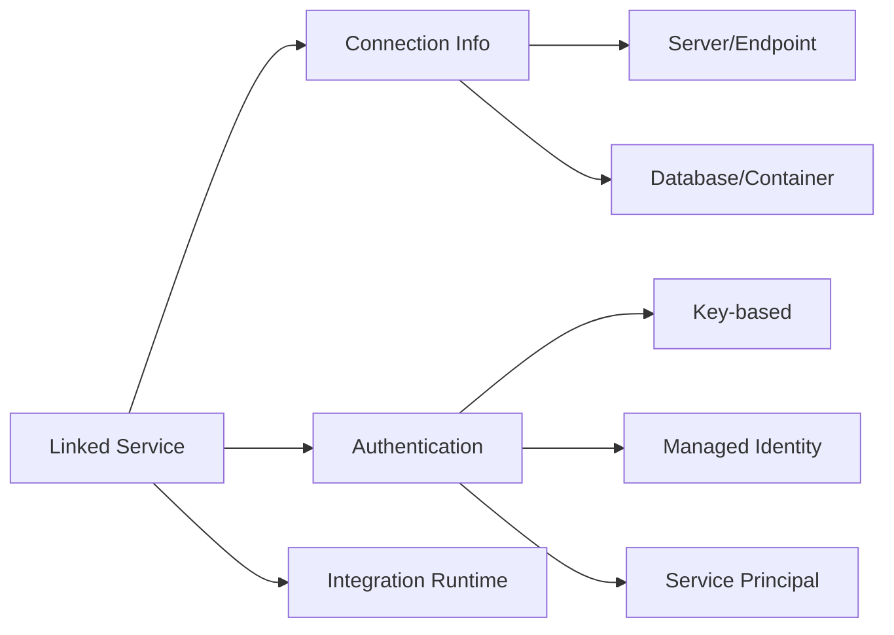

# 🔗 Linked Services & Datasets

> __🏠 [Home](../../../README.md)__ | __📖 [Documentation](../../README.md)__ | __🎓 [Tutorials](../README.md)__ | __🔄 [Data Factory](README.md)__ | __Linked Services__


__Master the creation and management of linked services and datasets for seamless data source connectivity in Azure Data Factory.__

## 📋 Table of Contents

- [Understanding Linked Services](#understanding-linked-services)
- [Common Linked Service Types](#common-linked-service-types)
- [Authentication Methods](#authentication-methods)
- [Creating Datasets](#creating-datasets)
- [Best Practices](#best-practices)
- [Next Steps](#next-steps)

## 🔌 Understanding Linked Services

Linked services define connection information to external resources. Think of them as connection strings that ADF uses to connect to your data stores.

### Linked Service Components



### Linked Service Categories

| Category | Purpose | Examples |
|----------|---------|----------|
| __Data Stores__ | Connect to data sources | Azure SQL, Blob Storage, Cosmos DB |
| __Compute Services__ | Execute transformations | Databricks, HDInsight, Synapse |
| __File Systems__ | Access files | SFTP, HTTP, File Share |
| __Databases__ | Connect to databases | SQL Server, Oracle, PostgreSQL |
| __SaaS Applications__ | Integrate with apps | Salesforce, Dynamics 365, SAP |

## 🗂️ Common Linked Service Types

### Azure SQL Database

```json
{
  "name": "AzureSqlDatabase_LinkedService",
  "type": "Microsoft.DataFactory/factories/linkedservices",
  "properties": {
    "annotations": [],
    "type": "AzureSqlDatabase",
    "typeProperties": {
      "connectionString": {
        "type": "AzureKeyVaultSecret",
        "store": {
          "referenceName": "AzureKeyVault_LinkedService",
          "type": "LinkedServiceReference"
        },
        "secretName": "sql-connection-string"
      }
    },
    "connectVia": {
      "referenceName": "AutoResolveIntegrationRuntime",
      "type": "IntegrationRuntimeReference"
    }
  }
}
```

#### Create Using Portal

1. Navigate to ADF Studio > __Manage__ > __Linked services__
2. Click __+ New__
3. Search for "Azure SQL Database"
4. Configure:
   - Name: `AzureSqlDatabase_LinkedService`
   - Integration Runtime: `AutoResolveIntegrationRuntime`
   - Server name: `your-server.database.windows.net`
   - Database name: `your-database`
   - Authentication: Managed Identity
5. Click __Test connection__
6. Click __Create__

### Azure Blob Storage

```json
{
  "name": "AzureBlobStorage_LinkedService",
  "type": "Microsoft.DataFactory/factories/linkedservices",
  "properties": {
    "annotations": [],
    "type": "AzureBlobStorage",
    "typeProperties": {
      "serviceEndpoint": "https://youraccount.blob.core.windows.net/",
      "accountKind": "StorageV2",
      "authenticationType": "ManagedIdentity"
    },
    "connectVia": {
      "referenceName": "AutoResolveIntegrationRuntime",
      "type": "IntegrationRuntimeReference"
    }
  }
}
```

### Azure Data Lake Storage Gen2

```json
{
  "name": "AzureDataLakeGen2_LinkedService",
  "type": "Microsoft.DataFactory/factories/linkedservices",
  "properties": {
    "type": "AzureBlobFS",
    "typeProperties": {
      "url": "https://youraccount.dfs.core.windows.net/",
      "authenticationType": "ManagedIdentity"
    }
  }
}
```

### Azure Key Vault

```json
{
  "name": "AzureKeyVault_LinkedService",
  "type": "Microsoft.DataFactory/factories/linkedservices",
  "properties": {
    "type": "AzureKeyVault",
    "typeProperties": {
      "baseUrl": "https://your-keyvault.vault.azure.net/"
    }
  }
}
```

### REST API

```json
{
  "name": "RestAPI_LinkedService",
  "type": "Microsoft.DataFactory/factories/linkedservices",
  "properties": {
    "type": "RestService",
    "typeProperties": {
      "url": "https://api.example.com",
      "enableServerCertificateValidation": true,
      "authenticationType": "Anonymous"
    }
  }
}
```

### On-Premises SQL Server

```json
{
  "name": "OnPremSqlServer_LinkedService",
  "type": "Microsoft.DataFactory/factories/linkedservices",
  "properties": {
    "type": "SqlServer",
    "typeProperties": {
      "connectionString": "Server=myserver;Database=mydb;Integrated Security=False;User ID=username;",
      "password": {
        "type": "AzureKeyVaultSecret",
        "store": {
          "referenceName": "AzureKeyVault_LinkedService",
          "type": "LinkedServiceReference"
        },
        "secretName": "onprem-sql-password"
      }
    },
    "connectVia": {
      "referenceName": "SelfHostedIR",
      "type": "IntegrationRuntimeReference"
    }
  }
}
```

## 🔐 Authentication Methods

### Managed Identity (Recommended)

__Benefits__:
- No credential management
- Azure AD integration
- Automatic rotation

__Configuration__:

```bash
# Grant ADF managed identity access to Azure SQL
PRINCIPAL_ID=$(az datafactory show \
  --resource-group rg-adf-tutorial-dev \
  --factory-name adf-tutorial-dev-001 \
  --query identity.principalId \
  --output tsv)

# Add to SQL Database
az sql server ad-admin create \
  --resource-group rg-adf-tutorial-dev \
  --server-name your-sql-server \
  --display-name adf-tutorial-dev-001 \
  --object-id $PRINCIPAL_ID
```

### Service Principal

```json
{
  "typeProperties": {
    "servicePrincipalId": "your-app-id",
    "servicePrincipalKey": {
      "type": "AzureKeyVaultSecret",
      "store": {
        "referenceName": "AzureKeyVault_LinkedService",
        "type": "LinkedServiceReference"
      },
      "secretName": "service-principal-key"
    },
    "tenant": "your-tenant-id"
  }
}
```

### Key-Based Authentication

```json
{
  "typeProperties": {
    "accountKey": {
      "type": "AzureKeyVaultSecret",
      "store": {
        "referenceName": "AzureKeyVault_LinkedService",
        "type": "LinkedServiceReference"
      },
      "secretName": "storage-account-key"
    }
  }
}
```

### SQL Authentication

```json
{
  "typeProperties": {
    "connectionString": "Server=myserver;Database=mydb;User ID=username;",
    "password": {
      "type": "AzureKeyVaultSecret",
      "store": {
        "referenceName": "AzureKeyVault_LinkedService",
        "type": "LinkedServiceReference"
      },
      "secretName": "sql-password"
    }
  }
}
```

## 📊 Creating Datasets

Datasets represent data structures within linked services.

### Azure SQL Table Dataset

```json
{
  "name": "AzureSqlTable_Dataset",
  "type": "Microsoft.DataFactory/factories/datasets",
  "properties": {
    "linkedServiceName": {
      "referenceName": "AzureSqlDatabase_LinkedService",
      "type": "LinkedServiceReference"
    },
    "annotations": [],
    "type": "AzureSqlTable",
    "schema": [],
    "typeProperties": {
      "schema": "dbo",
      "table": "Customer"
    }
  }
}
```

### Parameterized Dataset

```json
{
  "name": "ParameterizedSqlTable_Dataset",
  "type": "Microsoft.DataFactory/factories/datasets",
  "properties": {
    "linkedServiceName": {
      "referenceName": "AzureSqlDatabase_LinkedService",
      "type": "LinkedServiceReference"
    },
    "parameters": {
      "schemaName": {
        "type": "string",
        "defaultValue": "dbo"
      },
      "tableName": {
        "type": "string"
      }
    },
    "type": "AzureSqlTable",
    "typeProperties": {
      "schema": {
        "value": "@dataset().schemaName",
        "type": "Expression"
      },
      "table": {
        "value": "@dataset().tableName",
        "type": "Expression"
      }
    }
  }
}
```

### Blob CSV Dataset

```json
{
  "name": "BlobCSV_Dataset",
  "type": "Microsoft.DataFactory/factories/datasets",
  "properties": {
    "linkedServiceName": {
      "referenceName": "AzureBlobStorage_LinkedService",
      "type": "LinkedServiceReference"
    },
    "parameters": {
      "containerName": {
        "type": "string"
      },
      "fileName": {
        "type": "string"
      }
    },
    "type": "DelimitedText",
    "typeProperties": {
      "location": {
        "type": "AzureBlobStorageLocation",
        "fileName": {
          "value": "@dataset().fileName",
          "type": "Expression"
        },
        "container": {
          "value": "@dataset().containerName",
          "type": "Expression"
        }
      },
      "columnDelimiter": ",",
      "escapeChar": "\\",
      "firstRowAsHeader": true,
      "quoteChar": "\""
    },
    "schema": []
  }
}
```

### Parquet Dataset

```json
{
  "name": "ParquetDataLake_Dataset",
  "type": "Microsoft.DataFactory/factories/datasets",
  "properties": {
    "linkedServiceName": {
      "referenceName": "AzureDataLakeGen2_LinkedService",
      "type": "LinkedServiceReference"
    },
    "parameters": {
      "folderPath": {
        "type": "string"
      }
    },
    "type": "Parquet",
    "typeProperties": {
      "location": {
        "type": "AzureBlobFSLocation",
        "folderPath": {
          "value": "@dataset().folderPath",
          "type": "Expression"
        },
        "fileSystem": "data"
      },
      "compressionCodec": "snappy"
    }
  }
}
```

## 🎯 Best Practices

### Linked Services

1. __Use Managed Identity Where Possible__
   - Eliminates credential management
   - More secure than key-based auth
   - Integrates with Azure RBAC

2. __Store Secrets in Key Vault__
   ```json
   {
     "password": {
       "type": "AzureKeyVaultSecret",
       "store": {
         "referenceName": "AzureKeyVault_LinkedService",
         "type": "LinkedServiceReference"
       },
       "secretName": "my-secret"
     }
   }
   ```

3. __Use Descriptive Naming__
   - Include data source type
   - Include environment
   - Example: `AzureSql_SalesDB_Prod`

4. __Test Connections__
   - Always test before saving
   - Verify network connectivity
   - Confirm permissions

### Datasets

1. __Parameterize for Reusability__
   ```json
   {
     "parameters": {
       "tableName": {"type": "string"},
       "schemaName": {"type": "string"}
     }
   }
   ```

2. __Define Schema When Possible__
   - Improves performance
   - Enables better validation
   - Helps with data lineage

3. __Use Appropriate File Formats__
   - Parquet for big data scenarios
   - CSV for interoperability
   - Avro for schema evolution

4. __Organize by Purpose__
   - Separate source and sink datasets
   - Group by system or domain
   - Use consistent naming

## ✅ Hands-On Exercise

### Exercise 1: Create Linked Services

Create the following linked services:

1. __Azure SQL Database__
   - Use managed identity
   - Test connection
   - Document connection details

2. __Azure Blob Storage__
   - Use storage account key from Key Vault
   - Test connection

3. __Azure Key Vault__
   - For storing secrets
   - Verify ADF has access

### Exercise 2: Create Datasets

1. __SQL Table Dataset__
   - Points to a specific table
   - Define schema

2. __Parameterized CSV Dataset__
   - Parameters: container, folder, file
   - Enable first row as header

3. __Parquet Dataset__
   - For data lake storage
   - Enable compression

## 🚨 Troubleshooting

### Connection Test Fails

```text
Error: Cannot connect to server

Solutions:
1. Check firewall rules
2. Verify credentials in Key Vault
3. Confirm Integration Runtime is running
4. Check network connectivity
```

### Managed Identity Access Denied

```bash
# Grant managed identity access to SQL Database
# Connect to SQL Database and run:
CREATE USER [adf-tutorial-dev-001] FROM EXTERNAL PROVIDER;
ALTER ROLE db_datareader ADD MEMBER [adf-tutorial-dev-001];
ALTER ROLE db_datawriter ADD MEMBER [adf-tutorial-dev-001];
```

### Key Vault Access Issues

```bash
# Verify ADF has Key Vault access
az role assignment list \
  --scope $(az keyvault show --name your-keyvault --query id --output tsv) \
  --assignee $(az datafactory show \
    --resource-group rg-adf-tutorial-dev \
    --factory-name adf-tutorial-dev-001 \
    --query identity.principalId --output tsv)
```

## 📚 Additional Resources

- [Supported Connectors](https://docs.microsoft.com/azure/data-factory/connector-overview)
- [Managed Identity Authentication](https://docs.microsoft.com/azure/data-factory/data-factory-service-identity)
- [Dataset Properties](https://docs.microsoft.com/azure/data-factory/concepts-datasets-linked-services)

## 🚀 Next Steps

Linked services and datasets configured! Continue to:

__→ [05. Multi-Source Integration](05-multi-source-integration.md)__ - Connect multiple data sources

---

__Module Progress__: 4 of 18 complete

*Tutorial Version: 1.0*
*Last Updated: January 2025*
