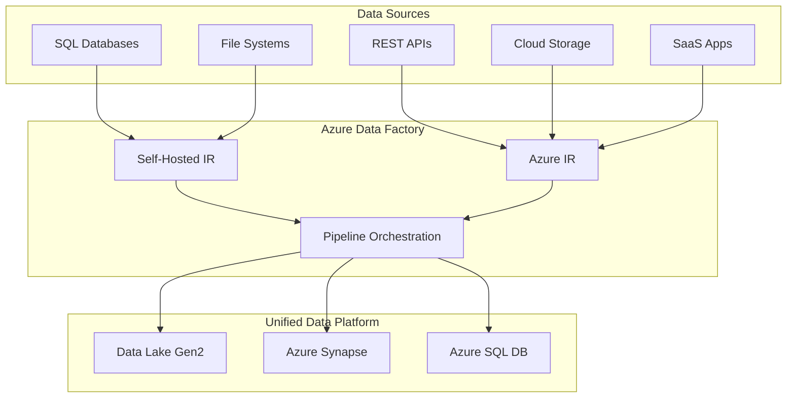

# 🔄 Multi-Source Data Integration

> __🏠 [Home](../../../README.md)__ | __📖 [Documentation](../../README.md)__ | __🎓 [Tutorials](../README.md)__ | __🔄 [Data Factory](README.md)__ | __Multi-Source Integration__


__Integrate data from diverse sources including databases, file systems, APIs, cloud services, and SaaS applications into a unified data platform.__

## 📋 Table of Contents

- [Integration Architecture](#integration-architecture)
- [Database Sources](#database-sources)
- [File-Based Sources](#file-based-sources)
- [API and Web Services](#api-and-web-services)
- [Cloud Storage](#cloud-storage)
- [SaaS Applications](#saas-applications)
- [Integration Patterns](#integration-patterns)
- [Next Steps](#next-steps)

## 🏗️ Integration Architecture



## 🗄️ Database Sources

### SQL Server (On-Premises)

```json
{
  "name": "OnPremSqlServer_LinkedService",
  "properties": {
    "type": "SqlServer",
    "typeProperties": {
      "connectionString": "Server=SERVER01;Database=SalesDB;",
      "userName": "sqluser",
      "password": {
        "type": "AzureKeyVaultSecret",
        "store": {
          "referenceName": "AzureKeyVault_LinkedService",
          "type": "LinkedServiceReference"
        },
        "secretName": "onprem-sql-password"
      }
    },
    "connectVia": {
      "referenceName": "SelfHostedIR",
      "type": "IntegrationRuntimeReference"
    }
  }
}
```

### Oracle Database

```json
{
  "name": "OracleDB_LinkedService",
  "properties": {
    "type": "Oracle",
    "typeProperties": {
      "connectionString": "Host=oracle-server;Port=1521;Sid=ORCL;",
      "username": "oracleuser",
      "password": {
        "type": "AzureKeyVaultSecret",
        "store": {
          "referenceName": "AzureKeyVault_LinkedService",
          "type": "LinkedServiceReference"
        },
        "secretName": "oracle-password"
      }
    },
    "connectVia": {
      "referenceName": "SelfHostedIR",
      "type": "IntegrationRuntimeReference"
    }
  }
}
```

### PostgreSQL

```json
{
  "name": "PostgreSQL_LinkedService",
  "properties": {
    "type": "PostgreSql",
    "typeProperties": {
      "connectionString": "Server=postgres-server;Database=mydb;Port=5432;",
      "username": "pguser",
      "password": {
        "type": "AzureKeyVaultSecret",
        "store": {
          "referenceName": "AzureKeyVault_LinkedService",
          "type": "LinkedServiceReference"
        },
        "secretName": "postgres-password"
      }
    }
  }
}
```

### MySQL

```json
{
  "name": "MySQL_LinkedService",
  "properties": {
    "type": "MySql",
    "typeProperties": {
      "connectionString": "Server=mysql-server;Database=mydb;Port=3306;",
      "username": "mysqluser",
      "password": {
        "type": "AzureKeyVaultSecret",
        "store": {
          "referenceName": "AzureKeyVault_LinkedService",
          "type": "LinkedServiceReference"
        },
        "secretName": "mysql-password"
      }
    }
  }
}
```

## 📁 File-Based Sources

### File Share (SMB)

```json
{
  "name": "FileShare_LinkedService",
  "properties": {
    "type": "FileServer",
    "typeProperties": {
      "host": "\\\\fileserver\\share",
      "userId": "domain\\username",
      "password": {
        "type": "AzureKeyVaultSecret",
        "store": {
          "referenceName": "AzureKeyVault_LinkedService",
          "type": "LinkedServiceReference"
        },
        "secretName": "file-share-password"
      }
    },
    "connectVia": {
      "referenceName": "SelfHostedIR",
      "type": "IntegrationRuntimeReference"
    }
  }
}
```

### SFTP

```json
{
  "name": "SFTP_LinkedService",
  "properties": {
    "type": "Sftp",
    "typeProperties": {
      "host": "sftp.example.com",
      "port": 22,
      "authenticationType": "Basic",
      "userName": "sftpuser",
      "password": {
        "type": "AzureKeyVaultSecret",
        "store": {
          "referenceName": "AzureKeyVault_LinkedService",
          "type": "LinkedServiceReference"
        },
        "secretName": "sftp-password"
      },
      "skipHostKeyValidation": false
    }
  }
}
```

### FTP

```json
{
  "name": "FTP_LinkedService",
  "properties": {
    "type": "FtpServer",
    "typeProperties": {
      "host": "ftp.example.com",
      "port": 21,
      "authenticationType": "Basic",
      "userName": "ftpuser",
      "password": {
        "type": "AzureKeyVaultSecret",
        "store": {
          "referenceName": "AzureKeyVault_LinkedService",
          "type": "LinkedServiceReference"
        },
        "secretName": "ftp-password"
      },
      "enableSsl": true
    }
  }
}
```

## 🌐 API and Web Services

### REST API with OAuth2

```json
{
  "name": "RestAPI_OAuth2_LinkedService",
  "properties": {
    "type": "RestService",
    "typeProperties": {
      "url": "https://api.example.com",
      "enableServerCertificateValidation": true,
      "authenticationType": "OAuth2ClientCredential",
      "clientId": "your-client-id",
      "clientSecret": {
        "type": "AzureKeyVaultSecret",
        "store": {
          "referenceName": "AzureKeyVault_LinkedService",
          "type": "LinkedServiceReference"
        },
        "secretName": "api-client-secret"
      },
      "tokenEndpoint": "https://login.example.com/oauth2/token",
      "scope": "api://default/.read"
    }
  }
}
```

### REST API with API Key

```json
{
  "name": "RestAPI_ApiKey_LinkedService",
  "properties": {
    "type": "RestService",
    "typeProperties": {
      "url": "https://api.example.com",
      "authenticationType": "Anonymous",
      "authHeaders": {
        "X-API-Key": {
          "type": "AzureKeyVaultSecret",
          "store": {
            "referenceName": "AzureKeyVault_LinkedService",
            "type": "LinkedServiceReference"
          },
          "secretName": "api-key"
        }
      }
    }
  }
}
```

### HTTP Endpoint

```json
{
  "name": "HTTP_LinkedService",
  "properties": {
    "type": "HttpServer",
    "typeProperties": {
      "url": "https://data.example.com",
      "authenticationType": "Basic",
      "userName": "httpuser",
      "password": {
        "type": "AzureKeyVaultSecret",
        "store": {
          "referenceName": "AzureKeyVault_LinkedService",
          "type": "LinkedServiceReference"
        },
        "secretName": "http-password"
      }
    }
  }
}
```

## ☁️ Cloud Storage

### AWS S3

```json
{
  "name": "AmazonS3_LinkedService",
  "properties": {
    "type": "AmazonS3",
    "typeProperties": {
      "accessKeyId": "your-access-key",
      "secretAccessKey": {
        "type": "AzureKeyVaultSecret",
        "store": {
          "referenceName": "AzureKeyVault_LinkedService",
          "type": "LinkedServiceReference"
        },
        "secretName": "aws-secret-key"
      }
    }
  }
}
```

### Google Cloud Storage

```json
{
  "name": "GoogleCloudStorage_LinkedService",
  "properties": {
    "type": "GoogleCloudStorage",
    "typeProperties": {
      "accessKeyId": "your-access-key",
      "secretAccessKey": {
        "type": "AzureKeyVaultSecret",
        "store": {
          "referenceName": "AzureKeyVault_LinkedService",
          "type": "LinkedServiceReference"
        },
        "secretName": "gcs-secret-key"
      }
    }
  }
}
```

### Azure Blob Storage (Other Subscription)

```json
{
  "name": "AzureBlobExternal_LinkedService",
  "properties": {
    "type": "AzureBlobStorage",
    "typeProperties": {
      "serviceEndpoint": "https://externalaccount.blob.core.windows.net/",
      "authenticationType": "ServicePrincipal",
      "servicePrincipalId": "your-sp-id",
      "servicePrincipalKey": {
        "type": "AzureKeyVaultSecret",
        "store": {
          "referenceName": "AzureKeyVault_LinkedService",
          "type": "LinkedServiceReference"
        },
        "secretName": "sp-key"
      },
      "tenant": "tenant-id"
    }
  }
}
```

## 📱 SaaS Applications

### Salesforce

```json
{
  "name": "Salesforce_LinkedService",
  "properties": {
    "type": "Salesforce",
    "typeProperties": {
      "environmentUrl": "https://login.salesforce.com",
      "username": "salesforce@example.com",
      "password": {
        "type": "AzureKeyVaultSecret",
        "store": {
          "referenceName": "AzureKeyVault_LinkedService",
          "type": "LinkedServiceReference"
        },
        "secretName": "salesforce-password"
      },
      "securityToken": {
        "type": "AzureKeyVaultSecret",
        "store": {
          "referenceName": "AzureKeyVault_LinkedService",
          "type": "LinkedServiceReference"
        },
        "secretName": "salesforce-token"
      }
    }
  }
}
```

### Dynamics 365

```json
{
  "name": "Dynamics365_LinkedService",
  "properties": {
    "type": "Dynamics",
    "typeProperties": {
      "deploymentType": "Online",
      "organizationName": "your-org",
      "authenticationType": "Office365",
      "username": "user@example.com",
      "password": {
        "type": "AzureKeyVaultSecret",
        "store": {
          "referenceName": "AzureKeyVault_LinkedService",
          "type": "LinkedServiceReference"
        },
        "secretName": "dynamics-password"
      }
    }
  }
}
```

### ServiceNow

```json
{
  "name": "ServiceNow_LinkedService",
  "properties": {
    "type": "ServiceNow",
    "typeProperties": {
      "endpoint": "https://instance.service-now.com",
      "authenticationType": "Basic",
      "username": "serviceuser",
      "password": {
        "type": "AzureKeyVaultSecret",
        "store": {
          "referenceName": "AzureKeyVault_LinkedService",
          "type": "LinkedServiceReference"
        },
        "secretName": "servicenow-password"
      }
    }
  }
}
```

### SAP Table

```json
{
  "name": "SapTable_LinkedService",
  "properties": {
    "type": "SapTable",
    "typeProperties": {
      "server": "sap-server",
      "systemNumber": "00",
      "clientId": "100",
      "userName": "sapuser",
      "password": {
        "type": "AzureKeyVaultSecret",
        "store": {
          "referenceName": "AzureKeyVault_LinkedService",
          "type": "LinkedServiceReference"
        },
        "secretName": "sap-password"
      }
    },
    "connectVia": {
      "referenceName": "SelfHostedIR",
      "type": "IntegrationRuntimeReference"
    }
  }
}
```

## 🔄 Integration Patterns

### Pattern 1: Hub and Spoke

Centralize data from multiple sources into a data lake.

```text
Sources → Self-Hosted IR → Data Lake → Synapse Analytics
```

### Pattern 2: Federation

Query data in-place without movement.

```text
Synapse Serverless SQL → External Tables → Source Systems
```

### Pattern 3: Incremental Load

Load only changed data using watermarks.

```json
{
  "source": {
    "type": "SqlServerSource",
    "sqlReaderQuery": "SELECT * FROM Sales WHERE ModifiedDate > '@{pipeline().parameters.LastRunTime}' AND ModifiedDate <= '@{pipeline().parameters.CurrentRunTime}'"
  }
}
```

### Pattern 4: Full Load with Archive

Complete refresh with historical archiving.

```text
1. Archive current data to history container
2. Truncate target table
3. Load full dataset from source
4. Validate record counts
```

## ✅ Hands-On Exercise

### Multi-Source Integration Pipeline

Create a pipeline that integrates data from:

1. __SQL Server__ - Customer data
2. __CSV Files__ - Transaction logs
3. __REST API__ - Product catalog
4. __Salesforce__ - Opportunity data

__Destination__: Azure Data Lake Gen2 with organized folder structure:

```text
data/
├── customers/
│   └── year=2025/month=01/day=15/
├── transactions/
│   └── year=2025/month=01/day=15/
├── products/
│   └── year=2025/month=01/day=15/
└── opportunities/
    └── year=2025/month=01/day=15/
```

### Implementation Steps

1. Create all required linked services
2. Create datasets for each source
3. Create copy activities
4. Configure parallel execution
5. Add error handling
6. Test the pipeline

## 📚 Additional Resources

- [Supported Connectors](https://docs.microsoft.com/azure/data-factory/connector-overview)
- [Copy Activity Performance](https://docs.microsoft.com/azure/data-factory/copy-activity-performance)
- [Integration Patterns](https://docs.microsoft.com/azure/architecture/data-guide/)

## 🚀 Next Steps

Multi-source integration mastered! Proceed to:

__→ [06. Secure Connectivity Patterns](06-secure-connectivity.md)__ - Implement enterprise security

---

__Module Progress__: 5 of 18 complete

*Tutorial Version: 1.0*
*Last Updated: January 2025*
