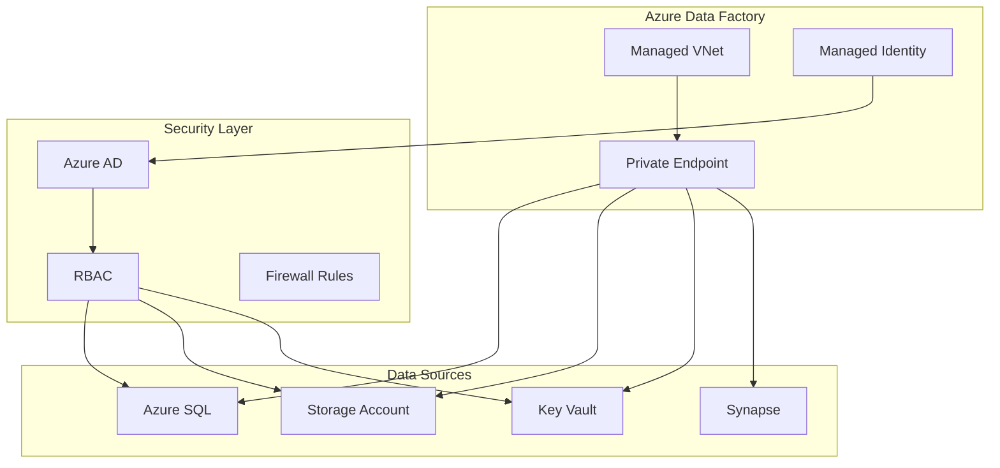

# 🔒 Secure Connectivity Patterns

> __🏠 [Home](../../../README.md)__ | __📖 [Documentation](../../README.md)__ | __🎓 [Tutorials](../README.md)__ | __🔄 [Data Factory](README.md)__ | __Secure Connectivity__


__Implement enterprise-grade security for data movement using private endpoints, managed virtual networks, managed identities, and Azure Key Vault integration.__

## 📋 Table of Contents

- [Security Architecture](#security-architecture)
- [Managed Virtual Network](#managed-virtual-network)
- [Private Endpoints](#private-endpoints)
- [Managed Identity Authentication](#managed-identity-authentication)
- [Network Security](#network-security)
- [Best Practices](#best-practices)
- [Next Steps](#next-steps)

## 🏗️ Security Architecture



## 🌐 Managed Virtual Network

Enable managed virtual network for network isolation.

### Enable Managed VNet

```powershell
# Enable managed virtual network
$ResourceGroupName = "rg-adf-tutorial-dev"
$DataFactoryName = "adf-tutorial-dev-001"

Set-AzDataFactoryV2 `
    -ResourceGroupName $ResourceGroupName `
    -Name $DataFactoryName `
    -Location "East US 2" `
    -PublicNetworkAccess "Disabled"

# Create managed virtual network integration runtime
Set-AzDataFactoryV2IntegrationRuntime `
    -ResourceGroupName $ResourceGroupName `
    -DataFactoryName $DataFactoryName `
    -Name "ManagedVNetIR" `
    -Type Managed `
    -Location "AutoResolve" `
    -ManagedVirtualNetwork "default"
```

### Managed VNet Configuration

```json
{
  "name": "ManagedVNetIR",
  "properties": {
    "type": "Managed",
    "typeProperties": {
      "computeProperties": {
        "location": "AutoResolve",
        "dataFlowProperties": {
          "computeType": "General",
          "coreCount": 8,
          "timeToLive": 10
        }
      }
    },
    "managedVirtualNetwork": {
      "type": "ManagedVirtualNetworkReference",
      "referenceName": "default"
    }
  }
}
```

## 🔐 Private Endpoints

Create private endpoints for secure connectivity to Azure services.

### Azure SQL Database Private Endpoint

```powershell
# Variables
$SubscriptionId = "your-subscription-id"
$ResourceGroupName = "rg-adf-tutorial-dev"
$DataFactoryName = "adf-tutorial-dev-001"
$SqlServerName = "sql-tutorial-dev"
$PrivateEndpointName = "pe-adf-sql"

# Create private endpoint to SQL Database
$SqlServerId = "/subscriptions/$SubscriptionId/resourceGroups/$ResourceGroupName/providers/Microsoft.Sql/servers/$SqlServerName"

New-AzDataFactoryV2ManagedPrivateEndpoint `
    -ResourceGroupName $ResourceGroupName `
    -DataFactoryName $DataFactoryName `
    -ManagedVirtualNetworkName "default" `
    -Name $PrivateEndpointName `
    -PrivateLinkResourceId $SqlServerId `
    -GroupId "sqlServer"
```

### Storage Account Private Endpoint

```powershell
# Create private endpoint to Storage Account
$StorageAccountName = "stadftutorialdev"
$StorageAccountId = "/subscriptions/$SubscriptionId/resourceGroups/$ResourceGroupName/providers/Microsoft.Storage/storageAccounts/$StorageAccountName"

New-AzDataFactoryV2ManagedPrivateEndpoint `
    -ResourceGroupName $ResourceGroupName `
    -DataFactoryName $DataFactoryName `
    -ManagedVirtualNetworkName "default" `
    -Name "pe-adf-storage-blob" `
    -PrivateLinkResourceId $StorageAccountId `
    -GroupId "blob"

New-AzDataFactoryV2ManagedPrivateEndpoint `
    -ResourceGroupName $ResourceGroupName `
    -DataFactoryName $DataFactoryName `
    -ManagedVirtualNetworkName "default" `
    -Name "pe-adf-storage-dfs" `
    -PrivateLinkResourceId $StorageAccountId `
    -GroupId "dfs"
```

### Approve Private Endpoint Connections

```bash
# List pending private endpoint connections
az network private-endpoint-connection list \
    --name $SqlServerName \
    --resource-group $ResourceGroupName \
    --type Microsoft.Sql/servers

# Approve private endpoint connection
az network private-endpoint-connection approve \
    --name "connection-name" \
    --resource-group $ResourceGroupName \
    --resource-name $SqlServerName \
    --type Microsoft.Sql/servers \
    --description "Approved for ADF"
```

## 🔑 Managed Identity Authentication

Use Azure AD managed identity for credential-less authentication.

### Enable System-Assigned Managed Identity

```powershell
# Enable system-assigned managed identity
$DataFactory = Set-AzDataFactoryV2 `
    -ResourceGroupName $ResourceGroupName `
    -Name $DataFactoryName `
    -Location "East US 2" `
    -IdentityType "SystemAssigned"

$PrincipalId = $DataFactory.Identity.PrincipalId
Write-Output "Managed Identity Principal ID: $PrincipalId"
```

### Grant SQL Database Access

```sql
-- Connect to Azure SQL Database
-- Run as database administrator

-- Create user for ADF managed identity
CREATE USER [adf-tutorial-dev-001] FROM EXTERNAL PROVIDER;

-- Grant permissions
ALTER ROLE db_datareader ADD MEMBER [adf-tutorial-dev-001];
ALTER ROLE db_datawriter ADD MEMBER [adf-tutorial-dev-001];
ALTER ROLE db_ddladmin ADD MEMBER [adf-tutorial-dev-001];

-- Verify user created
SELECT name, type_desc FROM sys.database_principals WHERE name = 'adf-tutorial-dev-001';
```

### Grant Storage Account Access

```bash
# Get ADF managed identity principal ID
PRINCIPAL_ID=$(az datafactory show \
    --resource-group $ResourceGroupName \
    --factory-name $DataFactoryName \
    --query identity.principalId \
    --output tsv)

# Grant Storage Blob Data Contributor role
az role assignment create \
    --role "Storage Blob Data Contributor" \
    --assignee $PRINCIPAL_ID \
    --scope "/subscriptions/$SubscriptionId/resourceGroups/$ResourceGroupName/providers/Microsoft.Storage/storageAccounts/$StorageAccountName"

# Grant Storage Blob Data Reader role (if read-only access needed)
az role assignment create \
    --role "Storage Blob Data Reader" \
    --assignee $PRINCIPAL_ID \
    --scope "/subscriptions/$SubscriptionId/resourceGroups/$ResourceGroupName/providers/Microsoft.Storage/storageAccounts/$StorageAccountName"
```

### Grant Key Vault Access

```bash
# Grant Key Vault Secrets User role
az role assignment create \
    --role "Key Vault Secrets User" \
    --assignee $PRINCIPAL_ID \
    --scope "/subscriptions/$SubscriptionId/resourceGroups/$ResourceGroupName/providers/Microsoft.KeyVault/vaults/$KeyVaultName"
```

### Linked Service with Managed Identity

```json
{
  "name": "AzureSqlDatabase_ManagedIdentity",
  "properties": {
    "type": "AzureSqlDatabase",
    "typeProperties": {
      "connectionString": "Server=tcp:sql-tutorial-dev.database.windows.net,1433;Database=salesdb;Encrypt=True;TrustServerCertificate=False;Connection Timeout=30;",
      "authenticationType": "ManagedIdentity"
    },
    "connectVia": {
      "referenceName": "ManagedVNetIR",
      "type": "IntegrationRuntimeReference"
    }
  }
}
```

## 🛡️ Network Security

### Disable Public Network Access

```powershell
# Disable public network access to Data Factory
Set-AzDataFactoryV2 `
    -ResourceGroupName $ResourceGroupName `
    -Name $DataFactoryName `
    -Location "East US 2" `
    -PublicNetworkAccess "Disabled"
```

### Configure IP Firewall Rules

```bash
# Add firewall rule to allow specific IP
az datafactory update \
    --resource-group $ResourceGroupName \
    --factory-name $DataFactoryName \
    --public-network-access Enabled \
    --set properties.publicNetworkAccess=Enabled

# Note: Detailed IP rules configured through ARM template or portal
```

### Network Security Best Practices

1. __Disable Public Access__
   - Use private endpoints only
   - Enable managed virtual network

2. __Implement Network Segmentation__
   - Separate dev, test, prod environments
   - Use different virtual networks

3. __Monitor Network Traffic__
   - Enable diagnostic logging
   - Monitor private endpoint connections
   - Set up alerts for unauthorized access

## 🎯 Best Practices

### Security Checklist

- [ ] Enable managed virtual network
- [ ] Create private endpoints for all data sources
- [ ] Use managed identity authentication
- [ ] Store secrets in Azure Key Vault
- [ ] Disable public network access
- [ ] Implement RBAC for all resources
- [ ] Enable audit logging
- [ ] Configure network security groups
- [ ] Implement data encryption at rest and in transit
- [ ] Regular security reviews

### Managed Identity Best Practices

```text
✅ Do:
- Use managed identity for Azure resources
- Grant minimum required permissions
- Use Azure RBAC for access control
- Regularly audit permissions

❌ Don't:
- Store credentials in plain text
- Grant excessive permissions
- Use service accounts when managed identity available
- Share credentials across environments
```

### Key Vault Integration

```json
{
  "name": "AzureSqlDatabase_KeyVault",
  "properties": {
    "type": "AzureSqlDatabase",
    "typeProperties": {
      "connectionString": {
        "type": "AzureKeyVaultSecret",
        "store": {
          "referenceName": "AzureKeyVault_LinkedService",
          "type": "LinkedServiceReference"
        },
        "secretName": "sql-connection-string"
      }
    }
  }
}
```

## 📊 Security Monitoring

### Enable Diagnostic Logging

```powershell
# Create Log Analytics workspace
$WorkspaceName = "law-adf-tutorial-dev"

New-AzOperationalInsightsWorkspace `
    -ResourceGroupName $ResourceGroupName `
    -Name $WorkspaceName `
    -Location "East US 2" `
    -Sku "PerGB2018"

# Get workspace ID
$Workspace = Get-AzOperationalInsightsWorkspace `
    -ResourceGroupName $ResourceGroupName `
    -Name $WorkspaceName

# Enable diagnostic settings
$DataFactoryId = (Get-AzDataFactoryV2 -ResourceGroupName $ResourceGroupName -Name $DataFactoryName).DataFactoryId

Set-AzDiagnosticSetting `
    -ResourceId $DataFactoryId `
    -WorkspaceId $Workspace.ResourceId `
    -Enabled $true `
    -Name "ADF-Diagnostics"
```

### Monitor Security Events

```kusto
// Query for unauthorized access attempts
AzureDiagnostics
| where ResourceProvider == "MICROSOFT.DATAFACTORY"
| where Category == "ActivityRuns" or Category == "PipelineRuns"
| where Level == "Error" or Level == "Warning"
| where OperationName contains "Unauthorized"
| project TimeGenerated, OperationName, ResultDescription, CallerIpAddress
| order by TimeGenerated desc
```

## ✅ Validation

### Test Private Endpoint Connectivity

```powershell
# Verify private endpoint status
Get-AzDataFactoryV2ManagedPrivateEndpoint `
    -ResourceGroupName $ResourceGroupName `
    -DataFactoryName $DataFactoryName `
    -ManagedVirtualNetworkName "default"

# Expected output should show "Approved" provisioning state
```

### Test Managed Identity Access

Create a test pipeline that copies data using managed identity:

```json
{
  "name": "TestManagedIdentityPipeline",
  "properties": {
    "activities": [
      {
        "name": "CopyWithManagedIdentity",
        "type": "Copy",
        "inputs": [
          {
            "referenceName": "SourceDataset_MI",
            "type": "DatasetReference"
          }
        ],
        "outputs": [
          {
            "referenceName": "SinkDataset_MI",
            "type": "DatasetReference"
          }
        ]
      }
    ]
  }
}
```

## 🚨 Troubleshooting

### Private Endpoint Connection Failed

```text
Error: Private endpoint connection is pending approval

Solution:
1. Navigate to the target resource (SQL Server, Storage Account)
2. Go to Networking > Private endpoint connections
3. Find the pending connection
4. Click Approve
```

### Managed Identity Access Denied

```sql
-- Verify ADF managed identity exists in database
SELECT name, type_desc, create_date
FROM sys.database_principals
WHERE name = 'adf-tutorial-dev-001';

-- Re-grant permissions if needed
ALTER ROLE db_datareader ADD MEMBER [adf-tutorial-dev-001];
```

## 📚 Additional Resources

- [ADF Managed Virtual Network](https://docs.microsoft.com/azure/data-factory/managed-virtual-network-private-endpoint)
- [Managed Identity Documentation](https://docs.microsoft.com/azure/active-directory/managed-identities-azure-resources/)
- [Azure Private Link](https://docs.microsoft.com/azure/private-link/)
- [Security Best Practices](../../best-practices/security.md)

## 🚀 Next Steps

Secure connectivity implemented! Continue to:

__→ [07. Basic Pipeline Activities](07-basic-activities.md)__ - Build your first data pipelines

---

__Module Progress__: 6 of 18 complete

*Tutorial Version: 1.0*
*Last Updated: January 2025*
