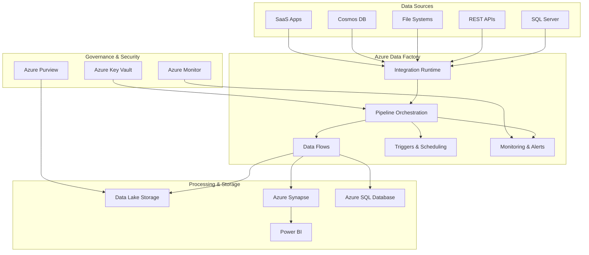

# 🔄 Azure Data Factory Orchestration Tutorial

> __🏠 [Home](../../../README.md)__ | __📖 [Documentation](../../README.md)__ | __🎓 Tutorials__ | __🔄 Data Factory__


__Master enterprise data orchestration with Azure Data Factory. Build complex ETL/ELT pipelines, implement data integration patterns, and create production-ready workflows with monitoring, error handling, and automated scheduling.__

## 🎯 What You'll Build

By completing this tutorial, you'll create a __comprehensive data orchestration platform__ featuring:

- __🔄 Multi-Source Data Integration__ - Ingest from databases, files, APIs, and streaming sources
- __🏗️ Complex Pipeline Orchestration__ - Coordinate dependencies, parallel processing, and conditional logic  
- __📊 Data Transformation Workflows__ - Clean, transform, and enrich data using multiple approaches
- __🔒 Enterprise Security Integration__ - Secure connections, credential management, and access controls
- __📈 Monitoring & Alerting__ - Comprehensive observability with automated incident response
- __🚀 CI/CD Pipeline Integration__ - Version control and automated deployment workflows

## 🏗️ Architecture Overview



## 📚 Tutorial Modules

### __🚀 Module 1: Foundation & Setup__ *(45 minutes)*

| Section | Focus | Duration |
|---------|-------|----------|
| [01. Data Factory Fundamentals](01-fundamentals.md) | Core concepts, components, architecture | 15 mins |
| [02. Environment Setup](02-environment-setup.md) | Resource provisioning, security configuration | 20 mins |
| [03. Integration Runtime Configuration](03-integration-runtime.md) | Self-hosted and Azure IR setup | 10 mins |

### __🔌 Module 2: Data Source Connectivity__ *(60 minutes)*

| Section | Focus | Duration |
|---------|-------|----------|
| [04. Linked Services & Datasets](04-linked-services.md) | Connection management, dataset definitions | 20 mins |
| [05. Multi-Source Integration](05-multi-source-integration.md) | Databases, files, APIs, cloud services | 25 mins |
| [06. Secure Connectivity Patterns](06-secure-connectivity.md) | Private endpoints, managed identity, Key Vault | 15 mins |

### __⚙️ Module 3: Pipeline Development__ *(90 minutes)*

| Section | Focus | Duration |
|---------|-------|----------|
| [07. Basic Pipeline Activities](07-basic-activities.md) | Copy, lookup, get metadata activities | 20 mins |
| [08. Advanced Orchestration](08-advanced-orchestration.md) | ForEach, If/Else, Switch, Until activities | 25 mins |
| [09. Data Transformation Patterns](09-transformation-patterns.md) | Mapping data flows, Synapse integration | 30 mins |
| [10. Error Handling & Retry Logic](10-error-handling.md) | Robust pipeline design, failure recovery | 15 mins |

### __📊 Module 4: Advanced Data Flows__ *(45 minutes)*

| Section | Focus | Duration |
|---------|-------|----------|
| [11. Mapping Data Flows](11-mapping-data-flows.md) | Visual data transformation designer | 25 mins |
| [12. Wrangling Data Flows](12-wrangling-data-flows.md) | Self-service data preparation | 20 mins |

### __⏰ Module 5: Scheduling & Triggers__ *(30 minutes)*

| Section | Focus | Duration |
|---------|-------|----------|
| [13. Pipeline Triggers](13-triggers.md) | Schedule, tumbling window, event-based triggers | 20 mins |
| [14. Dependency Management](14-dependency-management.md) | Complex scheduling scenarios | 10 mins |

### __📈 Module 6: Monitoring & Operations__ *(30 minutes)*

| Section | Focus | Duration |
|---------|-------|----------|
| [15. Monitoring & Alerting](15-monitoring.md) | Azure Monitor integration, custom alerts | 20 mins |
| [16. Performance Optimization](16-optimization.md) | Pipeline tuning, cost optimization | 10 mins |

### __🚀 Module 7: Production Deployment__ *(30 minutes)*

| Section | Focus | Duration |
|---------|-------|----------|
| [17. CI/CD Integration](17-cicd.md) | Git integration, automated deployment | 20 mins |
| [18. Environment Management](18-environment-mgmt.md) | Dev/test/prod pipeline promotion | 10 mins |

## 🎮 Interactive Learning Features

### __🧪 Hands-On Scenarios__

Work through realistic business scenarios that mirror production challenges:

__Scenario 1: Retail Data Integration__

- __Sources__: E-commerce database, inventory API, customer feedback files
- __Transformations__: Data cleansing, standardization, enrichment
- __Outputs__: Data warehouse, real-time dashboards, ML feature store

__Scenario 2: Financial Data Processing__

- __Sources__: Trading systems, market data feeds, regulatory reports
- __Processing__: High-frequency data validation, aggregation, compliance checks
- __Outputs__: Risk analytics, regulatory reporting, executive dashboards

__Scenario 3: Manufacturing IoT Pipeline__

- __Sources__: Sensor data streams, ERP systems, quality control databases
- __Processing__: Real-time anomaly detection, predictive maintenance
- __Outputs__: Operational dashboards, maintenance alerts, efficiency reports

### __💻 Interactive Development Environment__

- __Visual Pipeline Designer__: Drag-and-drop interface with real-time validation
- __Debug Mode__: Step-through pipeline execution with data inspection
- __Performance Profiler__: Analyze bottlenecks and optimization opportunities
- __Integration Testing__: Validate pipelines with sample data before production

### __🎯 Progressive Skill Building__

- __Basic Patterns__: Start with simple copy activities and basic transformations
- __Intermediate Logic__: Add conditional processing and error handling
- __Advanced Orchestration__: Implement complex workflows with dependencies
- __Production Patterns__: Add monitoring, alerting, and deployment automation

## 📋 Prerequisites

### __Required Knowledge__

- [ ] __Azure Fundamentals__ - Basic understanding of Azure services and concepts
- [ ] __SQL Basics__ - SELECT, JOIN, WHERE clause operations
- [ ] __Data Concepts__ - ETL processes, data warehousing, data types
- [ ] __JSON/XML__ - Basic understanding of structured data formats

### __Technical Requirements__

- [ ] __Azure Subscription__ with Data Factory service enabled
- [ ] __Owner or Contributor__ role for resource management
- [ ] __Sample Data Sources__ - We'll provide setup scripts for test databases
- [ ] __Visual Studio Code__ with Azure Data Factory extension (optional but recommended)

### __Recommended Experience__

- [ ] __Previous Tutorial Completion__: [Azure Synapse basics](../synapse/02-workspace-basics.md) helpful
- [ ] __PowerShell or Azure CLI__ - For automation and scripting
- [ ] __Business Intelligence__ - Understanding of reporting and analytics concepts

## 💰 Cost Management

### __Tutorial Cost Breakdown__

| Component | Estimated Cost | Usage Pattern |
|-----------|----------------|---------------|
| __Data Factory__ | $5-15/month | Pipeline orchestration, IR usage |
| __Data Movement__ | $10-25/month | Copy activities, data transfer |
| __Compute (Data Flows)__ | $20-50/month | Spark cluster usage |
| __Storage__ | $2-5/month | Temporary data, logging |
| __Monitoring__ | $3-8/month | Log Analytics, Application Insights |

__Total Estimated Monthly Cost__: $40-100 for tutorial completion and practice

### __Cost Optimization Strategies__

```json
{
  "optimization_techniques": {
    "right_sizing": "Start with smaller IR sizes, scale as needed",
    "scheduling": "Use time-based triggers to avoid unnecessary runs",
    "data_flows": "Use cluster auto-shutdown, right-size Spark pools", 
    "monitoring": "Set log retention policies, use sampling",
    "development": "Use shared dev environments, clean up test resources"
  }
}
```

## 🚀 Quick Start Options

### __🎯 Complete Tutorial Path__ *(Recommended)*

Follow all modules sequentially for comprehensive ADF mastery:

```powershell
# Clone tutorial resources and start setup
git clone https://github.com/your-org/adf-tutorial
cd adf-tutorial
.\scripts\setup-environment.ps1 -SubscriptionId "your-sub-id"
```

### __🎮 Interactive Demo__ *(30 minutes)*

Quick hands-on experience with pre-built scenarios:

```powershell
# Deploy demo environment with sample data and pipelines
.\scripts\deploy-demo.ps1 -ResourceGroup "adf-demo-rg" -Location "East US"
```

### __🔧 Scenario-Specific Learning__

Focus on specific aspects:

__Data Engineering Focus__:

- Modules 2-4 (Connectivity, pipeline development, data flows)

__Architecture Focus__:

- Modules 1, 3, 6-7 (Fundamentals, orchestration, production)

__Operations Focus__:

- Modules 5-7 (Scheduling, monitoring, deployment)

## 🎯 Learning Objectives

### __By Tutorial Completion, You Will:__

__🏗️ Design & Architecture__

- Design scalable data integration architectures using ADF
- Choose appropriate integration patterns for different scenarios
- Implement security best practices for data movement and processing
- Plan for high availability and disaster recovery

__💻 Implementation Skills__

- Build complex multi-source data integration pipelines
- Implement robust error handling and retry mechanisms
- Create reusable pipeline patterns and templates
- Optimize pipeline performance and cost

__🔄 Operations & Monitoring__

- Set up comprehensive monitoring and alerting systems
- Implement CI/CD workflows for pipeline deployment
- Troubleshoot pipeline failures and performance issues
- Manage environments and promote changes safely

__📊 Business Value__

- Translate business requirements into technical pipeline designs
- Implement data governance and quality controls
- Measure and optimize data processing performance
- Enable self-service analytics capabilities

## 💼 Real-World Use Cases

### __Enterprise Data Integration__

```json
{
  "scenario": "Global Retail Chain",
  "challenge": "Integrate data from 500+ stores, online platforms, and supply chain systems",
  "solution": {
    "approach": "Hub-and-spoke architecture with ADF orchestration",
    "components": [
      "Self-hosted integration runtimes in each region",
      "Centralized data lake with standardized schemas", 
      "Real-time and batch processing pipelines",
      "Automated data quality and governance controls"
    ],
    "outcomes": {
      "processing_volume": "10TB daily data movement",
      "latency_improvement": "Real-time insights vs. daily reports",
      "cost_savings": "60% reduction in ETL infrastructure costs",
      "time_to_insight": "Hours instead of days for new analytics"
    }
  }
}
```

### __Modern Data Warehouse Migration__

```json
{
  "scenario": "Financial Services Legacy Modernization",
  "challenge": "Migrate from on-premises SSIS packages to cloud-native solution",
  "solution": {
    "migration_strategy": "Lift-and-shift with cloud optimization",
    "components": [
      "SSIS package execution in ADF",
      "Gradual conversion to native ADF activities",
      "Hybrid connectivity with private endpoints",
      "Automated testing and validation frameworks"
    ],
    "benefits": {
      "operational_efficiency": "80% reduction in maintenance overhead",
      "scalability": "Auto-scaling based on workload demands",
      "reliability": "99.9% uptime with built-in retry mechanisms",
      "compliance": "Enhanced audit trails and data lineage"
    }
  }
}
```

## 🔧 Advanced Patterns You'll Master

### __Complex Orchestration Patterns__

__Dynamic Pipeline Generation__:

```json
{
  "pattern": "Metadata-Driven ETL",
  "description": "Generate pipelines dynamically based on configuration tables",
  "use_cases": [
    "Multi-tenant SaaS data processing",
    "Customer-specific ETL requirements",
    "Dynamic source-to-target mapping"
  ],
  "implementation": {
    "metadata_store": "Azure SQL Database with configuration tables",
    "pipeline_template": "Parameterized ADF pipeline template",
    "orchestration": "ForEach activity with dynamic content"
  }
}
```

__Event-Driven Processing__:

```json
{
  "pattern": "Real-Time Event Response",
  "description": "Trigger pipelines based on data arrival or business events",
  "triggers": [
    "Blob storage events for file arrival",
    "Service Bus messages for business events",
    "HTTP webhooks for external system notifications"
  ],
  "processing": {
    "immediate": "Stream Analytics for sub-second processing",
    "batch": "ADF pipelines for complex transformations",
    "hybrid": "Combination approach based on data characteristics"
  }
}
```

### __Enterprise Integration Patterns__

__Multi-Cloud and Hybrid Connectivity__:

- Securely connect to AWS S3, Google Cloud Storage
- Integrate with on-premises systems via self-hosted IR
- Implement cross-cloud data synchronization
- Handle network security and compliance requirements

__Data Governance Integration__:

- Automatic metadata capture and lineage tracking
- Data quality validation and reporting
- PII detection and masking automation
- Compliance reporting and audit trail generation

## 📊 Performance & Optimization

### __Pipeline Performance Tuning__

Learn advanced optimization techniques:

```python
# Example: Optimizing copy activity performance
{
  "copy_activity_optimization": {
    "parallelCopies": 32,
    "dataIntegrationUnits": 256,
    "enableStaging": True,
    "stagingSettings": {
      "linkedServiceName": "AzureBlobStorage",
      "path": "staging/copy-temp"
    },
    "enableSkipIncompatibleRow": True,
    "redirectIncompatibleRowSettings": {
      "linkedServiceName": "AzureBlobStorage", 
      "path": "error-logs/copy-errors"
    }
  }
}
```

__Data Flow Optimization__:

- Spark cluster auto-scaling configuration
- Partition optimization strategies
- Memory and compute tuning
- Debug vs. production cluster sizing

__Cost Optimization__:

- Integration Runtime rightsizing
- Trigger scheduling optimization
- Data movement cost reduction
- Monitoring and alerting cost control

## 🎓 Assessment & Validation

### __Hands-On Challenges__

__Challenge 1: Build End-to-End Data Pipeline__

```text
Requirements:
- Ingest data from 3+ different source types
- Implement data quality validation
- Create error handling and notifications
- Deploy using CI/CD pipeline

Success Criteria:
- Pipeline processes 100K+ records successfully
- Handles at least 2 different error scenarios
- Completes within performance SLA
- Passes all data quality checks
```

__Challenge 2: Optimize Existing Pipeline__

```text
Scenario: Provided with a poorly performing pipeline
Tasks:
- Identify performance bottlenecks
- Implement optimization strategies
- Reduce cost by 30%+ while maintaining functionality
- Add monitoring and alerting

Validation:
- Performance improvement measurement
- Cost analysis before/after optimization
- Monitoring dashboard creation
```

### __Knowledge Validation__

__Technical Assessment__:

- Pipeline design best practices
- Security implementation patterns
- Performance optimization techniques
- Troubleshooting and debugging skills

__Business Application__:

- Requirements gathering and analysis
- Solution design and presentation
- Cost-benefit analysis
- Change management and deployment

## 🎉 Success Stories

> __"The ADF tutorial transformed our data integration approach. We went from brittle SSIS packages to robust, cloud-native pipelines that scale automatically."__ - *David, Senior Data Engineer*
>
> __"Learning the advanced orchestration patterns helped me design our company's first self-service data platform. The metadata-driven approach was a game-changer."__ - *Sarah, Data Architect*
>
> __"The CI/CD integration module was exactly what we needed to implement proper DevOps for our analytics pipelines. No more manual deployments!"__ - *Michael, DevOps Engineer*

## 📞 Support & Community

### __Learning Resources__

- __📖 Official Documentation__: [Azure Data Factory Documentation](https://docs.microsoft.com/azure/data-factory/)
- __🎬 Video Series__: [ADF Tutorial Playlist](https://youtube.com/playlist?list=adf-tutorials)
- __💬 Community Forum__: [ADF Discussions](https://github.com/your-org/adf-tutorials/discussions)
- __📧 Direct Support__: <adf-tutorial-support@your-org.com>

### __Expert Office Hours__

- __Weekly Q&A Sessions__: Wednesdays 2 PM PT
- __Architecture Reviews__: Monthly deep-dive sessions
- __Troubleshooting Clinic__: Fridays 10 AM PT
- __Community Showcase__: Monthly sharing of implementations

### __Additional Resources__

- __Microsoft Learn__: [ADF Learning Path](https://docs.microsoft.com/learn/browse/?products=azure-data-factory)
- __Azure Architecture Center__: [Data Integration Patterns](https://docs.microsoft.com/azure/architecture/data-guide/scenarios/hybrid-on-premises-and-cloud)
- __GitHub Samples__: [ADF Template Gallery](https://github.com/Azure/Azure-DataFactory)

---

__Ready to master data orchestration?__

🚀 __[Start with ADF Fundamentals →](01-fundamentals.md)__

---

*Tutorial Series Version: 1.0*  
*Last Updated: January 2025*  
*Estimated Completion: 3-4 hours*
