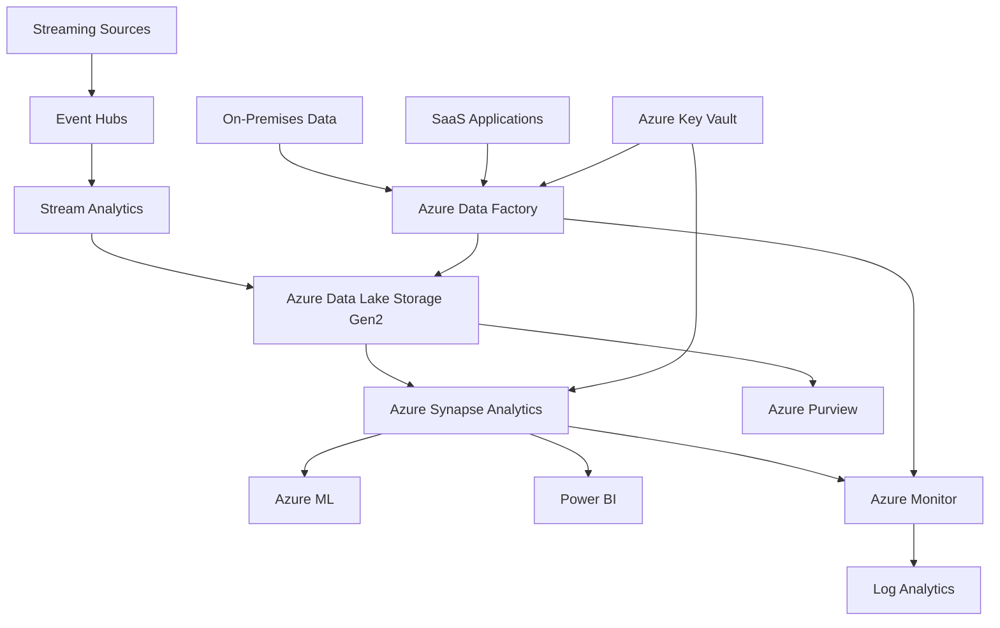
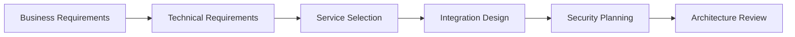

# 🔄 Multi-Service Integration Scenarios

> **🏠 [Home](../../../README.md)** | **📖 [Documentation](../../README.md)** | **🎓 [Tutorials](../README.md)** | **🔄 Integration Scenarios**


**Master complex enterprise integration patterns by building complete, production-ready solutions that span multiple Azure services. Learn architecture principles, integration patterns, and operational best practices through hands-on scenarios.**

## 🎯 Integration Philosophy

Modern analytics solutions require seamless integration across multiple services:

- **🏗️ Architecture-First**: Design robust, scalable integration patterns
- **🔄 Event-Driven**: Leverage events and messaging for loose coupling  
- **🚀 Cloud-Native**: Embrace serverless and managed service capabilities
- **🔒 Security-Embedded**: Security and governance throughout the data flow
- **📊 Observability-Ready**: Built-in monitoring and troubleshooting capabilities

## 🏗️ Integration Scenarios

### **🏢 Enterprise Data Lakehouse** 
*Complete data platform with governance and self-service capabilities*


**[Build Data Lakehouse →](data-lakehouse.md)**

Build a complete enterprise data platform featuring:
- **Multi-source ingestion** from on-premises, cloud, and streaming sources
- **Automated data cataloging** with Azure Purview integration
- **Self-service analytics** with Synapse and Power BI
- **ML model deployment** and scoring at scale
- **Comprehensive governance** and compliance controls

**Architecture Components:**


### **⚡ Real-Time ML Scoring Pipeline**
*End-to-end ML pipeline with real-time inference capabilities*


**[Build ML Pipeline →](ml-pipeline.md)**

Implement production-ready ML workflows featuring:
- **Real-time feature engineering** with Synapse and Event Hubs
- **Model training automation** with Azure ML and MLflow
- **High-throughput inference** using Azure Container Instances
- **Model monitoring** and drift detection
- **A/B testing framework** for model comparison

**Key Integration Points:**
- Stream Analytics → Feature Store (Synapse)
- Azure ML → Model Registry → Container Registry
- Event Hubs → ML Inference → Cosmos DB
- Application Insights → Model Performance Monitoring

### **🌐 Cross-Region Data Replication**
*Multi-region analytics with disaster recovery and geo-distribution*


**[Build Cross-Region Solution →](cross-region.md)**

Design resilient, globally distributed analytics:
- **Active-passive replication** across multiple Azure regions
- **Automated failover** with Traffic Manager and Function Apps
- **Data synchronization** patterns for consistency
- **Performance optimization** with regional data processing
- **Cost optimization** strategies for multi-region deployments

**Integration Pattern:**
- Primary Region: Full analytics stack
- Secondary Region: Read replicas and backup processing
- Global: Traffic Manager, DNS, and coordination services

### **🔗 Hybrid On-Premises Integration**
*Seamless integration between on-premises and cloud analytics*


**[Build Hybrid Solution →](hybrid.md)**

Connect on-premises systems with cloud analytics:
- **Secure connectivity** with VPN Gateway and Private Link
- **Data movement patterns** for hybrid scenarios
- **Identity integration** with Azure AD and on-premises AD
- **Monitoring across environments** with unified observability
- **Compliance handling** for data residency requirements

**Hybrid Components:**
- On-Premises: SQL Server, Active Directory, SSIS packages
- Connectivity: VPN Gateway, ExpressRoute, Private Endpoints
- Cloud: Full Azure analytics stack with hybrid integration

## 🎮 Scenario Learning Features

### **🏗️ Architecture Workshop Format**
Each scenario follows a structured architecture workshop approach:

1. **Requirements Analysis** (30 mins)
   - Business requirements gathering
   - Technical constraints identification
   - Success criteria definition

2. **Architecture Design** (60 mins)
   - Service selection and justification
   - Integration pattern design
   - Security and governance planning

3. **Implementation** (3-5 hours)
   - Hands-on building of the solution
   - Step-by-step guided implementation
   - Troubleshooting and optimization

4. **Validation & Testing** (30 mins)
   - End-to-end testing procedures
   - Performance validation
   - Security verification

### **🔍 Deep Architecture Analysis**
- **Trade-off Discussions**: Why specific patterns were chosen
- **Alternative Approaches**: Other ways to solve the same problems  
- **Scalability Planning**: How solutions grow with business needs
- **Cost Analysis**: Total cost of ownership considerations
- **Operational Readiness**: Production deployment considerations

### **🛠️ Production-Ready Patterns**
All scenarios implement enterprise-grade patterns:
- **Infrastructure as Code**: Everything deployed via ARM/Bicep templates
- **CI/CD Integration**: Automated testing and deployment pipelines
- **Monitoring and Alerting**: Comprehensive observability from day one
- **Security by Design**: Zero-trust principles and defense in depth
- **Disaster Recovery**: Business continuity and backup strategies

## 📋 Prerequisites

### **Required Experience**
- [ ] **Azure Fundamentals**: AZ-900 level understanding of Azure services
- [ ] **Solution Design**: Experience with multi-service architectures
- [ ] **Data Engineering**: Understanding of data processing concepts
- [ ] **DevOps Practices**: Familiarity with CI/CD and IaC concepts
- [ ] **Programming Skills**: Proficiency in Python, PowerShell, or .NET

### **Recommended Background**
- [ ] **Previous Tutorial Completion**: 
  - [Azure Synapse Analytics Series](../synapse/README.md)
  - [Stream Analytics Tutorial](../stream-analytics/README.md)
  - [Infrastructure as Code Lab](../code-labs/bicep-deployment.md)
- [ ] **Certification Progress**: Working toward DP-203 or AZ-305
- [ ] **Production Experience**: Exposure to enterprise-scale systems

### **Technical Setup**
- [ ] **Azure Subscription**: With Owner or Contributor access
- [ ] **Development Environment**: VS Code with Azure extensions
- [ ] **Local Tools**: Azure CLI, Git, Docker (for some scenarios)
- [ ] **Network Access**: Ability to create VPN connections (hybrid scenario)

## 💰 Cost Planning

### **Scenario Cost Estimates**

| Scenario | Development Cost | Production Monthly | Notes |
|----------|------------------|-------------------|-------|
| **Data Lakehouse** | $100-200 | $2,000-5,000 | Depends on data volume and compute |
| **ML Pipeline** | $50-100 | $500-1,500 | Varies with inference volume |
| **Cross-Region** | $75-150 | $1,000-3,000 | 2x single region costs |
| **Hybrid Integration** | $100-250 | $800-2,000 | VPN and gateway costs |

### **Cost Optimization Strategies**
- **Auto-pause/scale**: Implement automatic resource management
- **Spot instances**: Use for non-critical processing workloads
- **Reserved capacity**: Long-term commitments for predictable workloads
- **Data lifecycle**: Implement tiered storage policies
- **Resource sharing**: Multi-tenant patterns where appropriate

## 🎯 Learning Outcomes

### **Architecture Skills**
By completing these scenarios, you'll master:
- **Service Integration**: How Azure services work together effectively
- **Pattern Recognition**: Common enterprise integration patterns
- **Trade-off Analysis**: Making informed architectural decisions
- **Scalability Design**: Building solutions that grow with business needs
- **Operational Excellence**: Production-ready deployment patterns

### **Technical Competencies**
- **Infrastructure as Code**: ARM templates, Bicep, and deployment automation
- **Network Architecture**: VNets, private endpoints, and hybrid connectivity
- **Security Implementation**: RBAC, encryption, and compliance controls
- **Monitoring Strategy**: End-to-end observability and alerting
- **Performance Optimization**: Tuning for cost and performance

### **Business Value Creation**
- **Requirements Translation**: Converting business needs to technical solutions
- **ROI Demonstration**: Measuring and communicating solution value
- **Risk Management**: Identifying and mitigating technical and business risks
- **Stakeholder Communication**: Presenting complex architectures clearly
- **Strategic Planning**: Technology roadmap and evolution planning

## 🔧 Implementation Approach

### **Phase 1: Architecture Design**
Every scenario begins with comprehensive architecture design:



**Deliverables:**
- High-level architecture diagram
- Service integration patterns
- Security and compliance plan
- Implementation roadmap

### **Phase 2: Foundation Setup**
Establish the infrastructure foundation:

```powershell
# Example infrastructure setup pattern
$resourceGroup = "integration-scenario-rg"
$location = "East US"

# Deploy foundational services
New-AzResourceGroup -Name $resourceGroup -Location $location
New-AzResourceGroupDeployment `
    -ResourceGroupName $resourceGroup `
    -TemplateFile "foundation-template.bicep" `
    -TemplateParameterFile "scenario-parameters.json"
```

### **Phase 3: Service Integration**
Implement the core integration patterns:
- Configure service connections and authentication
- Implement data flow and processing logic
- Set up monitoring and logging
- Test integration points

### **Phase 4: Validation & Optimization**
Ensure production readiness:
- End-to-end testing with realistic data volumes
- Performance tuning and optimization
- Security validation and penetration testing
- Documentation and operational runbooks

## 📊 Success Metrics

### **Technical Metrics**
- **Integration Points**: All services communicate successfully
- **Performance**: Meets defined SLA requirements  
- **Security**: Passes security validation checklist
- **Reliability**: 99.9%+ uptime during testing period
- **Scalability**: Handles 10x expected load

### **Learning Metrics**  
- **Architecture Comprehension**: Can explain all integration points
- **Troubleshooting**: Can diagnose and resolve common issues
- **Optimization**: Can identify and implement performance improvements
- **Documentation**: Can create clear operational procedures
- **Knowledge Transfer**: Can teach concepts to others

## 🎓 Certification Alignment

These integration scenarios directly support multiple Azure certifications:

### **AZ-305: Azure Solutions Architect Expert**
- Design data storage solutions (20-25%)
- Design business continuity solutions (15-20%)
- Design infrastructure solutions (25-30%)

### **DP-203: Azure Data Engineer Associate**  
- Design and implement data storage solutions (15-20%)
- Develop data processing solutions (40-45%)
- Secure, monitor and optimize solutions (30-35%)

### **AZ-400: Azure DevOps Engineer Expert**
- Configure processes and communications (10-15%)
- Design and implement source control (15-20%)
- Implement continuous integration and delivery (40-45%)

## 💡 Real-World Applications

### **Industry Use Cases**

**Financial Services:**
- Real-time fraud detection with ML scoring
- Regulatory reporting with automated compliance
- Risk analytics with multi-region processing

**Retail & E-commerce:**
- Customer 360 with integrated customer data
- Supply chain optimization with IoT integration
- Personalization engines with real-time ML

**Healthcare:**
- Patient data integration with privacy controls
- Clinical trial analytics with secure multi-party computation
- Population health monitoring with streaming analytics

**Manufacturing:**
- Predictive maintenance with IoT and ML integration
- Quality analytics with computer vision
- Supply chain visibility with partner data integration

## 🤝 Community & Collaboration

### **Peer Learning**
- **Architecture Reviews**: Get feedback on your designs from experienced practitioners
- **Implementation Sharing**: Share code, configurations, and lessons learned
- **Troubleshooting Help**: Community support for complex integration challenges
- **Best Practices**: Contribute and learn from real-world implementation experiences

### **Expert Mentorship**
- **Office Hours**: Regular sessions with Azure MVPs and Microsoft employees
- **Architecture Clinics**: One-on-one reviews of your scenario implementations
- **Career Guidance**: Advice on leveraging integration skills for career advancement
- **Industry Insights**: Understanding how different industries approach integration challenges

---

**Ready to master enterprise integration?**

🏗️ **[Start with Data Lakehouse Architecture →](data-lakehouse.md)**  
⚡ **[Build ML Pipeline Integration →](ml-pipeline.md)**  
🌐 **[Explore Cross-Region Patterns →](cross-region.md)**  
🔗 **[Master Hybrid Integration →](hybrid.md)**

---

*Integration Scenarios Version: 1.0*  
*Last Updated: January 2025*  
*Enterprise Architecture Excellence*