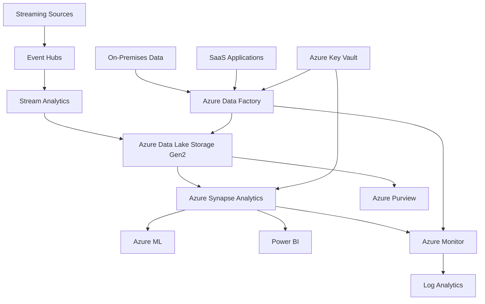
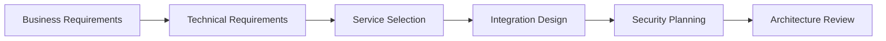

# 🔄 Multi-Service Integration Scenarios

> __🏠 [Home](../../../README.md)__ | __📖 [Documentation](../../README.md)__ | __🎓 Tutorials__ | __🔄 Integration Scenarios__


__Master complex enterprise integration patterns by building complete, production-ready solutions that span multiple Azure services. Learn architecture principles, integration patterns, and operational best practices through hands-on scenarios.__

## 🎯 Integration Philosophy

Modern analytics solutions require seamless integration across multiple services:

- __🏗️ Architecture-First__: Design robust, scalable integration patterns
- __🔄 Event-Driven__: Leverage events and messaging for loose coupling  
- __🚀 Cloud-Native__: Embrace serverless and managed service capabilities
- __🔒 Security-Embedded__: Security and governance throughout the data flow
- __📊 Observability-Ready__: Built-in monitoring and troubleshooting capabilities

## 🏗️ Integration Scenarios

### __🏢 Enterprise Data Lakehouse__

*Complete data platform with governance and self-service capabilities*


__[Build Data Lakehouse →](data-lakehouse.md)__

Build a complete enterprise data platform featuring:

- __Multi-source ingestion__ from on-premises, cloud, and streaming sources
- __Automated data cataloging__ with Azure Purview integration
- __Self-service analytics__ with Synapse and Power BI
- __ML model deployment__ and scoring at scale
- __Comprehensive governance__ and compliance controls

__Architecture Components:__



### __⚡ Real-Time ML Scoring Pipeline__

*End-to-end ML pipeline with real-time inference capabilities*


__[Build ML Pipeline →](ml-pipeline.md)__

Implement production-ready ML workflows featuring:

- __Real-time feature engineering__ with Synapse and Event Hubs
- __Model training automation__ with Azure ML and MLflow
- __High-throughput inference__ using Azure Container Instances
- __Model monitoring__ and drift detection
- __A/B testing framework__ for model comparison

__Key Integration Points:__

- Stream Analytics → Feature Store (Synapse)
- Azure ML → Model Registry → Container Registry
- Event Hubs → ML Inference → Cosmos DB
- Application Insights → Model Performance Monitoring

### __🌐 Cross-Region Data Replication__

*Multi-region analytics with disaster recovery and geo-distribution*


__[Build Cross-Region Solution →](cross-region.md)__

Design resilient, globally distributed analytics:

- __Active-passive replication__ across multiple Azure regions
- __Automated failover__ with Traffic Manager and Function Apps
- __Data synchronization__ patterns for consistency
- __Performance optimization__ with regional data processing
- __Cost optimization__ strategies for multi-region deployments

__Integration Pattern:__

- Primary Region: Full analytics stack
- Secondary Region: Read replicas and backup processing
- Global: Traffic Manager, DNS, and coordination services

### __🔗 Hybrid On-Premises Integration__

*Seamless integration between on-premises and cloud analytics*


__[Build Hybrid Solution →](hybrid.md)__

Connect on-premises systems with cloud analytics:

- __Secure connectivity__ with VPN Gateway and Private Link
- __Data movement patterns__ for hybrid scenarios
- __Identity integration__ with Azure AD and on-premises AD
- __Monitoring across environments__ with unified observability
- __Compliance handling__ for data residency requirements

__Hybrid Components:__

- On-Premises: SQL Server, Active Directory, SSIS packages
- Connectivity: VPN Gateway, ExpressRoute, Private Endpoints
- Cloud: Full Azure analytics stack with hybrid integration

## 🎮 Scenario Learning Features

### __🏗️ Architecture Workshop Format__

Each scenario follows a structured architecture workshop approach:

1. __Requirements Analysis__ (30 mins)
   - Business requirements gathering
   - Technical constraints identification
   - Success criteria definition

2. __Architecture Design__ (60 mins)
   - Service selection and justification
   - Integration pattern design
   - Security and governance planning

3. __Implementation__ (3-5 hours)
   - Hands-on building of the solution
   - Step-by-step guided implementation
   - Troubleshooting and optimization

4. __Validation & Testing__ (30 mins)
   - End-to-end testing procedures
   - Performance validation
   - Security verification

### __🔍 Deep Architecture Analysis__

- __Trade-off Discussions__: Why specific patterns were chosen
- __Alternative Approaches__: Other ways to solve the same problems  
- __Scalability Planning__: How solutions grow with business needs
- __Cost Analysis__: Total cost of ownership considerations
- __Operational Readiness__: Production deployment considerations

### __🛠️ Production-Ready Patterns__

All scenarios implement enterprise-grade patterns:

- __Infrastructure as Code__: Everything deployed via ARM/Bicep templates
- __CI/CD Integration__: Automated testing and deployment pipelines
- __Monitoring and Alerting__: Comprehensive observability from day one
- __Security by Design__: Zero-trust principles and defense in depth
- __Disaster Recovery__: Business continuity and backup strategies

## 📋 Prerequisites

### __Required Experience__

- [ ] __Azure Fundamentals__: AZ-900 level understanding of Azure services
- [ ] __Solution Design__: Experience with multi-service architectures
- [ ] __Data Engineering__: Understanding of data processing concepts
- [ ] __DevOps Practices__: Familiarity with CI/CD and IaC concepts
- [ ] __Programming Skills__: Proficiency in Python, PowerShell, or .NET

### __Recommended Background__

- [ ] __Previous Tutorial Completion__:
  - [Azure Synapse Analytics Series](../synapse/README.md)
  - [Stream Analytics Tutorial](../stream-analytics/README.md)
  - [Infrastructure as Code Lab](../code-labs/bicep-deployment.md)
- [ ] __Certification Progress__: Working toward DP-203 or AZ-305
- [ ] __Production Experience__: Exposure to enterprise-scale systems

### __Technical Setup__

- [ ] __Azure Subscription__: With Owner or Contributor access
- [ ] __Development Environment__: VS Code with Azure extensions
- [ ] __Local Tools__: Azure CLI, Git, Docker (for some scenarios)
- [ ] __Network Access__: Ability to create VPN connections (hybrid scenario)

## 💰 Cost Planning

### __Scenario Cost Estimates__

| Scenario | Development Cost | Production Monthly | Notes |
|----------|------------------|-------------------|-------|
| __Data Lakehouse__ | $100-200 | $2,000-5,000 | Depends on data volume and compute |
| __ML Pipeline__ | $50-100 | $500-1,500 | Varies with inference volume |
| __Cross-Region__ | $75-150 | $1,000-3,000 | 2x single region costs |
| __Hybrid Integration__ | $100-250 | $800-2,000 | VPN and gateway costs |

### __Cost Optimization Strategies__

- __Auto-pause/scale__: Implement automatic resource management
- __Spot instances__: Use for non-critical processing workloads
- __Reserved capacity__: Long-term commitments for predictable workloads
- __Data lifecycle__: Implement tiered storage policies
- __Resource sharing__: Multi-tenant patterns where appropriate

## 🎯 Learning Outcomes

### __Architecture Skills__

By completing these scenarios, you'll master:

- __Service Integration__: How Azure services work together effectively
- __Pattern Recognition__: Common enterprise integration patterns
- __Trade-off Analysis__: Making informed architectural decisions
- __Scalability Design__: Building solutions that grow with business needs
- __Operational Excellence__: Production-ready deployment patterns

### __Technical Competencies__

- __Infrastructure as Code__: ARM templates, Bicep, and deployment automation
- __Network Architecture__: VNets, private endpoints, and hybrid connectivity
- __Security Implementation__: RBAC, encryption, and compliance controls
- __Monitoring Strategy__: End-to-end observability and alerting
- __Performance Optimization__: Tuning for cost and performance

### __Business Value Creation__

- __Requirements Translation__: Converting business needs to technical solutions
- __ROI Demonstration__: Measuring and communicating solution value
- __Risk Management__: Identifying and mitigating technical and business risks
- __Stakeholder Communication__: Presenting complex architectures clearly
- __Strategic Planning__: Technology roadmap and evolution planning

## 🔧 Implementation Approach

### __Phase 1: Architecture Design__

Every scenario begins with comprehensive architecture design:



__Deliverables:__

- High-level architecture diagram
- Service integration patterns
- Security and compliance plan
- Implementation roadmap

### __Phase 2: Foundation Setup__

Establish the infrastructure foundation:

```powershell
# Example infrastructure setup pattern
$resourceGroup = "integration-scenario-rg"
$location = "East US"

# Deploy foundational services
New-AzResourceGroup -Name $resourceGroup -Location $location
New-AzResourceGroupDeployment `
    -ResourceGroupName $resourceGroup `
    -TemplateFile "foundation-template.bicep" `
    -TemplateParameterFile "scenario-parameters.json"
```

### __Phase 3: Service Integration__

Implement the core integration patterns:

- Configure service connections and authentication
- Implement data flow and processing logic
- Set up monitoring and logging
- Test integration points

### __Phase 4: Validation & Optimization__

Ensure production readiness:

- End-to-end testing with realistic data volumes
- Performance tuning and optimization
- Security validation and penetration testing
- Documentation and operational runbooks

## 📊 Success Metrics

### __Technical Metrics__

- __Integration Points__: All services communicate successfully
- __Performance__: Meets defined SLA requirements  
- __Security__: Passes security validation checklist
- __Reliability__: 99.9%+ uptime during testing period
- __Scalability__: Handles 10x expected load

### __Learning Metrics__  

- __Architecture Comprehension__: Can explain all integration points
- __Troubleshooting__: Can diagnose and resolve common issues
- __Optimization__: Can identify and implement performance improvements
- __Documentation__: Can create clear operational procedures
- __Knowledge Transfer__: Can teach concepts to others

## 🎓 Certification Alignment

These integration scenarios directly support multiple Azure certifications:

### __AZ-305: Azure Solutions Architect Expert__

- Design data storage solutions (20-25%)
- Design business continuity solutions (15-20%)
- Design infrastructure solutions (25-30%)

### __DP-203: Azure Data Engineer Associate__  

- Design and implement data storage solutions (15-20%)
- Develop data processing solutions (40-45%)
- Secure, monitor and optimize solutions (30-35%)

### __AZ-400: Azure DevOps Engineer Expert__

- Configure processes and communications (10-15%)
- Design and implement source control (15-20%)
- Implement continuous integration and delivery (40-45%)

## 💡 Real-World Applications

### __Industry Use Cases__

__Financial Services:__

- Real-time fraud detection with ML scoring
- Regulatory reporting with automated compliance
- Risk analytics with multi-region processing

__Retail & E-commerce:__

- Customer 360 with integrated customer data
- Supply chain optimization with IoT integration
- Personalization engines with real-time ML

__Healthcare:__

- Patient data integration with privacy controls
- Clinical trial analytics with secure multi-party computation
- Population health monitoring with streaming analytics

__Manufacturing:__

- Predictive maintenance with IoT and ML integration
- Quality analytics with computer vision
- Supply chain visibility with partner data integration

## 🤝 Community & Collaboration

### __Peer Learning__

- __Architecture Reviews__: Get feedback on your designs from experienced practitioners
- __Implementation Sharing__: Share code, configurations, and lessons learned
- __Troubleshooting Help__: Community support for complex integration challenges
- __Best Practices__: Contribute and learn from real-world implementation experiences

### __Expert Mentorship__

- __Office Hours__: Regular sessions with Azure MVPs and Microsoft employees
- __Architecture Clinics__: One-on-one reviews of your scenario implementations
- __Career Guidance__: Advice on leveraging integration skills for career advancement
- __Industry Insights__: Understanding how different industries approach integration challenges

---

__Ready to master enterprise integration?__

🏗️ __[Start with Data Lakehouse Architecture →](data-lakehouse.md)__  
⚡ __[Build ML Pipeline Integration →](ml-pipeline.md)__  
🌐 __[Explore Cross-Region Patterns →](cross-region.md)__  
🔗 __[Master Hybrid Integration →](hybrid.md)__

---

*Integration Scenarios Version: 1.0*  
*Last Updated: January 2025*  
*Enterprise Architecture Excellence*
