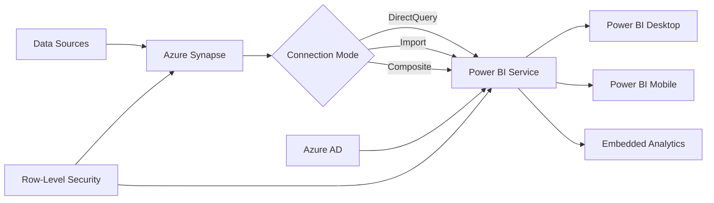

# = Power BI Integration with Azure Synapse Analytics

> **< [Home](../../../../README.md)** | **= [Documentation](../../../README.md)** | **< [Tutorials](../../README.md)** | **= [Integration](../README.md)** | **= Power BI**


**Learn to build high-performance, enterprise-scale business intelligence solutions by integrating Power BI with Azure Synapse Analytics. Master direct query optimization, composite models, incremental refresh, and embedded analytics patterns.**

## < Integration Overview

### Why Integrate Power BI with Synapse?

Power BI + Synapse provides:

- **Unified Analytics**: Single platform for data engineering and business intelligence
- **Performance**: DirectQuery to dedicated SQL pools for large datasets
- **Scalability**: Handle TB+ datasets with enterprise-grade infrastructure
- **Security**: Row-level security (RLS) and single sign-on (SSO)
- **Real-time**: Near real-time dashboards from streaming data
- **Cost Optimization**: Pause/resume compute resources independently

### Integration Architecture



## < Connection Methods

### 1. DirectQuery Connection

**Best For:** Large datasets (GB-TB), real-time requirements, limited Power BI Premium capacity

**Advantages:**
-  Always shows latest data
-  No data import required
-  Leverages Synapse compute power
-  Suitable for very large datasets

**Disadvantages:**
- L Query performance depends on Synapse
- L Limited DAX functionality
- L Requires Synapse pool to be running

**Configuration:**

```sql
-- Optimize views for DirectQuery
CREATE VIEW vw_sales_summary
WITH DISTRIBUTION = ROUND_ROBIN
AS
SELECT
    s.sale_date,
    s.product_id,
    p.product_name,
    p.category,
    s.quantity,
    s.revenue,
    s.cost,
    s.profit
FROM fact_sales s
INNER JOIN dim_product p ON s.product_id = p.product_id
WHERE s.sale_date >= DATEADD(year, -2, GETDATE());

-- Create statistics for better performance
CREATE STATISTICS stat_sale_date ON vw_sales_summary(sale_date);
CREATE STATISTICS stat_product_id ON vw_sales_summary(product_id);
CREATE STATISTICS stat_category ON vw_sales_summary(category);
```

**Power BI Connection String:**

```text
Server: <workspace-name>.sql.azuresynapse.net
Database: <pool-name>
Authentication: Azure Active Directory
Connection Mode: DirectQuery
```

---

### 2. Import Mode Connection

**Best For:** Small to medium datasets (<1GB), complex DAX calculations, frequent access

**Advantages:**
-  Fast query performance
-  Full DAX functionality
-  Works offline
-  No Synapse compute cost during queries

**Disadvantages:**
- L Data refresh required for updates
- L Power BI capacity limits apply
- L Increased storage costs
- L Not suitable for very large datasets

**Configuration:**

```powerquery
let
    Source = Sql.Database("<workspace>.sql.azuresynapse.net", "<pool>"),
    dbo_FactSales = Source{[Schema="dbo",Item="FactSales"]}[Data],
    FilteredRows = Table.SelectRows(dbo_FactSales,
        each [SaleDate] >= #date(2023, 1, 1))
in
    FilteredRows
```

---

### 3. Composite Model (Hybrid)

**Best For:** Large datasets with frequently accessed subsets, mixed performance requirements

**Advantages:**
-  Best of both worlds
-  Import small/static tables
-  DirectQuery large/dynamic tables
-  Aggregations for performance

**Disadvantages:**
- L More complex to configure
- L Requires careful planning
- L Multiple refresh schedules

**Configuration:**

```powerquery
// Import dimension tables (small, static)
let
    Source = Sql.Database("<workspace>.sql.azuresynapse.net", "<pool>"),
    DimProduct = Source{[Schema="dbo",Item="DimProduct"]}[Data]
in
    DimProduct // Set to Import mode

// DirectQuery fact table (large, dynamic)
let
    Source = Sql.Database("<workspace>.sql.azuresynapse.net", "<pool>"),
    FactSales = Source{[Schema="dbo",Item="FactSales"]}[Data]
in
    FactSales // Set to DirectQuery mode
```

## = Implementation Steps

### Step 1: Prepare Synapse for Power BI

**1.1 Configure Dedicated SQL Pool**

```sql
-- Create optimized views for Power BI
CREATE VIEW vw_powerbi_sales_fact
WITH DISTRIBUTION = HASH(sale_id)
AS
SELECT
    sale_id,
    sale_date,
    product_id,
    customer_id,
    store_id,
    quantity,
    unit_price,
    discount_amount,
    tax_amount,
    total_amount
FROM fact_sales
WHERE is_deleted = 0;

-- Create dimension views
CREATE VIEW vw_powerbi_product_dim
WITH DISTRIBUTION = REPLICATE
AS
SELECT
    product_id,
    product_name,
    category,
    subcategory,
    brand,
    unit_cost,
    is_active
FROM dim_product
WHERE is_active = 1;
```

**1.2 Implement Row-Level Security**

```sql
-- Create RLS function
CREATE FUNCTION dbo.fn_securitypredicate(@Region AS NVARCHAR(100))
RETURNS TABLE
WITH SCHEMABINDING
AS
RETURN SELECT 1 AS result
WHERE @Region IN (
    SELECT region
    FROM dbo.user_region_mapping
    WHERE user_email = USER_NAME()
);

-- Create security policy
CREATE SECURITY POLICY RegionSecurityPolicy
ADD FILTER PREDICATE dbo.fn_securitypredicate(region)
ON dbo.vw_powerbi_sales_fact
WITH (STATE = ON);
```

**1.3 Grant Permissions**

```sql
-- Create database role for Power BI users
CREATE ROLE PowerBIUsers;

-- Grant permissions
GRANT SELECT ON SCHEMA::dbo TO PowerBIUsers;
GRANT EXECUTE ON SCHEMA::dbo TO PowerBIUsers;

-- Add users to role
ALTER ROLE PowerBIUsers ADD MEMBER [user@domain.com];
```

---

### Step 2: Connect Power BI Desktop

**2.1 Install Prerequisites**
- Power BI Desktop (latest version)
- Azure Active Directory account with access to Synapse

**2.2 Create Connection**

1. Open Power BI Desktop
2. Click **Get Data**  **More**  **Azure**  **Azure Synapse Analytics SQL**
3. Enter server name: `<workspace>.sql.azuresynapse.net`
4. Enter database name: `<pool-name>`
5. Select **DirectQuery** or **Import**
6. Authenticate with Azure AD
7. Select tables/views to load

**2.3 Configure Query Folding**

Ensure queries fold to Synapse for optimal performance:

```powerquery
// Good - Query folds to Synapse
let
    Source = Sql.Database("workspace.sql.azuresynapse.net", "pool"),
    FactSales = Source{[Schema="dbo",Item="FactSales"]}[Data],
    FilteredRows = Table.SelectRows(FactSales,
        each [SaleDate] >= #date(2024, 1, 1) and [Region] = "West"),
    GroupedRows = Table.Group(FilteredRows, {"ProductID"},
        {{"TotalRevenue", each List.Sum([Revenue]), type number}})
in
    GroupedRows

// Bad - Query doesn't fold (avoid)
let
    Source = Sql.Database("workspace.sql.azuresynapse.net", "pool"),
    FactSales = Source{[Schema="dbo",Item="FactSales"]}[Data],
    AddedCustom = Table.AddColumn(FactSales, "Custom",
        each if [Revenue] > 1000 then "High" else "Low") // Forces local processing
in
    AddedCustom
```

---

### Step 3: Optimize Data Model

**3.1 Create Star Schema**

```text
Fact Tables (DirectQuery):
- FactSales
- FactInventory

Dimension Tables (Import):
- DimProduct (small)
- DimCustomer (small)
- DimDate (small)
- DimStore (small)
```

**3.2 Configure Relationships**

- Use integer surrogate keys for relationships
- Set cardinality correctly (1:*, 1:1)
- Use single direction where possible
- Disable auto-detect for better control

**3.3 Create Aggregations**

```powerquery
// Create aggregation table in Import mode
let
    Source = Sql.Database("workspace.sql.azuresynapse.net", "pool"),
    AggTable = Source{[Schema="dbo",Item="FactSalesMonthly"]}[Data]
in
    AggTable

// Configure aggregation settings:
// - Set to Import mode
// - Define aggregation functions (SUM, COUNT, AVG)
// - Map to detail table (FactSales)
```

---

### Step 4: Configure Incremental Refresh

**4.1 Set Up Parameters**

```powerquery
// Create RangeStart parameter
RangeStart = #datetime(2024, 1, 1, 0, 0, 0) meta [IsParameterQuery=true, Type="DateTime"]

// Create RangeEnd parameter
RangeEnd = #datetime(2024, 12, 31, 23, 59, 59) meta [IsParameterQuery=true, Type="DateTime"]
```

**4.2 Apply Filter**

```powerquery
let
    Source = Sql.Database("workspace.sql.azuresynapse.net", "pool"),
    FactSales = Source{[Schema="dbo",Item="FactSales"]}[Data],
    FilteredRows = Table.SelectRows(FactSales,
        each [SaleDate] >= RangeStart and [SaleDate] <= RangeEnd)
in
    FilteredRows
```

**4.3 Configure Refresh Policy**

In Power BI Desktop:
1. Right-click table  **Incremental refresh**
2. Set archive data: Store rows where **SaleDate** is in the last **2 years**
3. Set incremental refresh: Refresh rows where **SaleDate** is in the last **7 days**
4. Check **Detect data changes** using **ModifiedDate** column
5. Publish to Power BI Service

---

### Step 5: Publish and Configure Service

**5.1 Publish Report**

1. Click **Publish** in Power BI Desktop
2. Select workspace (requires Power BI Premium or Premium Per User)
3. Wait for publication to complete

**5.2 Configure Data Gateway (if needed)**

For on-premises data sources or specific network configurations:
1. Install On-premises Data Gateway
2. Configure gateway in Power BI Service
3. Map data source to gateway

**5.3 Configure Scheduled Refresh**

```json
// Example refresh schedule configuration
{
  "refreshSchedule": {
    "days": ["Monday", "Tuesday", "Wednesday", "Thursday", "Friday"],
    "times": ["06:00", "12:00", "18:00"],
    "enabled": true,
    "localTimeZoneId": "UTC"
  },
  "notifyOption": "MailOnFailure"
}
```

**5.4 Configure Credentials**

1. Go to dataset settings
2. Under **Data source credentials**, click **Edit credentials**
3. Select **OAuth2** authentication method
4. Sign in with Azure AD account that has access to Synapse

---

### Step 6: Implement Security

**6.1 Configure Row-Level Security in Power BI**

```dax
// Create RLS role in Power BI Desktop
// Role: RegionalManager
[Region] = USERPRINCIPALNAME()

// Or use custom mapping
VAR UserEmail = USERPRINCIPALNAME()
VAR UserRegions =
    CALCULATETABLE(
        VALUES('UserRegionMapping'[Region]),
        'UserRegionMapping'[Email] = UserEmail
    )
RETURN
    [Region] IN UserRegions
```

**6.2 Configure App Workspace Permissions**

- **Admin**: Full access, can publish, manage
- **Member**: Can publish content
- **Contributor**: Can contribute content
- **Viewer**: Read-only access

**6.3 Configure Embedding Security**

```javascript
// For embedded analytics
const embedConfig = {
    type: 'report',
    id: '<report-id>',
    embedUrl: '<embed-url>',
    accessToken: '<access-token>',
    permissions: models.Permissions.Read,
    settings: {
        filterPaneEnabled: false,
        navContentPaneEnabled: false
    },
    // Apply RLS
    filters: [{
        $schema: "http://powerbi.com/product/schema#basic",
        target: {
            table: "FactSales",
            column: "Region"
        },
        operator: "In",
        values: ["West"],
        filterType: models.FilterType.BasicFilter
    }]
};
```

## < Performance Optimization

### Query Optimization Tips

**1. Use Views Instead of Direct Tables**

```sql
-- Create materialized views for better performance
CREATE MATERIALIZED VIEW mv_sales_summary
WITH (DISTRIBUTION = HASH(product_id))
AS
SELECT
    product_id,
    DATE_TRUNC('month', sale_date) as sale_month,
    SUM(quantity) as total_quantity,
    SUM(revenue) as total_revenue,
    COUNT(DISTINCT customer_id) as unique_customers
FROM fact_sales
GROUP BY product_id, DATE_TRUNC('month', sale_date);
```

**2. Optimize DirectQuery DAX**

```dax
// Good - Simple aggregation
Total Revenue = SUM(FactSales[Revenue])

// Bad - Complex calculation that doesn't push down
Complex Calc =
SUMX(
    FILTER(
        FactSales,
        FactSales[Category] = "Electronics" &&
        FactSales[Revenue] > AVERAGE(FactSales[Revenue])
    ),
    FactSales[Revenue] * FactSales[Quantity]
)

// Better - Pre-aggregate in Synapse
Total Complex Calc = SUM(FactSales[PreCalculatedValue])
```

**3. Use Query Reduction Options**

In Power BI Desktop:
- File  Options  Query reduction
- Enable **Reduce number of queries sent by:** Filters, Slicers, Other visuals
- Add an **Apply button** to slicers

**4. Implement Aggregation Tables**

```sql
-- Create aggregation table in Synapse
CREATE TABLE fact_sales_monthly
WITH (
    DISTRIBUTION = HASH(product_id),
    CLUSTERED COLUMNSTORE INDEX
)
AS
SELECT
    product_id,
    customer_id,
    YEAR(sale_date) as sale_year,
    MONTH(sale_date) as sale_month,
    SUM(quantity) as total_quantity,
    SUM(revenue) as total_revenue,
    SUM(profit) as total_profit,
    COUNT(*) as transaction_count
FROM fact_sales
GROUP BY
    product_id,
    customer_id,
    YEAR(sale_date),
    MONTH(sale_date);
```

### Monitoring and Troubleshooting

**Monitor Query Performance:**

```sql
-- Check running queries
SELECT
    request_id,
    session_id,
    start_time,
    total_elapsed_time,
    command,
    status
FROM sys.dm_pdw_exec_requests
WHERE status = 'Running'
ORDER BY total_elapsed_time DESC;

-- Analyze query execution
SELECT
    request_id,
    step_index,
    operation_type,
    distribution_type,
    row_count,
    data_processed_mb
FROM sys.dm_pdw_request_steps
WHERE request_id = '<request_id>'
ORDER BY step_index;
```

**Power BI Performance Analyzer:**

1. In Power BI Desktop, go to **View** tab
2. Click **Performance Analyzer**
3. Click **Start recording**
4. Interact with report
5. Review query duration and DAX query text

## = Common Integration Patterns

### Pattern 1: Real-Time Dashboard

```sql
-- Create view for near real-time data
CREATE VIEW vw_realtime_sales
AS
SELECT
    sale_date,
    sale_time,
    store_id,
    product_category,
    transaction_count,
    total_revenue
FROM fact_sales_streaming
WHERE sale_date >= CAST(GETDATE() AS DATE);
```

**DirectQuery + Automatic page refresh:**
- Set page refresh to 1-5 minutes
- Use for operational dashboards
- Monitor Synapse compute costs

---

### Pattern 2: Executive Dashboard with Drill-Through

```text
Executive Summary Page (Import):
- High-level KPIs
- Year-over-year trends
- Top performers

Detailed Analysis Page (DirectQuery):
- Transaction-level data
- Customer segmentation
- Product performance
```

**Drill-through configuration:**
- Set up drill-through page with DirectQuery
- Configure drill-through fields
- Optimize underlying Synapse views

---

### Pattern 3: Self-Service Analytics

```sql
-- Create secure views for self-service
CREATE VIEW vw_selfservice_sales
WITH VIEW_METADATA
AS
SELECT
    sale_date,
    product_name,
    category,
    subcategory,
    customer_segment,
    region,
    quantity,
    revenue,
    profit
FROM fact_sales f
JOIN dim_product p ON f.product_id = p.product_id
JOIN dim_customer c ON f.customer_id = c.customer_id
WHERE f.is_deleted = 0
AND f.sale_date >= DATEADD(year, -3, GETDATE());
```

**Enable self-service:**
- Publish certified datasets
- Enable dataset discovery
- Configure Q&A
- Set up usage metrics

## = Security Best Practices

### 1. Authentication

-  Use Azure AD authentication
-  Enable SSO for embedded scenarios
-  Implement service principals for automation
- L Don't use SQL authentication for production

### 2. Authorization

```sql
-- Implement dynamic RLS based on Azure AD
CREATE FUNCTION dbo.fn_user_security()
RETURNS TABLE
WITH SCHEMABINDING
AS
RETURN
    SELECT
        u.region,
        u.business_unit
    FROM dbo.user_access_mapping u
    WHERE u.user_principal_name = USER_NAME();

CREATE SECURITY POLICY UserAccessPolicy
ADD FILTER PREDICATE dbo.fn_user_security()
ON dbo.fact_sales
WITH (STATE = ON);
```

### 3. Data Governance

- Tag sensitive columns in Synapse
- Implement data classification
- Enable auditing and monitoring
- Use Private Link for connectivity

## = Support & Resources

### Documentation

- [Power BI and Synapse Integration](https://learn.microsoft.com/power-bi/connect-data/service-azure-sql-data-warehouse-with-direct-connect)
- [DirectQuery Best Practices](https://learn.microsoft.com/power-bi/guidance/directquery-model-guidance)
- [Incremental Refresh](https://learn.microsoft.com/power-bi/connect-data/incremental-refresh-overview)

### Troubleshooting

- = [CSA In-a-Box FAQ](../../../faq.md)
- = [Community Forums](https://github.com/fgarofalo56/csa-inabox-docs/discussions)
- = [Report Issues](https://github.com/fgarofalo56/csa-inabox-docs/issues)

##  Implementation Checklist

### Pre-Implementation

- [ ] Synapse workspace is provisioned
- [ ] Dedicated SQL pool is created and running
- [ ] Data model is designed (star schema)
- [ ] Views are created and optimized
- [ ] Security policies are defined

### Power BI Configuration

- [ ] Power BI Desktop is installed
- [ ] Connection to Synapse is established
- [ ] Connection mode is selected (DirectQuery/Import/Composite)
- [ ] Data model is configured
- [ ] Relationships are set up correctly
- [ ] Row-level security is implemented
- [ ] Performance is optimized

### Deployment

- [ ] Report is published to Power BI Service
- [ ] Workspace permissions are configured
- [ ] Dataset credentials are set up
- [ ] Refresh schedule is configured (if Import mode)
- [ ] Usage metrics are enabled
- [ ] User training is conducted

---

**Ready to build powerful analytics?** Start with a simple DirectQuery connection and gradually implement advanced patterns as needed! =

---

*Last Updated: January 2025*
*CSA In-a-Box Version: 1.0*
