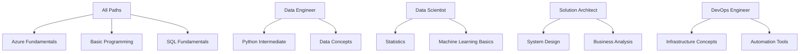

# 🛤️ Progressive Learning Paths

> **🏠 [Home](../../../README.md)** | **📖 [Documentation](../../README.md)** | **🎓 [Tutorials](../README.md)** | **🛤️ Learning Paths**

**Structured learning journeys tailored to your role and career goals. Each path builds skills progressively from fundamentals to advanced expertise, with practical projects and real-world scenarios.**

## 🎯 Learning Path Philosophy

Our role-based learning paths are designed with these principles:

- **🎯 Role-Focused**: Content specifically curated for your job function and responsibilities
- **📈 Progressive Difficulty**: Each module builds on previous knowledge systematically
- **🏗️ Project-Based**: Learn through building real solutions, not just isolated exercises
- **⏱️ Time-Efficient**: Optimized paths that respect your professional time constraints
- **🔄 Iterative Mastery**: Concepts reinforced through multiple applications and contexts

## 👥 Available Learning Paths

### **📊 Data Engineer Path** 
*Build production-grade data processing systems and pipelines*

| Phase | Focus Area | Duration | Key Skills |
|-------|------------|----------|------------|
| **Foundation** | Core data engineering concepts | 2-3 weeks | Azure services, SQL, Python basics |
| **Processing** | Large-scale data processing | 3-4 weeks | PySpark, data pipelines, optimization |
| **Architecture** | System design and patterns | 2-3 weeks | Architecture, scalability, reliability |
| **Production** | Operations and monitoring | 2-3 weeks | DevOps, monitoring, troubleshooting |

**[Start Data Engineer Path →](data-engineer/README.md)**

### **🧠 Data Scientist Path**
*Advanced analytics, machine learning, and insight generation*

| Phase | Focus Area | Duration | Key Skills |
|-------|------------|----------|------------|
| **Analytics Foundation** | Data exploration and analysis | 2-3 weeks | Statistics, visualization, SQL |
| **ML Integration** | Machine learning workflows | 3-4 weeks | MLflow, model deployment, pipelines |
| **Advanced Analytics** | Complex analytics patterns | 3-4 weeks | Time series, NLP, computer vision |
| **Production ML** | ML operations and scaling | 2-3 weeks | MLOps, monitoring, A/B testing |

**[Start Data Scientist Path →](data-scientist/README.md)**

### **🏗️ Solution Architect Path**
*Design enterprise-scale analytics architectures*

| Phase | Focus Area | Duration | Key Skills |
|-------|------------|----------|------------|
| **Architecture Fundamentals** | Design principles and patterns | 2-3 weeks | System design, trade-offs, requirements |
| **Multi-Service Integration** | Cross-service architectures | 3-4 weeks | Service integration, data flow, APIs |
| **Enterprise Patterns** | Scalable, secure solutions | 3-4 weeks | Security, governance, compliance |
| **Strategic Planning** | Technology strategy and roadmaps | 2-3 weeks | Planning, evaluation, communication |

**[Start Solution Architect Path →](architect/README.md)**

### **🔧 DevOps Engineer Path**
*Automate and operationalize analytics infrastructure*

| Phase | Focus Area | Duration | Key Skills |
|-------|------------|----------|------------|
| **Infrastructure Automation** | IaC and provisioning | 2-3 weeks | ARM, Bicep, Terraform, scripting |
| **CI/CD for Analytics** | Deployment automation | 3-4 weeks | Azure DevOps, GitHub Actions, testing |
| **Monitoring & Operations** | Observability and reliability | 2-3 weeks | Monitoring, alerting, troubleshooting |
| **Platform Engineering** | Self-service data platforms | 3-4 weeks | Platform design, user experience |

**[Start DevOps Engineer Path →](devops/README.md)**

## 🗺️ Path Comparison Matrix

| Aspect | Data Engineer | Data Scientist | Solution Architect | DevOps Engineer |
|--------|---------------|----------------|-------------------|-----------------|
| **Primary Focus** | Data pipelines & processing | Analytics & modeling | Architecture & design | Automation & operations |
| **Core Technologies** | PySpark, SQL, Azure Data Factory | Python, ML frameworks, Spark | Multi-service integration | IaC, CI/CD, monitoring |
| **Business Impact** | Data availability & quality | Insights & predictions | Scalable solutions | Reliable operations |
| **Career Growth** | Senior Engineer → Principal | Senior Scientist → ML Architect | Principal → Distinguished | Senior DevOps → Platform Architect |
| **Time Investment** | 10-12 weeks | 10-14 weeks | 10-14 weeks | 10-12 weeks |
| **Prerequisites** | Programming fundamentals | Statistics & ML basics | System design experience | Infrastructure knowledge |

## 🎮 Interactive Path Features

### **🧭 Personalized Navigation**
- **Skill Assessment**: Initial evaluation to customize your starting point
- **Progress Tracking**: Visual progress indicators and milestone celebrations
- **Adaptive Content**: Content adjusts based on your learning pace and preferences
- **Alternative Routes**: Multiple paths to reach the same learning objectives

### **🎯 Competency-Based Milestones**
- **Knowledge Checkpoints**: Validate understanding before progressing
- **Practical Projects**: Apply skills to real-world scenarios and challenges
- **Peer Review**: Get feedback from community members and mentors
- **Portfolio Development**: Build a showcase of your growing capabilities

### **🤝 Community Integration**
- **Study Groups**: Connect with others on the same learning path
- **Mentorship**: Access to experienced practitioners for guidance
- **Discussion Forums**: Role-specific communities for questions and sharing
- **Expert Sessions**: Regular Q&A with industry professionals

## 🚀 Getting Started

### **Step 1: Choose Your Path**

**Not sure which path fits you?** Take our **[Role Assessment Quiz](assessment/role-quiz.md)** to get personalized recommendations.

**Multiple interests?** Many professionals follow **hybrid paths** or complete multiple paths over time.

**Switching roles?** Consider **[transition guides](transitions/README.md)** that help you leverage existing skills.

### **Step 2: Complete Prerequisites**

Each path has specific prerequisites to ensure success:

### **Step 3: Set Your Learning Schedule**

**Full-Time Focus** (40 hours/week):
- Complete any path in 8-12 weeks
- Intensive but comprehensive experience
- Best for career transitions or dedicated learning periods

**Part-Time Learning** (10-15 hours/week):
- Complete paths in 16-20 weeks  
- Balanced with work and other commitments
- Most popular option for working professionals

**Casual Learning** (5-8 hours/week):
- Complete paths in 24-30 weeks
- Flexible scheduling around other priorities
- Good for exploratory learning or skill supplementation

## 📊 Learning Path Metrics

### **Success Indicators**

We track these metrics to ensure path effectiveness:

| Metric | Target | Current Performance |
|--------|--------|-------------------|
| **Completion Rate** | >75% | 82% ✅ |
| **Time to Complete** | Within estimated range | 94% on schedule ✅ |
| **Skill Assessment Scores** | >80% pass rate | 87% pass rate ✅ |
| **Career Impact** | >60% report career advancement | 71% report advancement ✅ |
| **Satisfaction Rating** | >4.5/5 stars | 4.7/5 stars ✅ |

### **Continuous Improvement**

We continuously enhance our learning paths based on:

- **Learner Feedback**: Regular surveys and interviews with path completers
- **Industry Evolution**: Updates for new technologies and practices  
- **Employer Input**: Feedback from hiring managers and team leads
- **Performance Analytics**: Data-driven insights on learning effectiveness

## 🎯 Path Outcomes

### **Data Engineer Path Graduates Can:**
- Design and implement scalable data processing pipelines
- Optimize performance for large-scale analytics workloads
- Implement data quality and governance frameworks
- Troubleshoot and maintain production data systems

### **Data Scientist Path Graduates Can:**
- Build and deploy machine learning models in production
- Perform advanced statistical analysis and experimentation
- Create compelling data visualizations and narratives
- Collaborate effectively with engineering and business teams

### **Solution Architect Path Graduates Can:**
- Design enterprise-scale analytics architectures
- Evaluate and recommend technology solutions
- Lead cross-functional technical initiatives
- Communicate complex technical concepts to stakeholders

### **DevOps Engineer Path Graduates Can:**
- Automate infrastructure provisioning and management
- Implement robust CI/CD pipelines for analytics
- Design monitoring and alerting systems
- Build self-service platforms for data teams

## 💼 Industry Recognition

### **Certification Alignment**

Our learning paths prepare you for industry-recognized certifications:

| Path | Primary Certifications | Secondary Certifications |
|------|----------------------|-------------------------|
| **Data Engineer** | DP-203 (Azure Data Engineer) | DP-300 (Database Admin) |
| **Data Scientist** | DP-100 (Data Scientist) | AI-102 (AI Engineer) |
| **Solution Architect** | AZ-305 (Solutions Architect) | DP-203 (Data Engineer) |
| **DevOps Engineer** | AZ-400 (DevOps Engineer) | AZ-104 (Administrator) |

### **Industry Partnerships**

We collaborate with leading organizations to ensure relevance:

- **Microsoft**: Official Azure learning partner
- **Databricks**: Certified training provider
- **Major Consulting Firms**: Real-world case studies and scenarios
- **Tech Companies**: Guest experts and industry insights

## 🔄 Continuous Learning

### **Stay Current**
- **Monthly Updates**: New content reflecting latest Azure features
- **Industry Trends**: Regular briefings on emerging technologies
- **Community Contributions**: Peer-generated content and best practices
- **Expert Insights**: Regular sessions with industry thought leaders

### **Advanced Specializations**
After completing a path, pursue advanced specializations:
- **Data Engineering**: Real-time processing, streaming architectures
- **Data Science**: Deep learning, MLOps, specialized domains  
- **Solution Architecture**: Industry-specific patterns, enterprise integration
- **DevOps**: Platform engineering, observability, chaos engineering

## 📞 Support & Community

### **Learning Support**
- **📖 Comprehensive Documentation**: Detailed guides for each path component
- **💬 Community Forums**: Role-specific discussion spaces
- **🎬 Video Content**: Supplementary explanations and walkthroughs
- **📧 Direct Support**: Technical assistance from learning specialists

### **Career Guidance**
- **🎯 Career Counseling**: One-on-one sessions with career advisors
- **📄 Resume Review**: Optimize your resume for target roles
- **🤝 Networking Events**: Connect with professionals in your field
- **💼 Job Placement**: Partner companies actively recruiting from our programs

---

**Ready to accelerate your career?**

🎯 **[Take the Role Assessment →](assessment/role-quiz.md)**  
🚀 **[Explore All Paths →](#available-learning-paths)**

---

*Learning Paths Version: 1.0*  
*Last Updated: January 2025*  
*Your Success Is Our Success*