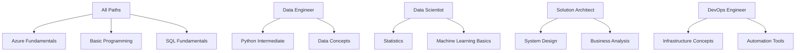

# 🛤️ Progressive Learning Paths

> __🏠 [Home](../../../README.md)__ | __📖 [Documentation](../../README.md)__ | __🎓 Tutorials__ | __🛤️ Learning Paths__

__Structured learning journeys tailored to your role and career goals. Each path builds skills progressively from fundamentals to advanced expertise, with practical projects and real-world scenarios.__

## 🎯 Learning Path Philosophy

Our role-based learning paths are designed with these principles:

- __🎯 Role-Focused__: Content specifically curated for your job function and responsibilities
- __📈 Progressive Difficulty__: Each module builds on previous knowledge systematically
- __🏗️ Project-Based__: Learn through building real solutions, not just isolated exercises
- __⏱️ Time-Efficient__: Optimized paths that respect your professional time constraints
- __🔄 Iterative Mastery__: Concepts reinforced through multiple applications and contexts

## 👥 Available Learning Paths

### __📊 Data Engineer Path__

*Build production-grade data processing systems and pipelines*

| Phase | Focus Area | Duration | Key Skills |
|-------|------------|----------|------------|
| __Foundation__ | Core data engineering concepts | 2-3 weeks | Azure services, SQL, Python basics |
| __Processing__ | Large-scale data processing | 3-4 weeks | PySpark, data pipelines, optimization |
| __Architecture__ | System design and patterns | 2-3 weeks | Architecture, scalability, reliability |
| __Production__ | Operations and monitoring | 2-3 weeks | DevOps, monitoring, troubleshooting |

__[Start Data Engineer Path →](data-engineer/README.md)__

### __🧠 Data Scientist Path__

*Advanced analytics, machine learning, and insight generation*

| Phase | Focus Area | Duration | Key Skills |
|-------|------------|----------|------------|
| __Analytics Foundation__ | Data exploration and analysis | 2-3 weeks | Statistics, visualization, SQL |
| __ML Integration__ | Machine learning workflows | 3-4 weeks | MLflow, model deployment, pipelines |
| __Advanced Analytics__ | Complex analytics patterns | 3-4 weeks | Time series, NLP, computer vision |
| __Production ML__ | ML operations and scaling | 2-3 weeks | MLOps, monitoring, A/B testing |

__[Start Data Scientist Path →](data-scientist/README.md)__

### __🏗️ Solution Architect Path__

*Design enterprise-scale analytics architectures*

| Phase | Focus Area | Duration | Key Skills |
|-------|------------|----------|------------|
| __Architecture Fundamentals__ | Design principles and patterns | 2-3 weeks | System design, trade-offs, requirements |
| __Multi-Service Integration__ | Cross-service architectures | 3-4 weeks | Service integration, data flow, APIs |
| __Enterprise Patterns__ | Scalable, secure solutions | 3-4 weeks | Security, governance, compliance |
| __Strategic Planning__ | Technology strategy and roadmaps | 2-3 weeks | Planning, evaluation, communication |

__[Start Solution Architect Path →](architect/README.md)__

### __🔧 DevOps Engineer Path__

*Automate and operationalize analytics infrastructure*

| Phase | Focus Area | Duration | Key Skills |
|-------|------------|----------|------------|
| __Infrastructure Automation__ | IaC and provisioning | 2-3 weeks | ARM, Bicep, Terraform, scripting |
| __CI/CD for Analytics__ | Deployment automation | 3-4 weeks | Azure DevOps, GitHub Actions, testing |
| __Monitoring & Operations__ | Observability and reliability | 2-3 weeks | Monitoring, alerting, troubleshooting |
| __Platform Engineering__ | Self-service data platforms | 3-4 weeks | Platform design, user experience |

__[Start DevOps Engineer Path →](devops/README.md)__

## 🗺️ Path Comparison Matrix

| Aspect | Data Engineer | Data Scientist | Solution Architect | DevOps Engineer |
|--------|---------------|----------------|-------------------|-----------------|
| __Primary Focus__ | Data pipelines & processing | Analytics & modeling | Architecture & design | Automation & operations |
| __Core Technologies__ | PySpark, SQL, Azure Data Factory | Python, ML frameworks, Spark | Multi-service integration | IaC, CI/CD, monitoring |
| __Business Impact__ | Data availability & quality | Insights & predictions | Scalable solutions | Reliable operations |
| __Career Growth__ | Senior Engineer → Principal | Senior Scientist → ML Architect | Principal → Distinguished | Senior DevOps → Platform Architect |
| __Time Investment__ | 10-12 weeks | 10-14 weeks | 10-14 weeks | 10-12 weeks |
| __Prerequisites__ | Programming fundamentals | Statistics & ML basics | System design experience | Infrastructure knowledge |

## 🎮 Interactive Path Features

### __🧭 Personalized Navigation__

- __Skill Assessment__: Initial evaluation to customize your starting point
- __Progress Tracking__: Visual progress indicators and milestone celebrations
- __Adaptive Content__: Content adjusts based on your learning pace and preferences
- __Alternative Routes__: Multiple paths to reach the same learning objectives

### __🎯 Competency-Based Milestones__

- __Knowledge Checkpoints__: Validate understanding before progressing
- __Practical Projects__: Apply skills to real-world scenarios and challenges
- __Peer Review__: Get feedback from community members and mentors
- __Portfolio Development__: Build a showcase of your growing capabilities

### __🤝 Community Integration__

- __Study Groups__: Connect with others on the same learning path
- __Mentorship__: Access to experienced practitioners for guidance
- __Discussion Forums__: Role-specific communities for questions and sharing
- __Expert Sessions__: Regular Q&A with industry professionals

## 🚀 Getting Started

### __Step 1: Choose Your Path__

__Not sure which path fits you?__ Take our __[Role Assessment Quiz](assessment/role-quiz.md)__ to get personalized recommendations.

__Multiple interests?__ Many professionals follow __hybrid paths__ or complete multiple paths over time.

__Switching roles?__ Consider __[transition guides](transitions/README.md)__ that help you leverage existing skills.

### __Step 2: Complete Prerequisites__

Each path has specific prerequisites to ensure success:

### __Step 3: Set Your Learning Schedule__

__Full-Time Focus__ (40 hours/week):

- Complete any path in 8-12 weeks
- Intensive but comprehensive experience
- Best for career transitions or dedicated learning periods

__Part-Time Learning__ (10-15 hours/week):

- Complete paths in 16-20 weeks  
- Balanced with work and other commitments
- Most popular option for working professionals

__Casual Learning__ (5-8 hours/week):

- Complete paths in 24-30 weeks
- Flexible scheduling around other priorities
- Good for exploratory learning or skill supplementation

## 📊 Learning Path Metrics

### __Success Indicators__

We track these metrics to ensure path effectiveness:

| Metric | Target | Current Performance |
|--------|--------|-------------------|
| __Completion Rate__ | >75% | 82% ✅ |
| __Time to Complete__ | Within estimated range | 94% on schedule ✅ |
| __Skill Assessment Scores__ | >80% pass rate | 87% pass rate ✅ |
| __Career Impact__ | >60% report career advancement | 71% report advancement ✅ |
| __Satisfaction Rating__ | >4.5/5 stars | 4.7/5 stars ✅ |

### __Continuous Improvement__

We continuously enhance our learning paths based on:

- __Learner Feedback__: Regular surveys and interviews with path completers
- __Industry Evolution__: Updates for new technologies and practices  
- __Employer Input__: Feedback from hiring managers and team leads
- __Performance Analytics__: Data-driven insights on learning effectiveness

## 🎯 Path Outcomes

### __Data Engineer Path Graduates Can:__

- Design and implement scalable data processing pipelines
- Optimize performance for large-scale analytics workloads
- Implement data quality and governance frameworks
- Troubleshoot and maintain production data systems

### __Data Scientist Path Graduates Can:__

- Build and deploy machine learning models in production
- Perform advanced statistical analysis and experimentation
- Create compelling data visualizations and narratives
- Collaborate effectively with engineering and business teams

### __Solution Architect Path Graduates Can:__

- Design enterprise-scale analytics architectures
- Evaluate and recommend technology solutions
- Lead cross-functional technical initiatives
- Communicate complex technical concepts to stakeholders

### __DevOps Engineer Path Graduates Can:__

- Automate infrastructure provisioning and management
- Implement robust CI/CD pipelines for analytics
- Design monitoring and alerting systems
- Build self-service platforms for data teams

## 💼 Industry Recognition

### __Certification Alignment__

Our learning paths prepare you for industry-recognized certifications:

| Path | Primary Certifications | Secondary Certifications |
|------|----------------------|-------------------------|
| __Data Engineer__ | DP-203 (Azure Data Engineer) | DP-300 (Database Admin) |
| __Data Scientist__ | DP-100 (Data Scientist) | AI-102 (AI Engineer) |
| __Solution Architect__ | AZ-305 (Solutions Architect) | DP-203 (Data Engineer) |
| __DevOps Engineer__ | AZ-400 (DevOps Engineer) | AZ-104 (Administrator) |

### __Industry Partnerships__

We collaborate with leading organizations to ensure relevance:

- __Microsoft__: Official Azure learning partner
- __Databricks__: Certified training provider
- __Major Consulting Firms__: Real-world case studies and scenarios
- __Tech Companies__: Guest experts and industry insights

## 🔄 Continuous Learning

### __Stay Current__

- __Monthly Updates__: New content reflecting latest Azure features
- __Industry Trends__: Regular briefings on emerging technologies
- __Community Contributions__: Peer-generated content and best practices
- __Expert Insights__: Regular sessions with industry thought leaders

### __Advanced Specializations__

After completing a path, pursue advanced specializations:

- __Data Engineering__: Real-time processing, streaming architectures
- __Data Science__: Deep learning, MLOps, specialized domains  
- __Solution Architecture__: Industry-specific patterns, enterprise integration
- __DevOps__: Platform engineering, observability, chaos engineering

## 📞 Support & Community

### __Learning Support__

- __📖 Comprehensive Documentation__: Detailed guides for each path component
- __💬 Community Forums__: Role-specific discussion spaces
- __🎬 Video Content__: Supplementary explanations and walkthroughs
- __📧 Direct Support__: Technical assistance from learning specialists

### __Career Guidance__

- __🎯 Career Counseling__: One-on-one sessions with career advisors
- __📄 Resume Review__: Optimize your resume for target roles
- __🤝 Networking Events__: Connect with professionals in your field
- __💼 Job Placement__: Partner companies actively recruiting from our programs

---

__Ready to accelerate your career?__

🎯 __[Take the Role Assessment →](assessment/role-quiz.md)__  
🚀 __[Explore All Paths →](#available-learning-paths)__

---

*Learning Paths Version: 1.0*  
*Last Updated: January 2025*  
*Your Success Is Our Success*
