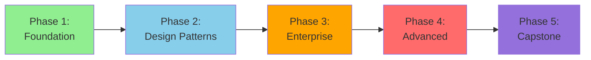

# 🏗️ Solution Architect Learning Path

> __🏠 [Home](../../../../README.md)__ | __📖 [Documentation](../../../README.md)__ | __🎓 [Tutorials](../../README.md)__ | __🛤️ [Learning Paths](../README.md)__ | __🏗️ Solution Architect__

__Design and architect enterprise-scale analytics solutions on Azure. Master architectural patterns, best practices, and decision frameworks to build robust, scalable, and cost-effective data platforms.__

## 🎯 Learning Objectives

After completing this learning path, you will be able to:

- __Design__ end-to-end analytics architectures aligned with business requirements
- __Evaluate__ technology choices and trade-offs for different use cases
- __Architect__ hybrid and multi-cloud data solutions
- __Implement__ enterprise governance and security frameworks
- __Optimize__ solutions for performance, reliability, and cost
- __Lead__ technical design discussions and architecture reviews
- __Document__ architectural decisions and patterns

## 📋 Prerequisites Checklist

Before starting this learning path, ensure you have:

### __Required Experience__

- [ ] __5+ years__ in software development or data engineering
- [ ] __3+ years__ working with cloud platforms (Azure preferred)
- [ ] __Hands-on experience__ with data warehousing and ETL/ELT
- [ ] __Production experience__ deploying and operating large-scale systems
- [ ] __Understanding__ of networking, security, and infrastructure concepts

### __Required Knowledge__

- [ ] __Azure services__ - Deep familiarity with Azure data and analytics services
- [ ] __Data modeling__ - Expert in dimensional modeling, data vault, and normalization
- [ ] __Distributed systems__ - Understanding of scalability, availability, and consistency
- [ ] __SQL and programming__ - Proficient in T-SQL, Python, or similar languages
- [ ] __DevOps practices__ - Experience with CI/CD, IaC, and automation

### __Required Access__

- [ ] __Azure subscription__ with Owner or Contributor role
- [ ] __Development tools__ - VS Code, Azure CLI, PowerShell, Terraform/Bicep
- [ ] __Sufficient budget__ (~$400-500 for complete path)

## 🗺️ Learning Path Structure

This path consists of __5 progressive phases__ from foundational architecture to expert-level design:

### __Time Investment__

- __Full-Time__ (40 hrs/week): 12-14 weeks
- __Part-Time__ (20 hrs/week): 20-24 weeks
- __Casual__ (10 hrs/week): 30-36 weeks

## 📚 Phase 1: Architectural Foundation (2-3 weeks)

__Goal__: Build comprehensive understanding of Azure analytics architecture principles

### __Module 1.1: Architecture Fundamentals__ (10 hours)

__Learning Objectives:__

- Understand cloud-native architecture principles
- Master Azure analytics service capabilities and limitations
- Learn architectural decision frameworks
- Understand cost modeling and optimization strategies

__Hands-on Exercises:__

1. __Lab 1.1.1__: Architecture assessment of existing analytics platform
2. __Lab 1.1.2__: Create architecture diagrams using Azure icons
3. __Lab 1.1.3__: Cost modeling for different architecture scenarios
4. __Lab 1.1.4__: Document architectural decisions using ADRs

__Resources:__

- [Azure Architecture Center](https://learn.microsoft.com/azure/architecture/)
- [Cloud Adoption Framework](https://learn.microsoft.com/azure/cloud-adoption-framework/)
- [Well-Architected Framework](https://learn.microsoft.com/azure/well-architected/)

__Assessment:__

- Design a reference architecture for a retail analytics platform
- Document key architectural decisions and trade-offs

### __Module 1.2: Data Architecture Patterns__ (12 hours)

__Learning Objectives:__

- Master data lakehouse, data mesh, and modern data warehouse patterns
- Understand batch vs streaming architecture decisions
- Learn data partitioning and distribution strategies
- Understand metadata management and data catalogs

__Hands-on Exercises:__

1. __Lab 1.2.1__: Design medallion architecture (bronze, silver, gold layers)
2. __Lab 1.2.2__: Implement data mesh domain boundaries
3. __Lab 1.2.3__: Create metadata-driven ingestion framework
4. __Lab 1.2.4__: Design near-real-time analytics architecture

__Resources:__

- [Delta Lakehouse Architecture](../../../architecture/delta-lakehouse/README.md)
- [Medallion Architecture Pattern](../../../architecture/delta-lakehouse/detailed-architecture.md)
- [Data Mesh on Azure](https://learn.microsoft.com/azure/architecture/example-scenario/data/data-mesh-scenario)

__Assessment:__

- Design a data lakehouse for healthcare analytics
- Present architecture to peer review group

### __Module 1.3: Security and Governance Architecture__ (10 hours)

__Learning Objectives:__

- Design zero-trust security architectures
- Implement network isolation and private connectivity
- Architect data governance frameworks
- Design identity and access management strategies

__Hands-on Exercises:__

1. __Lab 1.3.1__: Design network architecture with private endpoints
2. __Lab 1.3.2__: Implement Azure Purview data governance
3. __Lab 1.3.3__: Design RBAC and ABAC strategies
4. __Lab 1.3.4__: Architect data encryption and key management

__Resources:__

- [Private Link Architecture](../../../architecture/private-link-architecture.md)
- [Security Best Practices](../../../best-practices/security.md)
- [Network Security](../../../best-practices/network-security.md)

__Assessment:__

- Design security architecture for financial services platform
- Document compliance requirements and controls

## 📚 Phase 2: Design Patterns and Best Practices (3-4 weeks)

__Goal__: Master proven architectural patterns for common scenarios

### __Module 2.1: Ingestion Patterns__ (12 hours)

__Topics:__

- Batch ingestion architectures (full, incremental, CDC)
- Streaming ingestion patterns (Event Hubs, IoT Hub, Kafka)
- Hybrid batch-streaming architectures (Lambda, Kappa)
- Data quality and validation frameworks

__Hands-on Projects:__

1. Design real-time CDC pipeline from SQL Server to Delta Lake
2. Architect multi-source batch ingestion framework
3. Implement data quality checks and validation rules

__Resources:__

- [Auto Loader Pattern](../../../code-examples/delta-lake/ingestion/auto-loader.md)
- [Change Data Capture](../../../code-examples/delta-lake/cdc/change-data-capture.md)

### __Module 2.2: Processing Patterns__ (12 hours)

__Topics:__

- Medallion architecture (bronze, silver, gold)
- Slowly changing dimensions (SCD Type 1, 2, 3)
- Data deduplication strategies
- Incremental processing patterns

__Hands-on Projects:__

1. Design SCD Type 2 implementation with merge operations
2. Architect incremental processing framework
3. Implement data lineage tracking

__Resources:__

- [Delta Lake Optimization](../../../best-practices/delta-lake-optimization.md)
- [Table Optimization](../../../code-examples/delta-lake/optimization/table-optimization.md)

### __Module 2.3: Serving Patterns__ (10 hours)

__Topics:__

- Serverless SQL for ad-hoc analytics
- Dedicated SQL for high-concurrency workloads
- Power BI integration patterns
- API-based data serving

__Hands-on Projects:__

1. Design semantic layer with Serverless SQL
2. Architect aggregation framework for BI
3. Implement caching strategies

__Resources:__

- [Serverless SQL Architecture](../../../architecture/serverless-sql/README.md)
- [Query Optimization](../../../code-examples/serverless-sql/query-optimization.md)

## 📚 Phase 3: Enterprise Architecture (3-4 weeks)

__Goal__: Design enterprise-grade multi-tenant, multi-region solutions

### __Module 3.1: Multi-Tenant Architecture__ (14 hours)

__Topics:__

- Isolation strategies (database, schema, row-level)
- Tenant onboarding and provisioning
- Tenant-specific customization
- Cost allocation and chargeback

__Hands-on Projects:__

1. Design multi-tenant SaaS analytics platform
2. Implement tenant isolation with row-level security
3. Architect tenant provisioning automation

### __Module 3.2: High Availability and Disaster Recovery__ (12 hours)

__Topics:__

- Redundancy and failover strategies
- Backup and restore patterns
- Multi-region deployment architectures
- RPO/RTO planning and testing

__Hands-on Projects:__

1. Design active-passive multi-region architecture
2. Implement automated failover procedures
3. Create disaster recovery runbook

__Resources:__

- [Best Practices: Cost Optimization](../../../best-practices/cost-optimization.md)

### __Module 3.3: Performance Architecture__ (12 hours)

__Topics:__

- Data partitioning strategies
- Compute scaling patterns
- Caching architectures
- Query optimization frameworks

__Hands-on Projects:__

1. Design partitioning strategy for 100TB+ dataset
2. Architect auto-scaling framework
3. Implement performance monitoring dashboard

__Resources:__

- [Performance Optimization](../../../best-practices/performance-optimization.md)
- [Spark Performance](../../../best-practices/spark-performance.md)

## 📚 Phase 4: Advanced Topics (3-4 weeks)

__Goal__: Master cutting-edge patterns and complex integration scenarios

### __Module 4.1: Hybrid and Multi-Cloud__ (14 hours)

__Topics:__

- Hybrid cloud connectivity (ExpressRoute, VPN)
- Multi-cloud data integration
- Edge computing and IoT architectures
- Data sovereignty and compliance

__Hands-on Projects:__

1. Design hybrid on-premises to Azure migration
2. Architect multi-cloud data synchronization
3. Implement edge analytics with Azure IoT Edge

### __Module 4.2: Advanced Analytics and ML__ (12 hours)

__Topics:__

- MLOps architecture patterns
- Real-time ML scoring pipelines
- Feature store architectures
- Model monitoring and governance

__Hands-on Projects:__

1. Design end-to-end MLOps pipeline
2. Architect real-time recommendation engine
3. Implement ML model registry and versioning

__Resources:__

- [Azure ML Integration](../../../code-examples/integration/azure-ml.md)

### __Module 4.3: Data Mesh and Decentralized Architectures__ (10 hours)

__Topics:__

- Domain-oriented data ownership
- Self-service data platforms
- Federated governance
- Data product thinking

__Hands-on Projects:__

1. Design data mesh architecture for enterprise
2. Implement domain data products
3. Architect federated governance framework

## 📚 Phase 5: Capstone Project (2-3 weeks)

__Goal__: Apply all learning to design comprehensive enterprise solution

### __Capstone Requirements__

Design and document a complete analytics platform including:

1. __Business Requirements__: Define use cases and success criteria
2. __Solution Architecture__: Create detailed architecture diagrams
3. __Technology Selection__: Document service choices and trade-offs
4. __Security Design__: Define security and compliance controls
5. __Cost Model__: Estimate TCO and optimization strategies
6. __Migration Plan__: Create phased implementation roadmap
7. __Operations Plan__: Define monitoring, backup, and support

### __Deliverables__

- Architecture design document (20-30 pages)
- Detailed architecture diagrams (C4 model)
- Infrastructure as Code templates
- Proof of concept implementation
- Architecture review presentation
- Cost model spreadsheet

### __Sample Capstone Topics__

1. Global retail analytics platform with 50+ stores
2. Healthcare analytics with HIPAA compliance
3. Financial services real-time fraud detection
4. Manufacturing IoT and predictive maintenance
5. Media and entertainment content analytics

## 🎓 Certification Alignment

This learning path prepares you for:

- __Azure Solutions Architect Expert (AZ-305)__
- __Azure Data Engineer Associate (DP-203)__
- __Azure Database Administrator Associate (DP-300)__

## 📊 Skills Assessment

### __Self-Assessment Checklist__

Rate your skills (1-5, where 5 is expert):

#### __Architecture Design__ (Target: 4-5)

- [ ] Can design complete end-to-end solutions
- [ ] Understand trade-offs between architectural patterns
- [ ] Can justify technology choices with business context
- [ ] Document architecture decisions effectively

#### __Technical Depth__ (Target: 4-5)

- [ ] Deep expertise in Azure analytics services
- [ ] Understanding of distributed systems concepts
- [ ] Can optimize for performance and cost
- [ ] Knowledge of security and compliance requirements

#### __Communication__ (Target: 4-5)

- [ ] Can explain complex technical concepts to non-technical stakeholders
- [ ] Create clear and comprehensive documentation
- [ ] Lead effective architecture review discussions
- [ ] Present and defend architectural decisions

#### __Business Acumen__ (Target: 3-4)

- [ ] Understand business drivers for technology decisions
- [ ] Can estimate TCO and ROI
- [ ] Align technical solutions with business strategy
- [ ] Manage stakeholder expectations

## 💡 Learning Tips

### __Study Strategies__

- __Learn by doing__: Always implement what you design
- __Study real architectures__: Review Azure Architecture Center case studies
- __Peer review__: Get feedback on your designs from experienced architects
- __Stay current__: Follow Azure updates and new service announcements
- __Document everything__: Practice creating ADRs and design docs

### __Recommended Reading__

- "Designing Data-Intensive Applications" by Martin Kleppmann
- "Building Microservices" by Sam Newman
- "Cloud FinOps" by J.R. Storment and Mike Fuller
- Azure Architecture Center case studies
- Azure Well-Architected Framework documentation

### __Community Engagement__

- Join Azure architecture community forums
- Attend Azure architecture webinars and events
- Participate in architecture review sessions
- Contribute to open-source architecture patterns

## 🔗 Next Steps

After completing this path:

- __Apply learning__: Lead architecture initiatives at your organization
- __Mentor others__: Share knowledge with junior engineers
- __Contribute back__: Create reference architectures and patterns
- __Stay engaged__: Join architecture communities and forums

### __Advanced Learning__

- Data mesh architecture deep dive
- Kubernetes and container orchestration
- Multi-cloud integration patterns
- Edge computing and IoT architectures

## 🎉 Success Stories

> __"This learning path transformed how I approach architecture design. The hands-on projects gave me confidence to lead our enterprise data platform redesign."__
> *- James, Principal Architect*

> __"The emphasis on business context and cost optimization helped me create solutions that leadership actually approved and funded."__
> *- Maria, Solutions Architect*

## 📞 Getting Help

- __Architecture Reviews__: Schedule peer review sessions
- __Community Forum__: [GitHub Discussions](https://github.com/your-org/csa-tutorials/discussions)
- __Office Hours__: Weekly architect Q&A sessions
- __Mentorship__: Connect with experienced Azure architects

---

__Ready to start?__ Begin with [Phase 1: Architectural Foundation](#-phase-1-architectural-foundation-2-3-weeks)

---

*Last Updated: January 2025*
*Learning Path Version: 1.0*
*Maintained by: Cloud Architecture Team*
