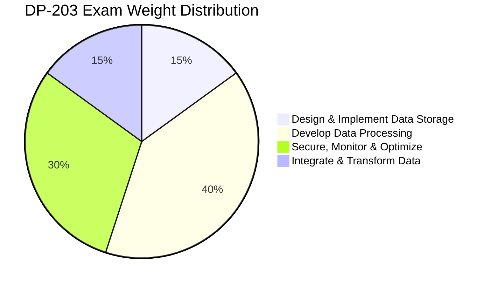

# = DP-203: Azure Data Engineer Associate Certification Prep

> **< [Home](../../../../README.md)** | **= [Documentation](../../../README.md)** | **< [Tutorials](../../README.md)** | **= [Learning Paths](../README.md)** | **= DP-203 Certification**


**Comprehensive preparation guide for the DP-203: Data Engineering on Microsoft Azure certification. This path aligns with the official exam objectives and provides hands-on practice with real-world scenarios using Azure Synapse Analytics, Data Factory, and related services.**

## < Certification Overview

### Exam Details

| Aspect | Details |
|--------|---------|
| **Exam Code** | DP-203 |
| **Title** | Data Engineering on Microsoft Azure |
| **Level** | Associate |
| **Duration** | 120 minutes |
| **Number of Questions** | 40-60 questions |
| **Question Types** | Multiple choice, multiple response, drag and drop, case studies |
| **Passing Score** | 700/1000 (approximately 70%) |
| **Cost** | $165 USD |
| **Languages** | English, Japanese, Chinese (Simplified), Korean |
| **Renewal** | Annual renewal required |

### Target Audience

This certification is designed for:

- Data engineers building analytics solutions on Azure
- ETL developers transitioning to cloud data platforms
- Database professionals expanding to big data engineering
- Software engineers specializing in data pipelines
- Solution architects focusing on data platform design

## = Exam Skills Measured

### Domain Breakdown



### Detailed Skill Areas

#### 1. Design and Implement Data Storage (15-20%)

**1.1 Design a Data Storage Structure**
- Design an Azure Data Lake solution
- Recommend file types for specific analytics workloads
- Design for efficient querying patterns
- Design for data archiving and retention

**1.2 Design the Serving Layer**
- Design star schemas and snowflake schemas
- Design a dimensional hierarchy
- Design a data warehouse solution
- Design for incremental loads

**1.3 Implement Physical Data Storage Structures**
- Implement compression strategies
- Implement partitioning strategies
- Implement sharding strategies
- Implement different table geometries with Azure Synapse Analytics

**1.4 Implement Logical Data Structures**
- Build a temporal data solution
- Build a slowly changing dimension (SCD) solution
- Build a logical folder structure
- Build external tables

**CSA In-a-Box Coverage:**
-  [Data Lake Architecture](../../../architecture/delta-lakehouse/README.md)
-  [Delta Lake Implementation](../../../code-examples/delta-lake-guide.md)
-  [Table Optimization Patterns](../../../code-examples/delta-lake/optimization/table-optimization.md)

---

#### 2. Develop Data Processing Solutions (40-45%)

**2.1 Ingest and Transform Data**
- Transform data by using Apache Spark
- Transform data by using Transact-SQL
- Ingest and transform data by using Azure Synapse Pipelines
- Transform data by using Azure Stream Analytics
- Cleanse data
- Split data
- Encode and decode data
- Configure error handling for transformations
- Normalize and denormalize data
- Perform exploratory data analysis

**2.2 Develop a Batch Processing Solution**
- Develop batch processing solutions by using Azure Data Lake Storage
- Develop batch processing solutions by using Azure Databricks
- Develop batch processing solutions by using Azure Synapse Analytics
- Develop batch processing solutions by using Azure Data Factory
- Develop batch processing solutions by using Azure SQL Database
- Develop a windowing solution
- Handle duplicate data
- Handle late-arriving data
- Handle missing data
- Upsert data
- Configure exception handling
- Configure batch retention

**2.3 Develop a Stream Processing Solution**
- Create a stream processing solution by using Stream Analytics
- Create a stream processing solution by using Azure Databricks
- Create a stream processing solution by using Azure Event Hubs
- Implement windowed aggregates
- Handle schema drift
- Process time-series data
- Process data across partitions
- Process within one partition

**2.4 Manage Batches and Pipelines**
- Trigger batches
- Handle failed batch loads
- Validate batch loads
- Design and configure exception handling
- Configure batch retention
- Debug Spark jobs by using the Spark UI

**CSA In-a-Box Coverage:**
-  [PySpark Fundamentals](../../../tutorials/code-labs/pyspark-fundamentals.md)
-  [Auto Loader Implementation](../../../code-examples/delta-lake/ingestion/auto-loader.md)
-  [Change Data Capture](../../../code-examples/delta-lake/cdc/change-data-capture.md)
-  [Stream Analytics Tutorials](../../../tutorials/stream-analytics/README.md)

---

#### 3. Secure, Monitor, and Optimize Data Storage and Processing (30-35%)

**3.1 Implement Data Security**
- Implement data masking
- Encrypt data at rest and in motion
- Implement row-level and column-level security
- Implement Azure role-based access control (RBAC)
- Implement Managed Identities
- Implement resource tokens in Azure Databricks
- Implement Azure Active Directory authentication

**3.2 Monitor Data Storage and Processing**
- Implement logging for Azure data services
- Configure monitoring services
- Monitor stream processing
- Measure performance of data movement
- Monitor and update statistics about data across a system
- Monitor data pipeline performance
- Measure query performance
- Schedule and monitor pipeline tests

**3.3 Optimize and Troubleshoot Data Storage and Processing**
- Compact small files
- Handle skew in data
- Handle data spill
- Optimize resource management
- Tune queries by using indexers
- Tune queries by using cache
- Troubleshoot a failed Spark job
- Troubleshoot a failed pipeline run

**CSA In-a-Box Coverage:**
-  [Security Best Practices](../../../best-practices/security.md)
-  [Network Security](../../../best-practices/network-security.md)
-  [Performance Optimization](../../../best-practices/performance-optimization.md)
-  [Spark Performance Tuning](../../../best-practices/spark-performance.md)
-  [Monitoring Setup](../../../monitoring/monitoring-setup.md)

---

#### 4. Integrate and Transform Data (15-20%)

**4.1 Design and Implement Incremental Data Loads**
- Design and implement slowly changing dimensions
- Design and implement full loads
- Design and implement incremental loads

**4.2 Design and Configure Data Integration**
- Integrate data from multiple sources
- Configure data mapping and transformations
- Design data processing solutions

**CSA In-a-Box Coverage:**
-  [Data Factory Integration](../../../code-examples/integration/azure-data-factory.md)
-  [Azure ML Integration](../../../code-examples/integration/azure-ml.md)
-  [Azure Purview Integration](../../../code-examples/integration/azure-purview.md)

## < Study Plan

### 8-Week Preparation Timeline

#### **Week 1-2: Foundations & Data Storage (15-20%)**
- Review Azure Data Lake Storage Gen2 architecture
- Practice implementing partitioning strategies
- Study star schema and dimensional modeling
- Complete data storage labs in CSA In-a-Box

**Study Time:** 10-12 hours per week

**Hands-On Labs:**
- [ ] Create and configure ADLS Gen2 accounts
- [ ] Implement file organization and partitioning
- [ ] Design dimensional models for sample datasets
- [ ] Build external tables in Synapse

**Practice Questions:** 15-20 questions on data storage

---

#### **Week 3-5: Data Processing Solutions (40-45%)**
- Master PySpark transformations and optimizations
- Practice with Azure Data Factory pipeline design
- Implement streaming solutions with Event Hubs
- Study batch processing patterns

**Study Time:** 15-18 hours per week

**Hands-On Labs:**
- [ ] Build end-to-end batch processing pipeline
- [ ] Implement real-time streaming solution
- [ ] Create complex data transformations with Spark
- [ ] Design error handling and retry logic
- [ ] Implement change data capture (CDC)
- [ ] Build windowing aggregations

**Practice Questions:** 40-50 questions on data processing

---

#### **Week 6: Security, Monitoring & Optimization (30-35%)**
- Implement RBAC and data security controls
- Configure monitoring and alerting
- Practice performance tuning techniques
- Study troubleshooting methodologies

**Study Time:** 12-15 hours per week

**Hands-On Labs:**
- [ ] Configure row-level and column-level security
- [ ] Implement data masking and encryption
- [ ] Set up monitoring dashboards
- [ ] Optimize query performance
- [ ] Troubleshoot failed pipeline runs
- [ ] Handle data skew and spill

**Practice Questions:** 30-35 questions on security and optimization

---

#### **Week 7: Data Integration & Loads (15-20%)**
- Practice slowly changing dimensions (SCD Type 1, 2, 3)
- Implement incremental load patterns
- Study multi-source integration patterns

**Study Time:** 10-12 hours per week

**Hands-On Labs:**
- [ ] Implement SCD Type 2 solution
- [ ] Build incremental load pipeline
- [ ] Integrate data from multiple sources
- [ ] Design data mapping transformations

**Practice Questions:** 15-20 questions on data integration

---

#### **Week 8: Review & Practice Exams**
- Take full-length practice exams
- Review weak areas
- Complete remaining hands-on scenarios
- Final knowledge check

**Study Time:** 15-20 hours

**Activities:**
- [ ] Complete 3 full-length practice exams
- [ ] Review all incorrect answers
- [ ] Revisit difficult topics
- [ ] Complete final hands-on scenario
- [ ] Review Microsoft Learn modules

## = Recommended Study Resources

### Official Microsoft Resources

**Must-Have:**
- **[Microsoft Learn DP-203 Path](https://learn.microsoft.com/certifications/exams/dp-203)** - Official learning path
- **[DP-203 Exam Page](https://learn.microsoft.com/certifications/exams/dp-203)** - Exam objectives and details
- **[Microsoft Learn Sandbox](https://learn.microsoft.com)** - Free hands-on environment
- **[Azure Documentation](https://learn.microsoft.com/azure/)** - Comprehensive service documentation

**Supplementary:**
- Microsoft Virtual Training Days (free)
- Azure Friday episodes on data engineering
- Microsoft Tech Community blogs
- Azure Architecture Center patterns

### CSA In-a-Box Resources

**Core Learning Materials:**
- [Data Engineer Learning Path](../data-engineer/README.md) - Complete learning journey
- [Architecture Patterns](../../../architecture/README.md) - Design patterns and best practices
- [Code Examples](../../../code-examples/README.md) - Practical implementations
- [Best Practices](../../../best-practices/README.md) - Production-ready guidance

**Hands-On Practice:**
- [Synapse Tutorials](../../../tutorials/synapse/README.md)
- [PySpark Fundamentals Lab](../../../tutorials/code-labs/pyspark-fundamentals.md)
- [Integration Scenarios](../../../tutorials/integration/README.md)
- [Troubleshooting Guides](../../../troubleshooting/README.md)

### Practice Tests & Assessments

**Practice Exam Providers:**
- MeasureUp - Official Microsoft practice tests
- Whizlabs - DP-203 practice exams
- Udemy - Practice question sets
- LinkedIn Learning - Assessment tests

**Free Resources:**
- ExamTopics - Community-shared questions
- Microsoft Learn knowledge checks
- GitHub community study guides

### Books & Video Courses

**Recommended Books:**
- "Data Engineering on Azure" by Vlad Riscutia (Apress)
- "Azure Data Engineer Cookbook" (Packt)
- "Designing Data-Intensive Applications" by Martin Kleppmann

**Video Courses:**
- Pluralsight - DP-203 learning path
- LinkedIn Learning - Azure Data Engineering courses
- Udemy - Complete DP-203 prep courses
- Microsoft Learn - Video modules

## < Hands-On Lab Scenarios

### Scenario 1: E-Commerce Data Lake

**Objective:** Build complete data lake with medallion architecture

**Components:**
- Ingest data from multiple sources
- Implement bronze, silver, gold layers
- Create dimensional model
- Optimize for query performance

**Time:** 4-6 hours

**Skills Tested:**
- Data storage design
- Batch processing
- Data modeling
- Performance optimization

---

### Scenario 2: Real-Time IoT Analytics

**Objective:** Process streaming IoT data with real-time dashboards

**Components:**
- Configure Event Hubs ingestion
- Implement Stream Analytics processing
- Store in optimized format
- Create real-time visualizations

**Time:** 3-4 hours

**Skills Tested:**
- Stream processing
- Real-time transformations
- Windowing operations
- Monitoring and alerting

---

### Scenario 3: Hybrid Data Integration

**Objective:** Integrate on-premises and cloud data sources

**Components:**
- Configure hybrid connectivity
- Implement secure data movement
- Build transformation pipelines
- Implement incremental loads

**Time:** 4-5 hours

**Skills Tested:**
- Data integration
- Security implementation
- Hybrid scenarios
- Pipeline orchestration

---

### Scenario 4: Performance Troubleshooting

**Objective:** Diagnose and resolve performance issues

**Components:**
- Identify bottlenecks
- Implement optimization techniques
- Handle data skew
- Improve query performance

**Time:** 2-3 hours

**Skills Tested:**
- Troubleshooting
- Performance tuning
- Query optimization
- Resource management

## = Exam Taking Strategies

### Before the Exam

**One Week Before:**
- [ ] Review all incorrect practice questions
- [ ] Complete final hands-on scenarios
- [ ] Review exam objectives checklist
- [ ] Prepare exam environment (online or test center)
- [ ] Get adequate sleep and rest

**Day Before:**
- [ ] Light review of key concepts
- [ ] Prepare ID and confirmation details
- [ ] Avoid cramming - trust your preparation
- [ ] Relax and stay confident

### During the Exam

**Time Management:**
- 120 minutes for 40-60 questions = ~2-3 minutes per question
- Flag difficult questions and return later
- Don't spend more than 4 minutes on any single question
- Reserve 15 minutes at the end for review

**Question Strategies:**
- Read each question carefully - twice
- Eliminate obviously wrong answers first
- Watch for keywords: "BEST", "MOST", "LEAST"
- Case studies: Read questions first, then scenario
- Drag-and-drop: Think about logical sequence
- Multi-select: Read all options before selecting

**Common Traps to Avoid:**
- L Choosing solutions that work but aren't optimal
- L Selecting on-premises solutions when cloud-native exists
- L Ignoring cost optimization considerations
- L Overlooking security and governance requirements
- L Choosing complex solutions when simple ones suffice

### After the Exam

**If You Pass:**
-  Download and share your certificate
-  Add certification to LinkedIn profile
-  Update your resume
-  Plan for annual renewal
-  Consider advanced certifications (DP-420, DP-500)

**If You Don't Pass:**
- Review your score report carefully
- Identify weak knowledge areas
- Revisit those topics with hands-on practice
- Wait required period before retaking
- Most people pass on second attempt

## = Key Concepts & Formulas

### Data Processing Patterns

```python
# Medallion Architecture Pattern
bronze_layer = raw_ingested_data()
silver_layer = cleaned_and_validated(bronze_layer)
gold_layer = business_aggregations(silver_layer)

# Slowly Changing Dimension Type 2
def scd_type2_merge(source, target):
    # Close expired records
    # Insert new records with current flag
    # Update effective dates
    pass

# Delta Lake Optimization
OPTIMIZE table_name ZORDER BY (column1, column2)
VACUUM table_name RETAIN 168 HOURS
```

### Performance Tuning Checklist

**Spark Optimization:**
- Partition data appropriately (aim for 128MB per partition)
- Use broadcast joins for small tables (<10MB)
- Persist DataFrames when reused multiple times
- Use partitionBy() for frequently filtered columns
- Avoid shuffle operations when possible

**SQL Pool Optimization:**
- Use clustered columnstore indexes for large tables
- Implement hash distribution for large fact tables
- Use round robin for staging tables
- Update statistics after significant data changes
- Use result set caching for repeated queries

### Security Checklist

-  Enable encryption at rest and in transit
-  Implement RBAC with principle of least privilege
-  Use Managed Identities instead of credentials
-  Implement row-level and column-level security
-  Enable data masking for sensitive columns
-  Configure Private Endpoints for services
-  Enable Azure Defender for threat protection
-  Implement network isolation with VNets

## < Post-Certification Path

### Career Advancement

**Next Certifications:**
- **DP-420**: Designing and Implementing Cloud-Native Applications Using Microsoft Azure Cosmos DB
- **DP-500**: Designing and Implementing Enterprise-Scale Analytics Solutions
- **AZ-305**: Designing Microsoft Azure Infrastructure Solutions
- **AI-102**: Designing and Implementing a Microsoft Azure AI Solution

### Skill Development

**Advanced Topics to Explore:**
- MLOps and ML pipeline automation
- Real-time analytics at scale
- Data mesh architectures
- Data governance and compliance
- Cloud cost optimization strategies

### Community Engagement

- Join Azure Data Community
- Contribute to open-source projects
- Share knowledge through blogs
- Speak at user groups and conferences
- Mentor aspiring data engineers

## = Support & Resources

### Study Group & Community

- **Microsoft Learn Community**: Official forums for certification discussions
- **Reddit r/AzureCertification**: Active community with study tips
- **Discord Data Engineering Servers**: Real-time help and discussions
- **LinkedIn Groups**: Azure Data Engineering professional groups

### Need Help?

- = [CSA In-a-Box FAQ](../../../faq.md)
- = [Community Forums](https://github.com/fgarofalo56/csa-inabox-docs/discussions)
- = [Report Issues](https://github.com/fgarofalo56/csa-inabox-docs/issues)
- = [Contact Support](mailto:support@example.com)

##  Exam Readiness Checklist

### Knowledge Verification

- [ ] Can design appropriate data storage structures
- [ ] Understand partitioning and sharding strategies
- [ ] Can implement batch processing solutions
- [ ] Can build streaming data pipelines
- [ ] Understand security and RBAC implementation
- [ ] Can troubleshoot performance issues
- [ ] Understand monitoring and optimization
- [ ] Can implement incremental loads and SCDs

### Hands-On Verification

- [ ] Built complete medallion architecture
- [ ] Implemented real-time streaming solution
- [ ] Configured security controls
- [ ] Optimized query performance
- [ ] Troubleshot failed pipelines
- [ ] Integrated multiple data sources
- [ ] Monitored and alerted on metrics

### Practice Exam Performance

- [ ] Scored 85%+ on three practice exams
- [ ] Understand all incorrect answers
- [ ] Can explain reasoning for all answers
- [ ] Completed within time limit

---

## = Final Tips

> **"Success in the DP-203 exam comes from balancing theoretical knowledge with hands-on practice. Use CSA In-a-Box to build real solutions, not just memorize concepts."**

**Remember:**
- = Hands-on practice is crucial - build real solutions
- = Understand "why" not just "what"
-  Time management during the exam is essential
- < Focus on Azure-native solutions
- = Review weak areas multiple times
- = Think about production scenarios
-  Trust your preparation

---

**Good luck with your DP-203 certification journey!** =

---

*Last Updated: January 2025*
*Aligned with: DP-203 Exam Objectives (January 2025)*
*CSA In-a-Box Version: 1.0*
