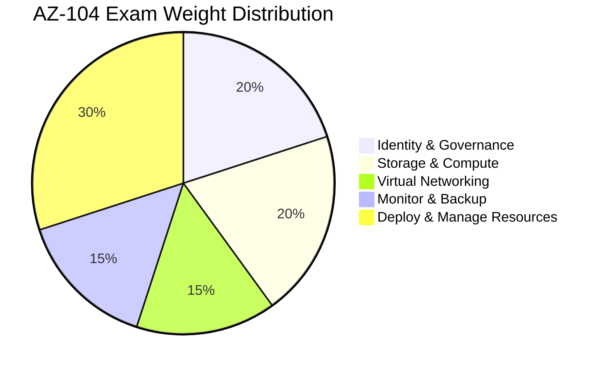

# = AZ-104: Azure Administrator Associate Certification Prep

> **< [Home](../../../../README.md)** | **= [Documentation](../../../README.md)** | **< [Tutorials](../../README.md)** | **= [Learning Paths](../README.md)** | **= AZ-104 Certification**


**Comprehensive preparation guide for the AZ-104: Microsoft Azure Administrator certification, focused on administering and managing Azure Synapse Analytics, data platforms, and analytics infrastructure. This specialized path prepares you to operate production-scale analytics environments.**

## < Certification Overview

### Exam Details

| Aspect | Details |
|--------|---------|
| **Exam Code** | AZ-104 |
| **Title** | Microsoft Azure Administrator |
| **Level** | Associate |
| **Duration** | 120 minutes |
| **Number of Questions** | 40-60 questions |
| **Question Types** | Multiple choice, multiple response, drag and drop, case studies |
| **Passing Score** | 700/1000 (approximately 70%) |
| **Cost** | $165 USD |
| **Languages** | English, Japanese, Chinese (Simplified), Korean, Spanish, German, French |
| **Renewal** | Annual renewal required |

### Target Audience for Analytics Platforms

This certification is valuable for:

- Platform administrators managing Azure Synapse environments
- Infrastructure engineers supporting analytics workloads
- DevOps engineers automating data platform operations
- Cloud administrators responsible for analytics services
- Site reliability engineers (SREs) managing data infrastructure

## = Exam Skills Measured

### Domain Breakdown



### Analytics Platform Focus Areas

While AZ-104 covers general Azure administration, this guide emphasizes skills critical for analytics platform management:

#### 1. Manage Azure Identities and Governance (20-25%)

**1.1 Manage Azure Active Directory Objects**
- Configure users and groups for analytics access
- Manage device settings and identity protection
- Perform bulk user updates for analytics teams
- Manage guest accounts for external collaboration

**1.2 Manage Access Control (RBAC)**
- Create custom roles for Synapse administrators
- Assign built-in roles (Contributor, Reader, Owner)
- Interpret access assignments for analytics resources
- Configure management groups for analytics workspaces

**1.3 Manage Subscriptions and Governance**
- Configure resource locks for production environments
- Apply and manage tags for cost allocation
- Manage resource groups for analytics services
- Configure cost management and budgets
- Implement Azure Policy for compliance

**CSA In-a-Box Coverage:**
-  [Workspace Management](../../../administration/workspace-management.md)
-  [Security Best Practices](../../../best-practices/security.md)
-  [Cost Optimization](../../../best-practices/cost-optimization.md)

---

#### 2. Implement and Manage Storage (20-25%)

**2.1 Configure Azure Storage**
- Create and configure Azure Data Lake Storage Gen2 accounts
- Configure storage account security (firewalls, VNets)
- Manage storage account access keys and SAS tokens
- Configure blob storage tiers for analytics data
- Implement storage replication strategies

**2.2 Manage Data in Azure Storage**
- Configure blob lifecycle management for analytics data
- Configure versioning and soft delete
- Configure blob storage policies
- Implement Azure Storage Explorer for management

**2.3 Configure Azure Files and Blob Storage**
- Configure Azure Files shares for shared analytics assets
- Configure blob storage with private endpoints
- Manage blob access tiers (hot, cool, archive)

**CSA In-a-Box Coverage:**
-  [Architecture Overview](../../../architecture/README.md)
-  [Delta Lakehouse Storage](../../../architecture/delta-lakehouse/README.md)
-  [Best Practices](../../../best-practices/README.md)

---

#### 3. Deploy and Manage Azure Compute Resources (15-20%)

**3.1 Configure Virtual Machines**
- Deploy VMs for analytics self-hosted integration runtimes
- Configure VM availability and scalability
- Manage VM sizes and performance

**3.2 Automate Deployment**
- Use Azure Resource Manager (ARM) templates
- Deploy analytics resources using Bicep
- Configure VHD templates for integration runtime VMs

**3.3 Configure Azure Container Instances**
- Deploy containers for analytics utilities
- Configure container groups
- Manage container networking

**CSA In-a-Box Coverage:**
-  [Infrastructure Setup](../../../reference/README.md)
-  [Deployment Patterns](../../../devops/README.md)

---

#### 4. Configure and Manage Virtual Networking (15-20%)

**4.1 Implement and Manage Virtual Networks**
- Configure VNets for Synapse workspaces
- Create and configure subnets for analytics services
- Configure private endpoints for secure connectivity
- Implement service endpoints for storage

**4.2 Configure Network Security**
- Configure Network Security Groups (NSGs)
- Implement Azure Firewall for analytics environments
- Configure user-defined routes (UDRs)
- Implement network security best practices

**4.3 Configure Name Resolution**
- Configure Azure DNS for custom domains
- Configure DNS settings in virtual networks
- Implement private DNS zones for private endpoints

**CSA In-a-Box Coverage:**
-  [Private Link Architecture](../../../architecture/private-link-architecture.md)
-  [Network Security](../../../best-practices/network-security.md)
-  [Security Monitoring](../../../monitoring/security-monitoring.md)

---

#### 5. Monitor and Maintain Azure Resources (15-20%)

**5.1 Monitor Resources**
- Configure Azure Monitor for Synapse workspaces
- Create and configure Log Analytics workspaces
- Configure Application Insights for analytics applications
- Create and test alerts for analytics services
- Analyze logs and metrics for troubleshooting

**5.2 Implement Backup and Recovery**
- Configure backup for storage accounts
- Create Recovery Services vaults
- Configure Azure Site Recovery
- Implement soft delete and backup policies

**5.3 Configure Diagnostic Settings**
- Configure diagnostic settings for Synapse
- Configure log analytics for analytics services
- Implement monitoring dashboards

**CSA In-a-Box Coverage:**
-  [Monitoring Setup](../../../monitoring/monitoring-setup.md)
-  [Spark Monitoring](../../../monitoring/spark-monitoring.md)
-  [SQL Monitoring](../../../monitoring/sql-monitoring.md)
-  [Security Monitoring](../../../monitoring/security-monitoring.md)

## < Study Plan for Analytics Administrators

### 6-Week Preparation Timeline

#### **Week 1: Identity, Governance & RBAC (20-25%)**

Focus on managing identities and access control for analytics platforms.

**Study Time:** 10-12 hours per week

**Key Topics:**
- Azure Active Directory fundamentals
- RBAC for Synapse and analytics services
- Custom role creation for analytics teams
- Azure Policy for governance
- Resource tagging and cost management

**Hands-On Labs:**
- [ ] Create custom roles for Synapse administrators
- [ ] Configure RBAC for analytics workspace
- [ ] Implement Azure Policy for analytics compliance
- [ ] Set up cost management and budgets
- [ ] Configure resource tags for analytics services

**Practice Questions:** 20-25 questions on identity and governance

---

#### **Week 2: Storage Management (20-25%)**

Master storage account management for analytics data lakes.

**Study Time:** 12-15 hours per week

**Key Topics:**
- Azure Data Lake Storage Gen2 configuration
- Storage security (firewalls, private endpoints)
- Lifecycle management for analytics data
- Storage replication and redundancy
- Access control (RBAC, ACLs, SAS)

**Hands-On Labs:**
- [ ] Create and configure ADLS Gen2 accounts
- [ ] Implement storage firewall rules
- [ ] Configure private endpoints for storage
- [ ] Set up lifecycle management policies
- [ ] Manage storage access keys and SAS tokens

**Practice Questions:** 20-25 questions on storage

---

#### **Week 3: Compute & Automation (15-20%)**

Learn to deploy and manage compute resources for analytics.

**Study Time:** 10-12 hours per week

**Key Topics:**
- VM deployment for integration runtimes
- ARM templates and Bicep for infrastructure
- Container deployment for analytics utilities
- Automation and scripting

**Hands-On Labs:**
- [ ] Deploy self-hosted integration runtime VM
- [ ] Create ARM templates for Synapse workspace
- [ ] Deploy analytics resources using Bicep
- [ ] Configure container instances for utilities
- [ ] Automate resource deployment with scripts

**Practice Questions:** 15-20 questions on compute

---

#### **Week 4: Virtual Networking (15-20%)**

Implement secure networking for analytics environments.

**Study Time:** 12-15 hours per week

**Key Topics:**
- Virtual network design for analytics
- Private endpoints and service endpoints
- Network Security Groups (NSGs)
- Azure Firewall configuration
- DNS and name resolution

**Hands-On Labs:**
- [ ] Design VNet topology for Synapse
- [ ] Configure private endpoints for services
- [ ] Implement NSG rules for analytics
- [ ] Set up Azure Firewall for egress control
- [ ] Configure private DNS zones

**Practice Questions:** 15-20 questions on networking

---

#### **Week 5: Monitoring & Maintenance (15-20%)**

Master monitoring and operational excellence for analytics platforms.

**Study Time:** 12-15 hours per week

**Key Topics:**
- Azure Monitor for analytics services
- Log Analytics workspace configuration
- Alert creation and action groups
- Diagnostic settings and logging
- Backup and recovery strategies

**Hands-On Labs:**
- [ ] Configure Azure Monitor for Synapse
- [ ] Create Log Analytics workspace
- [ ] Set up alerts for analytics services
- [ ] Configure diagnostic settings
- [ ] Implement backup policies
- [ ] Create monitoring dashboards

**Practice Questions:** 15-20 questions on monitoring

---

#### **Week 6: Review & Practice Exams**

Final preparation and exam readiness verification.

**Study Time:** 15-20 hours

**Activities:**
- [ ] Complete 3 full-length practice exams
- [ ] Review all incorrect answers
- [ ] Revisit weak knowledge areas
- [ ] Complete final hands-on scenarios
- [ ] Review Microsoft Learn modules

## = Recommended Study Resources

### Official Microsoft Resources

**Must-Have:**
- **[Microsoft Learn AZ-104 Path](https://learn.microsoft.com/certifications/exams/az-104)** - Official learning path
- **[AZ-104 Exam Page](https://learn.microsoft.com/certifications/exams/az-104)** - Exam objectives
- **[Azure Documentation](https://learn.microsoft.com/azure/)** - Comprehensive documentation
- **[Azure Architecture Center](https://learn.microsoft.com/azure/architecture/)** - Best practices

**Supplementary:**
- Microsoft Virtual Training Days (free)
- Azure Friday episodes
- Microsoft Tech Community blogs
- Azure Updates and announcements

### CSA In-a-Box Resources

**Administration Guides:**
- [Workspace Management](../../../administration/workspace-management.md)
- [Monitoring Setup](../../../monitoring/README.md)
- [Security Best Practices](../../../best-practices/security.md)
- [Network Security](../../../best-practices/network-security.md)
- [Cost Optimization](../../../best-practices/cost-optimization.md)

**Architecture Documentation:**
- [Architecture Overview](../../../architecture/README.md)
- [Private Link Architecture](../../../architecture/private-link-architecture.md)
- [Delta Lakehouse](../../../architecture/delta-lakehouse/README.md)

**Operational Guides:**
- [Troubleshooting](../../../troubleshooting/README.md)
- [Performance Optimization](../../../best-practices/performance-optimization.md)
- [DevOps Practices](../../../devops/README.md)

### Practice Tests & Assessments

**Practice Exam Providers:**
- MeasureUp - Official Microsoft practice tests
- Whizlabs - AZ-104 practice exams
- Udemy - Practice question sets
- LinkedIn Learning - Assessment tests

**Free Resources:**
- ExamTopics - Community questions
- Microsoft Learn knowledge checks
- GitHub community study guides

### Books & Video Courses

**Recommended Books:**
- "Exam Ref AZ-104 Microsoft Azure Administrator" (Microsoft Press)
- "Microsoft Azure Administrator" by Michael Washam
- "Azure Administration Cookbook" (Packt)

**Video Courses:**
- Pluralsight - AZ-104 learning path
- LinkedIn Learning - Azure Administration courses
- Udemy - Complete AZ-104 prep courses
- A Cloud Guru - Azure Administrator path

## < Analytics-Focused Lab Scenarios

### Scenario 1: Secure Analytics Environment Setup

**Objective:** Deploy production-ready Synapse workspace with security controls

**Components:**
- Create resource group with proper naming and tagging
- Deploy ADLS Gen2 with hierarchical namespace
- Configure private endpoints for storage and Synapse
- Implement network security groups
- Configure RBAC for analytics teams
- Set up Azure Monitor and diagnostics

**Time:** 3-4 hours

**Skills Tested:**
- Resource deployment
- Network security
- RBAC configuration
- Monitoring setup

---

### Scenario 2: Cost Optimization for Analytics Platform

**Objective:** Implement cost management and optimization strategies

**Components:**
- Configure cost management and budgets
- Implement resource tagging strategy
- Set up lifecycle management for storage
- Configure auto-pause for Spark pools
- Create cost alerts and action groups
- Analyze cost reports

**Time:** 2-3 hours

**Skills Tested:**
- Cost management
- Resource governance
- Storage optimization
- Monitoring and alerting

---

### Scenario 3: Disaster Recovery Configuration

**Objective:** Implement backup and recovery for analytics platform

**Components:**
- Configure storage account replication
- Set up geo-redundant storage
- Implement soft delete for blobs
- Create backup policies
- Test recovery procedures
- Document recovery processes

**Time:** 2-3 hours

**Skills Tested:**
- Backup configuration
- Recovery planning
- Storage management
- Documentation

---

### Scenario 4: Monitoring Dashboard Creation

**Objective:** Build comprehensive monitoring solution for analytics services

**Components:**
- Create Log Analytics workspace
- Configure diagnostic settings for all services
- Build Azure Monitor dashboards
- Create alerts for critical metrics
- Set up action groups for notifications
- Test alert workflows

**Time:** 3-4 hours

**Skills Tested:**
- Azure Monitor
- Log Analytics
- Alert configuration
- Dashboard creation

## = Exam Taking Strategies

### Before the Exam

**Preparation Checklist:**
- [ ] Completed all hands-on labs
- [ ] Scored 85%+ on three practice exams
- [ ] Reviewed exam objectives thoroughly
- [ ] Understand portal, PowerShell, and CLI approaches
- [ ] Prepared exam environment and ID

### During the Exam

**Time Management:**
- 120 minutes for 40-60 questions = ~2-3 minutes per question
- Mark difficult questions for review
- Complete case studies carefully
- Reserve 15 minutes for final review

**Question Strategies:**
- Read each question twice
- Identify keywords: "MOST", "LEAST", "FIRST"
- Eliminate wrong answers
- Consider cost and operational excellence
- Think about Azure-native solutions

**Common Traps:**
- L Overcomplicating simple scenarios
- L Ignoring least-privilege principle
- L Forgetting about cost optimization
- L Missing security requirements
- L Not considering operational aspects

### Analytics Platform Specific Tips

**Remember for Analytics Services:**
- Private endpoints are preferred for Synapse
- Managed identities eliminate credential management
- Always enable diagnostic settings
- Tag resources for cost tracking
- Implement least-privilege RBAC
- Use Azure Policy for governance

## = Key Concepts & Commands

### PowerShell Commands

```powershell
# Create resource group
New-AzResourceGroup -Name "rg-synapse-prod" -Location "eastus"

# Create storage account with hierarchical namespace
New-AzStorageAccount -ResourceGroupName "rg-synapse-prod" `
    -Name "dlssynapseprod" `
    -Location "eastus" `
    -SkuName "Standard_LRS" `
    -Kind "StorageV2" `
    -EnableHierarchicalNamespace $true

# Configure RBAC
New-AzRoleAssignment -ObjectId $userId `
    -RoleDefinitionName "Storage Blob Data Contributor" `
    -Scope $storageAccountId

# Configure diagnostic settings
Set-AzDiagnosticSetting -ResourceId $synapseWorkspaceId `
    -WorkspaceId $logAnalyticsId `
    -Enabled $true `
    -Category "SQLSecurityAuditEvents"
```

### Azure CLI Commands

```bash
# Create resource group
az group create --name rg-synapse-prod --location eastus

# Create storage account
az storage account create \
    --name dlssynapseprod \
    --resource-group rg-synapse-prod \
    --location eastus \
    --sku Standard_LRS \
    --kind StorageV2 \
    --hierarchical-namespace true

# Configure network rules
az storage account network-rule add \
    --account-name dlssynapseprod \
    --resource-group rg-synapse-prod \
    --vnet-name vnet-synapse \
    --subnet subnet-synapse

# Create private endpoint
az network private-endpoint create \
    --name pe-synapse-sql \
    --resource-group rg-synapse-prod \
    --vnet-name vnet-synapse \
    --subnet subnet-pe \
    --private-connection-resource-id $synapseId \
    --group-ids Sql \
    --connection-name synapse-sql-connection
```

### Common Administration Tasks

**Storage Management:**
- Configure lifecycle management for cost optimization
- Implement versioning for data protection
- Set up private endpoints for secure access
- Configure firewall rules for network security

**Identity & Access:**
- Create custom roles for specific analytics tasks
- Implement RBAC with least privilege
- Use Managed Identities for service-to-service auth
- Configure conditional access policies

**Networking:**
- Design hub-spoke topology for analytics
- Configure NSGs for traffic control
- Implement private endpoints for all services
- Set up DNS for name resolution

**Monitoring:**
- Configure diagnostic settings for all services
- Create actionable alerts with appropriate thresholds
- Build operational dashboards
- Implement log retention policies

## < Post-Certification Path

### Career Advancement

**Next Certifications:**
- **DP-203**: Azure Data Engineer Associate (natural progression)
- **AZ-305**: Azure Solutions Architect Expert
- **AZ-400**: DevOps Engineer Expert
- **SC-300**: Identity and Access Administrator

### Skill Development

**Advanced Topics:**
- Infrastructure as Code (Terraform, Bicep)
- DevOps for analytics platforms
- Advanced networking architectures
- Security and compliance automation
- Cost optimization strategies

## = Support & Resources

### Community

- **Microsoft Tech Community**: Azure administration forums
- **Reddit r/Azure**: Active Azure community
- **Azure Discord Servers**: Real-time help
- **LinkedIn Groups**: Azure professional networks

### Need Help?

- = [CSA In-a-Box FAQ](../../../faq.md)
- = [Community Forums](https://github.com/fgarofalo56/csa-inabox-docs/discussions)
- = [Report Issues](https://github.com/fgarofalo56/csa-inabox-docs/issues)

##  Exam Readiness Checklist

### Knowledge Verification

- [ ] Can configure RBAC for analytics services
- [ ] Understand storage account security
- [ ] Can implement virtual networking
- [ ] Know how to configure private endpoints
- [ ] Understand Azure Monitor and diagnostics
- [ ] Can create and manage resource groups
- [ ] Understand Azure Policy implementation

### Hands-On Verification

- [ ] Deployed Synapse workspace with security
- [ ] Configured private endpoints
- [ ] Implemented network security
- [ ] Set up monitoring and alerts
- [ ] Managed storage lifecycle
- [ ] Configured backup and recovery

### Practice Exam Performance

- [ ] Scored 85%+ on three practice exams
- [ ] Understand all incorrect answers
- [ ] Comfortable with portal, CLI, and PowerShell
- [ ] Completed within time limit

---

## = Final Tips

> **"AZ-104 success requires both theoretical knowledge and practical experience. Use CSA In-a-Box environments to practice administration tasks regularly."**

**Remember:**
- = Security and governance are critical
- = Always consider cost implications
- = Implement least-privilege access
- = Monitoring is essential for operations
- < Infrastructure as Code is best practice
- < Think operationally, not just deployment

---

**Good luck with your AZ-104 certification journey!** =

---

*Last Updated: January 2025*
*Aligned with: AZ-104 Exam Objectives (January 2025)*
*CSA In-a-Box Version: 1.0*
