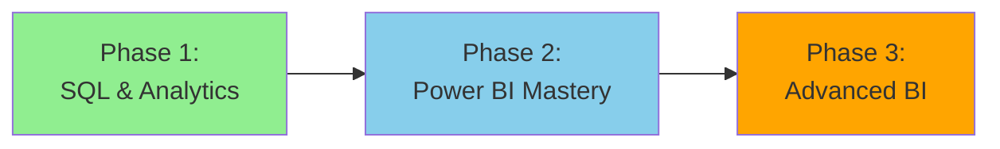

# 📈 Data Analyst Learning Path

> __🏠 [Home](../../../README.md)__ | __📖 [Documentation](../../README.md)__ | __🎓 [Tutorials](../README.md)__ | __🛤️ [Learning Paths](README.md)__ | __📈 Data Analyst__


__Master data analysis and visualization on Azure. Build expertise in SQL, Power BI, and analytical storytelling to transform data into actionable business insights.__

## 🎯 Learning Objectives

After completing this learning path, you will be able to:

- __Query and analyze__ large datasets using T-SQL and Serverless SQL Pools
- __Build interactive dashboards__ and reports in Power BI
- __Create compelling data visualizations__ that tell stories
- __Perform statistical analysis__ and identify trends and patterns
- __Implement self-service analytics__ solutions for business users
- __Optimize query performance__ for analytical workloads
- __Collaborate effectively__ with data engineers and business stakeholders

## 📋 Prerequisites Checklist

Before starting this learning path, ensure you have:

### __Required Knowledge__

- [ ] __Basic SQL__ - Familiarity with SELECT, WHERE, JOIN, GROUP BY
- [ ] __Excel proficiency__ - Comfortable with formulas, pivot tables, charts
- [ ] __Business fundamentals__ - Understanding of KPIs and business metrics
- [ ] __Basic statistics__ - Concepts like mean, median, correlation

### __Required Access__

- [ ] __Azure subscription__ with Contributor role or access to shared workspace
- [ ] __Power BI Pro or Premium__ license
- [ ] __Sample datasets__ for practice exercises
- [ ] __Azure credits__ (~$100-150 for complete path)

### __Recommended Skills__ (helpful but not required)

- [ ] __Data visualization principles__ - Understanding of chart types and when to use them
- [ ] __DAX basics__ - Exposure to Power BI expressions
- [ ] __Python or R__ - For advanced analytics (optional)

## 🗺️ Learning Path Structure

This path consists of __3 progressive phases__ focused on SQL, visualization, and business intelligence:



### __Time Investment__

- __Full-Time__ (40 hrs/week): 8-10 weeks
- __Part-Time__ (15 hrs/week): 14-18 weeks
- __Casual__ (8 hrs/week): 20-24 weeks

## 📚 Phase 1: SQL & Analytics Foundation (3-4 weeks)

__Goal__: Master SQL querying and analytical techniques for business intelligence

### __Module 1.1: SQL for Analytics__ (16 hours)

__Learning Objectives:__

- Write complex analytical queries with aggregations and window functions
- Understand query execution plans and optimization
- Work with date/time functions for time-series analysis
- Query semi-structured data (JSON, nested structures)

__Hands-on Exercises:__

1. __Lab 1.1.1__: Sales analysis using GROUP BY and aggregate functions
2. __Lab 1.1.2__: Time-series analysis with window functions (LEAD, LAG, RANK)
3. __Lab 1.1.3__: Customer cohort analysis using CTEs
4. __Lab 1.1.4__: JSON data extraction and analysis

__Practice Scenarios:__

```sql
-- Sales trend analysis
SELECT
    YEAR(OrderDate) AS OrderYear,
    MONTH(OrderDate) AS OrderMonth,
    SUM(TotalAmount) AS TotalSales,
    LAG(SUM(TotalAmount), 1) OVER (ORDER BY YEAR(OrderDate), MONTH(OrderDate)) AS PreviousMonthSales,
    ROUND((SUM(TotalAmount) - LAG(SUM(TotalAmount), 1) OVER (ORDER BY YEAR(OrderDate), MONTH(OrderDate))) /
          LAG(SUM(TotalAmount), 1) OVER (ORDER BY YEAR(OrderDate), MONTH(OrderDate)) * 100, 2) AS PercentChange
FROM Sales
GROUP BY YEAR(OrderDate), MONTH(OrderDate)
ORDER BY OrderYear, OrderMonth;
```

__Resources:__

- [SQL Performance Optimization](../../../best-practices/sql-performance.md)
- [Serverless SQL Best Practices](../../../best-practices/serverless-sql-best-practices.md)

__Assessment Questions:__

1. How do window functions differ from aggregate functions?
2. When should you use CTEs vs subqueries vs temp tables?
3. How do you identify and fix slow-running queries?
4. What are the best practices for date/time filtering in large tables?

---

### __Module 1.2: Azure Synapse Serverless SQL__ (12 hours)

__Learning Objectives:__

- Query data in Azure Data Lake using Serverless SQL Pool
- Create and manage external tables and views
- Implement security with row-level and column-level security
- Optimize serverless query costs and performance

__Hands-on Exercises:__

1. __Lab 1.2.1__: Query Parquet files directly from Data Lake
2. __Lab 1.2.2__: Create external tables for reusable data access
3. __Lab 1.2.3__: Build curated views for business users
4. __Lab 1.2.4__: Implement row-level security for multi-tenant data

__Resources:__

- [Serverless SQL Architecture](../../../architecture/serverless-sql/README.md)
- [Serverless SQL Query Optimization](../../../code-examples/serverless-sql/query-optimization.md)

__Assessment Questions:__

1. What are the cost implications of querying data in serverless pools?
2. How do you optimize queries against Parquet files?
3. When should you create external tables vs query files directly?
4. How does partitioning affect serverless query performance?

---

### __Module 1.3: Statistical Analysis Fundamentals__ (12 hours)

__Learning Objectives:__

- Perform descriptive statistics (mean, median, mode, standard deviation)
- Identify correlations and relationships between variables
- Detect outliers and anomalies in data
- Understand basic hypothesis testing

__Hands-on Exercises:__

1. __Lab 1.3.1__: Customer segmentation using statistical analysis
2. __Lab 1.3.2__: Sales forecasting with trend analysis
3. __Lab 1.3.3__: Anomaly detection in transaction data
4. __Lab 1.3.4__: A/B test result analysis

__Practice Scenarios:__

```sql
-- Calculate statistical measures
SELECT
    Category,
    COUNT(*) AS ProductCount,
    AVG(Price) AS AvgPrice,
    STDEV(Price) AS StdDevPrice,
    MIN(Price) AS MinPrice,
    MAX(Price) AS MaxPrice,
    PERCENTILE_CONT(0.5) WITHIN GROUP (ORDER BY Price) OVER (PARTITION BY Category) AS MedianPrice
FROM Products
GROUP BY Category;
```

__Assessment Questions:__

1. How do you interpret standard deviation in business contexts?
2. What is the difference between correlation and causation?
3. How do you identify statistically significant differences?
4. When should you use mean vs median for analysis?

---

### __Module 1.4: Data Quality and Validation__ (8 hours)

__Learning Objectives:__

- Identify data quality issues in source data
- Implement data validation checks
- Handle missing values and outliers
- Document data quality rules and assumptions

__Hands-on Exercises:__

1. __Lab 1.4.1__: Data profiling and quality assessment
2. __Lab 1.4.2__: Create data validation queries
3. __Lab 1.4.3__: Handle missing data scenarios
4. __Lab 1.4.4__: Build data quality dashboard

__Assessment Questions:__

1. What are the most common data quality issues?
2. How do you decide whether to exclude or impute missing values?
3. What validation checks should be performed before analysis?
4. How do you communicate data quality issues to stakeholders?

---

## 📚 Phase 2: Power BI Mastery (3-4 weeks)

__Goal__: Build professional, interactive dashboards and reports in Power BI

### __Module 2.1: Power BI Fundamentals__ (16 hours)

__Learning Objectives:__

- Navigate Power BI Desktop and Service
- Connect to various data sources (Azure Synapse, SQL, files)
- Transform data using Power Query (M language)
- Build basic visualizations and dashboards

__Hands-on Exercises:__

1. __Lab 2.1.1__: Connect Power BI to Azure Synapse workspace
2. __Lab 2.1.2__: Transform data with Power Query Editor
3. __Lab 2.1.3__: Create basic dashboard with key visuals
4. __Lab 2.1.4__: Publish and share reports in Power BI Service

__Resources:__

- [Power BI Integration Guide](../../../tutorials/README.md)

__Assessment Questions:__

1. What are the differences between Import, DirectQuery, and Live Connection?
2. How do you handle incremental data refresh in Power BI?
3. When should data transformation happen in Power Query vs DAX?
4. What are the best practices for report performance?

---

### __Module 2.2: DAX for Analysis__ (20 hours)

__Learning Objectives:__

- Write DAX measures and calculated columns
- Understand context (row context vs filter context)
- Use time intelligence functions
- Implement advanced calculations (YoY, MoM, running totals)

__Hands-on Exercises:__

1. __Lab 2.2.1__: Create calculated measures for KPIs
2. __Lab 2.2.2__: Implement time intelligence (YTD, QTD, MTD)
3. __Lab 2.2.3__: Build cumulative and running total measures
4. __Lab 2.2.4__: Create dynamic calculations with variables

__DAX Examples:__

```dax
-- Year-over-Year Sales Growth
YoY Sales Growth =
VAR CurrentYearSales = [Total Sales]
VAR PreviousYearSales =
    CALCULATE(
        [Total Sales],
        SAMEPERIODLASTYEAR('Date'[Date])
    )
RETURN
    DIVIDE(CurrentYearSales - PreviousYearSales, PreviousYearSales, 0)

-- Customer Lifetime Value
Customer LTV =
CALCULATE(
    SUM(Sales[Amount]),
    ALLEXCEPT(Customer, Customer[CustomerID])
)
```

__Assessment Questions:__

1. What is the difference between CALCULATE and CALCULATETABLE?
2. How do filter contexts propagate through relationships?
3. When should you use calculated columns vs measures?
4. How do you optimize DAX calculations for performance?

---

### __Module 2.3: Advanced Visualizations__ (16 hours)

__Learning Objectives:__

- Choose appropriate chart types for different analyses
- Design effective dashboard layouts
- Implement drill-through and cross-filtering
- Use custom visuals and R/Python visuals

__Hands-on Exercises:__

1. __Lab 2.3.1__: Build executive sales dashboard
2. __Lab 2.3.2__: Create customer analytics report with drill-through
3. __Lab 2.3.3__: Implement dynamic visuals with parameters
4. __Lab 2.3.4__: Use R visual for advanced statistical charts

__Design Principles:__

- __Color usage__: Consistent color schemes, accessibility considerations
- __Layout__: F-pattern reading flow, visual hierarchy
- __Interactivity__: Appropriate use of filters, slicers, drill-through
- __Performance__: Optimize visual rendering and data model

__Assessment Questions:__

1. When should you use a bar chart vs line chart vs scatter plot?
2. How do you design dashboards for mobile devices?
3. What are the principles of effective data visualization?
4. How do you balance detail with simplicity in dashboards?

---

### __Module 2.4: Data Modeling in Power BI__ (12 hours)

__Learning Objectives:__

- Design star schema data models
- Implement relationships and cardinality
- Optimize model performance
- Handle many-to-many relationships

__Hands-on Exercises:__

1. __Lab 2.4.1__: Build dimensional data model
2. __Lab 2.4.2__: Configure bi-directional filtering appropriately
3. __Lab 2.4.3__: Optimize model size with aggregations
4. __Lab 2.4.4__: Implement role-playing dimensions

__Assessment Questions:__

1. What is the impact of bi-directional filtering on performance?
2. How do you handle slowly changing dimensions in Power BI?
3. When should you use composite models?
4. How do aggregations improve query performance?

---

## 📚 Phase 3: Advanced Business Intelligence (2-3 weeks)

__Goal__: Implement enterprise-grade BI solutions and advanced analytics

### __Module 3.1: Report Building Best Practices__ (12 hours)

__Learning Objectives:__

- Design reports for different audiences
- Implement parameterized reports
- Create mobile-optimized layouts
- Build accessible reports (508 compliance)

__Hands-on Exercises:__

1. __Lab 3.1.1__: Build executive summary report
2. __Lab 3.1.2__: Create operational dashboard for managers
3. __Lab 3.1.3__: Design mobile-first report layout
4. __Lab 3.1.4__: Implement accessibility features

__Assessment Questions:__

1. How do you tailor reports for different audience levels?
2. What are the key accessibility considerations?
3. How do you handle different device form factors?
4. What documentation should accompany reports?

---

### __Module 3.2: Power BI Administration & Security__ (12 hours)

__Learning Objectives:__

- Configure workspace security and roles
- Implement row-level security (RLS)
- Manage gateway connections
- Monitor usage and adoption

__Hands-on Exercises:__

1. __Lab 3.2.1__: Configure workspace roles and permissions
2. __Lab 3.2.2__: Implement dynamic row-level security
3. __Lab 3.2.3__: Set up on-premises data gateway
4. __Lab 3.2.4__: Create usage analytics reports

__Assessment Questions:__

1. What are the different Power BI licensing options?
2. How do you implement multi-tenant security?
3. What are the best practices for gateway configuration?
4. How do you monitor report performance in production?

---

### __Module 3.3: Self-Service Analytics__ (12 hours)

__Learning Objectives:__

- Design self-service BI solutions
- Create reusable templates and themes
- Build certified datasets for organization
- Implement dataflows for data preparation

__Hands-on Exercises:__

1. __Lab 3.3.1__: Create corporate report template
2. __Lab 3.3.2__: Build certified dataset for sales analysis
3. __Lab 3.3.3__: Implement Power BI dataflow
4. __Lab 3.3.4__: Set up automated data refresh

__Assessment Questions:__

1. What is the difference between dataset and dataflow?
2. How do you promote data reuse across organization?
3. What governance is needed for self-service BI?
4. How do you balance agility with control?

---

### __Module 3.4: Advanced Analytics Integration__ (12 hours)

__Learning Objectives:__

- Integrate R and Python scripts in Power BI
- Use AI-powered visuals (Key Influencers, Decomposition Tree)
- Implement what-if analysis
- Create predictive analytics visualizations

__Hands-on Exercises:__

1. __Lab 3.4.1__: Customer churn prediction visualization
2. __Lab 3.4.2__: What-if parameter for scenario analysis
3. __Lab 3.4.3__: Key influencers analysis for sales drivers
4. __Lab 3.4.4__: Python clustering visualization

__Assessment Questions:__

1. When should you use AI visuals vs traditional analytics?
2. How do you deploy R/Python scripts in enterprise environments?
3. What are the limitations of embedded analytics in Power BI?
4. How do you explain AI-driven insights to business users?

---

## 🎯 Capstone Project

__Duration__: 1-2 weeks

Build a comprehensive business intelligence solution demonstrating all learned skills:

### __Project Requirements:__

1. __Data Integration__: Connect to Azure Synapse and at least one other data source
2. __Data Model__: Design star schema with proper relationships
3. __DAX Measures__: Implement at least 10 meaningful business metrics
4. __Reports__: Create 3-5 reports for different audiences (executive, manager, analyst)
5. __Interactivity__: Implement drill-through, bookmarks, and dynamic filtering
6. __Security__: Configure RLS for multi-tenant or departmental access
7. __Documentation__: Provide user guide and technical documentation

### __Suggested Project Ideas:__

- __Sales Performance Dashboard__: Multi-level sales analytics with forecasting
- __Customer Analytics Solution__: Customer segmentation and lifetime value analysis
- __Financial Reporting Suite__: P&L, balance sheet, and variance analysis
- __Marketing Campaign Analysis__: Campaign performance and attribution modeling
- __Operational Metrics Dashboard__: Real-time operational KPI monitoring

### __Project Deliverables:__

- [ ] Data model documentation with relationships and business definitions
- [ ] Power BI report (.pbix file) with all dashboards
- [ ] DAX measure documentation with calculation logic
- [ ] User guide for report consumers
- [ ] Presentation demonstrating key insights

### __Evaluation Criteria:__

| Category | Weight | Criteria |
|----------|--------|----------|
| __Data Model__ | 20% | Design quality, performance, maintainability |
| __Visualizations__ | 25% | Appropriateness, clarity, aesthetics |
| __DAX Calculations__ | 20% | Accuracy, efficiency, complexity |
| __Usability__ | 15% | Intuitive navigation, interactivity |
| __Insights__ | 10% | Business value, actionable recommendations |
| __Documentation__ | 10% | Completeness, clarity, professionalism |

---

## 📊 Progress Tracking

### __Recommended Learning Schedule__

__Week 1-2__: Phase 1 - Modules 1.1 & 1.2
__Week 3__: Phase 1 - Modules 1.3 & 1.4
__Week 4-5__: Phase 2 - Modules 2.1 & 2.2
__Week 6-7__: Phase 2 - Modules 2.3 & 2.4
__Week 8__: Phase 3 - Modules 3.1 & 3.2
__Week 9__: Phase 3 - Modules 3.3 & 3.4
__Week 10__: Capstone Project

### __Skill Assessment Checkpoints__

Complete these assessments at key milestones:

- __After Phase 1__: SQL Skills Assessment (80% pass required)
- __After Module 2.2__: DAX Fundamentals Exam (75% pass required)
- __After Phase 2__: Power BI Dashboard Review (85% pass required)
- __After Phase 3__: Capstone Project Evaluation (90% pass required)

---

## 🎓 Certification Preparation

### __PL-300: Power BI Data Analyst Associate__

This learning path prepares you for the PL-300 certification exam.

__Exam Objectives Coverage:__

| Exam Area | Coverage | Learning Modules |
|-----------|----------|------------------|
| __Prepare the data__ | 100% | Phase 1, Module 2.1 |
| __Model the data__ | 100% | Module 2.4 |
| __Visualize and analyze the data__ | 100% | Phase 2, Phase 3 |
| __Deploy and maintain assets__ | 100% | Module 3.2, 3.3 |

__Study Schedule Recommendations:__

1. __Week 8__: Review Power BI-specific topics from official learning path
2. __Week 9__: Complete practice exams and identify weak areas
3. __Week 10__: Final review alongside capstone project work

__Practice Resources:__

- Microsoft Learn PL-300 Learning Paths
- Power BI documentation and whitepapers
- Practice exams from official sources
- Community challenge scenarios

---

## 💡 Learning Tips

### __Maximize Your Success__

1. __Practice Daily__: Spend 15-30 minutes daily on SQL or DAX exercises
2. __Build Portfolio__: Create reports for personal or open datasets
3. __Join Community__: Participate in Power BI community forums and challenges
4. __Follow Experts__: Learn from Power BI MVPs and thought leaders
5. __Teach Others__: Explaining concepts reinforces your understanding

### __Common Challenges and Solutions__

| Challenge | Solution |
|-----------|----------|
| __DAX complexity__ | Start simple; build up gradually; use variables |
| __Slow reports__ | Review data model; optimize DAX; reduce visual count |
| __Design struggles__ | Study examples; follow design principles; get feedback |
| __SQL confusion__ | Practice with progressively complex queries |
| __Information overload__ | Focus on one concept at a time; take breaks |

---

## 🎯 Next Steps After Completion

### __Career Advancement__

- __Senior Data Analyst__: Lead analytics projects and mentor juniors
- __BI Developer__: Focus on technical solution architecture
- __Analytics Manager__: Oversee analytics team and strategy
- __Business Intelligence Architect__: Design enterprise BI solutions

### __Advanced Specializations__

- __Advanced Analytics__: Machine learning integration, predictive modeling
- __BI Architecture__: Enterprise data warehouse and BI strategy
- __Data Science__: Transition to statistical modeling and ML
- __Analytics Engineering__: Combine analytics with data engineering

### __Continue Learning__

- __Additional Certifications__: DA-100 (deprecated but valuable), DP-900
- __Advanced Power BI__: Paginated reports, embedded analytics, composite models
- __Complementary Skills__: Python/R, Azure services, Tableau

---

## 📞 Support and Resources

### __Getting Help__

- __SQL Questions__: [SQL Server Community](https://dba.stackexchange.com/)
- __Power BI Support__: [Power BI Community](https://community.powerbi.com/)
- __Lab Assistance__: Technical support for hands-on exercises
- __Career Guidance__: One-on-one mentoring sessions

### __Additional Resources__

- __Power BI Blog__: Latest features and best practices
- __SQLBI__: Advanced DAX techniques and patterns
- __Guy in a Cube__: Video tutorials and tips
- __Data Visualization Catalog__: Chart type selection guide

---

__Ready to become a Data Analyst?__

🚀 __[Start Phase 1 - Module 1.1 →](#phase-1-sql--analytics-foundation-3-4-weeks)__
📋 __[Download SQL Cheat Sheet (PDF)](#)__
🎯 __[Join Power BI Study Group →](#)__

---

*Learning Path Version: 1.0*
*Last Updated: January 2025*
*Estimated Completion: 8-10 weeks full-time*
