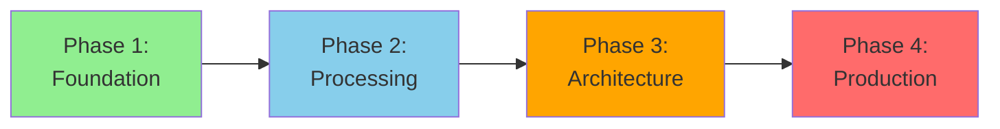

# 📊 Data Engineer Learning Path

> __🏠 [Home](../../../README.md)__ | __📖 [Documentation](../../README.md)__ | __🎓 [Tutorials](../README.md)__ | __🛤️ [Learning Paths](README.md)__ | __📊 Data Engineer__

__Build production-grade data processing systems and pipelines on Azure. Master the skills to design, implement, and maintain scalable data engineering solutions for enterprise-scale analytics.__

## 🎯 Learning Objectives

After completing this learning path, you will be able to:

- __Design and implement__ scalable data ingestion pipelines from diverse sources
- __Build and optimize__ large-scale data processing workflows using PySpark
- __Implement__ data quality frameworks and data governance practices
- __Architect__ delta lake solutions with ACID transactions
- __Deploy__ production-ready data pipelines with CI/CD automation
- __Monitor and troubleshoot__ data processing workloads at scale
- __Optimize performance__ for cost-effective data operations

## 📋 Prerequisites Checklist

Before starting this learning path, ensure you have:

### __Required Knowledge__

- [ ] __Programming fundamentals__ - Solid understanding of Python or another programming language
- [ ] __SQL proficiency__ - Comfortable writing complex queries including joins, aggregations, and subqueries
- [ ] __Azure fundamentals__ - Basic understanding of cloud concepts and Azure services
- [ ] __Command line basics__ - Familiarity with terminal/PowerShell commands
- [ ] __Git basics__ - Understanding of version control concepts

### __Required Access__

- [ ] __Azure subscription__ with Owner or Contributor role
- [ ] __Development environment__ with VS Code, Azure CLI, and Python 3.9+
- [ ] __GitHub account__ for code examples and exercises
- [ ] __Sufficient Azure credits__ (~$200-300 for complete path)

### __Recommended Skills__ (helpful but not required)

- [ ] __Data modeling concepts__ - Understanding of dimensional modeling and normalization
- [ ] __Basic Spark knowledge__ - Familiarity with distributed computing concepts
- [ ] __Infrastructure as Code__ - Exposure to ARM templates, Bicep, or Terraform
- [ ] __DevOps principles__ - Understanding of CI/CD concepts

## 🗺️ Learning Path Structure

This path consists of __4 progressive phases__ building from fundamentals to advanced production skills:

### __Time Investment__

- __Full-Time__ (40 hrs/week): 10-12 weeks
- __Part-Time__ (15 hrs/week): 16-20 weeks
- __Casual__ (8 hrs/week): 24-30 weeks

## 📚 Phase 1: Foundation (2-3 weeks)

__Goal__: Build solid foundation in Azure data services and core engineering concepts

### __Module 1.1: Azure Data Services Overview__ (8 hours)

__Learning Objectives:__

- Understand Azure data service ecosystem and when to use each service
- Navigate Azure Synapse Analytics workspace
- Configure basic security and networking
- Understand cost management for data services

__Hands-on Exercises:__

1. __Lab 1.1.1__: Create and configure Azure Synapse workspace
2. __Lab 1.1.2__: Set up Azure Data Lake Storage Gen2 with proper folder structure
3. __Lab 1.1.3__: Configure managed private endpoints for secure connectivity
4. __Lab 1.1.4__: Implement role-based access control (RBAC) for data access

__Resources:__

- [Azure Synapse Environment Setup](../../synapse/01-environment-setup.md)
- [Azure Data Lake Storage Best Practices](../../../best-practices/delta-lake-optimization.md)
- [Security Best Practices](../../../best-practices/security.md)

__Assessment Questions:__

1. What are the differences between Serverless SQL Pool and Dedicated SQL Pool?
2. When would you use Azure Data Factory vs Azure Synapse Pipelines?
3. How does private endpoint connectivity improve security?
4. What are the cost implications of different compute tier choices?

---

### __Module 1.2: SQL Fundamentals for Data Engineering__ (12 hours)

__Learning Objectives:__

- Write optimized SQL queries for analytical workloads
- Understand query execution plans and optimization techniques
- Implement partitioning and indexing strategies
- Work with semi-structured data (JSON, Parquet)

__Hands-on Exercises:__

1. __Lab 1.2.1__: Query optimization using execution plans
2. __Lab 1.2.2__: Implement table partitioning for large datasets
3. __Lab 1.2.3__: Query JSON data using OPENJSON and JSON functions
4. __Lab 1.2.4__: External table creation over Parquet files

__Resources:__

- [SQL Performance Optimization](../../../best-practices/sql-performance.md)
- [Serverless SQL Best Practices](../../../best-practices/serverless-sql-best-practices.md)

__Assessment Questions:__

1. How do you identify query bottlenecks using execution plans?
2. What partitioning strategy would you use for time-series data?
3. When should you use external tables vs internal tables?
4. How does columnstore indexing improve query performance?

---

### __Module 1.3: Python for Data Engineering__ (16 hours)

__Learning Objectives:__

- Master Python libraries for data manipulation (Pandas, NumPy)
- Understand asynchronous programming for data pipelines
- Implement error handling and logging best practices
- Write unit tests for data transformation code

__Hands-on Exercises:__

1. __Lab 1.3.1__: Data transformation pipeline using Pandas
2. __Lab 1.3.2__: Parallel processing with concurrent.futures
3. __Lab 1.3.3__: Implement robust error handling and retry logic
4. __Lab 1.3.4__: Write pytest unit tests for transformation functions

__Resources:__

- [Python Best Practices for Data Engineering](../../../code-examples/README.md)
- [Automated Testing Guide](../../../devops/automated-testing.md)

__Assessment Questions:__

1. When should you use Pandas vs PySpark for data processing?
2. How do you handle partial failures in batch processing pipelines?
3. What are the benefits of type hints in data processing code?
4. How do you test data transformation logic effectively?

---

### __Module 1.4: Data Modeling Fundamentals__ (12 hours)

__Learning Objectives:__

- Design star and snowflake schemas for analytics
- Implement slowly changing dimensions (SCD) patterns
- Understand data vault and data lakehouse architectures
- Model streaming and batch data integration

__Hands-on Exercises:__

1. __Lab 1.4.1__: Design dimensional model for e-commerce analytics
2. __Lab 1.4.2__: Implement Type 2 SCD for customer dimension
3. __Lab 1.4.3__: Create medallion architecture (bronze/silver/gold layers)
4. __Lab 1.4.4__: Model real-time and batch data integration

__Resources:__

- [Delta Lakehouse Architecture](../../../architecture/delta-lakehouse/README.md)
- [Data Modeling Best Practices](../../../best-practices/README.md)

__Assessment Questions:__

1. When would you choose star schema vs data vault architecture?
2. How do you handle late-arriving dimensions in data pipelines?
3. What are the trade-offs between normalization and denormalization?
4. How does the medallion architecture support data quality?

---

## 📚 Phase 2: Processing (3-4 weeks)

__Goal__: Master large-scale data processing with PySpark and Azure Synapse

### __Module 2.1: Apache Spark Fundamentals__ (20 hours)

__Learning Objectives:__

- Understand Spark architecture and execution model
- Master DataFrames and Dataset APIs
- Implement transformations and actions efficiently
- Optimize Spark job performance

__Hands-on Exercises:__

1. __Lab 2.1.1__: Spark DataFrame operations and transformations
2. __Lab 2.1.2__: Window functions for time-series analysis
3. __Lab 2.1.3__: Join optimization strategies for large datasets
4. __Lab 2.1.4__: Broadcast joins vs shuffle joins performance testing

__Resources:__

- [PySpark Fundamentals](../../code-labs/pyspark-fundamentals.md)
- [Spark Performance Optimization](../../../best-practices/spark-performance.md)

__Assessment Questions:__

1. What is the difference between narrow and wide transformations?
2. How does Spark lazy evaluation optimize query execution?
3. When should you use broadcast joins vs sort-merge joins?
4. How do you troubleshoot Spark job failures?

---

### __Module 2.2: Delta Lake Implementation__ (16 hours)

__Learning Objectives:__

- Implement ACID transactions with Delta Lake
- Use time travel and versioning features
- Optimize Delta tables for query performance
- Implement change data capture (CDC) patterns

__Hands-on Exercises:__

1. __Lab 2.2.1__: Convert Parquet data lake to Delta Lake
2. __Lab 2.2.2__: Implement merge (upsert) operations
3. __Lab 2.2.3__: Use time travel for data auditing
4. __Lab 2.2.4__: Optimize Delta tables with Z-ordering

__Resources:__

- [Delta Lake Guide](../../../code-examples/delta-lake-guide.md)
- [Delta Lake Optimization](../../../code-examples/delta-lake/optimization/table-optimization.md)
- [Change Data Capture](../../../code-examples/delta-lake/cdc/change-data-capture.md)

__Assessment Questions:__

1. How does Delta Lake ensure ACID compliance?
2. What are the benefits of Z-ordering for query performance?
3. How do you implement CDC patterns with Delta Lake?
4. When should you run OPTIMIZE and VACUUM operations?

---

### __Module 2.3: Data Pipeline Development__ (20 hours)

__Learning Objectives:__

- Build orchestrated data pipelines with Azure Data Factory
- Implement parameterized and metadata-driven pipelines
- Handle pipeline failures and implement retry logic
- Monitor and alert on pipeline execution

__Hands-on Exercises:__

1. __Lab 2.3.1__: Create multi-stage data ingestion pipeline
2. __Lab 2.3.2__: Implement metadata-driven pipeline framework
3. __Lab 2.3.3__: Configure pipeline monitoring and alerting
4. __Lab 2.3.4__: Implement incremental data loading patterns

__Resources:__

- [Azure Data Factory Integration](../../../code-examples/integration/azure-data-factory.md)
- [Pipeline Optimization](../../../best-practices/pipeline-optimization.md)

__Assessment Questions:__

1. How do you implement idempotent data pipelines?
2. What are the benefits of metadata-driven pipeline architectures?
3. How do you handle schema evolution in data pipelines?
4. What monitoring metrics are critical for pipeline health?

---

### __Module 2.4: Data Quality and Validation__ (16 hours)

__Learning Objectives:__

- Implement data quality frameworks and checks
- Build data profiling and anomaly detection
- Create data validation rules and constraints
- Monitor data quality metrics and SLAs

__Hands-on Exercises:__

1. __Lab 2.4.1__: Implement Great Expectations for data validation
2. __Lab 2.4.2__: Build data profiling dashboards
3. __Lab 2.4.3__: Create data quality scorecards
4. __Lab 2.4.4__: Implement automated data quality alerts

__Resources:__

- [Data Quality Best Practices](../../../best-practices/README.md)
- [Monitoring Setup](../../../monitoring/monitoring-setup.md)

__Assessment Questions:__

1. What are the key dimensions of data quality?
2. How do you balance data quality checks with pipeline performance?
3. When should data quality failures stop pipeline execution?
4. How do you establish data quality SLAs?

---

## 📚 Phase 3: Architecture (2-3 weeks)

__Goal__: Design scalable, reliable data architectures for enterprise solutions

### __Module 3.1: Data Architecture Patterns__ (16 hours)

__Learning Objectives:__

- Design lambda and kappa architectures
- Implement event-driven data architectures
- Plan for data scalability and reliability
- Design multi-region data solutions

__Hands-on Exercises:__

1. __Lab 3.1.1__: Design real-time and batch processing architecture
2. __Lab 3.1.2__: Implement event-driven data pipeline
3. __Lab 3.1.3__: Plan data partitioning and sharding strategy
4. __Lab 3.1.4__: Design disaster recovery solution

__Resources:__

- [Architecture Patterns](../../../03-architecture-patterns/README.md)
- [Delta Lakehouse Architecture](../../../architecture/delta-lakehouse/detailed-architecture.md)

__Assessment Questions:__

1. When would you choose lambda vs kappa architecture?
2. How do you design for data consistency in distributed systems?
3. What are the trade-offs between eventual and strong consistency?
4. How do you plan for data scalability growth?

---

### __Module 3.2: Performance Optimization__ (16 hours)

__Learning Objectives:__

- Optimize query performance for analytical workloads
- Implement caching strategies
- Design for parallel processing
- Monitor and tune system performance

__Hands-on Exercises:__

1. __Lab 3.2.1__: Query performance tuning workshop
2. __Lab 3.2.2__: Implement result caching strategies
3. __Lab 3.2.3__: Optimize Spark shuffle operations
4. __Lab 3.2.4__: Create performance monitoring dashboards

__Resources:__

- [Performance Optimization](../../../best-practices/performance-optimization.md)
- [Cost Optimization](../../../best-practices/cost-optimization.md)

__Assessment Questions:__

1. How do you identify performance bottlenecks in data pipelines?
2. What caching strategies are most effective for analytics?
3. How do you optimize data skew in Spark jobs?
4. What metrics indicate need for scaling compute resources?

---

### __Module 3.3: Data Governance and Security__ (12 hours)

__Learning Objectives:__

- Implement data classification and cataloging
- Design data lineage and impact analysis
- Enforce data access policies
- Comply with data privacy regulations (GDPR, CCPA)

__Hands-on Exercises:__

1. __Lab 3.3.1__: Configure Azure Purview for data cataloging
2. __Lab 3.3.2__: Implement data lineage tracking
3. __Lab 3.3.3__: Configure dynamic data masking
4. __Lab 3.3.4__: Implement column-level security

__Resources:__

- [Security Best Practices](../../../best-practices/security.md)
- [Network Security](../../../best-practices/network-security.md)
- [Azure Purview Integration](../../../code-examples/integration/azure-purview.md)

__Assessment Questions:__

1. How do you implement data classification at scale?
2. What are the benefits of automated data lineage?
3. How do you balance data accessibility with security?
4. What are key compliance requirements for data engineering?

---

## 📚 Phase 4: Production Operations (2-3 weeks)

__Goal__: Operationalize and maintain production data engineering systems

### __Module 4.1: DevOps for Data Engineering__ (16 hours)

__Learning Objectives:__

- Implement CI/CD for data pipelines
- Use infrastructure as code for data services
- Implement automated testing strategies
- Manage deployment across environments

__Hands-on Exercises:__

1. __Lab 4.1.1__: Build CI/CD pipeline for Synapse artifacts
2. __Lab 4.1.2__: Deploy infrastructure using Bicep/ARM templates
3. __Lab 4.1.3__: Implement automated integration tests
4. __Lab 4.1.4__: Configure multi-environment deployment strategy

__Resources:__

- [Pipeline CI/CD](../../../devops/pipeline-ci-cd.md)
- [Automated Testing](../../../devops/automated-testing.md)

__Assessment Questions:__

1. How do you version control data pipeline code?
2. What should be included in automated pipeline tests?
3. How do you manage environment-specific configurations?
4. What are blue/green deployment strategies for data pipelines?

---

### __Module 4.2: Monitoring and Observability__ (12 hours)

__Learning Objectives:__

- Implement comprehensive monitoring solutions
- Configure alerting for critical metrics
- Build operational dashboards
- Implement log aggregation and analysis

__Hands-on Exercises:__

1. __Lab 4.2.1__: Configure Azure Monitor for Synapse workloads
2. __Lab 4.2.2__: Create custom metrics and alerts
3. __Lab 4.2.3__: Build operational dashboards in Azure
4. __Lab 4.2.4__: Implement log analytics queries

__Resources:__

- [Monitoring Setup](../../../monitoring/monitoring-setup.md)
- [Spark Monitoring](../../../monitoring/spark-monitoring.md)
- [SQL Monitoring](../../../monitoring/sql-monitoring.md)

__Assessment Questions:__

1. What are the key metrics to monitor for data pipelines?
2. How do you implement effective alerting strategies?
3. What log retention policies should you implement?
4. How do you correlate metrics across distributed systems?

---

### __Module 4.3: Troubleshooting and Incident Response__ (12 hours)

__Learning Objectives:__

- Diagnose common data pipeline failures
- Implement root cause analysis processes
- Handle data quality incidents
- Implement disaster recovery procedures

__Hands-on Exercises:__

1. __Lab 4.3.1__: Troubleshooting workshop with common scenarios
2. __Lab 4.3.2__: Implement runbooks for common incidents
3. __Lab 4.3.3__: Conduct disaster recovery drill
4. __Lab 4.3.4__: Perform post-incident review and documentation

__Resources:__

- [Troubleshooting Guide](../../../troubleshooting/README.md)
- [Spark Troubleshooting](../../../troubleshooting.md)

__Assessment Questions:__

1. What are the most common causes of Spark job failures?
2. How do you diagnose data quality issues in production?
3. What is your process for incident escalation?
4. How do you prevent similar incidents from recurring?

---

### __Module 4.4: Cost Optimization and FinOps__ (8 hours)

__Learning Objectives:__

- Analyze and optimize data processing costs
- Implement cost allocation and chargeback
- Right-size compute resources
- Implement automated cost controls

__Hands-on Exercises:__

1. __Lab 4.4.1__: Analyze cost patterns in Azure Cost Management
2. __Lab 4.4.2__: Implement resource tagging for cost allocation
3. __Lab 4.4.3__: Configure auto-pause and scaling policies
4. __Lab 4.4.4__: Create cost optimization recommendations

__Resources:__

- [Cost Optimization](../../../best-practices/cost-optimization.md)
- [Performance Optimization](../../../best-practices/performance-optimization.md)

__Assessment Questions:__

1. What are the primary cost drivers for Synapse workloads?
2. How do you implement effective cost allocation?
3. When should you scale up vs scale out compute resources?
4. What automation can reduce operational costs?

---

## 🎯 Capstone Project

__Duration__: 2-3 weeks

Build a complete, production-ready data engineering solution that demonstrates all skills learned:

### __Project Requirements:__

1. __Data Ingestion__: Ingest data from at least 3 different sources (batch and streaming)
2. __Data Processing__: Implement multi-stage processing with bronze/silver/gold layers
3. __Data Quality__: Implement comprehensive data quality framework
4. __Orchestration__: Build parameterized, metadata-driven pipelines
5. __Monitoring__: Implement full observability with metrics and alerts
6. __CI/CD__: Deploy using automated CI/CD pipelines
7. __Documentation__: Provide complete architecture and operational documentation

### __Suggested Project Ideas:__

- __E-commerce Analytics Platform__: Real-time and batch processing for sales analytics
- __IoT Data Processing Pipeline__: Process sensor data from millions of devices
- __Financial Data Warehouse__: Regulatory-compliant financial reporting system
- __Healthcare Data Integration__: HIPAA-compliant patient data aggregation

### __Project Deliverables:__

- [ ] Architecture diagram and design document
- [ ] Source code with comprehensive unit tests
- [ ] CI/CD pipeline configuration
- [ ] Monitoring and alerting configuration
- [ ] Operational runbooks and documentation
- [ ] Cost analysis and optimization recommendations
- [ ] Presentation demonstrating the solution

### __Evaluation Criteria:__

| Category | Weight | Criteria |
|----------|--------|----------|
| __Architecture__ | 20% | Scalability, reliability, maintainability |
| __Code Quality__ | 20% | Clean code, testing, documentation |
| __Data Quality__ | 15% | Validation framework, error handling |
| __Performance__ | 15% | Optimization, efficiency, cost-effectiveness |
| __Operations__ | 15% | Monitoring, troubleshooting, automation |
| __Security__ | 15% | Access control, compliance, data protection |

---

## 📊 Progress Tracking

### __Recommended Learning Schedule__

__Week 1-2__: Phase 1 - Modules 1.1 & 1.2
__Week 3-4__: Phase 1 - Modules 1.3 & 1.4
__Week 5-6__: Phase 2 - Modules 2.1 & 2.2
__Week 7-8__: Phase 2 - Modules 2.3 & 2.4
__Week 9__: Phase 3 - Modules 3.1 & 3.2
__Week 10__: Phase 3 - Module 3.3 & Phase 4 - Module 4.1
__Week 11__: Phase 4 - Modules 4.2, 4.3 & 4.4
__Week 12__: Capstone Project

### __Skill Assessment Checkpoints__

Complete these assessments at key milestones:

- __After Phase 1__: Foundational Knowledge Assessment (75% pass required)
- __After Phase 2__: Processing Skills Practical Exam (80% pass required)
- __After Phase 3__: Architecture Design Review (85% pass required)
- __After Phase 4__: Production Operations Simulation (90% pass required)

---

## 🎓 Certification Preparation

### __DP-203: Azure Data Engineer Associate__

This learning path prepares you for the DP-203 certification exam.

__Exam Objectives Coverage:__

| Exam Area | Coverage | Learning Modules |
|-----------|----------|------------------|
| __Design and implement data storage__ | 100% | Phase 1, Phase 2 |
| __Develop data processing__ | 100% | Phase 2, Phase 3 |
| __Secure, monitor, and optimize__ | 100% | Phase 3, Phase 4 |

__Study Schedule Recommendations:__

1. __Week 10-11__: Review all modules with focus on exam objectives
2. __Week 11__: Complete practice exams and identify weak areas
3. __Week 12__: Final review and schedule certification exam

__Practice Resources:__

- Microsoft Learn DP-203 Learning Paths
- Practice exams from official sources
- Hands-on labs reinforcing exam topics
- Study group discussions and knowledge sharing

---

## 💡 Learning Tips

### __Maximize Your Success__

1. __Hands-On Practice__: Complete every lab exercise - reading isn't enough
2. __Build Projects__: Apply concepts to real or simulated business problems
3. __Join Community__: Participate in forums, study groups, and discussions
4. __Document Learning__: Keep a journal of key concepts and challenges
5. __Seek Feedback__: Share your work and get reviews from peers and mentors

### __Common Challenges and Solutions__

| Challenge | Solution |
|-----------|----------|
| __Overwhelming content__ | Focus on one module at a time; don't skip ahead |
| __Complex PySpark concepts__ | Work through examples multiple times; use debugger |
| __Cost management concerns__ | Use auto-pause; delete resources when not in use |
| __Time management__ | Set specific learning blocks; track progress weekly |
| __Troubleshooting difficulties__ | Use systematic debugging; check logs thoroughly |

---

## 🎯 Next Steps After Completion

### __Career Advancement__

- __Senior Data Engineer__: Lead data platform initiatives
- __Data Architect__: Design enterprise data architectures
- __ML Engineer__: Specialize in ML pipeline engineering
- __Principal Engineer__: Define technical strategy and standards

### __Advanced Specializations__

- __Real-Time Processing__: Deep dive into streaming architectures
- __Machine Learning Pipelines__: MLOps and feature engineering
- __Data Mesh Architecture__: Decentralized data architectures
- __Cloud Data Migration__: Enterprise migration strategies

### __Continue Learning__

- __Advanced Certifications__: DP-300, AI-102, AZ-305
- __Specialization Tracks__: ML Engineering, Data Architecture, Platform Engineering
- __Community Contribution__: Blog posts, open source, speaking engagements

---

## 📞 Support and Resources

### __Getting Help__

- __Technical Questions__: [Community Forum](https://github.com/discussions)
- __Lab Support__: Technical assistance for hands-on exercises
- __Career Guidance__: One-on-one mentoring sessions
- __Study Groups__: Connect with other learners on the same path

### __Additional Resources__

- __Documentation Library__: Complete technical documentation
- __Video Tutorials__: Supplementary video content for complex topics
- __Code Repository__: All lab code and examples
- __Community Slack__: Real-time chat with peers and instructors

---

__Ready to become an Azure Data Engineer?__

🚀 __[Start Phase 1 - Module 1.1 →](#phase-1-foundation-2-3-weeks)__
📋 __[Download Learning Tracker (PDF)](#)__
🎯 __[Join Study Group →](#)__

---

*Learning Path Version: 1.0*
*Last Updated: January 2025*
*Estimated Completion: 10-12 weeks full-time*
