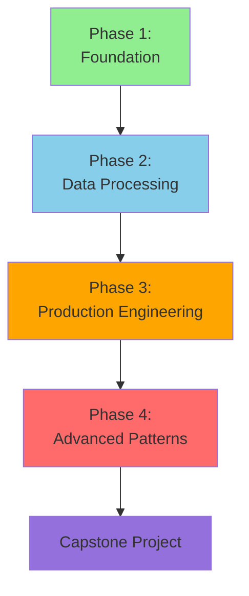

# = Data Engineer Learning Path

> **< [Home](../../../../README.md)** | **= [Documentation](../../../README.md)** | **< [Tutorials](../../README.md)** | **= [Learning Paths](../README.md)** | **= Data Engineer Path**

**Build production-grade data processing systems and pipelines using Azure Synapse Analytics, Delta Lake, and modern data engineering practices. Transform your career with hands-on expertise in scalable data platform engineering.**

## < Learning Objectives

After completing this path, you will be able to:

- **Design and implement** scalable data processing pipelines with PySpark and Delta Lake
- **Optimize performance** of large-scale analytics workloads (TB+ datasets)
- **Build** medallion architecture (bronze, silver, gold) data lakehouses
- **Implement** data quality frameworks and monitoring solutions
- **Deploy** CI/CD pipelines for analytics workloads
- **Master** performance tuning and cost optimization strategies
- **Pass** DP-203 (Azure Data Engineer Associate) certification exam

## = Prerequisites

### Required Skills

- **Programming**: Python fundamentals (variables, functions, loops, error handling)
- **SQL**: Intermediate SQL (joins, aggregations, subqueries, window functions)
- **Data Concepts**: Understanding of ETL/ELT, data warehousing basics
- **Cloud Basics**: Azure fundamentals (storage accounts, resource groups)
- **Version Control**: Git basics (commit, push, pull, branches)

### Recommended (Optional)

- Prior exposure to big data technologies (Hadoop, Spark)
- Experience with data modeling (dimensional modeling, star schema)
- Familiarity with Azure Data Factory or similar ETL tools

### Technical Setup

- **Azure Subscription**: Active subscription with $300-400 budget
- **Development Environment**: Visual Studio Code with Python extension
- **Tools**: Azure CLI, Git, PowerShell Core
- **Time Commitment**: 15-20 hours per week for 10-12 weeks

## = Path Structure

## = Phase 1: Foundation (2-3 weeks)

**Goal**: Build strong foundation in Azure Synapse and Apache Spark fundamentals

### Module 1.1: Azure Synapse Analytics Environment Setup (1 week)

**Learning Objectives:**

- Set up Synapse workspace and configure security
- Understand Synapse components (Spark pools, SQL pools, pipelines)
- Navigate Synapse Studio effectively
- Configure development environment

**Hands-On Labs:**

1. **Lab 1.1.1**: Create Synapse workspace with proper RBAC
2. **Lab 1.1.2**: Configure Azure Data Lake Storage Gen2 linked service
3. **Lab 1.1.3**: Set up Spark pool with custom libraries
4. **Lab 1.1.4**: Configure Git integration for version control

**Resources:**

- [Synapse Environment Setup Tutorial](../../synapse/01-environment-setup.md)
- [Azure Synapse Documentation](https://learn.microsoft.com/azure/synapse-analytics/)

**Time Estimate:** 15 hours

**Assessment:**

-  Successfully provision Synapse workspace
-  Connect to Data Lake Storage
-  Run your first Spark notebook
-  Commit code to Git repository

---

### Module 1.2: PySpark Fundamentals (1 week)

**Learning Objectives:**

- Master Spark DataFrames and transformations
- Understand lazy evaluation and execution plans
- Write efficient PySpark code
- Debug and troubleshoot Spark jobs

**Topics Covered:**

- Spark architecture (driver, executors, tasks)
- DataFrame API (select, filter, groupBy, join)
- Spark SQL and temp views
- Reading/writing various formats (CSV, Parquet, JSON, Delta)

**Hands-On Labs:**

1. **Lab 1.2.1**: DataFrames transformations and actions
2. **Lab 1.2.2**: Joins and aggregations at scale
3. **Lab 1.2.3**: Spark SQL queries and optimizations
4. **Lab 1.2.4**: Reading and writing Delta Lake tables

**Resources:**

- [PySpark Fundamentals Code Lab](../../code-labs/pyspark-fundamentals.md)
- [Spark Performance Best Practices](../../../best-practices/spark-performance.md)

**Time Estimate:** 20 hours

**Assessment:**

-  Write complex DataFrame transformations
-  Optimize join operations
-  Read execution plans effectively
-  Handle schema evolution

---

### Module 1.3: Delta Lake Essentials (0.5-1 week)

**Learning Objectives:**

- Understand Delta Lake architecture and benefits
- Implement ACID transactions
- Use time travel and versioning
- Optimize table performance

**Topics Covered:**

- Delta Lake vs Parquet comparison
- ACID transactions and MERGE operations
- Time travel and table versioning
- Optimize, Z-order, and vacuum operations

**Hands-On Labs:**

1. **Lab 1.3.1**: Create and manage Delta tables
2. **Lab 1.3.2**: Implement upsert operations with MERGE
3. **Lab 1.3.3**: Time travel queries and data recovery
4. **Lab 1.3.4**: Table optimization techniques

**Resources:**

- [Delta Lake Guide](../../../code-examples/delta-lake-guide.md)
- [Table Optimization](../../../code-examples/delta-lake/optimization/table-optimization.md)

**Time Estimate:** 10 hours

**Assessment:**

-  Perform upsert operations correctly
-  Use time travel for data recovery
-  Optimize tables for query performance

---

## = Phase 2: Data Processing Patterns (3-4 weeks)

**Goal**: Master production data engineering patterns and best practices

### Module 2.1: Medallion Architecture Implementation (1.5 weeks)

**Learning Objectives:**

- Design multi-layered data architecture
- Implement bronze, silver, and gold layers
- Build data quality checks
- Create reusable processing frameworks

**Topics Covered:**

- Medallion architecture pattern
- Bronze layer: Raw data ingestion
- Silver layer: Cleansed and conformed data
- Gold layer: Business-level aggregates
- Data quality validation frameworks

**Hands-On Projects:**

1. **Project 2.1.1**: Build bronze layer with schema validation
2. **Project 2.1.2**: Implement silver layer transformations
3. **Project 2.1.3**: Create gold layer aggregates
4. **Project 2.1.4**: Build end-to-end pipeline

**Resources:**

- [Delta Lakehouse Architecture](../../../architecture/delta-lakehouse/README.md)
- [Detailed Architecture](../../../architecture/delta-lakehouse/detailed-architecture.md)

**Time Estimate:** 25 hours

**Deliverable:** Complete medallion architecture with sample datasets

---

### Module 2.2: Data Ingestion Patterns (1.5 weeks)

**Learning Objectives:**

- Implement batch and incremental ingestion
- Use Auto Loader for streaming ingestion
- Handle schema evolution gracefully
- Implement error handling and recovery

**Topics Covered:**

- Full load vs incremental load patterns
- Auto Loader (cloudFiles) for file ingestion
- Change Data Capture (CDC) patterns
- Schema inference and evolution
- Error handling and dead letter queues

**Hands-On Projects:**

1. **Project 2.2.1**: Implement Auto Loader pipeline
2. **Project 2.2.2**: Build CDC pipeline from relational database
3. **Project 2.2.3**: Handle schema changes automatically
4. **Project 2.2.4**: Implement monitoring and alerting

**Resources:**

- [Auto Loader Pattern](../../../code-examples/delta-lake/ingestion/auto-loader.md)
- [Change Data Capture](../../../code-examples/delta-lake/cdc/change-data-capture.md)

**Time Estimate:** 25 hours

**Deliverable:** Production-ready ingestion framework

---

### Module 2.3: Data Transformation Patterns (1 week)

**Learning Objectives:**

- Implement slowly changing dimensions (SCD Type 1, 2, 3)
- Build incremental processing frameworks
- Implement data deduplication logic
- Handle complex business rules

**Topics Covered:**

- SCD Type 1, 2, 3 implementations
- Incremental processing with watermarks
- Deduplication strategies
- Complex transformations (pivots, unpivots, arrays, structs)

**Hands-On Projects:**

1. **Project 2.3.1**: Implement SCD Type 2 with MERGE
2. **Project 2.3.2**: Build incremental processing framework
3. **Project 2.3.3**: Create reusable transformation functions
4. **Project 2.3.4**: Handle complex data types

**Resources:**

- [Delta Lake Optimization](../../../best-practices/delta-lake-optimization.md)

**Time Estimate:** 20 hours

**Deliverable:** Library of reusable transformation patterns

---

## = Phase 3: Production Engineering (2-3 weeks)

**Goal**: Build production-ready, monitored, and optimized data pipelines

### Module 3.1: Performance Optimization (1 week)

**Learning Objectives:**

- Analyze and optimize Spark jobs
- Tune partitioning strategies
- Optimize joins and aggregations
- Manage shuffle and data skew

**Topics Covered:**

- Spark UI and query execution plans
- Partitioning strategies (hash, range, custom)
- Broadcast joins vs shuffle joins
- Data skew detection and mitigation
- Adaptive Query Execution (AQE)

**Hands-On Labs:**

1. **Lab 3.1.1**: Analyze slow queries with Spark UI
2. **Lab 3.1.2**: Optimize partitioning for large tables
3. **Lab 3.1.3**: Fix data skew issues
4. **Lab 3.1.4**: Implement caching strategies

**Resources:**

- [Performance Optimization](../../../best-practices/performance-optimization.md)
- [Spark Performance](../../../best-practices/spark-performance.md)

**Time Estimate:** 18 hours

**Assessment:**

-  Reduce query runtime by 50%+
-  Eliminate data skew issues
-  Read and interpret Spark execution plans

---

### Module 3.2: Orchestration with Azure Data Factory (1 week)

**Learning Objectives:**

- Design complex pipeline workflows
- Implement error handling and retry logic
- Schedule and trigger pipelines
- Monitor and troubleshoot failures

**Topics Covered:**

- Data Factory pipeline design patterns
- Activities (copy, dataflow, notebook, stored proc)
- Control flow (foreach, if, until, switch)
- Triggers (schedule, tumbling window, event-based)
- Integration runtime configuration

**Hands-On Projects:**

1. **Project 3.2.1**: Build parameterized pipeline framework
2. **Project 3.2.2**: Implement dynamic metadata-driven pipelines
3. **Project 3.2.3**: Configure error handling and notifications
4. **Project 3.2.4**: Set up monitoring dashboards

**Resources:**

- [Data Factory Tutorial](../../data-factory/README.md)
- [Azure Data Factory Integration](../../../code-examples/integration/azure-data-factory.md)
- [Pipeline Optimization](../../../best-practices/pipeline-optimization.md)

**Time Estimate:** 18 hours

**Deliverable:** Metadata-driven orchestration framework

---

### Module 3.3: DevOps and CI/CD (0.5-1 week)

**Learning Objectives:**

- Implement version control for notebooks and pipelines
- Build CI/CD pipelines with Azure DevOps
- Automate testing and deployment
- Implement environment promotion strategies

**Topics Covered:**

- Git workflows for data engineering
- Azure DevOps pipeline configuration
- Automated testing strategies
- Deployment across environments (dev, test, prod)
- Infrastructure as Code with Bicep/Terraform

**Hands-On Projects:**

1. **Project 3.3.1**: Set up Git repository structure
2. **Project 3.3.2**: Create CI/CD pipeline
3. **Project 3.3.3**: Implement automated tests
4. **Project 3.3.4**: Deploy to multiple environments

**Resources:**

- [DevOps Integration](../../../devops/pipeline-ci-cd.md)
- [Automated Testing](../../../devops/automated-testing.md)

**Time Estimate:** 12 hours

**Deliverable:** Fully automated CI/CD pipeline

---

## = Phase 4: Advanced Patterns (2-3 weeks)

**Goal**: Master advanced data engineering techniques

### Module 4.1: Real-Time Streaming Analytics (1 week)

**Learning Objectives:**

- Design streaming architectures
- Implement Spark Structured Streaming
- Integrate with Event Hubs and Kafka
- Build real-time aggregations

**Topics Covered:**

- Streaming vs batch processing trade-offs
- Structured Streaming fundamentals
- Watermarks and late data handling
- State management and checkpointing
- Integration with Event Hubs

**Hands-On Projects:**

1. **Project 4.1.1**: Build real-time ETL pipeline
2. **Project 4.1.2**: Implement windowed aggregations
3. **Project 4.1.3**: Handle late-arriving data
4. **Project 4.1.4**: Monitor streaming job health

**Resources:**

- [Azure Stream Analytics Tutorial](../../stream-analytics/README.md)
- [Streaming Concepts](../../beginner/streaming-concepts.md)
- [Event Hubs Quickstart](../../beginner/eventhubs-quickstart.md)

**Time Estimate:** 20 hours

**Deliverable:** Production streaming pipeline

---

### Module 4.2: Data Quality and Monitoring (1 week)

**Learning Objectives:**

- Implement data quality checks
- Build monitoring dashboards
- Create alerting strategies
- Implement data lineage tracking

**Topics Covered:**

- Data quality dimensions (completeness, accuracy, timeliness)
- Great Expectations or custom quality frameworks
- Azure Monitor and Log Analytics
- Application Insights for Spark
- Data lineage with Azure Purview

**Hands-On Projects:**

1. **Project 4.2.1**: Build data quality framework
2. **Project 4.2.2**: Create monitoring dashboard
3. **Project 4.2.3**: Configure alerting rules
4. **Project 4.2.4**: Implement data lineage

**Resources:**

- [Monitoring Setup](../../../monitoring/README.md)
- [Spark Monitoring](../../../monitoring/spark-monitoring.md)
- [Azure Purview Integration](../../../code-examples/integration/azure-purview.md)

**Time Estimate:** 18 hours

**Deliverable:** Complete observability solution

---

### Module 4.3: Cost Optimization and FinOps (0.5 week)

**Learning Objectives:**

- Analyze and optimize Azure costs
- Right-size compute resources
- Implement cost allocation strategies
- Monitor spending trends

**Topics Covered:**

- Azure cost management tools
- Spark pool auto-scaling strategies
- Storage optimization (lifecycle policies)
- Reserved capacity planning
- Cost allocation tags

**Hands-On Projects:**

1. **Project 4.3.1**: Analyze current cost patterns
2. **Project 4.3.2**: Implement auto-scaling
3. **Project 4.3.3**: Optimize storage costs
4. **Project 4.3.4**: Create cost dashboards

**Resources:**

- [Cost Optimization](../../../best-practices/cost-optimization.md)

**Time Estimate:** 10 hours

**Deliverable:** Cost optimization report with 20%+ savings

---

## < Capstone Project (2-3 weeks)

**Build a complete, production-ready data engineering solution**

### Project Requirements

Design and implement an end-to-end data lakehouse for **e-commerce analytics** with the following:

**Business Requirements:**

- Ingest data from 5+ sources (sales, inventory, customers, web clickstream, reviews)
- Support both batch and real-time processing
- Provide data for BI dashboards and ML models
- Ensure data quality and lineage tracking
- Implement proper security and governance

**Technical Requirements:**

- Medallion architecture (bronze, silver, gold layers)
- Automated ingestion with schema evolution
- Incremental processing for large tables
- Real-time aggregations for key metrics
- CI/CD pipeline for automated deployment
- Monitoring and alerting
- Cost optimized (< $500/month for moderate workloads)

**Deliverables:**

1. **Architecture Document**
   - System design diagrams
   - Data flow documentation
   - Technology choices and justification

2. **Implementation**
   - Bronze layer: Raw data ingestion (batch + streaming)
   - Silver layer: Cleansed and conformed data with SCD Type 2
   - Gold layer: Business aggregates and metrics
   - Orchestration with Data Factory
   - CI/CD pipeline with automated tests

3. **Documentation**
   - Developer setup guide
   - Operational runbooks
   - Troubleshooting guide
   - Performance tuning recommendations

4. **Presentation**
   - 15-minute demo to peer review panel
   - Architecture walkthrough
   - Performance metrics and cost analysis

**Evaluation Criteria:**

- Code quality and best practices (25%)
- Architecture design and scalability (25%)
- Data quality implementation (15%)
- Performance optimization (15%)
- Documentation and presentation (20%)

**Time Estimate:** 40-60 hours

---

## = Certification Preparation

This learning path aligns with **DP-203: Azure Data Engineer Associate**

### Exam Coverage

**Skills Measured:**

- Design and implement data storage (40-45%)
- Develop data processing (25-30%)
- Secure, monitor, and optimize data storage and processing (25-30%)

**Path Alignment:** This learning path covers 95%+ of DP-203 exam objectives

### Certification Study Plan

1. **Complete this learning path** (10-12 weeks)
2. **Review Microsoft Learn modules** (1-2 weeks)
3. **Take practice exams** (1 week)
4. **Review weak areas** (1 week)
5. **Schedule and pass exam**

**Resources:**

- [DP-203 Certification Guide](../certification/data-engineer-path.md)
- [Official DP-203 Exam Page](https://learn.microsoft.com/en-us/certifications/exams/dp-203)
- [Microsoft Learn: Data Engineering on Azure](https://learn.microsoft.com/en-us/training/paths/data-engineering-with-azure-synapse/)

---

## < Skills You'll Gain

### Technical Skills

- **PySpark**: Expert-level DataFrame and SQL API
- **Delta Lake**: ACID transactions, time travel, optimization
- **Azure Synapse**: Spark pools, pipelines, security
- **Data Modeling**: Medallion architecture, SCD patterns
- **Performance Tuning**: Partitioning, caching, query optimization
- **DevOps**: Git, CI/CD, infrastructure as code

### Professional Skills

- **Problem Solving**: Debug complex data pipeline issues
- **System Design**: Architect scalable data solutions
- **Documentation**: Create clear technical documentation
- **Communication**: Explain technical concepts to stakeholders
- **Collaboration**: Work effectively with data scientists and analysts

---

## = Progress Tracking

### Module Completion Checklist

**Phase 1: Foundation**

- [ ] Module 1.1: Synapse Environment Setup
- [ ] Module 1.2: PySpark Fundamentals
- [ ] Module 1.3: Delta Lake Essentials

**Phase 2: Data Processing Patterns**

- [ ] Module 2.1: Medallion Architecture
- [ ] Module 2.2: Data Ingestion Patterns
- [ ] Module 2.3: Data Transformation Patterns

**Phase 3: Production Engineering**

- [ ] Module 3.1: Performance Optimization
- [ ] Module 3.2: Orchestration with ADF
- [ ] Module 3.3: DevOps and CI/CD

**Phase 4: Advanced Patterns**

- [ ] Module 4.1: Real-Time Streaming
- [ ] Module 4.2: Data Quality and Monitoring
- [ ] Module 4.3: Cost Optimization

**Capstone**

- [ ] Capstone Project Completed
- [ ] Peer Review Passed
- [ ] DP-203 Certification Earned

---

## = Learning Tips

### Best Practices

- **Hands-on first**: Always try coding before watching explanations
- **Break down complex problems**: Tackle one layer at a time
- **Debug systematically**: Use Spark UI and logs effectively
- **Optimize incrementally**: Get it working, then make it fast
- **Document as you go**: Future you will thank present you

### Common Pitfalls to Avoid

- **Premature optimization**: Focus on correctness before performance
- **Ignoring data quality**: Build quality checks from the start
- **Skipping tests**: Automated tests save time in the long run
- **Not reading Spark plans**: Understanding execution is critical
- **Over-engineering**: Start simple, add complexity when needed

### Time Management

- **Consistency matters**: 2 hours daily beats 14-hour weekend marathons
- **Set mini-deadlines**: Complete one module per week
- **Review regularly**: Spend 20% of time reviewing previous modules
- **Ask for help**: Don't get stuck for more than 30 minutes

---

## > Community and Support

### Learning Resources

- **Discussion Forum**: [GitHub Discussions](https://github.com/your-org/csa-tutorials/discussions)
- **Office Hours**: Weekly live Q&A sessions
- **Study Groups**: Join cohort-based learning groups
- **Slack Community**: Real-time chat with peers and mentors

### Getting Help

- **Stack Overflow**: Search/ask Spark and Azure questions
- **Microsoft Q&A**: Official Azure support forums
- **GitHub Issues**: Report bugs in learning materials
- **Mentor Network**: Connect with experienced data engineers

---

## < Success Stories

> **"This path gave me the confidence to architect our company's entire data lakehouse migration. We're now processing 10TB daily with ease."**
> *- Alex, Senior Data Engineer*

> **"I passed DP-203 on my first attempt after completing this path. The hands-on projects were exactly what I needed."**
> *- Sarah, Data Engineer*

> **"The performance optimization module helped me reduce our Spark job costs by 60%. Incredible ROI."**
> *- Michael, Principal Engineer*

---

## = Related Resources

### Tutorials and Guides

- [Synapse Quickstart](../../beginner/synapse-quickstart.md)
- [Serverless SQL Guide](../../../code-examples/serverless-sql-guide.md)
- [Integration Patterns](../../../code-examples/integration-guide.md)

### Best Practices

- [Security Best Practices](../../../best-practices/security.md)
- [Network Security](../../../best-practices/network-security.md)
- [SQL Performance](../../../best-practices/sql-performance.md)

### Architecture Patterns

- [Shared Metadata](../../../architecture/shared-metadata/shared-metadata.md)
- [Private Link Architecture](../../../architecture/private-link-architecture.md)

---

## = Ready to Start?

**Begin your data engineering journey today:**

1. **[Verify Prerequisites](#prerequisites)** - Ensure you have required skills
2. **[Set Up Environment](#module-11-azure-synapse-analytics-environment-setup-1-week)** - Start Module 1.1
3. **[Join Community](https://your-platform.com/community)** - Connect with peers

**[< Start Module 1.1: Synapse Environment Setup ](#module-11-azure-synapse-analytics-environment-setup-1-week)**

---

*Last Updated: January 2025*
*Learning Path Version: 1.0*
*Pass Rate: 87% for DP-203 certification*
