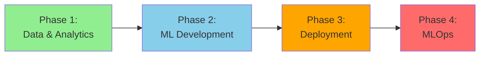

# 🔬 Data Scientist Learning Path

> __🏠 [Home](../../../../README.md)__ | __📖 [Documentation](../../../README.md)__ | __🎓 [Tutorials](../../README.md)__ | __🛤️ [Learning Paths](../README.md)__ | __🔬 Data Scientist__

__Build and deploy production machine learning models on Azure. Master the complete ML lifecycle from data exploration to model deployment, monitoring, and MLOps automation.__

## 🎯 Learning Objectives

After completing this learning path, you will be able to:

- __Explore and analyze__ large-scale datasets using Azure Synapse Analytics
- __Build__ machine learning models using Azure Machine Learning and Spark MLlib
- __Deploy__ models to production with automated pipelines
- __Implement__ MLOps practices for continuous training and deployment
- __Monitor__ model performance and detect data drift
- __Optimize__ model performance and cost efficiency
- __Integrate__ ML models with real-time and batch processing pipelines

## 📋 Prerequisites Checklist

Before starting this learning path, ensure you have:

### __Required Knowledge__

- [ ] __Python programming__ - Strong proficiency in Python (3+ years preferred)
- [ ] __Statistics and mathematics__ - Understanding of probability, statistics, linear algebra
- [ ] __Machine learning fundamentals__ - Familiarity with supervised and unsupervised learning
- [ ] __SQL proficiency__ - Comfortable with data queries and transformations
- [ ] __Data analysis__ - Experience with pandas, numpy, and data visualization

### __Required Skills__

- [ ] __ML frameworks__ - Experience with scikit-learn, TensorFlow, or PyTorch
- [ ] __Data preprocessing__ - Feature engineering and data cleaning
- [ ] __Model evaluation__ - Understanding of metrics, cross-validation, hyperparameter tuning
- [ ] __Git basics__ - Version control for code and notebooks

### __Required Access__

- [ ] __Azure subscription__ with Contributor role
- [ ] __Azure Machine Learning workspace__ or ability to create one
- [ ] __Development environment__ - VS Code, Jupyter, Azure ML extension
- [ ] __Sufficient credits__ (~$150-200 for complete path)

### __Recommended Background__

- [ ] Exposure to big data frameworks (Spark, Hadoop)
- [ ] Understanding of distributed computing concepts
- [ ] Basic cloud computing knowledge
- [ ] Familiarity with Docker and containerization

## 🗺️ Learning Path Structure

This path consists of __4 progressive phases__ from data exploration to production MLOps:

### __Time Investment__

- __Full-Time__ (40 hrs/week): 8-10 weeks
- __Part-Time__ (20 hrs/week): 14-16 weeks
- __Casual__ (10 hrs/week): 20-24 weeks

## 📚 Phase 1: Data Analytics Foundation (2-3 weeks)

__Goal__: Master data exploration and feature engineering on Azure

### __Module 1.1: Azure Data Platform for Data Science__ (8 hours)

__Learning Objectives:__

- Navigate Azure Synapse Analytics for data science workflows
- Access and query data from Azure Data Lake Storage
- Understand compute options (Spark pools, Serverless SQL)
- Set up development environment for data science

__Hands-on Exercises:__

1. __Lab 1.1.1__: Set up Azure Synapse workspace for data science
2. __Lab 1.1.2__: Connect to data sources and explore datasets
3. __Lab 1.1.3__: Configure Spark pools for ML workloads
4. __Lab 1.1.4__: Set up Jupyter notebooks in Synapse

__Resources:__

- [Azure Synapse Environment Setup](../../synapse/01-environment-setup.md)
- [PySpark Fundamentals](../../code-labs/pyspark-fundamentals.md)

__Assessment:__

- Connect to a dataset and perform exploratory data analysis
- Create summary statistics and visualizations

### __Module 1.2: Large-Scale Data Exploration__ (12 hours)

__Learning Objectives:__

- Perform exploratory data analysis (EDA) on big data
- Use PySpark for distributed data processing
- Create visualizations with matplotlib, seaborn, plotly
- Identify data quality issues and patterns

__Hands-on Exercises:__

1. __Lab 1.2.1__: EDA on 10GB+ dataset using PySpark
2. __Lab 1.2.2__: Statistical analysis and hypothesis testing
3. __Lab 1.2.3__: Data profiling and quality assessment
4. __Lab 1.2.4__: Interactive visualizations and dashboards

__Sample Project:__

Analyze e-commerce transaction data (50M+ records) to identify customer segments and purchase patterns.

### __Module 1.3: Feature Engineering at Scale__ (12 hours)

__Learning Objectives:__

- Design feature engineering pipelines
- Handle missing data and outliers
- Create time-based features for temporal data
- Implement feature transformations (encoding, scaling, binning)

__Hands-on Exercises:__

1. __Lab 1.3.1__: Build feature engineering pipeline with PySpark
2. __Lab 1.3.2__: Handle categorical features (one-hot, label encoding)
3. __Lab 1.3.3__: Create time-series features (lag, rolling windows)
4. __Lab 1.3.4__: Feature selection and dimensionality reduction

__Resources:__

- [Delta Lake Guide](../../../code-examples/delta-lake-guide.md)
- [Table Optimization](../../../code-examples/delta-lake/optimization/table-optimization.md)

__Assessment:__

- Build feature engineering pipeline for customer churn prediction
- Document feature rationale and transformations

## 📚 Phase 2: Machine Learning Development (2-3 weeks)

__Goal__: Build, train, and evaluate ML models using Azure services

### __Module 2.1: ML Model Development with Spark MLlib__ (14 hours)

__Learning Objectives:__

- Use Spark MLlib for distributed machine learning
- Train classification and regression models
- Implement cross-validation and hyperparameter tuning
- Evaluate model performance with appropriate metrics

__Hands-on Exercises:__

1. __Lab 2.1.1__: Build classification model with logistic regression
2. __Lab 2.1.2__: Train gradient boosted trees for prediction
3. __Lab 2.1.3__: Hyperparameter tuning with grid search
4. __Lab 2.1.4__: Model evaluation and comparison

__Sample Models:__

- Customer churn prediction (classification)
- Sales forecasting (regression)
- Product recommendation (collaborative filtering)

### __Module 2.2: Azure Machine Learning Workspace__ (12 hours)

__Learning Objectives:__

- Set up and configure Azure ML workspace
- Use Azure ML SDK for experiment tracking
- Manage datasets and datastores
- Track experiments and compare runs

__Hands-on Exercises:__

1. __Lab 2.2.1__: Create and configure Azure ML workspace
2. __Lab 2.2.2__: Register datasets and create data pipelines
3. __Lab 2.2.3__: Track experiments with MLflow
4. __Lab 2.2.4__: Compare model performance across runs

__Resources:__

- [Azure ML Integration](../../../code-examples/integration/azure-ml.md)

### __Module 2.3: Advanced ML Techniques__ (14 hours)

__Learning Objectives:__

- Implement ensemble methods (bagging, boosting, stacking)
- Handle imbalanced datasets
- Build neural networks with TensorFlow/PyTorch
- Implement time-series forecasting models

__Hands-on Exercises:__

1. __Lab 2.3.1__: Build ensemble model with voting classifier
2. __Lab 2.3.2__: Handle class imbalance with SMOTE and class weights
3. __Lab 2.3.3__: Train deep learning model with TensorFlow
4. __Lab 2.3.4__: Implement ARIMA/Prophet for time-series forecasting

__Advanced Topics:__

- AutoML for automated model selection
- Neural architecture search
- Transfer learning and pre-trained models

## 📚 Phase 3: Model Deployment (2-3 weeks)

__Goal__: Deploy ML models to production environments

### __Module 3.1: Batch Scoring Pipelines__ (10 hours)

__Learning Objectives:__

- Design batch scoring architectures
- Implement model scoring with PySpark
- Schedule and orchestrate scoring jobs
- Store and serve predictions

__Hands-on Exercises:__

1. __Lab 3.1.1__: Build batch scoring pipeline with Synapse
2. __Lab 3.1.2__: Optimize scoring performance
3. __Lab 3.1.3__: Schedule daily/hourly scoring jobs
4. __Lab 3.1.4__: Write predictions to Delta Lake tables

__Sample Project:__

Daily customer churn prediction pipeline processing 10M+ customers.

### __Module 3.2: Real-Time Model Serving__ (12 hours)

__Learning Objectives:__

- Deploy models as REST APIs
- Use Azure ML managed endpoints
- Implement model serving with containers
- Handle real-time inference at scale

__Hands-on Exercises:__

1. __Lab 3.2.1__: Deploy model to Azure ML managed endpoint
2. __Lab 3.2.2__: Create REST API with FastAPI and containerize
3. __Lab 3.2.3__: Implement authentication and rate limiting
4. __Lab 3.2.4__: Load testing and performance optimization

__Deployment Options:__

- Azure ML managed endpoints
- Azure Kubernetes Service (AKS)
- Azure Container Instances (ACI)
- Azure Functions for lightweight models

### __Module 3.3: Model Monitoring and Observability__ (10 hours)

__Learning Objectives:__

- Monitor model performance in production
- Detect data drift and model degradation
- Set up alerts and notifications
- Implement logging and debugging

__Hands-on Exercises:__

1. __Lab 3.3.1__: Implement model performance monitoring
2. __Lab 3.3.2__: Set up data drift detection
3. __Lab 3.3.3__: Create monitoring dashboard with Azure Monitor
4. __Lab 3.3.4__: Configure alerts for performance degradation

__Resources:__

- [Monitoring Setup](../../../monitoring/README.md)

## 📚 Phase 4: MLOps and Production (2-3 weeks)

__Goal__: Implement end-to-end MLOps automation

### __Module 4.1: ML Pipeline Automation__ (14 hours)

__Learning Objectives:__

- Build automated ML pipelines with Azure ML
- Implement CI/CD for ML models
- Version control models and datasets
- Automate retraining and deployment

__Hands-on Exercises:__

1. __Lab 4.1.1__: Create Azure ML pipeline for training
2. __Lab 4.1.2__: Set up GitHub Actions for ML CI/CD
3. __Lab 4.1.3__: Implement model versioning and registry
4. __Lab 4.1.4__: Automate model retraining on new data

__MLOps Components:__

- Pipeline orchestration (Azure ML Pipelines, Azure Data Factory)
- Version control (Git, Azure ML Model Registry)
- CI/CD (GitHub Actions, Azure DevOps)
- Infrastructure as Code (Bicep, Terraform)

### __Module 4.2: Advanced MLOps Patterns__ (12 hours)

__Learning Objectives:__

- Implement A/B testing for model deployment
- Build champion/challenger model frameworks
- Implement feature stores
- Design model governance processes

__Hands-on Exercises:__

1. __Lab 4.2.1__: Implement A/B testing framework
2. __Lab 4.2.2__: Build champion/challenger deployment
3. __Lab 4.2.3__: Create feature store with Azure Synapse
4. __Lab 4.2.4__: Document model governance policies

__Advanced Topics:__

- Model explainability and interpretability
- Responsible AI and fairness testing
- Model security and adversarial testing

### __Module 4.3: Capstone Project__ (20 hours)

__Requirements:__

Build and deploy a complete end-to-end ML solution including:

1. __Data Pipeline__: Ingest and prepare data at scale
2. __Feature Engineering__: Create reusable feature pipeline
3. __Model Training__: Train multiple model types and compare
4. __Deployment__: Deploy best model to production (batch and/or real-time)
5. __Monitoring__: Implement comprehensive monitoring
6. __MLOps__: Automate retraining and deployment
7. __Documentation__: Create model card and deployment guide

__Sample Project Ideas:__

1. Fraud detection system with real-time scoring
2. Product recommendation engine with personalization
3. Predictive maintenance for IoT sensors
4. Customer lifetime value prediction
5. Demand forecasting for retail

## 🎓 Certification Alignment

This learning path prepares you for:

- __Azure Data Scientist Associate (DP-100)__ - Primary focus
- __Azure Data Engineer Associate (DP-203)__ - Complementary skills
- __Azure AI Engineer Associate (AI-102)__ - Advanced ML scenarios

## 📊 Skills Assessment

### __Self-Assessment Checklist__

Rate your skills (1-5, where 5 is expert):

#### __Data Science Skills__ (Target: 4-5)

- [ ] Exploratory data analysis on large datasets
- [ ] Statistical analysis and hypothesis testing
- [ ] Feature engineering and selection
- [ ] Model development and evaluation

#### __Azure ML Platform__ (Target: 3-4)

- [ ] Azure Machine Learning workspace usage
- [ ] Experiment tracking and model management
- [ ] Model deployment and serving
- [ ] MLOps pipeline automation

#### __Programming__ (Target: 4-5)

- [ ] Python for data science (pandas, numpy, scikit-learn)
- [ ] PySpark for distributed computing
- [ ] Deep learning frameworks (TensorFlow/PyTorch)
- [ ] API development and containerization

#### __MLOps__ (Target: 3-4)

- [ ] CI/CD for ML models
- [ ] Model monitoring and drift detection
- [ ] Infrastructure as Code
- [ ] Version control and collaboration

## 💡 Learning Tips

### __Study Strategies__

- __Practice daily__: Code every day, even if just 30 minutes
- __Work on real problems__: Use real datasets, not just toy examples
- __Document everything__: Keep a learning journal and code notebooks
- __Peer learning__: Join data science communities and study groups
- __Stay current__: Follow ML research and Azure ML updates

### __Recommended Resources__

#### __Books__

- "Hands-On Machine Learning" by Aurélien Géron
- "Feature Engineering for Machine Learning" by Alice Zheng
- "Building Machine Learning Powered Applications" by Emmanuel Ameisen
- "Designing Data-Intensive Applications" by Martin Kleppmann

#### __Online Courses__

- Fast.ai Practical Deep Learning
- Andrew Ng's Machine Learning Specialization
- Azure ML documentation and Microsoft Learn paths

### __Practice Datasets__

- Kaggle competitions and datasets
- UCI Machine Learning Repository
- Azure Open Datasets
- Your organization's real data (with permissions)

## 🔗 Next Steps

After completing this path:

- __Apply skills__: Work on ML projects at your organization
- __Specialize__: Deep dive into NLP, computer vision, or time-series
- __Contribute__: Share models and pipelines with the community
- __Mentor__: Help others learning data science

### __Advanced Topics__

- Deep learning for NLP (transformers, BERT, GPT)
- Computer vision with CNNs and object detection
- Reinforcement learning
- Distributed deep learning training
- Edge ML and model optimization

## 🎉 Success Stories

> __"This path gave me the confidence to deploy my first production ML model. The MLOps section was particularly valuable for enterprise settings."__
> *- Aisha, Data Scientist*

> __"The hands-on projects with real-world scale data prepared me better than any academic course. I got promoted within 6 months of completing this path."__
> *- Chen, Senior Data Scientist*

## 📞 Getting Help

- __Technical Questions__: [Stack Overflow Azure ML tag](https://stackoverflow.com/questions/tagged/azure-machine-learning)
- __Community Forum__: [GitHub Discussions](https://github.com/your-org/csa-tutorials/discussions)
- __Office Hours__: Weekly data science Q&A sessions
- __Study Groups__: Join peer learning cohorts

---

__Ready to start?__ Begin with [Phase 1: Data Analytics Foundation](#phase-1-data-analytics-foundation-2-3-weeks)

---

*Last Updated: January 2025*
*Learning Path Version: 1.0*
*Maintained by: Data Science Team*
